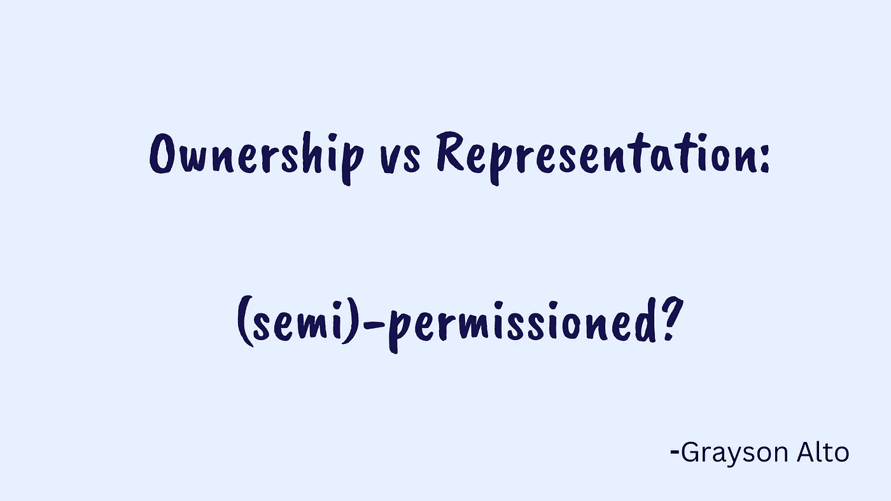

# 所有权与代表权:(半)许可？

> 原文：<https://medium.com/coinmonks/ownership-v-representation-semi-permissioned-ecc8f6f6e15d?source=collection_archive---------18----------------------->

*在我思考过去六个月现实世界资产生态系统的进步以及来自零售的一些阻力时，我有一些快速的想法。*

随着关于高风险和高波动性资产的讨论逐渐平息，对有“实质”的数字资产的需求出现了。是的，在这种情况下，谈论真实世界资产(RWA ),在某种程度上可以与“令牌化”运动互换。这并不是说这是区块链金融寻求成熟的唯一途径，而是它朝着利用区块链创造额外价值的方向迈出了坚实的一步。**至少可以说，无许可流动性对传统金融(TradeFi)的影响，或者说从现实世界中获得可持续收入在 deFi 中的作用，是巨大的。**

自从去年初春我第一次写关于数字证券的文章以来，区块链和 TradeFi 的混合数量已经激增。现在有几十个用例；年轻的公司和协议在各个方向涌现。虽然与现实世界相关的数字资产的供应正在快速增长，但零售似乎并不像许多人认为的那样热情。特别是当**真实世界和 DeFi 世界的贷款利率之间的差异达到历史最高水平**。毕竟，资本市场不应该是有效的吗？难道资本不应该在这两个体系中自由流动吗？(就目前而言)当然不是这样。虽然我觉得有很多原因可以解释这一点，但这是另一个话题了。

在令牌化的话题上，什么样的对话似乎被忽略了:出售给链上投资者*的资产代表资产*还是资产本身*？从理论上讲，你可以从很多方面来考虑这个问题，但我认为法律角度可能是最相关的。也就是说，如果我购买了这项资产，并把它放在我的 metamask 钱包中，我真正拥有的是什么？*

*从运营/法律角度来看，公司和协议部门目前正在或计划以多种方式促进 RWA 的连锁经营。合法性的范围从 100%合法到可能的灰色地带，各有各的好处。我经常会选择房地产来展示这一景观，因为房地产由于其在金融和日常生活中的突出地位以及其非流动性而成为数字世界中最发达的 RWA。*

***所有权与代表权:故事的两面***

*为了让你合法拥有一个资产链，至少在美国，必须有一定程度的 KYC(至少目前是这样)。虽然这种无拘无束的天性是我们许多人(包括我自己)所追求的，但在我看来，这并不是一切的终结。因为有了所有权，就有了真正的所有权。一旦资产被购买，毫无疑问就是你的了。由于智能合约的性质，代码就是法律，增加了交易的透明度，从而使交易完美执行。根据目前的 SEC 法规，有各种形式的证券可以进行连锁销售，其中每种形式都有不同级别的认证和地理规则。*

*我不想掩盖我用了令人不快的词的事实:“KYC”。是的，我知道对许多人来说 KYC 是 DeFi 的对立面，从某种角度来说我同意。但是 DeFi 的目标是什么呢？如果是为了建立一个完全没有许可的生态系统，那么我很难找到在现实世界和区块链之间建立联系的可行性(也许这很好)。如果我们的目标是改善现有的遗留金融系统，那么将 DeFi 多样化，纳入半许可系统，似乎是朝着这一目标迈出的有力一步。举例来说，提供次要的个人资料，以购买部分房地产股权，肯定是一个改进，从传统的家庭交易的无数理由。*

***代表性还不错***

*现实世界资产的表示本身并不坏，它们通常对购买需求和交易的限制较少。警告通常是，一个人并不真正拥有所代表的资产。你最终**相信了**某个中介，这并不奇怪，我们相信中介每天都会履行他们的承诺，因此有了自由市场。代表潜在房地产的代币(通常是细分的 NFT 代币)意味着有人或某个实体真正拥有该资产，如果你带着代币去县法院，你会很快发现他们的记录中只有一个名字(而且不是你的)。*

*但当我听到 RWA 中的代表权时，我经常会想到“无许可”，这意味着全球任何人都可以通过点击一个按钮来拥有美国股票。而这种代表性的策略似乎更符合用户当初逃到 DeFi 的特点。所以潜在的问题出现了，我信任卖家吗？这有什么法律含义？我认为随着时间的推移，随着这些协议/公司受到市场的考验，并可能受到法律的审查(尽管由于规模的原因，短期内不太可能)，会有很多澄清。*

*虽然我还不知道谁会“赢”，是许可还是不许可，所有权还是代表权，但我对这个空间抱有很高的期望。我倾向于认为，区块链继续以 DeFi 的形式产生影响，将不得不做出某种妥协，以便与现实世界互动。使用创新法律体系的半许可协议可能会有优势。对我来说，可以肯定地说,**世界可以从区块链获益，而区块链肯定可以从世界获益**,我认为这种联系是那些愿意创新的人创造最大价值的地方。*

> *交易新手？试试[密码交易机器人](/coinmonks/crypto-trading-bot-c2ffce8acb2a)或者[复制交易](/coinmonks/top-10-crypto-copy-trading-platforms-for-beginners-d0c37c7d698c)*