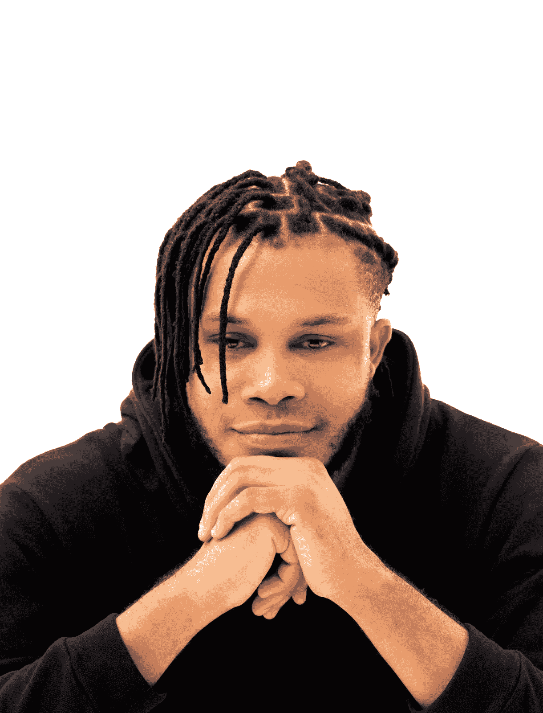
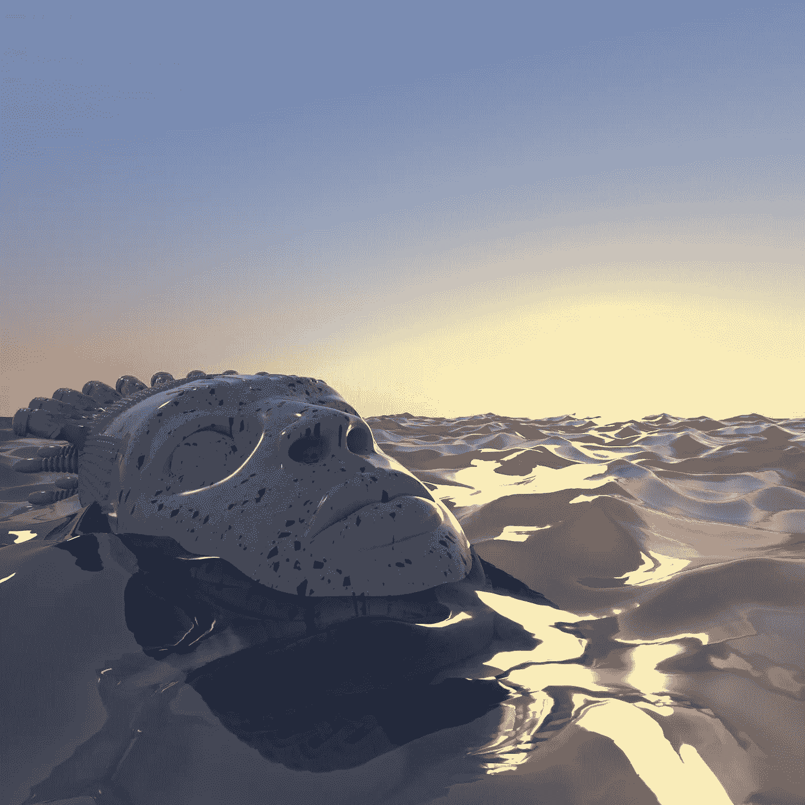
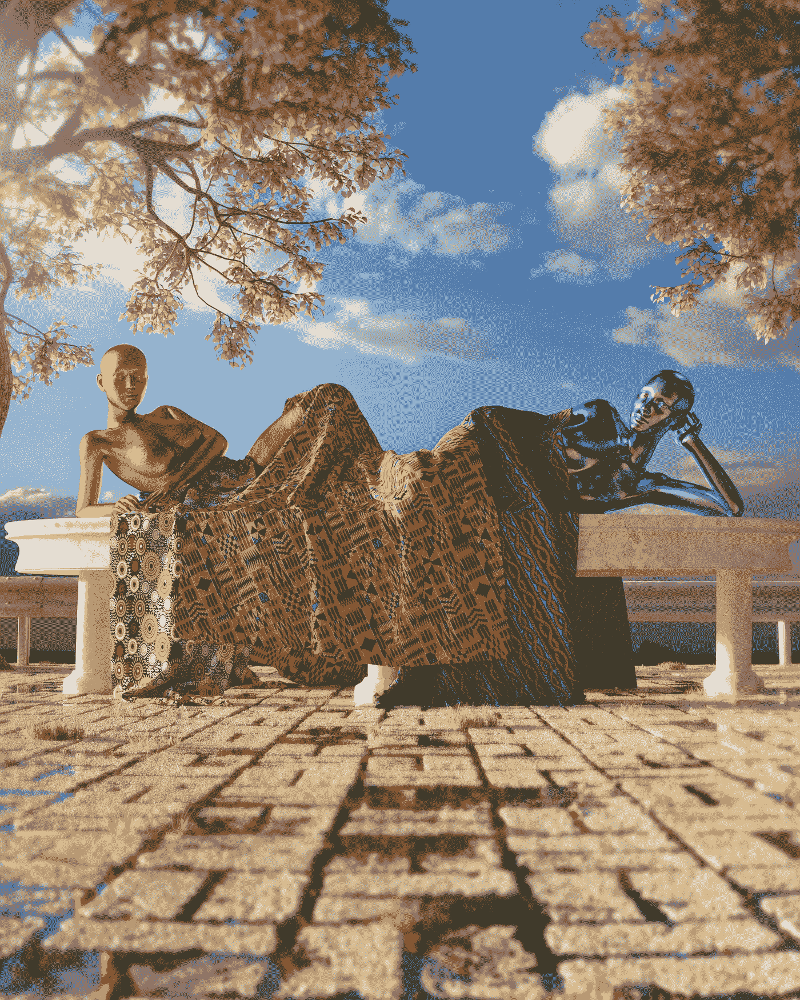
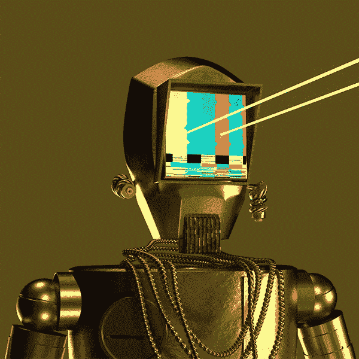
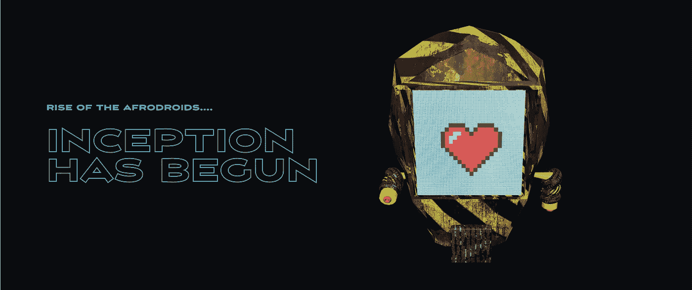
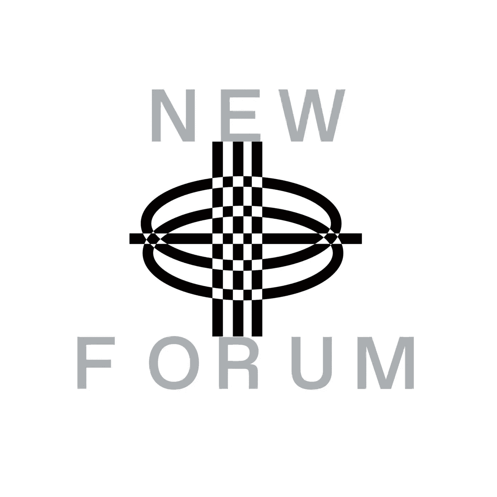

# 《非洲机器人》的创作者 Owo Anietie 讨论了来自新兴市场的 Web3 艺术家的奋斗历程，以及 Dao 和 NFT 如何赋予这些艺术家力量

> 原文：<https://medium.com/coinmonks/owo-anietie-creator-of-afrodroids-discusses-struggles-of-web3-artists-from-emerging-markets-how-bae840009ef9?source=collection_archive---------21----------------------->

Owo Anietie | Creator of Afrodroids | Art for Vogue | Featured on GQ | Make Art Everyday

Newforum 是一个社区播客，邀请有远见的人、创造者和投资者就加密、元宇宙、NFT 和一切 web3 的主题引发无障碍对话。

Owo Anietie，非洲机器人的不可思议的创造者，一位受非洲文化启发创造视觉上引人入胜的艺术的艺术家，代表西非，尼日利亚，加入我们这一集。

Owo 分享了 AfroDroids 背后的意义和愿景；他还谈到了他作为一名来自新兴市场的 Web3 艺术家的经历，定义了未来主义，并讨论了发展中国家非功能性技术的好处。

# 谁是 Owo？

Owo Anietie 是尼日利亚 3D Afrofuturism 艺术家。Afrofuturism 是一种科学和历史的文化哲学，探索非洲散居文化与技术的发展交集。

Owo 的艺术生涯始于 2009 年，当时他是一名传统艺术家——接受委托画肖像画和素描。他在 2012 年过渡到动作设计、动画和数字插图，并有了理想的未来。

Art by Owo Anietie | 2021

Owo 的愿景是在 50 年内每天创作和发行一件艺术品。

Art by Owo Anietie | Intertwined

> “我越来越渴望接触到更多的观众，因为我在画布上绘画，而在那时，你只是把它放在墙上，有人买了它，就把它放在他们的墙上，而且它也仅限于我所在的位置，只有尼日利亚人和尼日利亚特定州的人可以收集我的作品……”—Owo

Owo 想学习其他技能，所以他选了一门广告艺术指导的课程，后来在这个领域工作了几年。

Owo 做了一个大胆的举动，辞去了工作，作为一名艺术家投身于 Web3。

> “来到这个空间，我从来不认为它是为我准备的，因为我没有看到很多人像我一样，像我一样说话带着有趣的口音，把他们的工作作为 NFT 来进行。”— Owo

正如一位新兴市场的艺术家在他的完整采访中解释的那样，在他令人难以置信的引人入胜的故事中，一件事情导致了另一件事情。

他还谈到了他的艺术背后的叙事和意义。

# **来自新兴市场的艺术家在 Web3 的入职流程中面临哪些挑战？**

在他的采访中，Owo 从尼日利亚的角度回答了这个问题，分享了他个人和他的艺术家同事在入职过程中的斗争，同时讨论了尼日利亚政府在整个等式中的作用。

> “有这么多法规，人们因为在银行转账中引用 Crypto 作为描述而被冻结账户。这太疯狂了，新兴市场的情况是，他们找到了适应的方法，但有一段时间，人们被困住了，无法四处转移资金；大部分的加密交换……”— Owo

Owo 补充说，除了处理他的国家和其他地方有关加密的法规，另一个问题是获得加密的困难，其次是昂贵的天然气费，特别是以太坊交易费。

虽然 Owo 是尼日利亚的一个成功故事，但他仍然记得他是如何开始的，并尽可能多地通过汽油费和其他资源来支持即将进入该领域的艺术家。

我们喜欢 Owo 的这一点！

谈到 DAOs 的力量，Owo 和其他几位艺术家朋友一起成立了 DAO，以支持尼日利亚的艺术家们进入需要天然气费和其他资源支持的空间。

Owo 分享了这一切是如何发生的，以及为什么从他的角度来看 Dao 很重要。

他还在采访中讨论了 Dao 如何受益于或影响 NFT，以及新兴市场如何从 NFT 中受益最多。

# 为什么 Owo 对 AfroDroids 充满热情

每个非洲人都向他的非洲传统致敬，正如耳环、珠子和其他土著特征所描绘的那样。他相信讲故事的力量，Web3 工具让每个人都能讲述自己的故事，并与世界分享他们的文化。Owo 还进一步描述了是什么激发了他的愿景和使命，以及他希望如何发挥自己的作用，通过 AfroDroids 让世界变得更美好。

在 NEWFORUM 的这一集里，享受走进 Owo 的世界吧！

[加入社区](https://twitter.com/newforum_nco)了解[@ yeslydpheonix](https://twitter.com/yesladypheOnix)并在 web3 社区中发现其他创始人！

✨follow·奥沃·阿尼提！推特:[@ OwoAnietie](https://twitter.com/OwoAnietie)|[@ afrodroids](https://twitter.com/afrodroids)@ Linktree:[afrodroids byowo](https://linktr.ee/Afrodroidsbyowo)

# new forum # web 3 # nfts # Dao # crypto #新兴市场#多样性#社区#元宇宙

爱 x 新论坛

# Twitter @newforum_nco

不和谐[@加入](https://discord.gg/2K8tvVh8tM)

# 新论坛

[NEWFORUM](https://newforum.notion.site/newforum/Welcome-to-NEWFORUM-48f9661398ec4ec6a1af37fcc96dc926) 由 [Newcoin Foundation](https://newcoin.org/) 提供支持，专注于促进去中心化社交应用的扩展，也被称为 Social 3.0，形成一个生态系统和一个由远见者、创造者和投资者组成的社区。它为思想者提供了一个安全的交流、传播和分享思想的空间，以确保一个新网络的自觉和道德发展，嵌入关怀、自由和创造力的价值观。✨每周新集！在 [Twitter](https://twitter.com/newforum_nco) 、 [Newlife](https://newlife.io/) 、 [Youtube](https://www.youtube.com/channel/UCWvHyau1nIJBffmaaj6FmbQ) 和 [LinkedIn](https://www.linkedin.com/showcase/newforum/) 上关注我们，了解 web3 的更多信息，认识生态系统！加入生态系统[不和](https://discord.gg/DHepA4WTkN)！

> 交易新手？尝试[加密交易机器人](/coinmonks/crypto-trading-bot-c2ffce8acb2a)或[复制交易](/coinmonks/top-10-crypto-copy-trading-platforms-for-beginners-d0c37c7d698c)