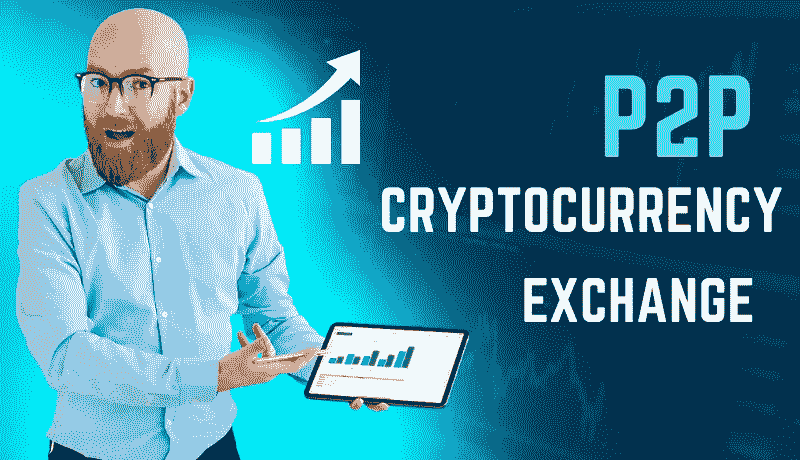
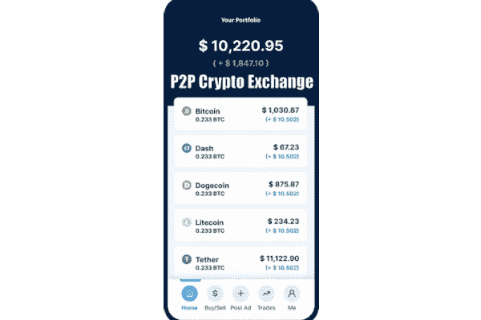
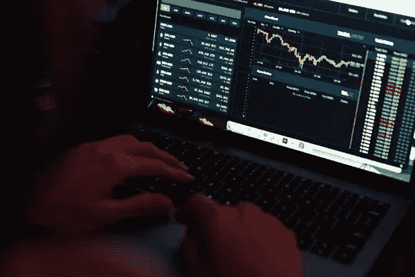

# P2P 加密货币交易所:一种分散的交易方式，给你更多的财富

> 原文：<https://medium.com/coinmonks/p2p-cryptocurrency-exchange-a-decentralized-way-of-trading-to-give-you-more-fortunes-288ca57c4c7c?source=collection_archive---------18----------------------->

**P2P Cryptocurrency Exchange**

C **伪币交易**已经成为一种趋势很久了。然而，许多此类交易所为更快地交换加密货币提供了有效的解决方案。此外，要使分散交换交易发生，您需要一个[**点对点交换**](https://bit.ly/3DsRBis) 来抓住它提供的机会。

据报道，目前约有 20268 种加密货币，市值在 2 万亿美元左右。由于它越来越受欢迎，来自世界各地的投资者都渴望在这个迅速扩大的市场进行交易。因此，区块链交易所大量涌入。

那么，让我们开始了解对等交换。

## **什么是点对点交换？**

对等交换是一个分散的平台，通过消除对中介的需要，参与者可以直接相互交易。由于虚拟交易的速度，这提高了安全性和价值水平。它还通过消除与中介相关的风险，使交易不受限制。

**peer-to-peer exchange**

## **对等交换是如何工作的？**

👉一个 [**P2P 加密货币交易所**](https://bit.ly/3DsRBis) 对经过验证的卖家和买家开放，以促进无障碍的资产交易。

👉高质量的匹配引擎被用来把挑剔的卖家和买家结合起来。

👉卖方或买方可能希望从同行那里获得某些特征来管理交易需求。

👉很少有人会把连接密码卖家和买家的 P2P 交易所与 Craigslist 或脸书市场联系起来。同时，该平台容纳通过共享数据连接的两个组。

👉相比之下，点对点加密货币交易模式使市场参与者能够直接相互交易，而不需要中介来执行交易或持有资金。

👉它使用自动化的订单簿将买卖订单联系起来，并管理平台的资产。

## 对等交换的优势是什么？

P2P 交易所的优势提供了一个信号，表明它可能是交易的未来。给你:

⏭多种支付方式

⏭提供隐私

⏭无限制进入全球市场

⏭在交易所有限的国家，这可能是有用的

⏭安全性

⏭实时贸易聊天

⏭通过广告发布定制优惠

⏭客户支持

⏭最低费用

⏭即时交易速度

⏭灵活收费

他们不仅有优势，而且还有吸引大批人的特点。让我们看看它们:

## 最好的点对点加密交换软件有哪些吸引人的特点？

以下是清单:

💰多语言支持

💰多种加密货币

💰自动 KYC 和反洗钱验证

💰主导交易引擎

💰支付网关集成

💰加密交换

💰多币种钱包

💰管理面板

💰多因素认证

💰首选交易

终于，你走了！

**P2P Decentralized Exchanges**

## **分散或点对点交流:如何开始？**

启动交易所需要建立框架的四个组成部分-

➊ [**加密货币钱包**](https://bit.ly/3N5JiN2)

➋ **交易和合并引擎，任何交易系统的首席**

➌ **行政系统**

➍ **流动性**

这四个框架中的每一个都可以分散到更安全的交换网络中。我们简单讨论一下。

## **加密钱包**

该组织应该适当分散，以便在分散的网络上提供安全的基础设施。这种机制存储虚拟加密货币交易的私钥或公钥——它不是一个物理钱包。因此，它必须是分散的或安全的。

第三方的参与有可能损害安全性和保密性。为了增加交易的安全性，这些必须是分散的。

## **交易和合并引擎**

匹配引擎和交易引擎都是从事图书和交易机器人马达的网络。从功能的角度来看，这一点并不重要。预先假定的价格和市场价格请求都可以使用该系统。请求可以记录在区块链上，但没有修改的规定。

对于一个具有确切的模糊响应的交换系统来说，这不是特别值得注意的。

## **管理系统**

管理密钥是分散式 exchange 网络中至关重要的组成部分。相比之下，所有者需要并且应该有权访问用户数据、交易历史和交易。

## **流动性**

流动性目前被认为是分散框架中最薄弱的一环，这也是研究仍在进行的原因。然而，可以通过为可能已经负责流动性的各个部门开发混合加密货币交易所来控制它。

# **结论**

最好的 P2P 加密交换系统 可以在帮助他们发展的公司的帮助下实现。他们通过一个去中心化的平台让事情变得更好，消除了中介。他们给了下一代完全的希望，说在一个平台上无止境的交易可以给你带来无尽的财富。因此，从最优秀的头脑中创造一个平台，使它成为一个完美的交易场所。

> 交易新手？试试[密码交易机器人](/coinmonks/crypto-trading-bot-c2ffce8acb2a)或[复制交易](/coinmonks/top-10-crypto-copy-trading-platforms-for-beginners-d0c37c7d698c)