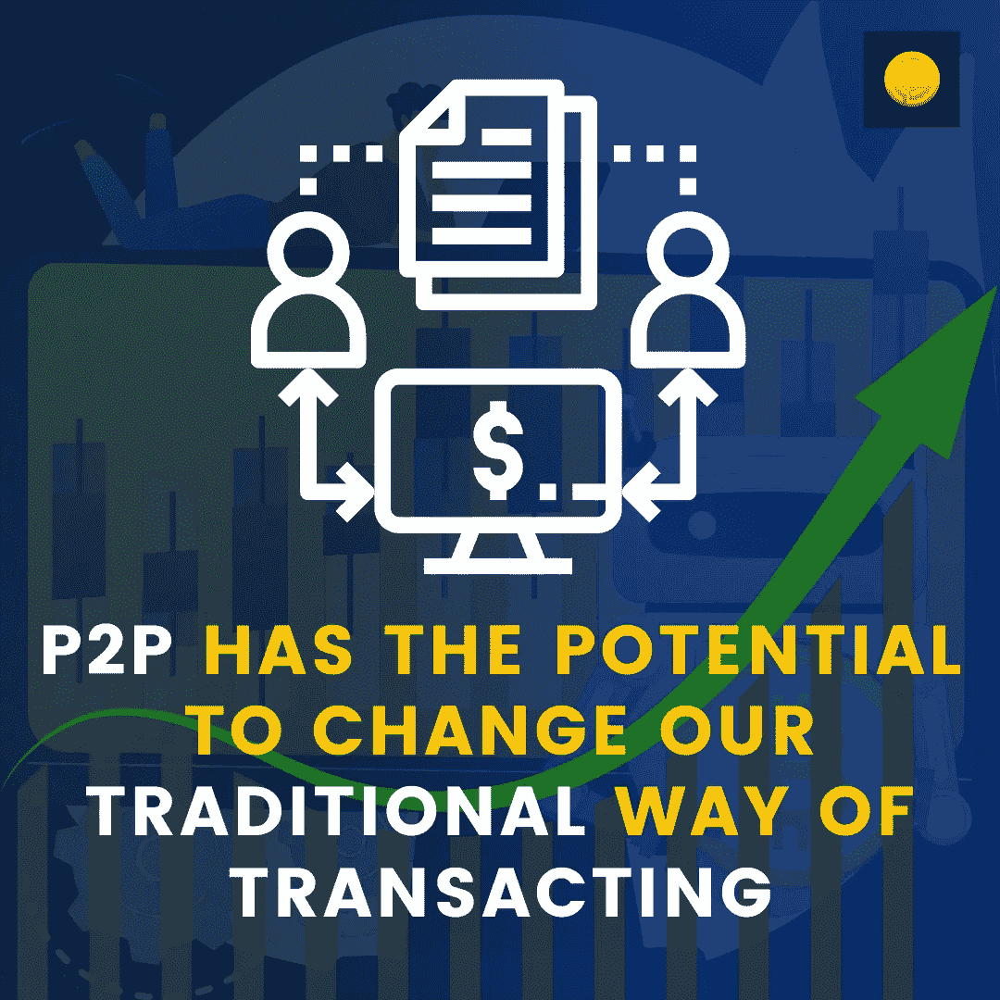

# P2P 有可能改变我们传统的交易方式

> 原文：<https://medium.com/coinmonks/p2p-has-the-potential-to-change-our-traditional-way-of-transacting-8efb7c13173d?source=collection_archive---------33----------------------->

最近在[加密货币](https://www.coindhan.com/trading/btcinr)中有很多关于 P2P 的讨论。这个词经常出现在关于区块链的优点的讨论中，无论它是否参考了 Peercoin，以及当人们听到这个词时会采取什么样的行动。至少从 2006 年开始，P2P 就成了一个时髦词，并被定义为“互联网”,以至于似乎没有人会要求更多的澄清。

这意味着它是一个流行词，因为它令人困惑。“对等”是什么意思？一个本身就是、去中心化的、与网络完全分离的东西怎么可能是“对等的”呢？一个我们称之为“A”的参与者是否向另一个参与者发送数据，或者我们是指 A 与自己进行通信？如果我在 P2P 聊天中，我是“与”还是“参与”P2P 聊天？既然其他人已经在 P2P 了，有没有办法让他们加入？

答案是人们不应该使用这个术语。它的存在是因为需要表达一种不依赖于第三方的交易网络的愿望。它意在尽可能清楚地表明，这种网络的目的是消除或尽量减少第三方的作用，这样就不会产生混淆。这个术语并没有给这个想法增加什么实质性的东西。如果说有什么不同的话，那就是它增加了不必要的、不清晰的信息，让事情变得更加复杂。

# [P2P](https://blog.coindhan.com/2022/09/21/p2p-trading-story-of-experience-across-the-world/) 将给我们的货币体系带来剧烈的变化

这一切意味着许多人正在以不同的方式使用 P2P、P2P 和类似的术语。对于这些术语的含义以及它们在理论上或实践中应该如何应用，还没有达成共识。很多人将“点对点”这个术语作为加密货币和区块链的同义词，但这不是它的本意。

这个词来源于" peer ",意思是平等，而" to peer ",意思是平等访问。这意味着 P2P 模式不是为第三方设计的；相反，它是一种与他人交换价值的手段。这违背了我们在过去几个世纪里所了解的关于货币如何运作的一切。它意在代表货币和货币交易模式的改变，而不仅仅是 T4 区块链技术的不同实现。

> 交易新手？试试[加密交易机器人](/coinmonks/crypto-trading-bot-c2ffce8acb2a)或者[复制交易](/coinmonks/top-10-crypto-copy-trading-platforms-for-beginners-d0c37c7d698c)