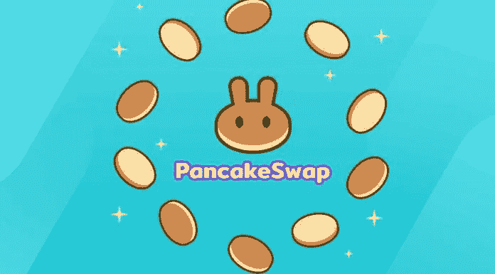
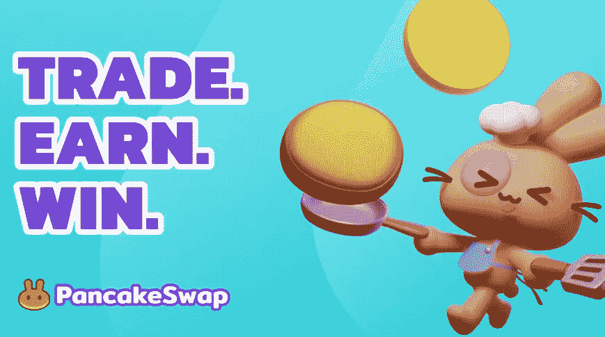

# 给初学者的煎饼交换。

> 原文：<https://medium.com/coinmonks/pancake-swap-for-beginners-bb2896cdf56b?source=collection_archive---------2----------------------->

[pancake swap photos — Bing images](https://www.bing.com/images/search?view=detailV2&ccid=FYd7tnUu&id=F95C473687D7080AA92284EFE3D37449D8BB8280&thid=OIP.FYd7tnUuHrF3iRvexidrmAHaEG&mediaurl=https%3a%2f%2flivecoins.com.br%2fwp-content%2fuploads%2f2021%2f03%2fpancake-swap-696x385.jpg&cdnurl=https%3a%2f%2fth.bing.com%2fth%2fid%2fR.15877bb6752e1eb177891bdec6276b98%3frik%3dgIK72El00%252bPvhA%26pid%3dImgRaw%26r%3d0&exph=385&expw=696&q=pancake+swap+photos&simid=608035917817649352&FORM=IRPRST&ck=2AD742F0096B15E53F1FFA0D699663CD&selectedIndex=44&ajaxhist=0&ajaxserp=0)

曾几何时，Defi 是以太坊的代名词，以太坊仍然是这个小众领域的首要加密货币。

然而，以太坊网络的高额燃气费迫使普通 Defi 用户寻求更具成本效益的选择。因此，出现了煎饼交换、寿司交换等代币。

大多数 Defi 协议的开源性质使得其他智能合同区块链公司，如币安智能链，复制相同的 Defi 协议成为可能。

[**煎饼互换**](https://pancakeswap.finance/) 协议就是这样一个协议的例子。

> **亦见:** [**认识分散交流；初学者指南。**](/coinmonks/understanding-decentralized-exchanges-beginners-guide-b6f74455a5f5)

**Uniswap 与 Pancake 互换**

Photo by solod_sha: [https://www.pexels.com/photo/close-up-photo-of-pancakes-with-raspberries-and-powdered-sugar-7663393/](https://www.pexels.com/photo/close-up-photo-of-pancakes-with-raspberries-and-powdered-sugar-7663393/)

[**Uniswap**](https://uniswap.org/) 是基于以太坊平台的 AMM 平台。它是由海登·亚当斯在 2018 年创建的，在他的朋友将他与以太坊的创始人维塔利克·布特林联系起来后，他从以太坊基金会获得了少量资金。

煎饼互换是在[**币安**](https://www.binance.com/en)智能链上搭建的一个 AMM 平台。一个匿名开发者团队在 2020 年 9 月创建了它。Pancake Swap 是由不知名的开发者开发的，不受币安的监管。

Pancake Swap 收到的唯一资金似乎来自币安，作为他们在币安智能链上的 1 亿美元 Defi 加速器基金的一部分。

煎饼交换是 Uniswap 的克隆。因此，这两个游戏是相同的。根据 Reddit 上的一个匿名帖子，pancake swap 的很大一部分代码仍然引用 Uniswap。

> **参见:** [**什么是以太坊合并？**](/coinmonks/what-is-ethereum-the-merge-1b65f4d2c853?source=your_stories_page-------------------------------------)

**Pancake Swap 和 Uniswap 的区别。**

Photo by solod_sha: [https://www.pexels.com/photo/close-up-photo-of-pancakes-with-raspberries-and-powdered-sugar-7663393/](https://www.pexels.com/photo/close-up-photo-of-pancakes-with-raspberries-and-powdered-sugar-7663393/)

Pancake Swap 有一些 Uniswap 没有的功能。

**1。高产农业**

您可以用 Pancake Swap 的两种产量农业工具来下注流动性提供者代币以赚取蛋糕，下注蛋糕以赚取额外的蛋糕或其他 Bep-20 代币。在众多这类资金池中，年化收益率超过 100%。

您也可以用蛋糕代币购买彩票，有机会赢得每轮抽奖中使用的整罐蛋糕。你也可以用蛋糕购买许多 NFT 纪念品。

**2。首次农场发行(IFO)**

Pancake Swap 有一个初始农场产品，允许您将您的流动性提供商令牌交换为新加密货币项目的令牌。该项目得到你的 BNB，你得到代币，煎饼交换烧伤你的蛋糕。

**3。游戏化**

煎饼交换的另一个方面是通过使用社区团队，排行榜，甚至其他任务和成就的游戏化的存在。

**4。交易量**

[**Uniswap**](https://uniswap.org/)**和煎饼掉期的交易量差不多。然而，Uniswap 比 Pancake Swap 提供了更多的代币和交易对。Uniswap 有大约 1600 个代币和 2100 个交易对，而 Pancake Swap 有大约 96 个代币和 690 个交易对。**

****5。交易费用****

**[**煎饼掉期**](https://pancakeswap.finance/) 对所有交易收取 0.2%的费用，而 Uniswap 收取 0.3%。所有费用都归 Uniswap 流动性提供商所有，但在 Pancake swap 上，0.17%归流动性提供商所有，0.03%用于支持 Pancake Swap 资金，该资金由协议开发商控制。**

**Uniswap 的治理结构比 pancake swap 复杂得多。**

****6。可用性****

**Uniswap 和 Pancake Swap 最根本的区别是可用性。要使用 Uniswap，你需要一个浏览器钱包插件，比如[**【meta mask】**](https://metamask.io/)**，做一笔交易通常需要 40 到 100 美元的油费。****

****Uniswap 交易也需要很长时间才能完成，尤其是如果你没有支付最高的汽油费。对于很少进行交易的正常人来说，这并不特别可行，这也是鲸鱼大量使用该网站的原因。****

****另一方面，薄饼掉期交易在 BNB 是收费的，而且非常便宜。煎饼掉期的单笔交易通常只需花费几美分的 BNB 天然气费用。薄饼掉期的交易同样非常快速和高效。****

****这就是为什么网站经历了用户增加和总价值锁定。此外，用户可以使用币安交易所将他们在币安智能链上的打包资产(如 BTC 和瑞士联邦理工学院)转换为本国货币。****

> ******参见:**[**2022 年最佳 NFT 商场**](https://ilekeairende.com/the-best-nft-marketplaces-in-2022-bc94ae6270c)****

******煎饼互换如何进行？******

********

****[pancake swap photos — Bing images](https://www.bing.com/images/search?view=detailV2&ccid=oZl88XsM&id=BACC0F90FBA39F04220394BBC745E33E411FACDC&thid=OIP.oZl88XsMLKgcKzZpsNt6lwHaEI&mediaurl=https%3A%2F%2Fsgeprint.com%2Fwp-content%2Fuploads%2F2021%2F05%2FPancake-Swap.jpg&cdnurl=https%3A%2F%2Fth.bing.com%2Fth%2Fid%2FR.a1997cf17b0c2ca81c2b3669b0db7a97%3Frik%3D3KwfQT7jRce7lA%26pid%3DImgRaw%26r%3D0&exph=485&expw=869&q=pancake+swap+photos&simid=608008253944918417&form=IRPRST&ck=94442D1CD9EBE13673A0E9BE086396E8&selectedindex=65&ajaxhist=0&ajaxserp=0&vt=0&sim=11)****

****诸如 MetaMask 或 TrustWallet 之类的钱包经常用于在分散式应用程序(DApp)上访问 PancakeSwap。一旦这些钱包被配置为与币安智能链进行交互，它们就可以访问 PancakeSwap 的智能合约。****

****PancakeSwap 财政部现在收取所有交易费用的 15%,负责网站的资金和维护。****

******如何使用 PancakeSwap？******

****在您可以使用 Pancake Swap 之前，您必须首先获得一种主要的加密货币，如币安币(BNB)、比特币(BTC)、以太坊(ETH)或系绳(USDT)。****

****要使用 PancakeSwap，必须首先将您的数字钱包(如 Metamask)连接到 exchange (Pancake Swap)。将 BNB 存入你的信托钱包后，你就可以用 PancakeSwap 将 BNB 换成另一枚硬币。****

****要做到这一点，从菜单中选择交易进入煎饼交易所。通常有两种选择:互换(贸易)或提供流动性。****

****与中央交易所不同，任何人都可以创建一对，提供流动性，并在煎饼交易所创建一个新的 DEX 市场。选择资产后，点击交换，确认钱包中的交易，就大功告成了！****

****您只能在 PancakeSwap DEX 上交换 BEP-20 代币。PancakeSwap 由币安智能链驱动，而不是以太坊。如果你只有 ERC-20 代币，你可以用币安桥把它们封装起来用于煎饼交换。****

> ******另见:**[**Crypto 崩溃何时结束？**](/web3-surfers/when-is-the-crypto-crash-coming-to-an-end-3342f7d47cde)****

******结论******

****煎饼交换是一个建立在币安智能链上的 AMM 平台。Pancake Swap 获得的唯一资金似乎来自币安。根据 Reddit 上的一个匿名帖子，pancake swap 的很大一部分代码仍然引用 Uniswap。****

****Uniswap 是建立在以太坊平台上的 AMM 平台，由 Hayden Adams 于 2018 年创建。它有大约 1600 个代币和 2100 个交易对，而 Pancake Swap 有大约 96 个代币和 690 个交易对。****

****要使用 Pancake Swap，你必须首先获得一种主要的加密货币，如币安币(BNB)、比特币(BTC)、以太币(ETH)或系绳币(USDT)。你也可以创建一对并在煎饼交易所提供流动性。****

> ****交易新手？试试[加密交易机器人](/coinmonks/crypto-trading-bot-c2ffce8acb2a)或者[复制交易](/coinmonks/top-10-crypto-copy-trading-platforms-for-beginners-d0c37c7d698c)****