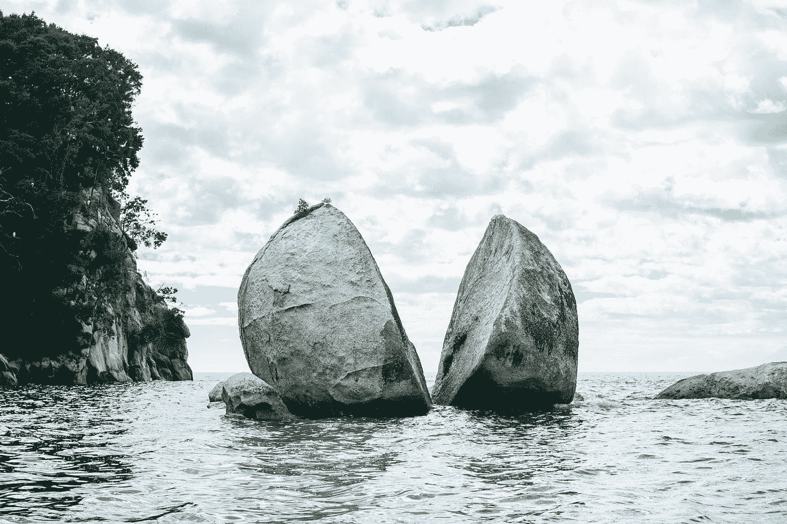
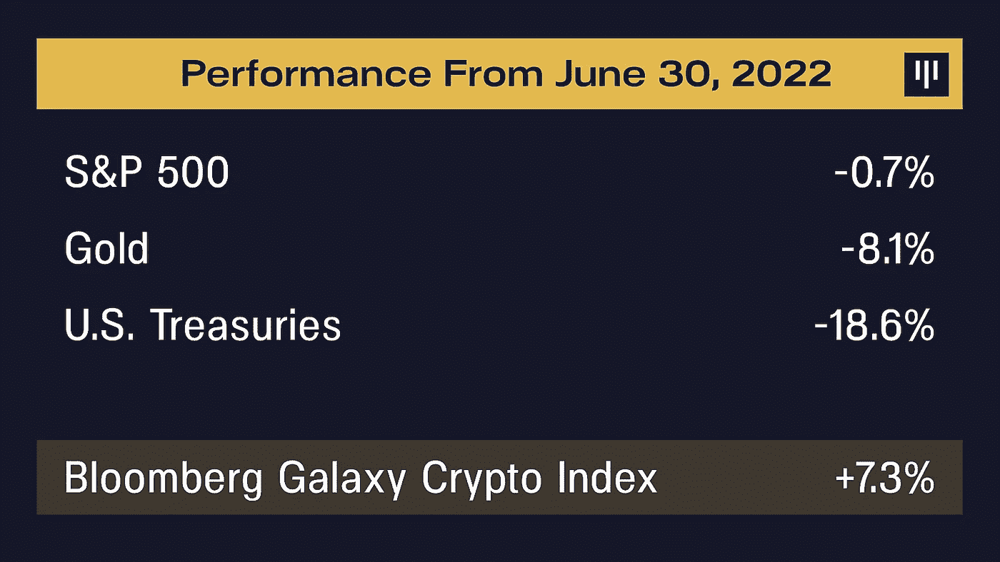
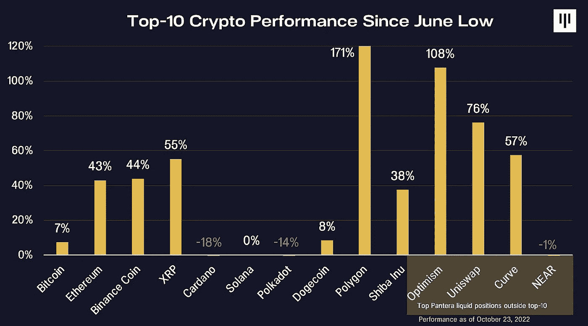
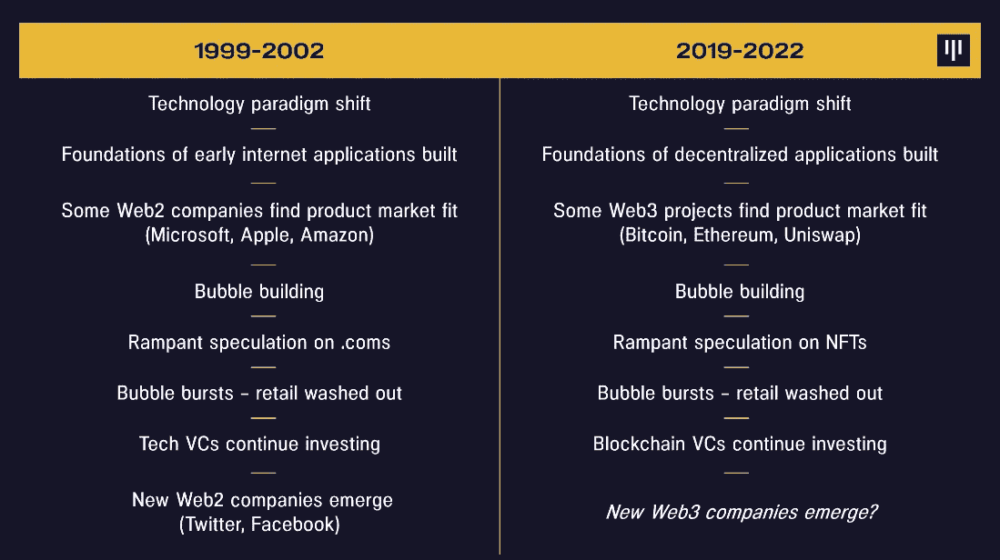
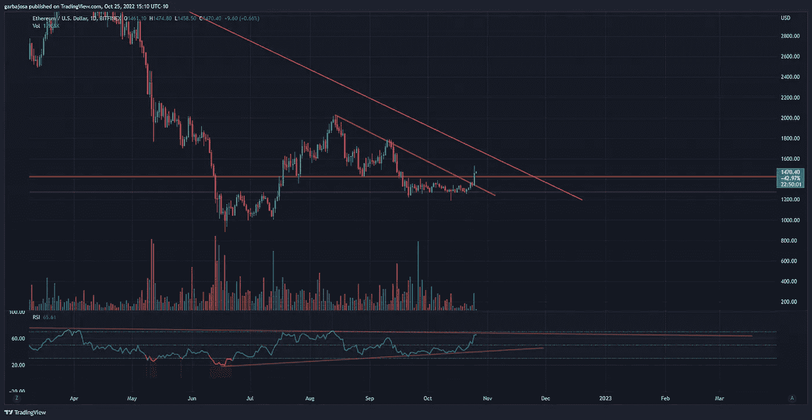
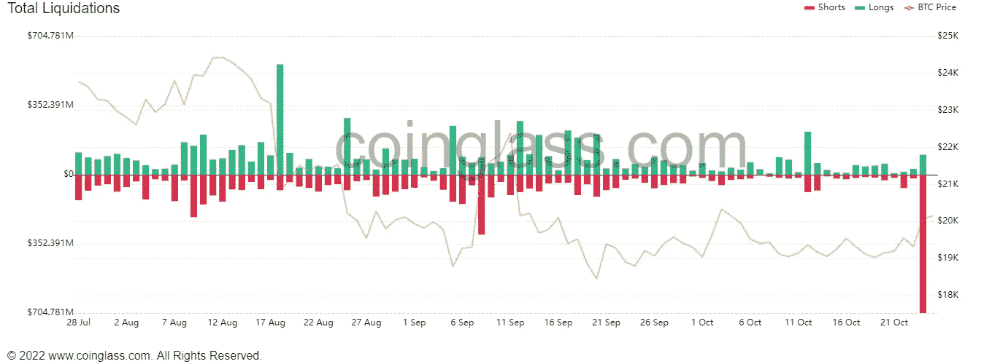
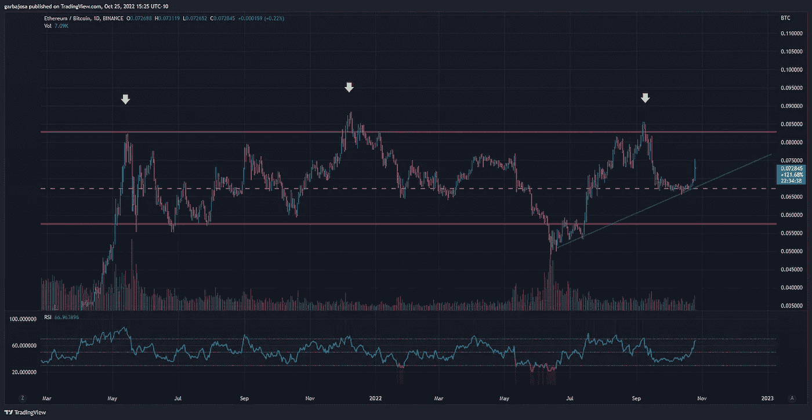
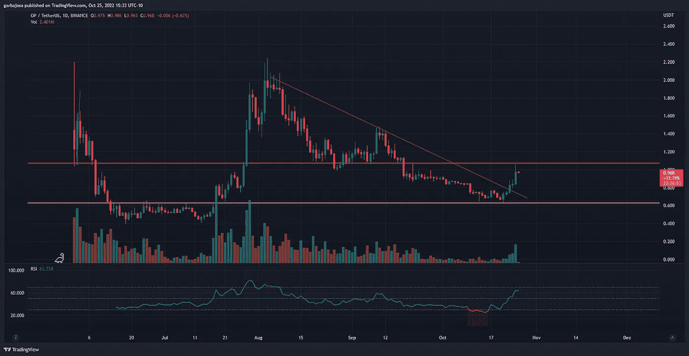
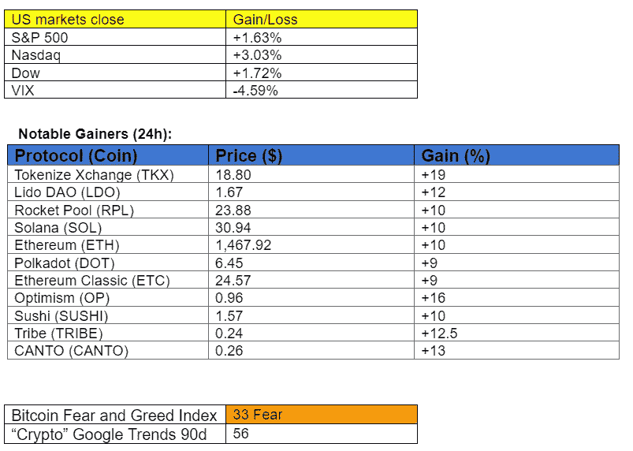

# 潘迪拉资本:加密正在与股票脱钩！

> 原文：<https://medium.com/coinmonks/pantera-capital-crypto-is-decoupling-from-stocks-a68677dc8e54?source=collection_archive---------7----------------------->

## 每日征服#112

最好的每日新闻、见解和阿尔法信息来源。

Photo by [Pablo Heimplatz](https://unsplash.com/@pabloheimplatz?utm_source=medium&utm_medium=referral) on [Unsplash](https://unsplash.com?utm_source=medium&utm_medium=referral)

**概述**

*   潘迪拉资本:加密正在脱钩！
*   市场抹去了创纪录数量的空头。
*   彭博对加密很认真。
*   英国议会 okays 加密。
*   Near 的 stablecoin USN 在 depeg 崩溃附近吗？

*密码市场是一个狂野、奇妙而令人生畏的地方；不要一个人跋涉！订阅加密征服者，让我们成为您的向导。*

订阅这份每日简讯，永不错过任何一期。

早上好，家人，

最大的风险投资公司和著名的加密智库之一，潘迪拉资本，昨天发出了他们的[十月区块链信](https://panteracapital.com/blockchain-letter/blockchains-2003-moment/)。它包含了一些有趣的见解，充满了阿尔法。今天的主要故事是那封信的一个简短摘要。

这封信的标题是“区块链的 2003 年时刻”，它涵盖了潘迪拉资本及其首席执行官丹·莫尔黑德几个月来一直在流传的区块链脱钩论。

叙述是，随着美联储继续放松，加密最终将与利率相关的资产脱钩，根据这封信，这已经开始了。

丹·莫尔黑德说:

“在 crypto 生命的第一个十年里，它与标准普尔的相关性为 0.08。这一次，它变得非常不同。诚然，在大约八个月的时间里，它确实看起来与纳斯达克指数相关。如果你眯着眼睛看图表，它开始崩溃了。在我看来，这是一项重大交易，风险资产仍将举步维艰，但我可以预见，即使其他风险资产受到影响，区块链也会做得非常好。”

来源:[潘迪拉资本的区块链信 2022 年 10 月。](https://panteracapital.com/blockchain-letter/blockchains-2003-moment/)

这封信接着阐述了不仅仅是比特币会从脱钩中受益。相反，自 2022 年 7 月低点以来，许多加密项目的表现超过了比特币。

> *来源:* [*潘迪拉资本的区块链信 2022 年 10 月。*](https://panteracapital.com/blockchain-letter/blockchains-2003-moment/)

这封信接着将当前的环境与 2003 年进行了比较，当时 dot.com 泡沫破裂，许多投资者对互联网的未来影响失去了信心。然而，许多风险投资基金继续投资未来。同样的事情目前也发生在 crypto。

> *来源:* [*潘迪拉资本的区块链信 2022 年 10 月。*](https://panteracapital.com/blockchain-letter/blockchains-2003-moment/)

这封信最后概述了以太坊合并，这是一个我们已经广泛讨论过的话题。

# 市场更新🌍

**瑞士联邦理工学院/USDT 1D 分校**

在以太网和比特币经历了平静的一个月之后，交易员纷纷涌入空头头寸，昨日在 crypto 中强烈感受到了股市的看涨情绪。ETH 经历了当地的下降趋势阻力(红色)，目前正在测试 1，430 美元的阻力(橙色)，此前在价值 3.53 亿美元的空头清算的刺激下，ETH 达到了 1，533 美元的高点。ETH 完成日蜡烛上涨+8.53%，至 1460 美元。

*高分辨率* [***图表***](https://www.tradingview.com/x/AHsrbleM/) 。

**总清算量**

*来源:* [*造币厂*](https://www.coinglass.com/LiquidationData)

**瑞士联邦理工学院/BTC 1D 分校**

自合并以来，以太坊验证机已经由网络发放了 1286 ETH(205 万美元),而如果以太坊仍然是工作证明(PoW ),则矿工将获得 484353 ETH(7 . 07 亿美元)。由于发行和出售压力减少，昨日瑞士联邦理工学院的表现超过 BTC 4.56%，导致瑞士联邦理工学院/BTC 图表转为看涨。价格看起来正在向 0.082 水平(洋红色)推进，这是 ETH 在其他三个场合未能保持的水平。

*高分辨率* [***图表***](https://www.tradingview.com/x/AQiLNNTY/) 。

**OP/USDT 1D**

乐观的第二层令牌(OP)通过将 ETH 的业绩提高近一倍证实了看涨偏见。OP 已经突破了下降趋势阻力(红色),并试图测试在不断增加的成交量背后的 1.08 美元阻力(橙色)。OP 完成日蜡烛上涨+15.95%至 0.97 美元。

*高分辨率* [*图表*](https://www.tradingview.com/x/Frq0osNP/) 。

*如果你喜欢这份报告，并且认为它值 20 分(0.01 美分)，请点击下面的鼓掌按钮来支持我的写作。(最多 50 次！)谢谢！*

# 新闻观察📰

英国 okays 加密公司。英国初级法院的立法者[投票](https://twitter.com/watcherguru/status/1584948976897626112?s=61&t=xvEkj2ixIivKv5MaymciLg)支持通过拟议的金融服务和市场法案，承认比特币和加密为受监管的金融工具。议员安德鲁·格里菲斯(Andrew Griffith)说，“这里的实质是像对待其他形式的金融资产一样对待它们(crypto)而不是偏爱它们，同时也是首次将其纳入监管范围。”

**彭博开始认真对待加密技术**。本周，彭博《商业周刊》有史以来第二次只有一篇文章。这次是关于密码。Matt Levine 撰写的题为“The Crypto Story”的 4 万字文章概述了该资产类别的每个重要方面，包括其历史、Web3、DeFi、stablecoins 及其作为金融系统的作用。

**近的稳定带来麻烦。近东基金会已经建立了一个 4000 万美元的基金，如果稳定的货币崩溃，它将救助 USN 持有者。该基金允许 USN 持有者用代币兑换等量的包装 USDT。近东基金会在 USN 协议面临抵押不足后，出于对潜在的重大 depeg——如 Terra 的 UST 所经历的那样——的恐惧，创建了该基金。USN 是 Near 协议的本机稳定代码。**

**新闻花絮:**

*   西部联盟期待扩大数字服务。
*   CashApp [增加了](https://cointelegraph.com/news/cashapp-adds-support-for-bitcoin-lightning-network)对比特币闪电网络的支持。
*   微软在疲软的[指引](https://www.cnbc.com/2022/10/25/microsoft-msft-earnings-q1-2023.html)后下跌 6%。
*   谷歌和 YouTube 在收益上错过了 T21。
*   摄氏[兜](https://www.coindesk.com/business/2022/10/25/celsius-once-solicited-donations-for-ukraine-heres-what-happened-next/)乌克兰捐款了吗？
*   凯西·伍德的方舟基金[买入](https://twitter.com/Investingcom/status/1384813482722349058?s=20&t=vg-Fl5Ro_7Z2PaofLuXenA)更多比特币基地股票。
*   PancakeSwap 及其蛋糕令牌给[在 Aptos 上部署](https://twitter.com/PancakeSwap/status/1584545337070739456?s=20&t=vg-Fl5Ro_7Z2PaofLuXenA)。
*   马克尔道[投票](https://decrypt.co/112808/makerdao-custody-usdc-coinbase)将 16 亿美元监护权判给比特币基地。

**NFT &元宇宙更新🐵**

*   兰博基尼[推出](https://twitter.com/lamborghini/status/1584545495489331205?s=61&t=Ib1L6Q_h2lvDFzL8IIIcLA)“史诗之旅”NFT 系列。

我的五分钱…

整个 cryptoverse 都希望看到“区块链分离”叙事的结束，我们开始看到它的证据，这很好。接下来的几个月，事情是否会朝着这个方向发展，将有很多话要说，不仅仅是价格表现，还包括监管、社会和政治层面。

但是，嘿，记住一件事，这从来都不容易！

# ***加布里埃尔***

*关注我的* [*推特*](https://twitter.com/web3_gabri) *每日更新！*

订阅这份每日时事通讯，不要错过任何一期。

> 交易新手？尝试[加密交易机器人](/coinmonks/crypto-trading-bot-c2ffce8acb2a)或[复制交易](/coinmonks/top-10-crypto-copy-trading-platforms-for-beginners-d0c37c7d698c)