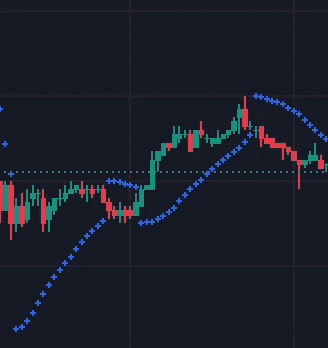
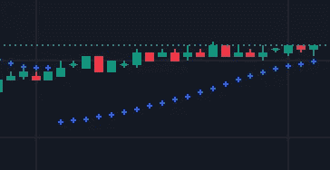
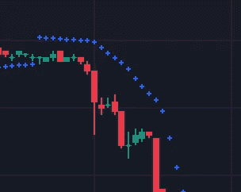
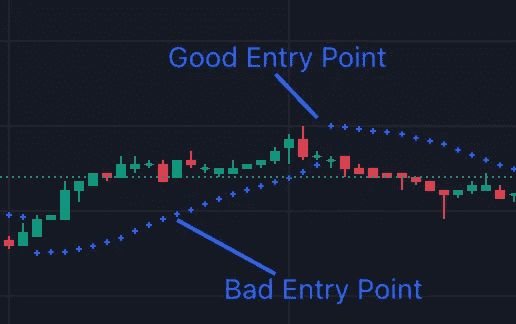
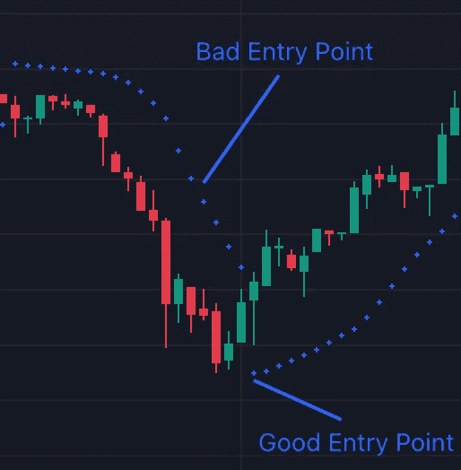

# 抛物线 SAR —解释的技术指标

> 原文：<https://medium.com/coinmonks/parabolic-sar-technical-indicators-explained-cf92dea3bf37?source=collection_archive---------38----------------------->

在我们开始之前，请记住投资时要对自己的钱负责。只和你能承受的损失交易，永远 DYOR。

抛物线 SAR 由点组成，绘制在图表上蜡烛的上方和下方，以指示资产价格的移动方向。

The Parabolic SAR (TradingView)

通过观察这些点的位置，交易者可以预测资产价格在趋势市场中的走向。蜡烛上方的点通常显示熊市迹象/趋势，蜡烛下方的点显示牛市趋势。

当圆点从位于蜡烛的顶部变成蜡烛的底部时，这表明市场正从熊市走向牛市。但是当这些点从位于蜡烛的底部变成蜡烛的顶部时，这表明市场正在从看涨趋势转向看跌趋势。

> 交易新手？在[最佳密码交易所](/coinmonks/crypto-exchange-dd2f9d6f3769)上尝试[密码交易机器人](/coinmonks/crypto-trading-bot-c2ffce8acb2a)或[复制交易](/coinmonks/top-10-crypto-copy-trading-platforms-for-beginners-d0c37c7d698c)

# 买卖信号

Long/Buy Signal

当这些点从蜡烛线的上面变成下面时，就给了交易者买入或做多的信号。如上所述，这意味着市场正在从熊市趋势向牛市趋势转变。

Short/Sell Signal

当点从蜡烛线下面变成上面时，就给了交易者卖出或做空的信号。意味着看涨势头正在转变为看跌势头。

当根据抛物线 SAR 的指示买卖时，不要在市场处于趋势中间时进场。而是等趋势变了再进场。下面是一些好的和坏的入口点的例子。

Entry Point Example 1 (TradingView)

Entry Point Example 2 (TradingView)

尽管抛物线 SAR 可能在趋势市场中显示许多有利可图的交易，像许多其他技术指标一样，抛物线 SAR 可能在横向市场中显示许多错误信号，这可能导致巨大损失。我不建议在横盘时使用抛物线 SAR，在趋势市场时利用它，但在横盘时不要太贪心。

如果你想在交易时使用抛物线 SAR，我推荐使用它和另一个技术指标，比如 MACD。这样做可以帮助您确认指示器是否发出合法的信号，同时也是一道额外的安全防线。

> *加入 Coinmonks* [*电报频道*](https://t.me/coincodecap) *和* [*Youtube 频道*](https://www.youtube.com/c/coinmonks/videos) *了解加密交易和投资*

# 另外，阅读

*   [3 商业评论](/coinmonks/3commas-review-an-excellent-crypto-trading-bot-2020-1313a58bec92) | [Pionex 评论](https://coincodecap.com/pionex-review-exchange-with-crypto-trading-bot) | [Coinrule 评论](/coinmonks/coinrule-review-2021-a-beginner-friendly-crypto-trading-bot-daf0504848ba)
*   [莱杰 vs n 格拉夫](/coinmonks/ledger-vs-ngrave-zero-7e40f0c1d694) | [莱杰纳诺 s vs x](/coinmonks/ledger-nano-s-vs-x-battery-hardware-price-storage-59a6663fe3b0) | [币安评论](/coinmonks/binance-review-ee10d3bf3b6e)
*   [加密交易机器人](/coinmonks/crypto-trading-bot-c2ffce8acb2a) | [Bingbon 评论](https://coincodecap.com/bingbon-review)
*   [Bybit Exchange 审查](/coinmonks/bybit-exchange-review-dbd570019b71) | [Bityard 审查](https://coincodecap.com/bityard-reivew) | [Jet-Bot 审查](https://coincodecap.com/jet-bot-review)
*   [3 commas vs crypto hopper](/coinmonks/3commas-vs-pionex-vs-cryptohopper-best-crypto-bot-6a98d2baa203)|[赚取加密利息](/coinmonks/earn-crypto-interest-b10b810fdda3)