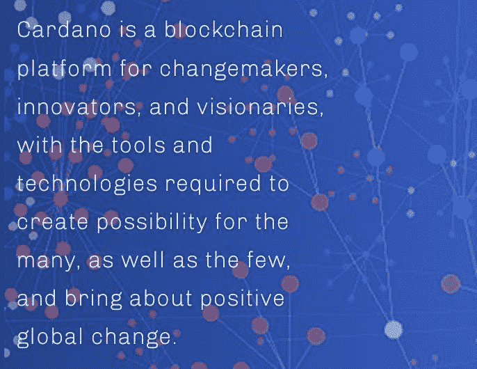
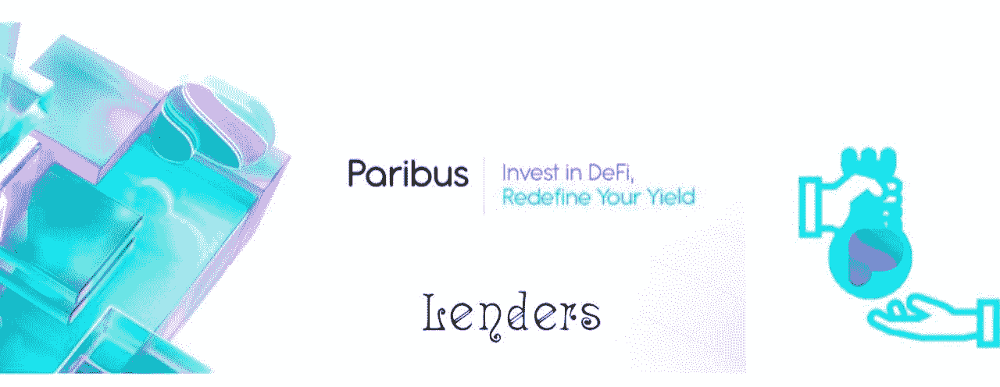
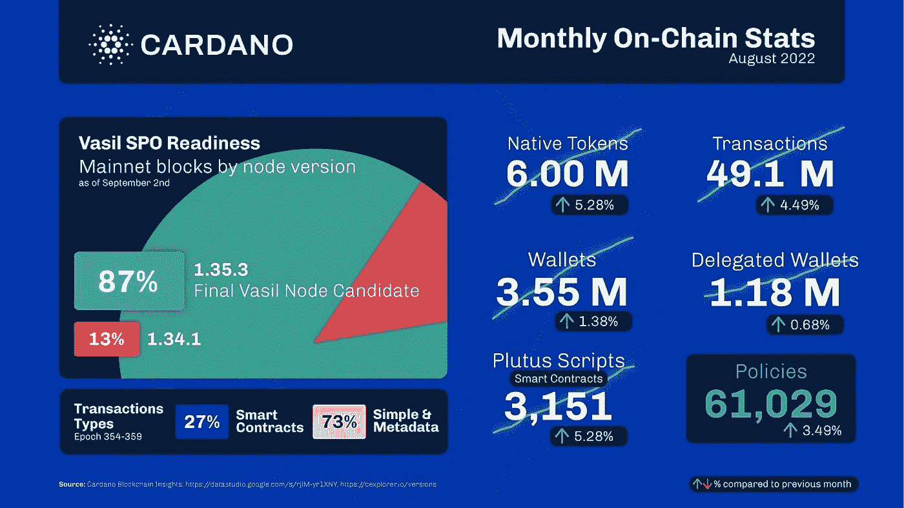

# Paribus 链作为革新不可替代代币的工具

> 原文：<https://medium.com/coinmonks/paribus-chain-as-a-tool-to-revolutionise-non-fungible-tokens-a5517739e51f?source=collection_archive---------38----------------------->

贷款是赋予 NFT 所有者权力的主要催化机制，因为它使他们能够通过简单地锁定他们的资产作为担保来获得流动性和资本。然而，NFT 借贷作为一种标准服务，在 DeFi 中是一个困难但显而易见的概念。毫无疑问，还有其他用途，包括衍生产品和在特定时间内将资源出租给其他用户。在流动性充裕的情况下，也有借贷的机会。本质上，用户将有机会创造收入，同时从流动性提供者那里获得好处。这些更新但发展迅速的用途是太空向前发展的驱动力。Paribus 的使命是为人们提供一个分散的渠道，让他们可以快速、自由地参与这场金融革命。截至目前，借贷平台和 DEXes 已经领先，exotics 缓慢跟进。然而，Paribus 正在已经建立的基础上进行扩展，并不断前进，以应对巨大的可用可能性和预期的需求。为了让不可替代代币、流动性头寸和合成资产的持有者从其价值中适当受益，DeFi 应用程序是必要的。

为了使其用户能够获得流动性并在不出售资产的情况下参与市场，基于 Cardano 的借贷平台 Paribus 支持传统和新型加密资产。在 Paribus，基本的操作方式是基于这样一种理念，即“如果可以出售，就有市场价值。如果它有价值，它可以被模型化”。

由于 Cardano 的性质及其与当前区块链整合的能力，Paribus 将默认利用并扩大这一能力，以释放各种资产的跨链流动性。NFT、虚拟土地、人工合成以及更传统的资产，如 ADA、ETH 和 DOT，是 Paribus 将处理的一些资产。Cardano 将使 Paribus 协议能够连接跨越几个区块链的无数资产，同时保持链不可知。Cardano 的互操作性消除了障碍，允许无限制的价值转移。

**PBX 令牌** 自分散自治组织(Dao)于 2016 年首次推出以来，人们对这些协议如何解决与商业模式相关的问题产生了浓厚的兴趣。建立一个允许权力分散结构的组织或业务战略可能是一个挑战。我们认为，权力下放和团队合作是强大的力量。PBX 所有者可以提出建议并进行投票，目的是增强协议。通过建立这种反馈循环，协议及其利益相关者的联系将得到改善，良好的调整将得到鼓励。PBX 令牌的费用分摊功能是其附加功能之一。收取的一部分费用将归持有者所有。拥有更多代币的人将获得更大份额的代币。利益相关者从持股中获益，同时得到回报，这鼓励了进一步持股。

**贷款人
任何 DeFi 平台的根本组成部分都是贷款人。这些人在比特币世界中通常被称为“霍德勒”。他们不打算完全清算他们持有的加密货币。这个用户群体将有另一种方式通过 Paribus 创造被动收入，因为他们的基础资产会随着时间的推移而增值。生态系统的流动性是由贷款人提供的，他们的服务会获得利息补偿。该平台将根据使用率等变量提供存款年利率(%)。某项资产的存款年利率(%)可以被贷方用来粗略预测他们的收益。**

为了保持系统的自给自足和可持续发展，清算已经就绪。当用户的借款余额由于借款资产的资产价格下降和/或上升而超过其全部抵押品价值时，清算可以由计算机、其他 dApps 或使用“清算经理”合同上的清算功能的人来执行。通过使用该功能，调用方的资产将以低于市场利率的价格换取借款方的抵押品。

**借款人** Paribus 只会起到担保贷款的平台作用。这意味着为了用一项资产进行借款，借款人必须首先存入该项资产。因此，为了确保平台的可持续发展和自给自足，借款人还充当间接的流动性提供者。每个借款人都需要支付贷款期限内累计的利息，以及小额的前期平台费用。

借书费适用于每一个借书人。目前，它的硬编码值为 0.2%。该费用将适用于借款总额，并在适当时显示在用户的仪表板上。这些费用将累计并计入协议储备金。这项收费是为了防止短期借款人受到虐待。DAO 治理机制将允许对收费计划进行更改。

**风险** 考虑利率模型的特点及其根据市场情况动态修改自身的能力。理解上述模型对借款人和贷款人来说都是至关重要的，以防止过高的利率和/或清算。

**购买巴黎银行并投资** 自 2021 年 8 月正式推出以来，巴黎银行链已成为加密货币市场上最受关注的货币之一。有鉴于此，有理由说 PBX 是一个极好的投资选择，前景看好，有吸引力。Paribus (PBX)可在包括 KuCoin 在内的加密货币交易所购买。这些利基市场的功能类似于股票交易平台，让你买卖比特币。

通过 paribus.io 上的 Paribus 网站，用户或 HODLer 可以入股 paribus。开发人员非常努力地让它尽可能的简单和开放，而且非常的用户友好。目前，Paribus 为他们的金银资金池提供赌注。用户可以在银池 Argenti 中投资 500，000 到 3，000，000 PBX，锁定 180 天，以换取至少 25% APY 的支付水平。

**pari bus 链的其他用例** Paribus 是一个跨链的借贷协议，用于 NFTs、流动性头寸，反之亦然。由于它的许多应用，它是更有价值和有吸引力的投资。以下可用性展示了某些使用案例:

Capital One Store
Capital One 的购物功能现在包括 Paribus，这是一个免费工具，可以快速寻找折扣、低价和激励措施。您最喜欢的价格保护功能用于将您的 Paribus 帐户与 Capital One 购物帐户连接起来。

**使用亚马逊** Paribus 现在会跟踪您的亚马逊在线订单的交付情况，如果交付延迟，它会代表您向亚马逊要求赔偿。事实上，你保留所有的是最好的部分。他们免费提供这项服务。

**结论** 非正规金融机构拥有一个不断增长的不对称市场基础，理应在这场争论中占有一席之地。这些新的可核实资产的持有者将能够通过贷款和租赁市场创造收入。根据 Paribus 的说法，NFT 市场最终将达到公平的市场价值，并达到与大多数可交易加密货币相同的流动性水平。与 NFT 不同，特定加密货币资产的所有者将能够使用他们的代币来支持 Paribus 网络并赚取利息。这是被动的，几乎没有风险，并以相关的命名令牌作为回报。在有内在价值的地方，这种价值可以被利用，以便用户可以保持特定资产的上升潜力，同时通过 Paribus 提供的贷款市场赚更多的钱。用户不需要主动管理它，因为它是不可信的。Cardano 的速度和定价结构为任何组织、dApp 或代币所有者提供了明显的效率。

> 交易新手？试试[密码交易机器人](/coinmonks/crypto-trading-bot-c2ffce8acb2a)或者[复制交易](/coinmonks/top-10-crypto-copy-trading-platforms-for-beginners-d0c37c7d698c)