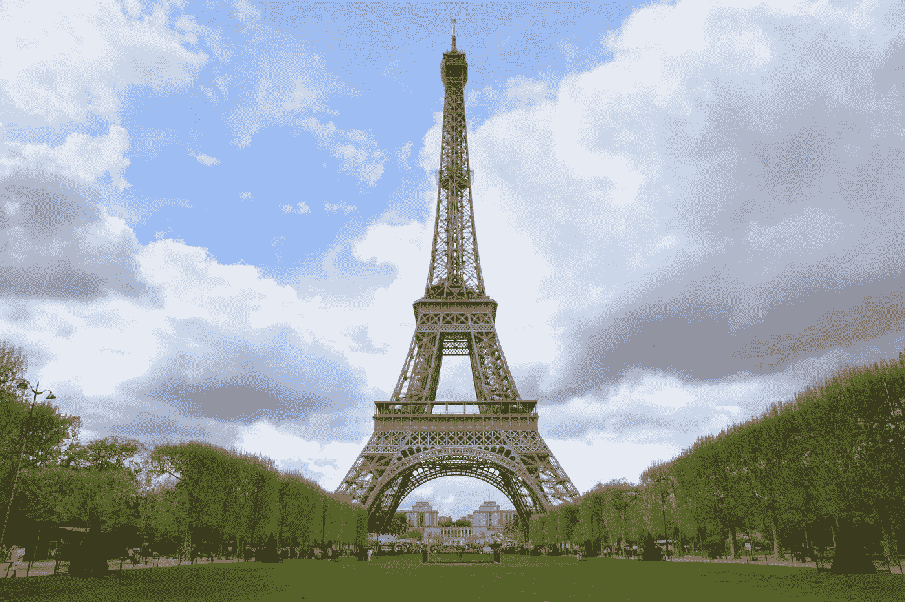

# 巴黎成为下一个“秘密天堂”的梦想因洗钱而受挫

> 原文：<https://medium.com/coinmonks/paris-dream-to-be-the-next-crypto-haven-crippled-by-money-laundering-f7856fcf3713?source=collection_archive---------16----------------------->

Image Credit: [Anirudh Koul](https://www.flickr.com/photos/anirudhkoul/)

来到巴黎，成为追求加密梦想的天堂竞赛的最新参赛者！这座爱情之城现在宣传自己是最新的、无疑是最酷的地方，可以过上轻松的比特币生活，或者领导一家加密公司。法国总统埃马纽埃尔·马克龙和他的政府一直表示希望招募更多的技术人才，并投资于分散金融(DeFi)、加密货币、元宇宙和元收藏品。

结果也开始显现。两个最强大的德菲公司，币安的 T3 和 Crypto.com 的 T5，现在把巴黎当成了他们的家。更多的人也来了。随着巴黎的历史能力，产生宏伟的艺术壮举，元宇宙从巴黎的角度可以提出一些梦幻般的可能性。但是它能提供保护免受被称为“隐冬”的风暴袭击吗？

全球有没有任何“加密货币避风港”避免了 2022 年加密冬天的负面影响？这似乎是意料之中的事，不是吗？如果天堂的基础——货币——受到冲击，那么天堂里的每个人都会受到冲击。包括马耳他、萨尔瓦多、瑞士和现在的法国在内的这些地方的居民，在你看来是否像是在财政上苦苦挣扎？没有那么多，至少如果外表说明了什么的话。这是因为加密市场不是为那些不属于百万富翁阶层的人准备的。就目前而言，这是富人的游戏，这使得这些“加密天堂”在很大程度上成为富人享受的地方。

艺术吸引了与密码相同(几乎相同)的人群，原因显而易见——可以说，只要赌对了马，就能获得巨大的收益。上次去巴黎时，我参观了现代艺术博物馆，我只能想象在那样的地方会有元宇宙式的体验。巴黎可以将 NFT 从目前的状态——一堆丑陋的像素——转变为美丽和/或有意义的东西，值得投资，即使对那些账面上没有数百万美元的人来说。据《华盛顿邮报》报道，一家 NFT 工厂已经在巴黎郊区的[蓬皮杜中心](https://www.centrepompidou.fr/en/)大楼附近就位。对于不了解的人来说，蓬皮杜中心和现代艺术博物馆一样前卫。

原谅我的冒昧，但是如果巴黎能够把艾菲尔铁塔或者凯旋门变成 NFT 呢？那会是什么样子(希望不是一堆笨重的像素)，它将如何工作，谁或什么实体将从公共投资中受益？也许是巴黎和凯旋门？一次 NFT 的出售可以建立一个足够大的基金来适当地维护拱门，但也给投资出售的公民一部分凯旋门，这将随着时间的推移而成熟。也许巴黎创造了一个 NFT 收藏馆，除了拱门和艾菲尔铁塔之外，还包括其他珍宝，比如巴黎圣母院的凡尔赛宫(我知道它不在巴黎市区)？拿我来说，我肯定会考虑投资类似的东西，我还没有投资过任何 NFT

不过，巴黎的问题从来都不是它的吸引力，也不是它为所投资的艺术品创造财富的能力。巴黎今天和历史上的问题，以及它所培育的艺术世界，一直是洗钱活动。自卢浮宫建成以来，艺术品就成了富人洗钱的工具。购买艺术品的程序总是不正当的，追踪这些不正当购买的法规从来就不存在。

随着欧盟开始监管加密及其副产品、非功能性金融工具和任何与元宇宙相关的东西，以及美国通过将其纳入越来越多的安全定义来限制艺术本身，这种情况可能会发生变化。据美国财政部称，美国的古董现在被视为证券，并伴随着一系列与艺术品交易商和买家无关的合规问题。

> “在我们应对系统性挑战，如企业透明度和其他让犯罪分子滥用美国金融体系的漏洞时，我们将看看还需要什么来解决其他行业(包括艺术行业)特有的洗钱风险。”
> 
> -恐怖融资和金融犯罪办公室负责战略政策的副助理国务卿斯科特·伦勃朗。

然而，今天在巴黎，马克龙政府(包括法国财政部)没有这样的职位。你能想象这样一项立法在像巴黎这样的城市会引起什么样的骚乱吗？马克龙知道他的法棍涂在哪里，可能会把这种举动留给他的前任。然而，为了让巴黎成为一个真正的加密天堂，马克龙需要实施的是针对他的政府带到巴黎的公司的监管和合规措施，包括 Binances 和 Crypto.coms。承诺减少监管是一个灾难，其中一个目前以一家名为 Sorare 的公司的形式存在，这是一家总部位于 NFT 的在线幻想足球游戏，去年由软银投资了 43 亿美元。

Sorare 本质上是一个伪装成游戏的赌博平台，在法国以外受到了抨击。英国的赌博委员会拒绝许可甚至承认该平台。委员会发布的一份通知称,“我们注意到英国消费者可以访问足球主题网站——Sorare.com。Sorare.com 没有得到赌博委员会的许可。这意味着英国消费者在该网站上完成的任何活动都不属于持牌运营商应该遵守的赌博法规范围。”

据[华盛顿邮报](https://www.washingtonpost.com/business/macrons-crypto-dreammay-be-a-gamble/2022/10/24/345d2a30-5368-11ed-ac8b-08bbfab1c5a5_story.html)报道，瑞士赌博和监督管理局(Gespa)最近将 Sorare 列入黑名单。由于欧盟针对 Sorare 的这些和其他运动，法国监管机构开始对该公司感到不安。共和党参议员克里斯蒂娜·拉瓦德最近要求法国政府解释为什么 Sorare 没有被置于该国赌博监管机构的监督之下。迄今为止，马克龙和索拉雷对此做出了相当冷漠的回应，声称索拉雷是一家“与众不同的公司”。

不同不等于好，更重要的是合规。有烟就有火，现在马克龙把巴黎变成下一个加密天堂的梦想有化为灰烬的危险，因为这些问题长期以来一直困扰着这座爱情之城。

*   结束

> 交易新手？试试[密码交易机器人](/coinmonks/crypto-trading-bot-c2ffce8acb2a)或[复制交易](/coinmonks/top-10-crypto-copy-trading-platforms-for-beginners-d0c37c7d698c)