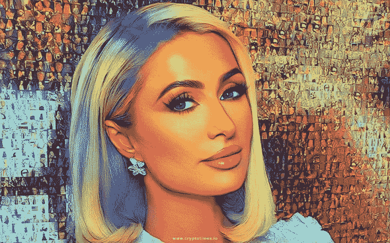
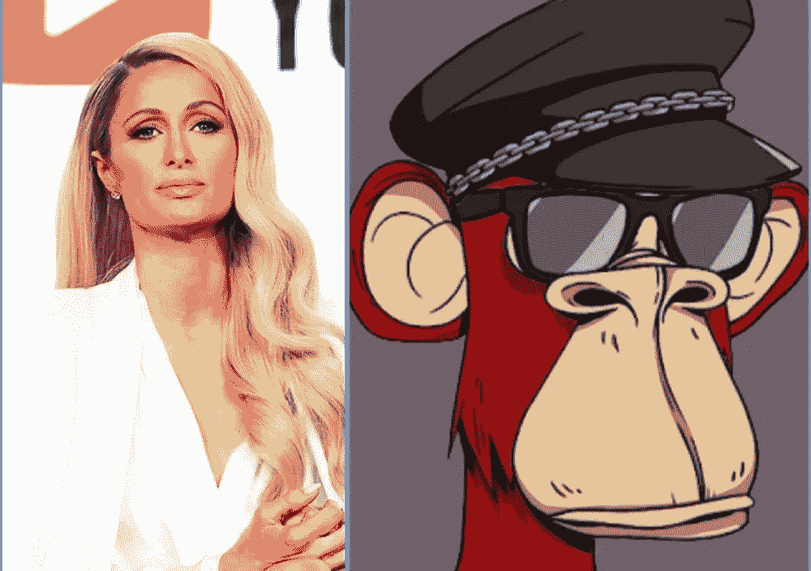
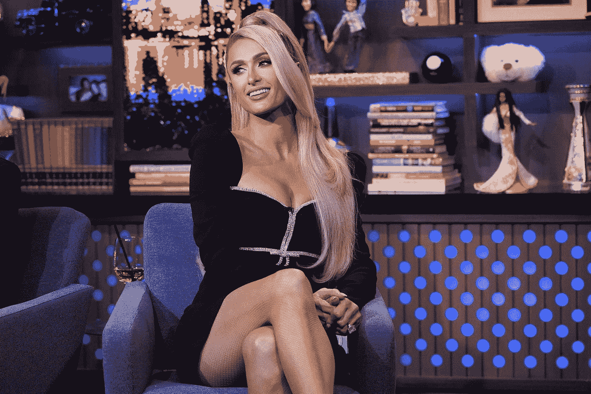

# 帕丽斯·希尔顿是个比你更好的骗子

> 原文：<https://medium.com/coinmonks/paris-hilton-is-a-better-hustler-than-you-ff13e9e0566a?source=collection_archive---------20----------------------->

Paris Hilton is ultra bullish on web3.

当我提到帕丽斯·希尔顿时，你可能会退缩。

虚荣，愚蠢的金发碧眼，富家子弟，不太有用。

这些可能就是你脑海中闪现的东西吧？

但我看到了一个积极进取的企业家，她随着时间的推移变得成熟起来，用自己的双手建立了自己的帝国。

她很努力。

她有事业心。

她比大多数亿万富翁继承人更努力工作，尤其是在她不需要工作的时候。

她适应时代。

从做她自己的真人秀，到成为一名模特和歌手，现在甚至跳上 NFT 炒作和拥有一只无聊的猿。

她没有坐拥财富，无所事事。

她拥有媒体内容公司 11:11 Media。

她甚至在去年开了一个播客“这是巴黎”。

现在，她把自己的才能带到了元宇宙。

Hilton’s bored ape is Bored Ape #1294\. Bored Ape #1294 is a five-trait red fur ape with sunglasses and an s&m hat. Moonpay purchased the ape for her three days for 119 Eth.

她计划出售自己的 NFTs，并在沙盒中举办虚拟派对。

她将创建自己的虚拟马里布豪宅，允许粉丝购买数字资产和头像。

她之前于 2021 年在 Roblox 建造了她的“巴黎希尔顿世界”，并在新年做 DJ。

说真的，她的简历很棒。

她的手无所不在！

她是一个充满活力的企业家。

尝试新事物，足够大胆地投身于新行业，在需要的地方转向，并且仍然能够熟练地操纵媒体以满足她的需要。

是的，她有时会有争议和古怪的举动。

但不管怎样，她确实很努力了。

巴黎因出名而出名。

她有自己的服装品牌、香水业务、自己的真人秀，目前是一名 DJ 和知名社交名流，甚至有过短暂的歌手生涯。

你以前听过她的歌吗？

Between NFTs and her collection of businesses, Paris is worth around $300M.

我感到震惊的是，她没有从创建希尔顿酒店品牌的曾祖父那里继承任何东西。

希尔顿酒店特许经营权价值 370 亿美元。

希尔顿品牌已存在近一个世纪，在 120 多个国家拥有 6000 多家酒店。

“黑石集团在 2007 年以 260 亿美元收购了希尔顿酒店”。

显然帕里斯一分钱也没得到。

尽管如此，以她近 3 亿美元的净资产，靠自己的力量实现这一目标还是令人印象深刻。

我的意思是，对于像她这样姓希尔顿的人来说，除了在沙滩上啜饮玛格丽塔酒和整夜在派对上跳舞之外，她真的不需要如此努力地工作或做任何事情。

恨她或爱她，你都不得不佩服她的魄力。

对于像她这样已经拥有一切的人来说，她真的很努力工作，到处沾手指。

让我们看看她将在 web3 中做什么。

-

你认为帕丽斯·希尔顿是一个好的企业家吗？

-

# startups # business # startupx # growth # success # social media # culture # web 3 # strategy # Paris hilton # hilton # Paris # sandbox #元宇宙#媒体# NFT # eth # BTC # crypto #黑客#钱包

> 交易新手？试试[加密交易机器人](/coinmonks/crypto-trading-bot-c2ffce8acb2a)或者[复制交易](/coinmonks/top-10-crypto-copy-trading-platforms-for-beginners-d0c37c7d698c)