# 第 1 部分:在 Go 中构建一个完整的 API，使用 go-ethereum 客户端和 GoFiber 框架与 P2P 托管智能契约进行交互

> 原文：<https://medium.com/coinmonks/part-1-building-a-complete-api-in-go-to-interact-with-a-p2p-escrow-smart-contract-using-9cf1f681c860?source=collection_archive---------5----------------------->

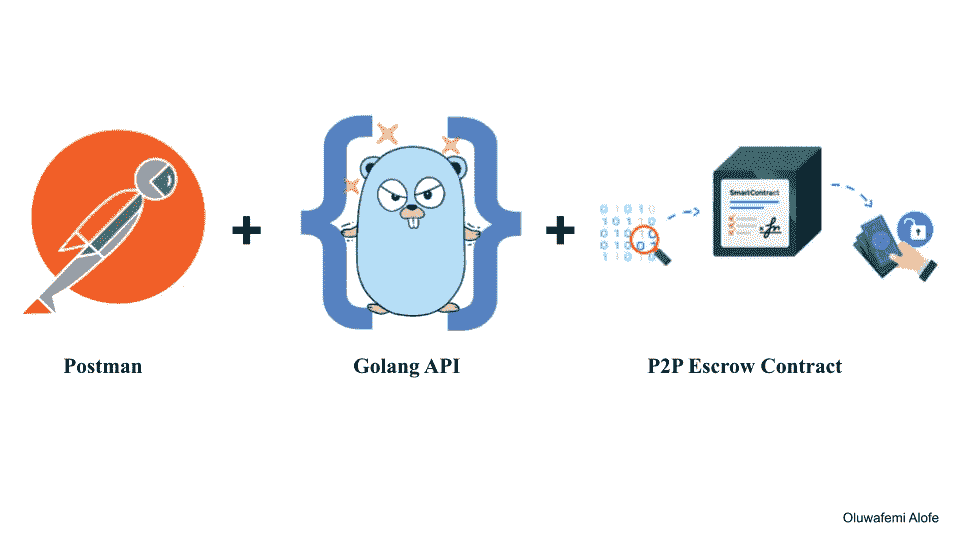

这是本系列两篇文章的第一部分

*   第 1 部分:项目概述、设置纤程、生成 Go 绑定、部署合同、添加 get Escrow & Wallet 逻辑地址端点
*   [第二部分:添加和结束 P2P API 端点](/coinmonks/part-2-building-a-complete-api-in-go-to-interact-with-a-p2p-escrow-smart-contract-using-fa0514531032)

你可以在 [GitHub](https://github.com/alofeoluwafemi/-smart-contract-api-go-ethereum) 上找到代码库作为参考。

这里是 API 邮差集[链接](https://www.getpostman.com/collections/362a5590ccf482592588)供你导入。

# 介绍

[Go 以太坊](https://geth.ethereum.org/)是以太坊协议的官方 Go 实现。矿工可以使用它来运行以太坊节点，Dapp 开发人员(如您)可以使用它的一些包来将您的智能合约编译为字节码，将其部署到网络，并使用它与您部署的智能合约进行交互。

[Go Fiber framework](https://gofiber.io/) 另一方面，它是一个构建在 Fasthttp 之上的 Go web 框架，fast http 是 Go 最快的 HTTP 引擎。它与 Node express framework 的相似性和易用性使得它对新的 go 开发人员来说很有吸引力，可以用来为他们的项目构建 API。就我个人而言，当我开始写 Go lang 时，我发现它很容易理解并很快上手。

# 你将学到什么

对于本教程，我将使用现有的智能合同，这是 PiggyFi 在 [Pay 上满足 P2P 平台的第一稿之一，它是在我们参加的一次黑客马拉松中作为概念证明而编写的。你可以在这里](https://piggyfi.africa/)[找到代码库](https://github.com/orignellc/piggyfi-contracts-poc)因为这个系列的目标不是关注构建一个智能契约，而是一个在 go 中与之交互的 API，这个契约服务于我们的使用。

不要担心，我将在下面做一个智能合同的分解

# 困难

*   初学✅
*   中间✅

# 要求

为了从本教程中获得最佳效果，需要对围棋有一些基本的了解。对于我选择的编辑器，我将使用 [go-land](https://www.jetbrains.com/go/) ，在我看来这是目前最好的 go-lang 编辑器。

除了安装最新的 [solidity 编译器](https://docs.soliditylang.org/en/v0.8.9/installing-solidity.html)和显然最新的 [go 编译器](https://go.dev/doc/install)是一个要求。

此外，确保从 Goerli 处获得一些[测试 ETH，在部署和与智能合同交互时将需要支付天然气费。](https://goerlifaucet.com/)

# 目录

## 本文的第 1 部分包括

```
- Project Overview
- Setup Fiber, .env & Install dependecies
- Deploy Smart Contracts on Goeril Testnet
- Generate Go Binding for Contracts
- Build out API Endpoints
 - POST request to Deploy Contracts
  - USDC
  - Factory
 - GET request to get CustodianWalletLogic  Address
 - GET request to get Escrow Contract Address
```

## 本文的第 2 部分包括

```
- POST request to set USDC address on the Escrow contract
- POST request to Deploy a new custodian wallet address
- POST request to open a buy P2P order with USDC Balance
- POST request to open a sell P2P order with USDC Balance
- Handle Revert Errors in response
- GET request to Get open orders for a vendor
- GET request to Get order by ID 
```

## 第三部分 DIY(自己动手)🤓

```
- POST request to open a sell P2P order with USDC Balance
- GET request to Get open orders for a vendor
- GET request to Get order by ID
- POST request to cancel P2P order
```

# 项目概述

Piggyfi 智能合约的这个版本是一个简单的托管系统，用于在供应商和希望将菲亚特兑换成美元的客户之间进行 P2P 交易。

**Factory:** 这个智能契约负责部署一个新的 CustodianWalletProxy，它在每次新用户根据用户配置文件注册时充当供应商或客户的钱包。

**CustodianWalletProxy:**这是作为钱包部署给每个用户的契约。它使用委托调用来使用 CustodianWallet 逻辑契约中的实际逻辑，除了回调方法和构造函数之外，它本身不包含任何有意义的函数。
**类型:**这保存了代理和逻辑钱包契约之间共享的公共变量，以避免写得不好的代理契约常见的可怕的存储覆盖问题。
**USDC:** 这个合同从来没有部署到生产中，它只是用来在测试环境中模仿 USDC，给我们灵活性和对铸造的控制。在生产中，该地址将用于托管合同中的 USDC。

# 设置光纤。环境和安装依赖项

如果你正在使用 Goland IDE，创建一个新项目就像打开你的 IDE 一样简单，在菜单上点击**文件>新建>项目**。不要忘记把默认的名字`awesomeProject`改成你想要的名字，我用`go-ethereum-api`作为我的名字。

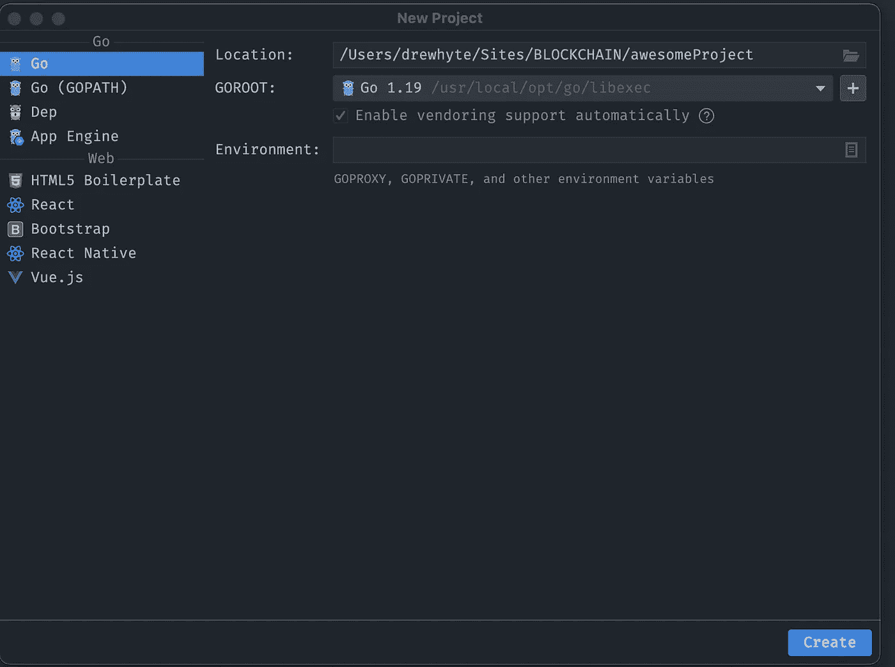

对于其他 IDE，如 VScode，创建您的项目主管，然后从终端运行下面的命令来生成您的`go.mod`文件。

```
go mod init github.com/GITHUB_USER_NAME/go-ethereum-api
```

记得用你的 GitHub 用户名替换`GITHUB_USER_NAME`。

**下一步**，运行安装纤维框架

```
go get github.com/gofiber/fiber/v2
```

现在，您想要创建一个`package main.go`文件并将下面的代码粘贴到其中。

```
package main

import (
 "github.com/gofiber/fiber/v2"
 "log"
)

func main() {
 app := fiber.New()

 app.Get("/", func(c *fiber.Ctx) error {
  return c.SendString("Hello, World!")
 })

 err := app.Listen(":3000")

 if err != nil {
  return
 }

}
```

从您的终端运行

```
go run server.go
```

您应该会在终端中看到类似的内容，表明一切都运行良好。

```
 ┌───────────────────────────────────────────────────┐ 
 │                   Fiber v2.37.0                   │ 
 │               http://127.0.0.1:3000               │ 
 │       (bound on host 0.0.0.0 and port 3000)       │ 
 │                                                   │ 
 │ Handlers ............. 2  Processes ........... 1 │ 
 │ Prefork ....... Disabled  PID ............. 57556 │ 
 └───────────────────────────────────────────────────┘
```

访问 [http://127.0.0.1:3000](http://127.0.0.1:3000/) 你会看到**你好，世界！不多，但是使用 go Fiber 建立一个 HTTP 服务器就那么快。**

现在，让我们正确设置我们的应用程序结构，但在我们继续之前，安装以下依赖项。

```
go get github.com/joho/godotenv
go get github.com/ethereum/go-ethereum
```

# 文件夹结构

更新您的项目结构以匹配下图。别担心，一切很快就会有意义的。

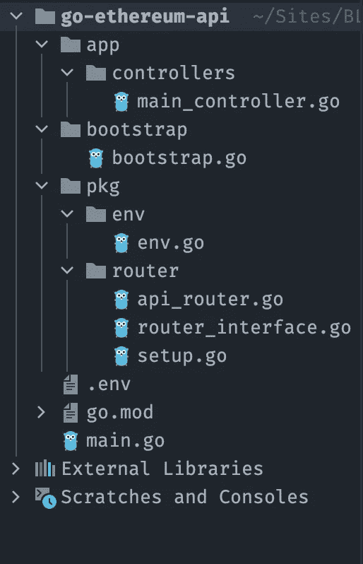

**路由器:**路由器包是定义所有路由的地方。在这里，我们定义了一个路由器接口，允许我们拥有不同类型的路由器，如 API 路由器、HTTP 路由器等，这样就可以在接口上定义所有路由器都必须实现的方法，并且我们可以确保我们的路由器将以某种方式运行，正如您将在下面看到的`InstallRouter`方法的情况。

**pkg/router/router _ interface . go**

```
package router

import "github.com/gofiber/fiber/v2"

type Router interface {
 InstallRouter(app *fiber.App)
}
```

**pkg/router/API _ router . go**

```
package router

import (
	"github.com/alofeoluwafemi/go-ethereum-api/app/controllers"
	"github.com/gofiber/fiber/v2"
	"github.com/gofiber/fiber/v2/middleware/limiter"
)

type ApiRouter struct {
}

func (h ApiRouter) InstallRouter(app *fiber.App) {
	api := app.Group("/api/v1", limiter.New())

	api.Get("/", controllers.RenderHello)
}

func NewApiRouter() *ApiRouter {
	return &ApiRouter{}
}
```

**pkg/router/setup.go**

```
package router

import (
	"github.com/gofiber/fiber/v2"
)

func InstallRouter(app *fiber.App) {
	setup(app, NewApiRouter())

	//If no route was matched
	app.Use(func(c *fiber.Ctx) error {
		err := c.SendStatus(404)
		panic(err)
	})
}

func setup(app *fiber.App, router ...Router) {
	for _, r := range router {
		r.InstallRouter(app)
	}
}
```

⚠️:记得用与你的`go.mod`对应的用户名替换导入中的 GitHub 用户名。

您会注意到我们在路由中导入了控制器包，但是它不能被解析。接下来，让我们解决这个问题。

**控制器:**控制器包的目的很简单，就是从路由包中抽象出逻辑，使事情变得简单。

**app/controllers/main _ controller . go**

```
package controllers

import "github.com/gofiber/fiber/v2"

func RenderHello(c *fiber.Ctx) error {
	return c.Status(fiber.StatusOK).JSON(fiber.Map{
		"message": "Hello from api",
	})
}
```

**env:**env 包是一个助手工具，它使用`godotenv`包来读取我们不想发布的环境变量，比如我们的私钥和 Alchemy API 密钥。

**pkg/env/env.go**

```
package env

import "github.com/joho/godotenv"

var Env map[string]string

func GetEnv(key, def string) string {
	if val, ok := Env[key]; ok {
		return val
	}
	return def
}

func SetupEnvFile() {
	envFile := ".env"
	var err error
	Env, err = godotenv.Read(envFile)
	if err != nil {
		panic(err)
	}

}
```

**bootstrap:**bootstrap 包就是你所说的 app 点火。它创建一个新的**应用**命名实例，注册路由器和中间件，如果你想在未来初始化你的数据库，你可以在这里这样做。

**bootstrap/bootstrap.go**

```
package bootstrap

import (
	"github.com/alofeoluwafemi/go-ethereum-api/pkg/env"
	"github.com/alofeoluwafemi/go-ethereum-api/pkg/router"
	"github.com/gofiber/fiber/v2"
	"github.com/gofiber/fiber/v2/middleware/logger"
	"github.com/gofiber/fiber/v2/middleware/recover"
)

func NewApplication() *fiber.App {
	env.SetupEnvFile()
	app := fiber.New(fiber.Config{
		AppName: "Go Ethereum API",
		CaseSensitive: true,
	})

	//Middleware
	app.Use(recover.New())
	app.Use(logger.New())

	//Setup routes
	router.InstallRouter(app)

	return app
}
```

最后在你的`main.go`里用这个取代一切。

```
package main

import (
"fmt"
"github.com/alofeoluwafemi/go-ethereum-api/bootstrap"
"github.com/alofeoluwafemi/go-ethereum-api/pkg/env"
"log"
)

func main() {
	app := bootstrap.NewApplication()
	log.Fatal(app.Listen(
		fmt.Sprintf("%s:%s",
			env.GetEnv("APP_HOST", "localhost"),
			env.GetEnv("APP_PORT", "3000"),
		)))
}
```

并在您的`.env`文件中更新细节以匹配以下内容。不要担心私钥和炼金术 Api 密钥，我们会及时更新它。

**。环境**

```
DEPLOYER_PRIVATE_KEY=0x0
ALCHEMY_KEY=
APP_HOST=localhost
APP_PORT=3000
```

停止当前运行的`go run main.go`进程并重启。如果您访问我们唯一注册的路由`http://127.0.0.1:3000/api/v1`，您应该会看到 JSON 返回。

```
{
	"message": "Hello from api"
}
```

# 在 Goeril Testnet 上部署智能合同

# 克隆合同

将 Piggyfi 智能合同库克隆到我们项目中的`smart-contracts`文件夹中。为此，请运行下面的命令。

```
git clone https://github.com/orignellc/piggyfi-contracts-poc.git smart-contracts
```

打开

# 汇编合同

在 smart-contracts 目录中运行`npm install`,以获取 openzeppelin 依赖项，该依赖项包含我们的一些合同所引用的智能合同

```
solc --abi smart-contracts/contracts/*.sol -o builds --bin --include-path smart-contracts/node_modules --base-path .
```

`--base-path`代表你自己源代码树的根，而`--include-path`允许你指定包含外部代码的额外位置。

如果你在`builds`文件夹中查看，你会看到生成的`.abi`和`.bin`文件列表。

# 生成合同 Go 绑定

阿比根是围棋以太坊附带的一个套装。它是一个源代码生成器，可以将以太坊契约定义转换成易于使用、编译时类型安全的 Go 包。

简单地说，为我们的智能契约生成一个 go 代码，这样我们就可以用 go 代码与契约进行交互。

安装 **abigen**

```
cd $GOPATH/src/github.com/ethereum/go-ethereum/
make
make devtools
```

一旦完成，如果你在命令行上运行`abigen`，你应该得到一个输出。

```
Fatal: No destination package specified (--pkg)
```

现在我们已经安装了`abigen`工具。在 **pkg** 文件夹中再创建两个新包，第一个是`go-binding`。

在里面，`go-binding`创建一个新文件`generate_binding.go`。这个文件将包含一个脚本，当我们运行它时，它将帮助我们生成 go-binding，所以将下面的脚本复制并粘贴到文件中。这是不言自明的，但我会很快给它一些背景。

```
package main

import (
	"fmt"
	"io/ioutil"
	"log"
	"os/exec"
	"strings"
)

const (
	buildDir  = "../../builds/"
	targetDir = "../ethereum/"
)

func main() {
	contractNames := []string{"CustodianWalletLogic", "Factory", "Escrow", "USDC"}

	cmd := exec.Command("which","abigen")
	err := cmd.Run()

	if err != nil {
		log.Fatal("ethereum-abigen is not a command: ",err)
	}

	for _, contractName := range contractNames {
		buildFilename := buildDir + contractName
		bindingFilename := targetDir + contractName + ".go"
		cmd = exec.Command(
			"abigen", fmt.Sprintf("--bin=%s.bin", buildFilename),
			fmt.Sprintf("--abi=%s.abi", buildFilename),
			fmt.Sprintf("--pkg=%s", contractName),
			fmt.Sprintf("--out=%s", bindingFilename),
		)

		err := cmd.Start()
		if err != nil {
			log.Fatalln(err)
		}
		log.Printf("Running... %s", cmd)
		err =  cmd.Wait()
		if err != nil {
			log.Fatalln(err)
		}
		bindFile, err := ioutil.ReadFile(bindingFilename)
		if err != nil {
			log.Fatalln("Cannot open: ",bindingFilename, err)
		}

		fileOutput := strings.Replace(string(bindFile), "package " + contractName, "package ethereum", 1)
		err = ioutil.WriteFile(bindingFilename, []byte(fileOutput), 0644)
		if err != nil {
			log.Fatalln("Cannot write to: ",bindingFilename,err)
		}
	}
}
```

该脚本遍历提供的`contractNames`，将`.abi`和`.bin`附加到文件名，然后将它们作为选项传递给`abigen`命令的`--abi`和`--bin`，以生成 go 绑定。

在运行 go 文件之前，创建我前面提到的第二个包文件夹。取名**以太坊**，别忘了这个应该在 **pkg** 之下。

从您的终端，在您的项目根目录下运行以下命令。

```
cd pkg/go-binding 
go run generate_binding.go
```

如果一切顺利，您的输出应该是这样的。

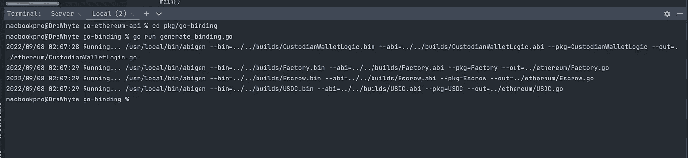

如果你打开以太坊包文件夹，你会看到你生成的 go-binding。

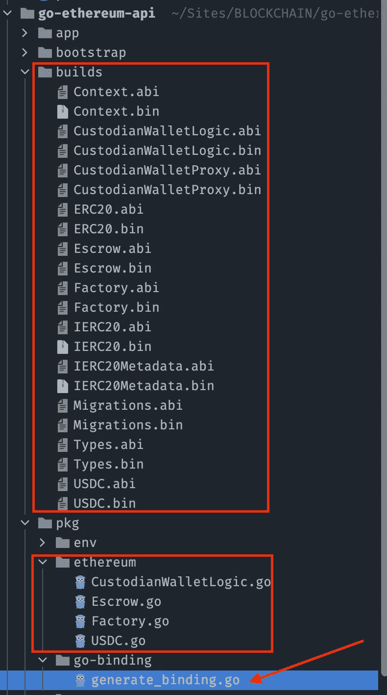

# 获取 Alchemy API 密钥

Alchemy 提供 web3 开发工具来构建和扩展您的 Dapp。我们将使用他们的一项服务，允许您连接到区块链节点，在我们的情况下是`Goerli`。

[创建一个新账户](https://dashboard.alchemy.com/)如果还没有，点击 **+创建应用**按钮，选择以太坊和 Goerli。

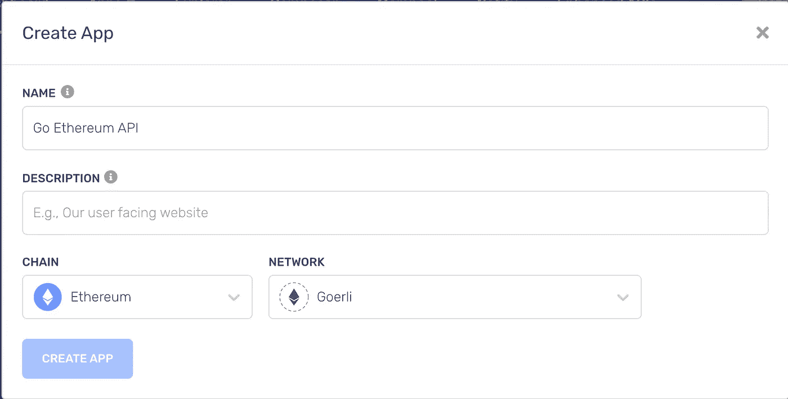

应用程序创建完成后，将会列出您当前拥有的应用程序列表。在你新创建的应用程序旁边，点击**查看密钥**并将密钥和 URL 复制到`.env`文件中，作为 **ALCHEMY_KEY** 和 **RPC_URL** 的值。

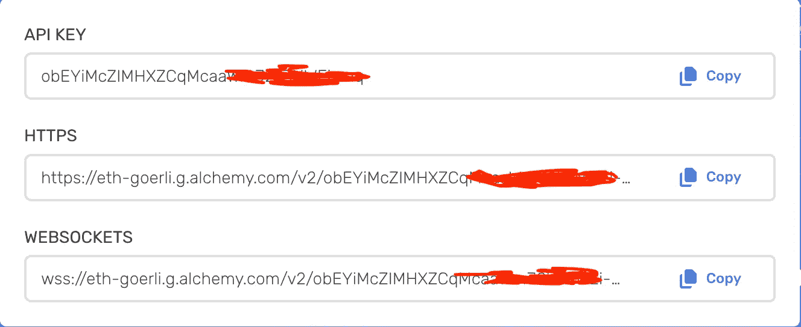

现在你的`.env`文件应该是这样的。

```
DEPLOYER_PRIVATE_KEY=bef9e118a31a0af39585d7e82cae42a...  
ALCHEMY_KEY=obEYiMcZIMHXZC...
RPC_URL=https://eth-goerli.g.alchemy.com/v2/obEYiMcZIMHXZC...
APP_HOST=localhost
APP_PORT=3000
```

# 创建包区块链

我们需要在`pkg`目录下创建一个区块链包，并在其中创建一个新的 go 文件`blockchain.go`。

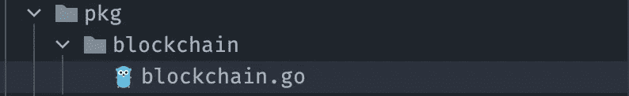

这个包抽象了我们如何连接到以太坊节点并与我们的智能合约通信的大部分内容，以避免代码重复并保持控制器精简。我将继续解释代码的每个部分，然后我们可以把它放在一起，看看它是如何运行的。

首先，我们定义一个变量`CurrentConnection`，它将从这个包中导出。这个变量将保存一个`ClientConnection`的实例。

```
var CurrentConnection *ClientConnection
```

接下来我们定义`ClientConnection` struct，它保存了我们需要与以太坊节点通信的细节集合，比如 RPC URL、调用请求选项等。以及节点连接本身的一个实例。

```
type ClientConnection struct {
	RpcURL      string
	SignerKey   string
	Client      *ethclient.Client
	NetworkId   *big.Int
	NetworkName string
	ctx         context.Context
	callOpts    *bind.CallOpts
	trxOpts     *bind.TransactOpts
}
```

上面的一些 struct 字段，比如`RpcURL`、`NetworkName`、`NetworkId`，是不言自明的，我将花时间更详细地描述其余的字段。

**SignerKey:** 这将从环境文件中选取，它是不带`0x`前缀的智能合约部署者的私钥。
**客户端:**它保存连接到以太坊炼金术节点的实例。
**ctx:** 用于所有智能合约调用的上下文
**callOpts:** 它是用于发出不改变状态的合约调用请求的选项集合。
**trxOpts:** 是创建有效以太坊交易所需的授权数据的集合，引起状态变化。

然后我们用`New()`来创建一个新的连接，并在`ClientConnection`中设置字段。

```
func New() {
	clientCon := new(ClientConnection)
	clientCon.RpcURL = env.GetEnv("RPC_URL", "")

	client, err := ethclient.Dial(clientCon.RpcURL)
	defer client.Close()
	if err != nil {
		log.Fatalln("Could not connect to client: ", err)
	}

	clientCon.Client = client
	clientCon.SignerKey = env.GetEnv("DEPLOYER_PRIVATE_KEY", "")
	clientCon.NetworkName = "Goerli"
	clientCon.NetworkId = new(big.Int).SetInt64(5)
	clientCon.ctx = context.Background()

	clientCon.setTransactOpts()
	clientCon.setCallOpts()

	CurrentConnection = clientCon
}
```

添加一个方法来从我们的私钥中提取公钥，公钥 ECDSA。

```
func (clientCon *ClientConnection) extractSignerKeys() (*ecdsa.PrivateKey, standardcryto.PublicKey, *ecdsa.PublicKey, error) {
	privateKey, err := crypto.HexToECDSA(clientCon.SignerKey)
	if err != nil {
		log.Fatalln("Invalid private key: ", err)
	}

	publicKey := privateKey.Public()
	publicKeyECDSA, ok := publicKey.(*ecdsa.PublicKey)

	if !ok {
		log.Fatalln("cannot assert type: publicKey is not of type *ecdsa.PublicKey")
	}

	return privateKey, publicKey, publicKeyECDSA, err
}
```

添加另一个方法来获取传递给它的任何地址的下一个`Nonce`。我们主要并且可能只需要它来获取部署者地址的随机数。

```
func (clientCon *ClientConnection) nonceAt(address common.Address) uint64 {

	nonce, err := clientCon.Client.PendingNonceAt(clientCon.ctx, address)

	if err != nil {
		log.Fatalln("Cannot get nonce: ", err)
	}

	return nonce
}
```

最后，我们需要在`ClientConnection`上设置`callOpts` `trxOpts`字段的方法。

```
func (clientCon *ClientConnection) setTransactOpts() *bind.TransactOpts {
	signer, _, publicKeyECDSA, _ := clientCon.extractSignerKeys()

	from := crypto.PubkeyToAddress(*publicKeyECDSA)

	opts, err := bind.NewKeyedTransactorWithChainID(signer, clientCon.NetworkId)
	if err != nil {
		log.Fatalln("Error with NewKeyedTransactorWithChainID ", err)
	}

	priorityFee, err := clientCon.Client.SuggestGasTipCap(clientCon.ctx)
	if err != nil {
		log.Fatalln("Cannot suggest Tip: ", err)
	}

	opts.Nonce = new(big.Int).SetUint64(clientCon.nonceAt(from))
	opts.GasTipCap = priorityFee

	clientCon.trxOpts = opts

	return opts
}
```

```
func (clientCon *ClientConnection) setCallOpts() *bind.CallOpts {
	opts := new(bind.CallOpts)
	return opts
}
```

把这些放在一起。

```
package blockchain

import (
	"context"
	standardcryto "crypto"
	"crypto/ecdsa"
	"github.com/alofeoluwafemi/go-ethereum-api/pkg/env"
	"github.com/alofeoluwafemi/go-ethereum-api/pkg/ethereum"
	"github.com/ethereum/go-ethereum/accounts/abi/bind"
	"github.com/ethereum/go-ethereum/common"
	"github.com/ethereum/go-ethereum/core/types"
	"github.com/ethereum/go-ethereum/crypto"
	"github.com/ethereum/go-ethereum/ethclient"
	"log"
	"math/big"
)

var CurrentConnection *ClientConnection

type ClientConnection struct {
	RpcURL      string
	SignerKey   string
	Client      *ethclient.Client
	NetworkId   *big.Int
	NetworkName string
	ctx         context.Context
	callOpts    *bind.CallOpts
	trxOpts     *bind.TransactOpts
}

func New() {
	clientCon := new(ClientConnection)
	clientCon.RpcURL = env.GetEnv("RPC_URL", "")

	client, err := ethclient.Dial(clientCon.RpcURL)
	defer client.Close()
	if err != nil {
		log.Fatalln("Could not connect to client: ", err)
	}

	clientCon.Client = client
	clientCon.SignerKey = env.GetEnv("DEPLOYER_PRIVATE_KEY", "")
	clientCon.NetworkName = "Goerli"
	clientCon.NetworkId = new(big.Int).SetInt64(5)
	clientCon.ctx = context.Background()

	clientCon.setTransactOpts()
	clientCon.setCallOpts()

	CurrentConnection = clientCon
}

func (clientCon *ClientConnection) nonceAt(address common.Address) uint64 {

	nonce, err := clientCon.Client.PendingNonceAt(clientCon.ctx, address)

	if err != nil {
		log.Fatalln("Cannot get nonce: ", err)
	}

	return nonce
}

func (clientCon *ClientConnection) setTransactOpts() *bind.TransactOpts {
	signer, _, publicKeyECDSA, _ := clientCon.extractSignerKeys()

	from := crypto.PubkeyToAddress(*publicKeyECDSA)

	opts, err := bind.NewKeyedTransactorWithChainID(signer, clientCon.NetworkId)
	if err != nil {
		log.Fatalln("Error with NewKeyedTransactorWithChainID ", err)
	}

	priorityFee, err := clientCon.Client.SuggestGasTipCap(clientCon.ctx)
	if err != nil {
		log.Fatalln("Cannot suggest Tip: ", err)
	}

	opts.Nonce = new(big.Int).SetUint64(clientCon.nonceAt(from))
	opts.GasTipCap = priorityFee

	clientCon.trxOpts = opts

	return opts
}

func (clientCon *ClientConnection) setCallOpts() *bind.CallOpts {
	opts := new(bind.CallOpts)
	return opts
}

func (clientCon *ClientConnection) extractSignerKeys() (*ecdsa.PrivateKey, standardcryto.PublicKey, *ecdsa.PublicKey, error) {
	privateKey, err := crypto.HexToECDSA(clientCon.SignerKey)
	if err != nil {
		log.Fatalln("Invalid private key: ", err)
	}

	publicKey := privateKey.Public()
	publicKeyECDSA, ok := publicKey.(*ecdsa.PublicKey)

	if !ok {
		log.Fatalln("cannot assert type: publicKey is not of type *ecdsa.PublicKey")
	}

	return privateKey, publicKey, publicKeyECDSA, err
}

func (clientCon *ClientConnection) DeployUSDC() (common.Address, *types.Transaction) {
	contract, trx, _, err := ethereum.DeployUSDC(clientCon.trxOpts, clientCon.Client)

	if err != nil {
		log.Fatalln("Could not deploy USDC contract: ", err)
	}

	return contract, trx
}
```

现在我们已经有了这些方法，我们可以开始在我们的智能契约上调用方法。打开以太坊包下的`USDC.go`文件，在第`46`行你会注意到函数`DeployUSDC`，可以调用它来部署`USDC`契约。

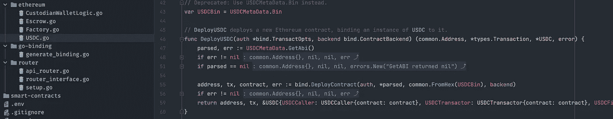

我们需要从一个控制器调用这个函数，并向它传递所需的两个参数。幸运的是，我们可以同时提供这两者，但是首先在 controllers 下，创建一个新的 go 文件`deployer_controller.go`，然后添加以下内容来定义一个将从`/api/v1/deploy/usdc`调用的`DeployUSDC`控制器。

内部`deployer_controller.go`把这个粘贴进去。

```
package controllers

import (
	"github.com/alofeoluwafemi/go-ethereum-api/pkg/blockchain"
	"github.com/gofiber/fiber/v2"
)

func DeployUSDC(c *fiber.Ctx) error {

	conn := blockchain.CurrentConnection

	address, transaction := conn.DeployUSDC()

	return c.Status(fiber.StatusOK).JSON(fiber.Map{
		"address": address.String(),
		"hash":    transaction.Hash(),
	})
}
```

区块链包的`DeployUSDC`方法尚未定义。让我们通过定义它来解决这个问题，它简单地调用`USDC.go`上的`DeployUSDC`函数。

```
func (clientCon *ClientConnection) DeployUSDC() (common.Address, *types.Transaction) {
	contract, trx, _, err := ethereum.DeployUSDC(clientCon.trxOpts, clientCon.Client)

	if err != nil {
		log.Fatalln("Could not deploy USDC contract: ", err)
	}

	return contract, trx
}
```

在`api_router.go`中，为新的 URL 添加一个路由器

```
deploy := api.Group("/deploy")
	deploy.Get("/usdc", controllers.DeployUSDC)
```

最后，如果您停止并重新运行该命令，使用。

```
go run main.go
```

当您访问[http://127 . 0 . 0 . 1:3000/API/v1/deploy/usdc](http://127.0.0.1:3000/api/v1/deploy/usdc)时，您将获得一个响应，其中包含合同地址和用于部署 usdc 合同地址的事务的哈希。

```
{
	"address": "0xb3f2504110eeea6a522218048D0519B829788DDD",
	"hash": "0xaeabc29be2bb6d2e84466edebf8e38b0ca833f250bc70eeb733509365b5f787b"
}
```

在我的例子中，如果我访问 Etherscan 并使用事务散列进行搜索。

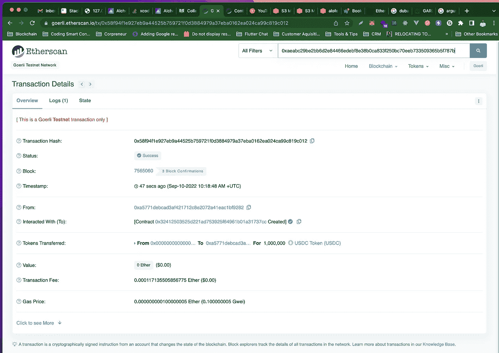

# 使用 POST 而不是 GET

我们在部署 USDC 路由上使用的当前 HTTP 方法是 GET，现在将其改为 POST，这样。

```
deploy.Post("/usdc", controllers.DeployUSDC)
```

再次重启服务器，从 Postman 向[http://127 . 0 . 0 . 1:3000/API/v1/deploy/usdc](http://127.0.0.1:3000/api/v1/deploy/usdc)发出 GET 请求，一个新的智能合约将被部署。您可以使用事务哈希进行确认。

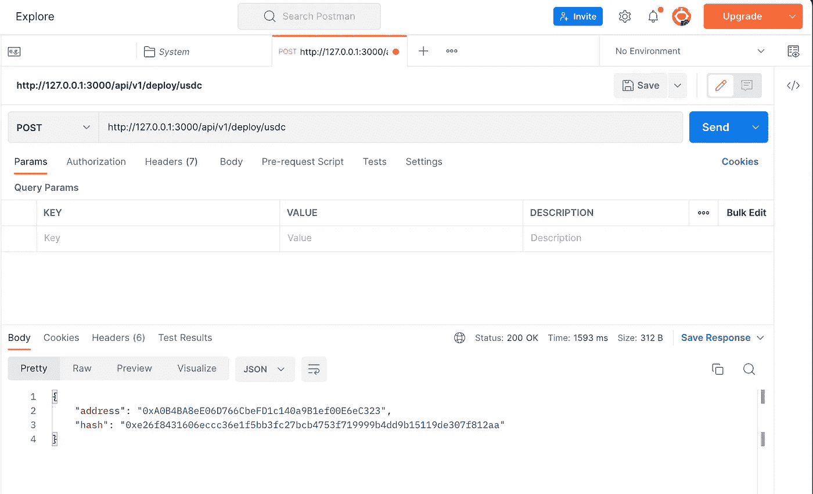

请务必记下已部署契约的地址，供我们以后使用。

接下来，让我们创建一个新的路由来部署工厂契约。在`DeployUSDC`的正下方添加该控制器功能。

```
func DeployFactory(c *fiber.Ctx) error {
```

```
 conn := blockchain.CurrentConnection address, transaction := conn.DeployFactory() return c.Status(fiber.StatusOK).JSON(fiber.Map{
		"address": address.String(),
		"hash":    transaction.Hash(),
	})
}
```

它与之前的控制器功能没有任何不同，因此无需解释。

这同样适用于区块链一揽子权利下的`DeployUSDC`方法。添加一个新方法`DeployFactory`，它调用 Factory.go 文件中的 DeployFactory。`DeployFactory`还部署了`Escrow`和`CustodianWalletLogic`合同，您将在后面看到。

```
func (clientCon *ClientConnection) DeployFactory() (common.Address, *types.Transaction) {
	contract, trx, _, err := ethereum.DeployFactory(clientCon.trxOpts, clientCon.Client)

	if err != nil {
		log.Fatalln("Could not deploy Factory contract: ", err)
	}

	return contract, trx
}
```

重启 fiber 服务器，在 Postman 中向[http://127 . 0 . 0 . 1:3000/API/v1/deploy/Factory](http://127.0.0.1:3000/api/v1/deploy/factory)发出 POST 请求，工厂契约将被部署。

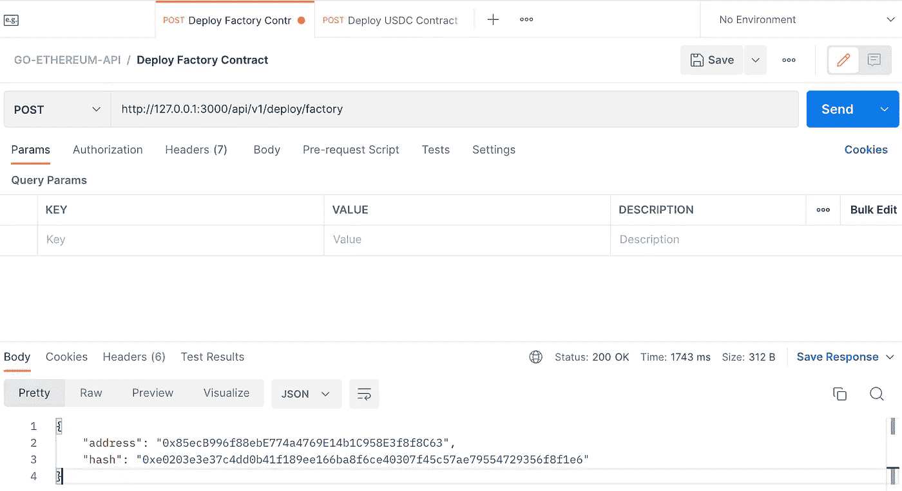

请记住，我提到过部署工厂契约也要部署托管& WalletLogic 契约。您可以通过查看工厂合同构造函数来确认这一点。

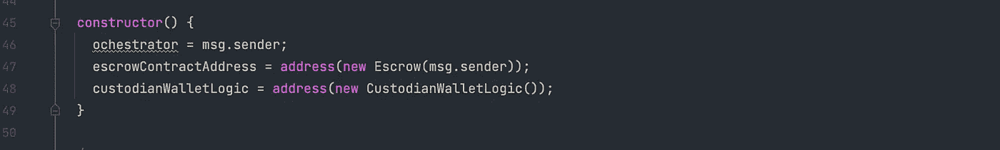

# 获取 CustodianWalletLogic 地址

为了使用工厂合同，我们将在区块链包中创建一个`factory.go`文件。就像在`blockchain.go`文件中我们定义了一个单例变量来保存连接实例一样，我们也将定义一个变量`FactoryInstance`来保存已部署工厂契约的实例。

然后一个`NewFactory`方法使用契约地址得到一个实例。

```
var FactoryInstance *Factory

type Factory struct {
	Address  common.Address
	Instance *ethereum.Factory
}

func (clientCon ClientConnection) NewFactory(address string) {
	FactoryInstance = new(Factory)

	contractAddress := common.HexToAddress(address)

	FactoryInstance.Address = contractAddress

	instance, err := ethereum.NewFactory(contractAddress, clientCon.Client)
	if err != nil {
		log.Fatalln("Cannot get Factory contract at address ", address, " due to: ", err)
	}

	FactoryInstance.Instance = instance
}
```

最后是`GetLogicAddress`方法。

```
func (clientCon ClientConnection) GetLogicAddress() common.Address {

	address, err := FactoryInstance.Instance.CustodianWalletLogic(clientCon.callOpts)

	if err != nil {
		log.Fatalln("Cannot make call to Factory at ", FactoryInstance.Address, "due to: ", err)
	}

	return address
}
```

将所有这些放在一起`pkg/blockchain/factory.go`看起来应该完全是这样的。

```
package blockchain

import (
	"github.com/alofeoluwafemi/go-ethereum-api/pkg/ethereum"
	"github.com/ethereum/go-ethereum/common"
	"log"
)

var FactoryInstance *Factory

type Factory struct {
	Address  common.Address
	Instance *ethereum.Factory
}

func (clientCon ClientConnection) NewFactory(address string) {
	FactoryInstance = new(Factory)

	contractAddress := common.HexToAddress(address)

	FactoryInstance.Address = contractAddress

	instance, err := ethereum.NewFactory(contractAddress, clientCon.Client)
	if err != nil {
		log.Fatalln("Cannot get Factory contract at address ", address, " due to: ", err)
	}

	FactoryInstance.Instance = instance
}

// GetLogicAddress 0x505A066E89Be22D3e56f16e1666de31f9328572e
func (clientCon ClientConnection) GetLogicAddress() common.Address {

	address, err := FactoryInstance.Instance.CustodianWalletLogic(clientCon.callOpts)

	if err != nil {
		log.Fatalln("Cannot make call to Factory at ", FactoryInstance.Address, "due to: ", err)
	}

	return address
}
```

在`api_router.go`文件中，添加路由以调用刚刚添加的新控制器方法。

```
api.Get("/wallet-logic-address", controllers.GetCustodianWalletLogicAddress)
```

`GetCustodianWalletLogicAddress`控制器方法尚未定义。让我们将工厂逻辑从主控制器和部署者控制器中分离出来，出于这些原因，创建一个新的控制器`factory_controller.go`并将其粘贴到内部。

```
package controllers

import (
	"github.com/alofeoluwafemi/go-ethereum-api/pkg/blockchain"
	"github.com/gofiber/fiber/v2"
)

func GetCustodianWalletLogicAddress(c *fiber.Ctx) error {
	conn := blockchain.CurrentConnection

	address := conn.GetLogicAddress()

	return c.Status(fiber.StatusOK).JSON(fiber.Map{
		"address": address.String(),
	})
}
```

最后在`factory.go`中添加从控制器调用的方法。

```
func (clientCon ClientConnection) GetLogicAddress() common.Address {

	address, err := getFactory().CustodianWalletLogic(clientCon.callOpts)

	if err != nil {
		log.Fatalln("Cannot make call to Factory at ", FactoryInstance.Address, "due to: ", err)
	}

	return address
}
```

重启光纤服务器并使用 Postman 向[http://127 . 0 . 0 . 1:3000/API/v1/wallet-logic-address](http://127.0.0.1:3000/api/v1/wallet-logic-address)发出 GET 请求。

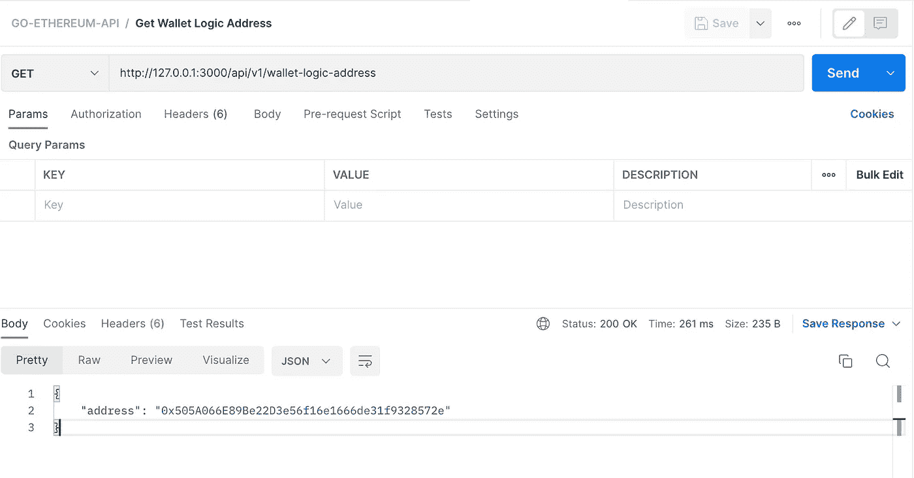

添加一个新的类似路由，以获取工厂部署的托管合同地址。

```
api.Get("/escrow-address", controllers.GetEscrowAddress)
```

在工厂控制器中创建`GetEscrowAddress`函数，几乎和 GetLogicAddress 控制器一样。

```
func GetEscrowAddress(c *fiber.Ctx) error {  
   conn := blockchain.CurrentConnection  

  address := conn.GetEscrowAddress()  

   return c.Status(fiber.StatusOK).JSON(fiber.Map{  
      "address": address.String(),  
   })  
}
```

最后，将`GetEscrowAddress`方法添加到`factory.go`中

```
func (clientCon ClientConnection) GetEscrowAddress() common.Address {  

   address, err := getFactory().EscrowContractAddress(clientCon.callOpts)  

   if err != nil {  
      log.Fatalln("Cannot make call to Factory at ", FactoryInstance.Address, "due to: ", err)  
   }  

   return address  
}
```

重启光纤服务器并使用 Postman 向[http://127 . 0 . 0 . 1:3000/API/v1/escrow-address](http://127.0.0.1:3000/api/v1/escrow-address)发出 GET 请求。

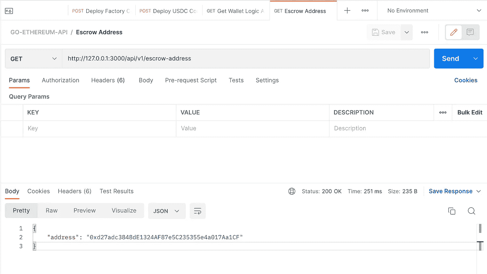

到目前为止，我们已经做到了以下几点:

*   设置 Go Fiber 框架并构建它以构建 API
*   设置 API 端点以部署工厂和 USDC 合同
*   设置 API 端点，以便在部署工厂合同时部署托管和钱包逻辑地址。我们直接从部署的工厂合同中读取这些信息

在最后一篇文章中，我们将完成与托管契约交互的另一个端点，以执行与订单相关的操作。

感谢你坚持到现在，如果你喜欢这篇文章，你可以通过为这篇文章鼓掌和订阅我的 [youtube 频道](https://www.youtube.com/channel/UCO3mWoCZ_iqRPRvUeg9oG2A)来支持我。

> 交易新手？尝试[加密交易机器人](/coinmonks/crypto-trading-bot-c2ffce8acb2a)或[复制交易](/coinmonks/top-10-crypto-copy-trading-platforms-for-beginners-d0c37c7d698c)