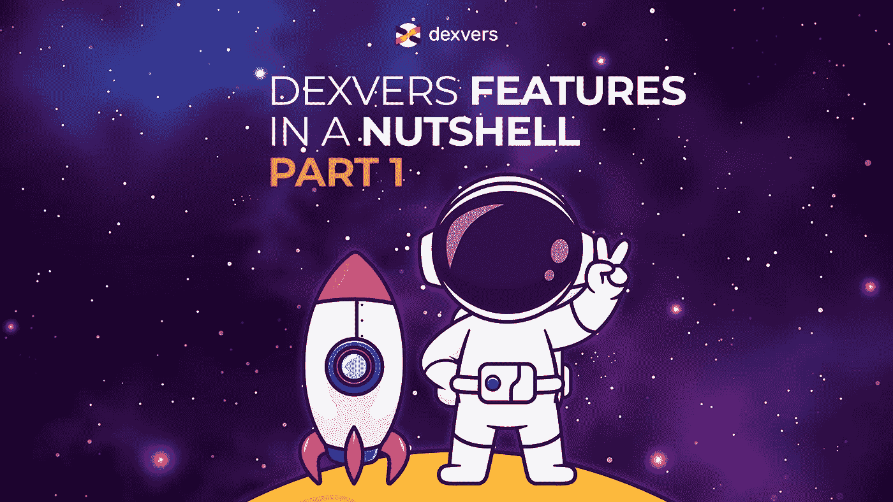

# [第 1 部分]简要介绍 Dexvers 的特性

> 原文：<https://medium.com/coinmonks/part-1-dexvers-features-in-a-nutshell-7f68284c05ba?source=collection_archive---------29----------------------->

古罗马人会说，Nomen 是预兆。因此，被称为 DEX vers——嗯，你已经猜到了——我们是一个分散的交易所(DEX)，而且——你可能真的不知道这一点——我们是基于具有多种和跨链可能性的多边形。

然而，虽然我们为自己是去中心化世界的一部分而感到非常自豪，但我们也认识到在 DeFi 世界中仍有改进的空间；尤其是关于流行的 dex 所提供的传统特性。

因此，Dexvers 提出了一个计划，为其用户提供一个结合了两个世界精华的超凡体验。我们目前正在开发 10 个具有各自用例的特性，在本文中，我们将分享其中一些特性的进展。让我们开始吧！

# 精英客户支持

有多少 dex 为其所有用户提供 24/7 全天候客户支持？传统的点对点市场几乎肯定不会提供聊天、电子邮件或任何其他类型的客户服务。

公平地说，在 CEX 上交易的核心机制是不同的，因此，对客户支持的需求更高——烦人的 KYC 程序，冻结提款，等等。

然而，这并不是分散交易的借口。至少对德克斯弗斯来说不是。女士们先生们，来认识一下 Dexvers 的三层客户支持！

# 电子邮件支持

这是 Dexvers 最简单的客户支持，最重要的是，对我们所有的用户完全免费。

# 聊天支持

每一层都包括前一层的特性，外加一些新的东西。因此，选择第 2 级客户支持的用户将同时获得电子邮件和聊天支持。

# 法律和会计支持

我们自豪地说，我们的第三层提供了一些令人印象深刻的功能，包括打电话给支持代理，询问他们您可能面临的法律和会计障碍。

# 溢价分析

Dexvers 的高级分析功能旨在确保交易的安全性和洞察力。Dexvers 信息图表将为您提供做出明智决策所需的数据。

对于交易初学者来说，Dexvers 有一个交换向导来详细解释如何进行 p2p 交易，每一步都是如此。对于有经验的交易者来说，Dexvers 提供了一个定制的仪表板，上面有你认为重要的任何信息图表。

了解历史数据和加密货币是如何演变的，将为您指明正确的方向。即使是最简单的事情，比如识别熊市。

# Dexvers 大使

Dexvers 有一个双管齐下的推荐计划，既有利于那些带来朋友在我们的交易所交易的人，也有利于那些带来新的和有前途的加密项目在 Dexvers 上市的人。

作为 Dexvers B2B 大使，只要项目仍然在 Dexvers 上列出，您将从您引入的项目交易中获得 2%的交易费。

其中一个好处是，在 Dexvers 上上市是 100%免费的，所以在这种情况下，每个人都是赢家:

*   你提到的项目将会免费上市
*   你将从该项目中获得所有交易费用的 2%
*   Dexvers 将成为生态系统的新成员

我们还了解到，许多有经验的加密爱好者都是微小的影响者，不管他们在社交媒体上有没有追随者。如果你有一个交易者网络——他们都可以通过你的推荐链接加入 Dexvers，瞧，你可以毫不费力地从他们的交易中获得 2%的交易费。

# 跟着德克斯韦尔

要了解更多关于 Dexvers 的信息，并在新的机会到来时抓住它们，请加入我们的 [Telegram](https://t.me/dexversproject) 社区和我们的 [Discord](https://discord.gg/FDgNWhU4Ps) 。

如果你想成为我们的原生令牌$DXVS 的早期采用者，赶快到你的应用商店或 Google Play 下载 Welthee Wallet 应用程序。

____

*免责声明:本文提供的信息不是法律、会计或财务建议。这些信息不应被解释为投资或交易建议，也不意味着是购买、出售或持有任何加密货币的恳求或建议。*

> 交易新手？尝试[加密交易机器人](/coinmonks/crypto-trading-bot-c2ffce8acb2a)或[复制交易](/coinmonks/top-10-crypto-copy-trading-platforms-for-beginners-d0c37c7d698c)