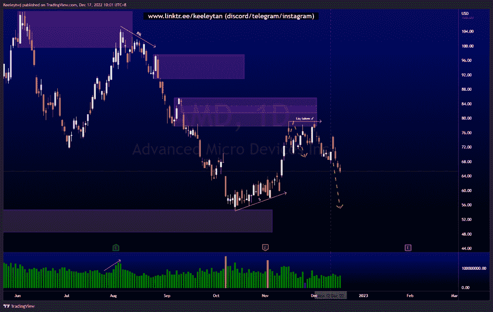

# 第一部分本周良好的技术分析#AAPL #NFLX #AMD

> 原文：<https://medium.com/coinmonks/part-1-good-technical-analysis-this-week-aapl-nflx-amd-55a3b9d6328d?source=collection_archive---------36----------------------->

在这里找到更多关于我的信息(YouTube/Discord/Telegram):[https://www.linktr.ee/keeleytan](https://www.linktr.ee/keeleytan)

如果你觉得我的帖子有帮助，如果你能在这个帖子上给我一个赞，并关注我以后的类似帖子，我将不胜感激。

我在考虑尝试在 discord 上提供免费信号服务。如果你有兴趣，请给我发邮件，让我在那里扮演一个角色！

希望你已经利用了我这周的分析。喜欢，分享，评论如果你是盈利的！我在考虑尝试在 discord 上提供免费信号服务。

#AAPL

自我本周分析以来下跌了 7.53%。

之前([https://www . trading view . com/chart/AAPL/roLhzUPd-AAPL-Analysis/](https://www.tradingview.com/chart/AAPL/roLhzUPd-AAPL-Analysis/))

在...之后

#NFLX

自我本周分析以来下跌了 7.53%。

前([https://www . trading view . com/chart/NFLX/146 uqxta-NFLX-Analysis/](https://www.tradingview.com/chart/NFLX/146uqXtA-NFLX-Analysis/))

在...之后

#AMD

自从我本周的分析以来，下跌了 7.44%。

之前([https://www . trading view . com/chart/AMD/q 4 xwdwnk-AMD-Analysis/](https://www.tradingview.com/chart/AMD/Q4xwdWNK-AMD-Analysis/))

在...之后

让我知道，如果你有任何你想让我分析的行情。

一定要在其他社交平台上看看我，我在交易、分析和心理学上发布内容。看看我这里:[https://www.linktr.ee/keeleytan](https://www.linktr.ee/keeleytan)

*原载于 2022 年 12 月 17 日 http://2minutesliteracy.wordpress.com***。**

> *交易新手？试试[加密交易机器人](/coinmonks/crypto-trading-bot-c2ffce8acb2a)或者[复制交易](/coinmonks/top-10-crypto-copy-trading-platforms-for-beginners-d0c37c7d698c)*