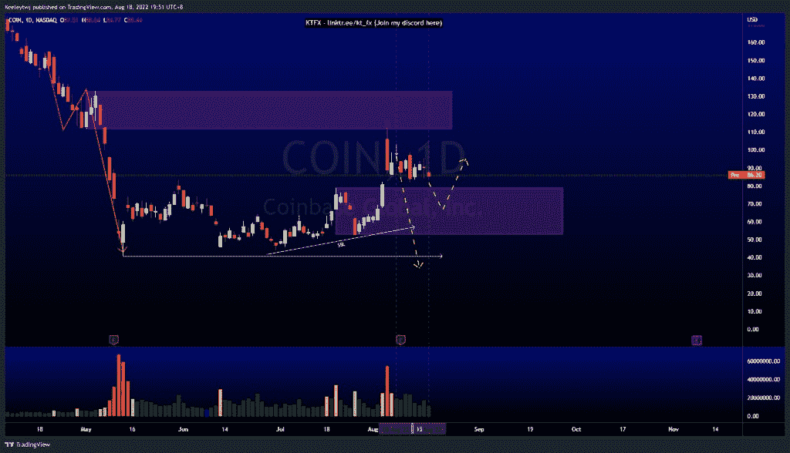
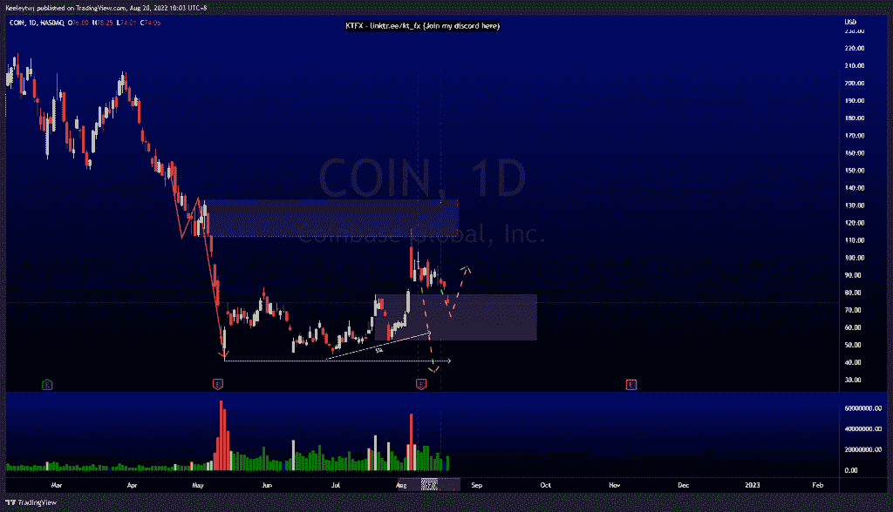
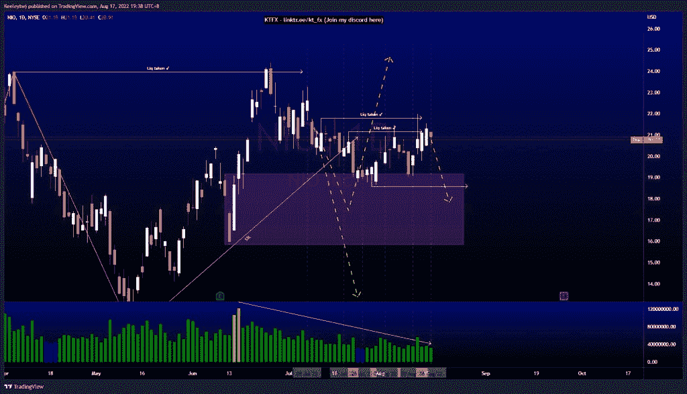
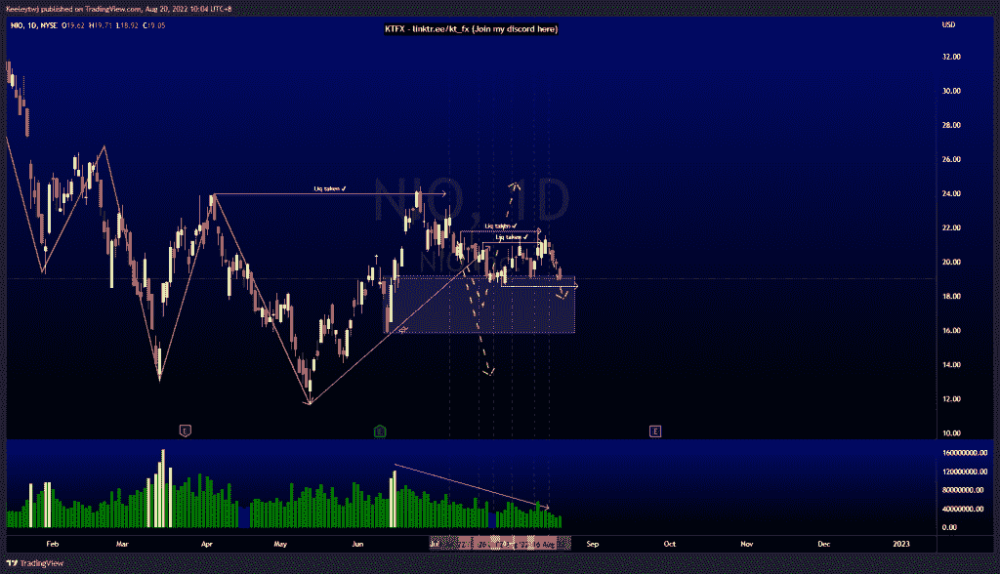
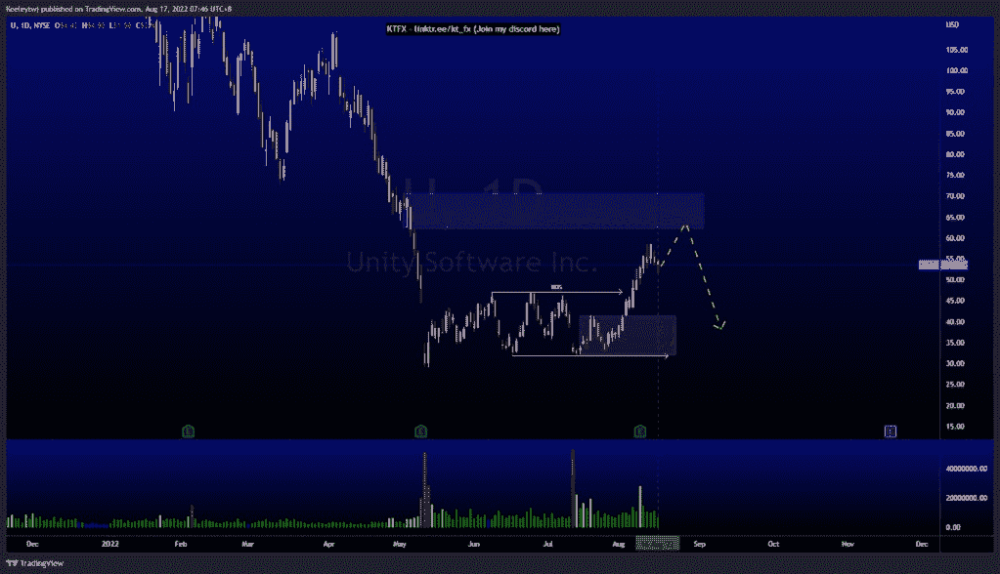
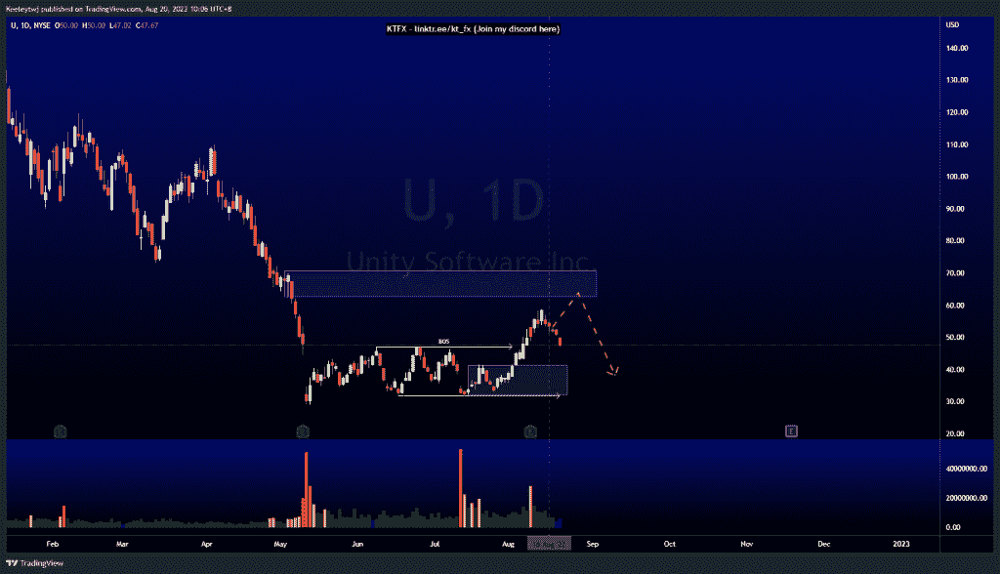

# 第 1 部分—本周良好的技术分析

> 原文：<https://medium.com/coinmonks/part-1-good-technical-analysis-this-week-coin-nio-u-e4bdfe8fa058?source=collection_archive---------43----------------------->

在这里找到更多关于我的信息(YouTube/Discord/Telegram):[https://www.linktr.ee/keeleytan](https://www.linktr.ee/keeleytan)

如果你觉得我的帖子有帮助，如果你能在这个帖子上给我一个赞，并关注我以后的类似帖子，我将不胜感激。

#硬币

缓和了 79.00 的看涨点。自从我的分析发表后，价格下跌了 12.69% 。

Before

After

#NIO

在 21.8 再次减轻了看涨的兴趣点。自从我的分析发表后，价格下跌了 9.52% 。

Before

After

#U

下跌以缓解 62.65 处的看涨 POI。自从我的分析发表后，股价下跌了 12.34%。

Before

After

希望你已经利用了我这周的分析。喜欢，分享，评论如果你是盈利的！

让我知道，如果你有任何你想让我分析的行情。

一定要在其他社交平台上看看我，我在交易、分析和心理学上发布内容。看看我这里:[https://www.linktr.ee/keeleytan](https://www.linktr.ee/keeleytan)

种类

发布于[技术分析](https://2minutesliteracy.wordpress.com/category/technical-analysis/)

*原载于 2022 年 8 月 20 日 http://2minutesliteracy.wordpress.com***。**

> *交易新手？试试[加密交易机器人](/coinmonks/crypto-trading-bot-c2ffce8acb2a)或者[复制交易](/coinmonks/top-10-crypto-copy-trading-platforms-for-beginners-d0c37c7d698c)*