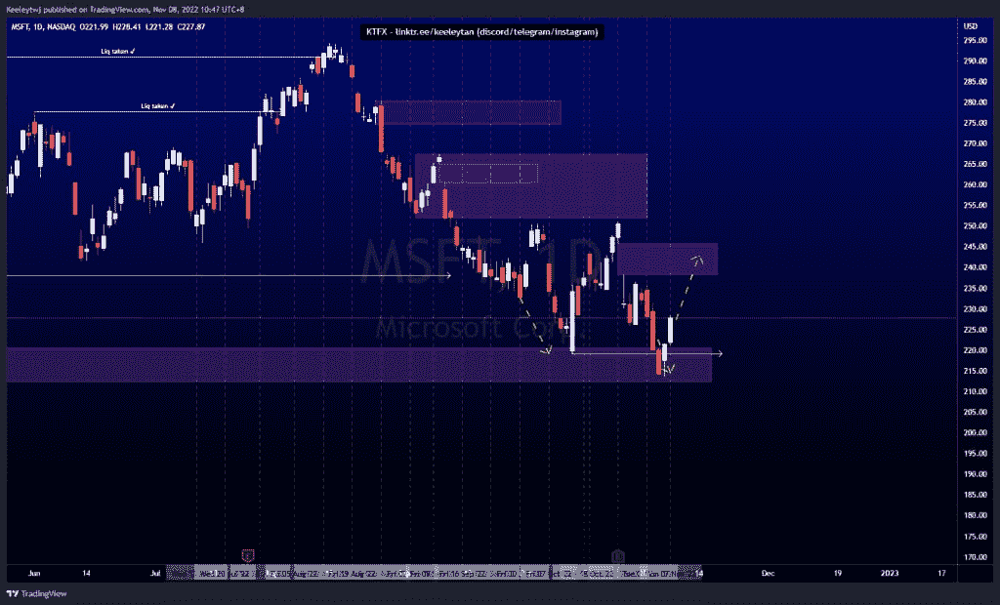
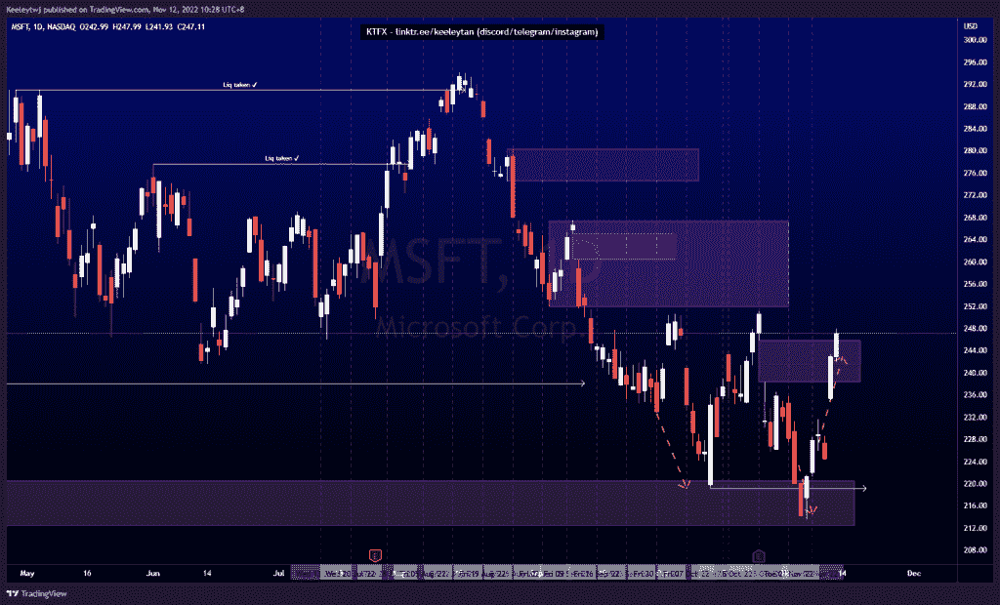
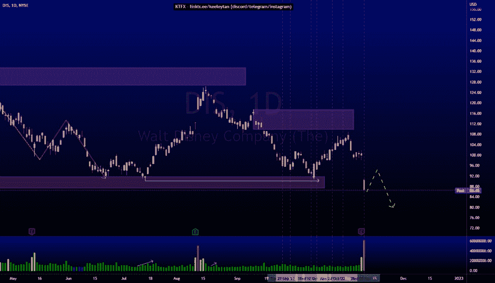
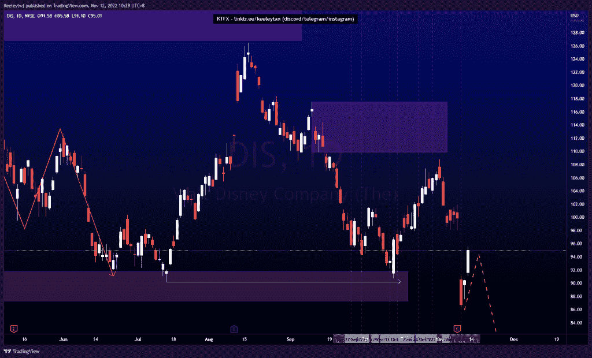
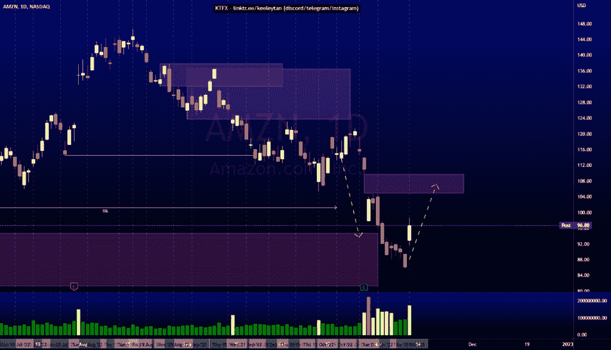
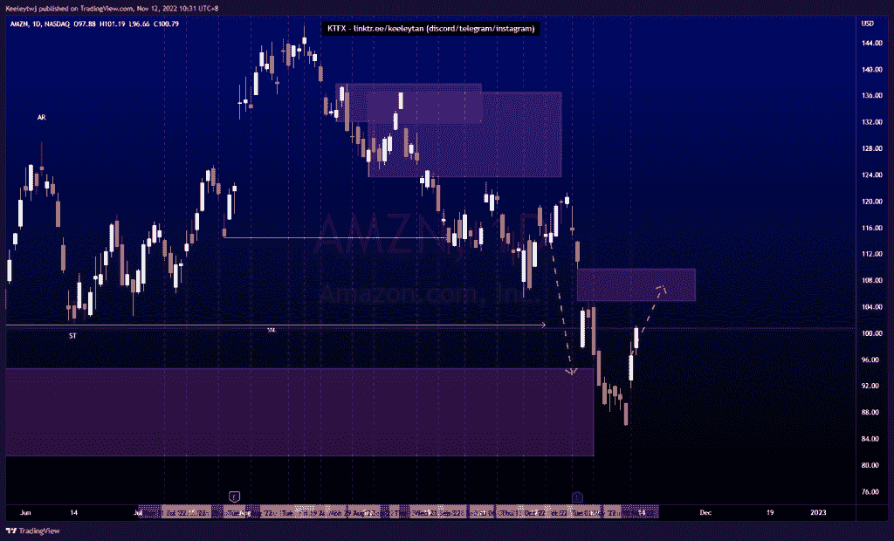

# 第一部分本周良好的技术分析#MSFT #DIS #AMZN

> 原文：<https://medium.com/coinmonks/part-1-good-technical-analysis-this-week-msft-dis-amzn-441341a6a3a3?source=collection_archive---------5----------------------->

在这里找到更多关于我的信息(YouTube/Discord/Telegram):[https://www.linktr.ee/keeleytan](https://www.linktr.ee/keeleytan)

如果你觉得我的帖子有帮助，如果你能在这个帖子上给我一个赞，并关注我以后的类似帖子，我将不胜感激。如果您有任何意见/反馈，请随时使用上面的谷歌表单链接。

不和谐的免费信号服务正式启动。如果有兴趣，请到我的不和谐来看看！

#MSFT

自我上次分析以来增长了 8.44%。

以前

在...之后

#DIS

自我上次分析以来增长了 9.52%。

以前

在...之后

#AMZN

自我上次分析以来增长了 4.31%

以前

在...之后

希望你已经利用了我这周的分析。喜欢，分享，评论如果你是盈利的！

让我知道，如果你有任何你想让我分析的行情。

一定要在其他社交平台上看看我，我在交易、分析和心理学上发布内容。看看我这里:【https://www.linktr.ee/keeleytan】T2

*原载于 2022 年 11 月 12 日***。**

> *交易新手？尝试[加密交易机器人](/coinmonks/crypto-trading-bot-c2ffce8acb2a)或[复制交易](/coinmonks/top-10-crypto-copy-trading-platforms-for-beginners-d0c37c7d698c)*