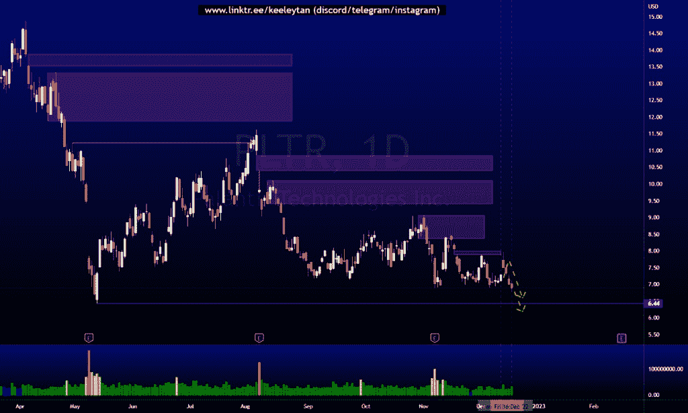

# 第一部分本周良好的技术分析#MSFT #PLTR #TSLA

> 原文：<https://medium.com/coinmonks/part-1-good-technical-analysis-this-week-msft-pltr-tsla-afeab629807c?source=collection_archive---------29----------------------->

在这里找到更多关于我的信息(YouTube/Discord/Telegram):[https://www.linktr.ee/keeleytan](https://www.linktr.ee/keeleytan)

如果你觉得我的帖子有帮助，如果你能在这个帖子上给我一个赞，并关注我以后的类似帖子，我将不胜感激。

> 从顶级交易者那里复制交易机器人。免费试用。

不和谐的免费信号服务正式启动。如果你感兴趣的话，去我的不和谐看看吧！

#MSFT

自我上次分析以来，价格变动了-1.21%。2022 年 12 月 21 日发出不一致的信号，2022 年 12 月 22 日触发进场，2022 年 12 月 23 日首次获利了结，涨幅为 3.66%。

之前([https://www . trading view . com/chart/MSFT/OcsOGPrZ-MSFT-Analysis/](https://www.tradingview.com/chart/MSFT/OcsOGPrZ-MSFT-Analysis/))

在...之后

不和谐线程

#PLTR

自我上次分析以来，价格下跌了 8.84%。

之前([https://www . trading view . com/chart/PLTR/S1 uzrnb 2-PLTR-Analysis/](https://www.tradingview.com/chart/PLTR/s1uZrNB2-PLTR-Analysis/))

在...之后

#TSLA

自从我上次分析以来，价格上涨了 17.83%。

之前([https://www . trading view . com/chart/TSLA/WiDESQCW-TSLA-Analysis/](https://www.tradingview.com/chart/TSLA/WiDESQCW-TSLA-Analysis/))

在...之后

希望你已经利用了我这周的分析。喜欢，分享，评论如果你是盈利的！我在考虑尝试在 discord 上提供免费信号服务。

让我知道，如果你有任何你想让我分析的行情。

一定要在其他社交平台上看看我，我在交易、分析和心理学上发布内容。看看我这里:[https://www.linktr.ee/keeleytan](https://www.linktr.ee/keeleytan)

*原载于 2022 年 12 月 24 日 http://2minutesliteracy.wordpress.com***。**

> *加入 Coinmonks [电报频道](https://t.me/coincodecap)和 [Youtube 频道](https://www.youtube.com/c/coinmonks/videos)了解加密交易和投资*

# *另外，阅读*

*   *[3 商业评论](/coinmonks/3commas-review-an-excellent-crypto-trading-bot-2020-1313a58bec92) | [Pionex 评论](https://coincodecap.com/pionex-review-exchange-with-crypto-trading-bot) | [Coinrule 评论](/coinmonks/coinrule-review-2021-a-beginner-friendly-crypto-trading-bot-daf0504848ba)*
*   *[莱杰 vs n rave](/coinmonks/ledger-vs-ngrave-zero-7e40f0c1d694)|[莱杰 nano s vs x](/coinmonks/ledger-nano-s-vs-x-battery-hardware-price-storage-59a6663fe3b0) | [币安评论](/coinmonks/binance-review-ee10d3bf3b6e)*
*   *[加密交易机器人](/coinmonks/crypto-trading-bot-c2ffce8acb2a) | [Bingbon 评论](https://coincodecap.com/bingbon-review)*
*   *[Bybit Exchange 审查](/coinmonks/bybit-exchange-review-dbd570019b71) | [Bityard 审查](https://coincodecap.com/bityard-reivew) | [Jet-Bot 审查](https://coincodecap.com/jet-bot-review)*