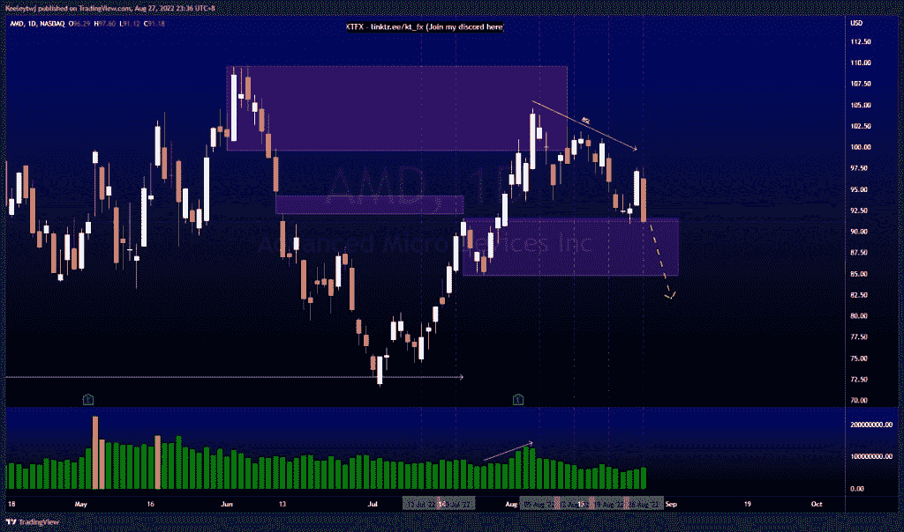
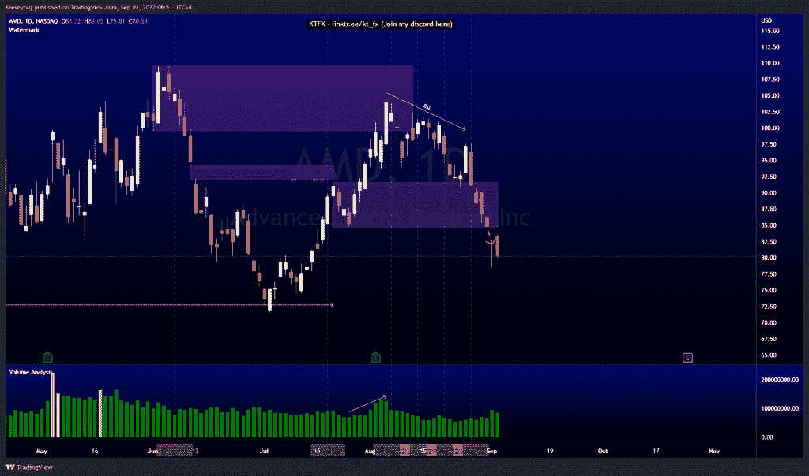
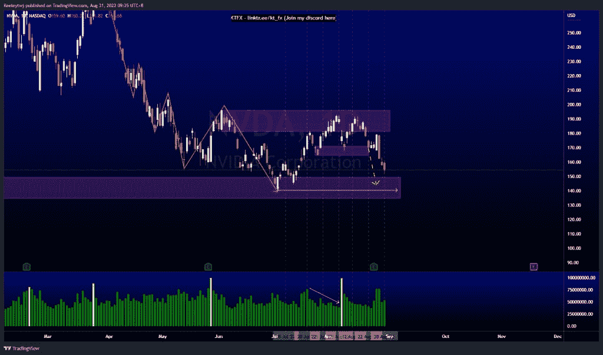
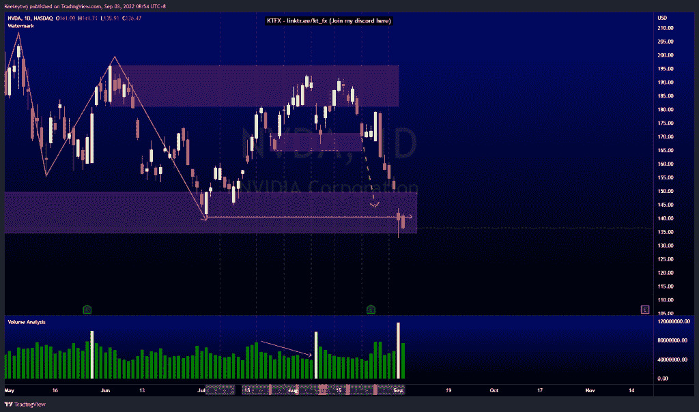
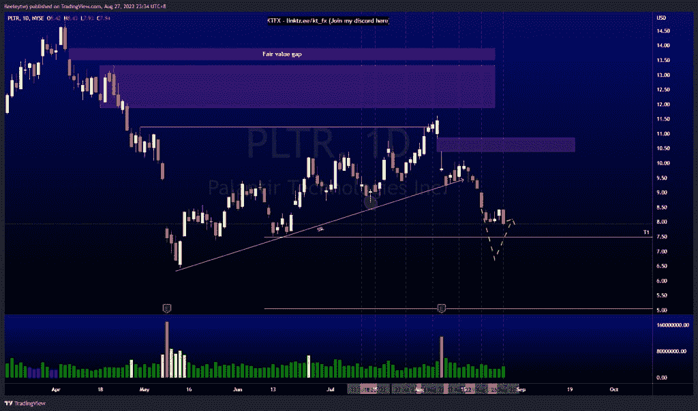
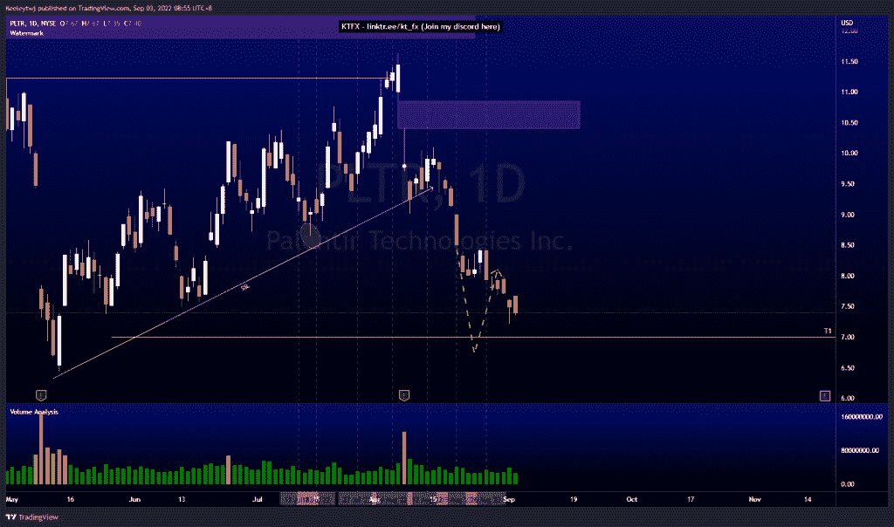

# 第一部分本周良好的技术分析#PLTR #AMD #NVDA

> 原文：<https://medium.com/coinmonks/part-1-good-technical-analysis-this-week-pltr-amd-nvda-bdb0656a221?source=collection_archive---------30----------------------->

在这里找到更多关于我的信息(YouTube/Discord/Telegram):[https://www.linktr.ee/keeleytan](https://www.linktr.ee/keeleytan)

如果你觉得我的帖子有帮助，如果你能在这个帖子上给我一个赞，并关注我以后的类似帖子，我将不胜感激。

我在考虑尝试在 discord 上提供免费信号服务。如果你有兴趣，请给我发邮件，让我在那里扮演一个角色！

#AMD

自上次分析以来，价格下降了 12.42%

Before

After

#NVDA

自上次分析以来，价格下降了 12.13%。

Before

After

#PLTR

自上次分析以来价格下跌了 7.31%。

Before

After

希望你已经利用了我这周的分析。喜欢，分享，评论如果你是盈利的！

让我知道，如果你有任何你想让我分析的行情。

一定要在其他社交平台上看看我，我在交易、分析和心理学上发布内容。看看我这里:【https://www.linktr.ee/keeleytan】T2

*原载于 2022 年 9 月 3 日 http://2minutesliteracy.wordpress.com***。**

> *交易新手？尝试[加密交易机器人](/coinmonks/crypto-trading-bot-c2ffce8acb2a)或[复制交易](/coinmonks/top-10-crypto-copy-trading-platforms-for-beginners-d0c37c7d698c)*