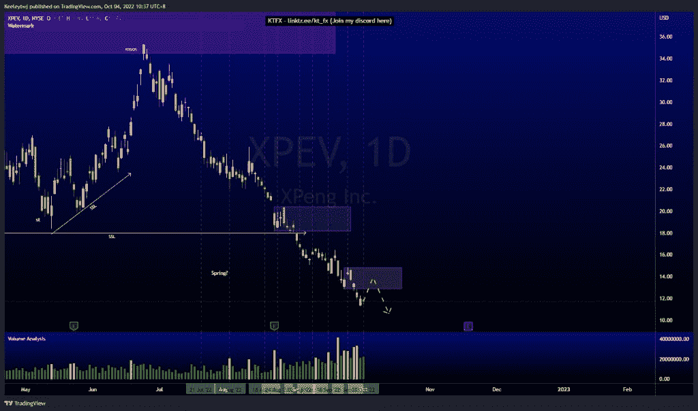
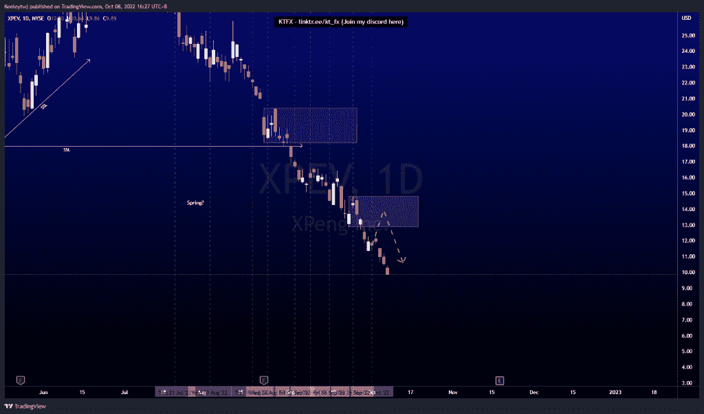
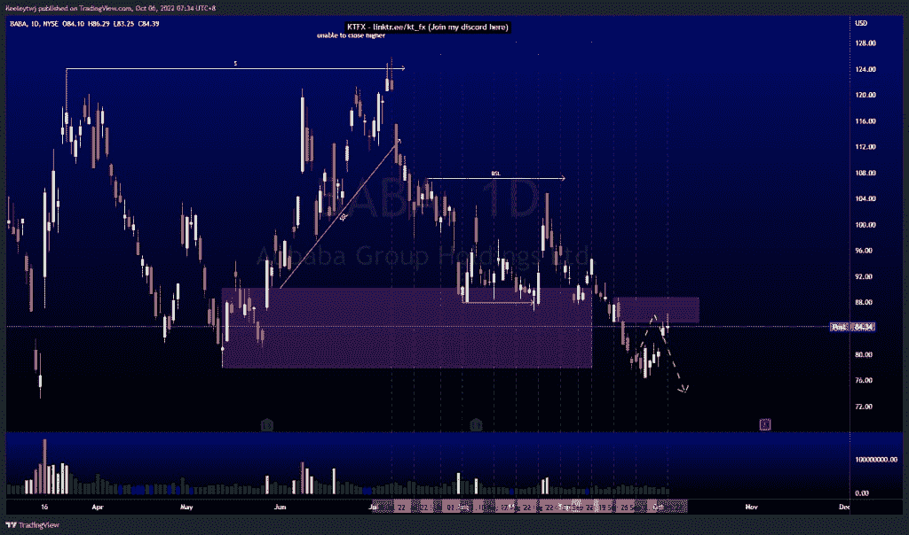
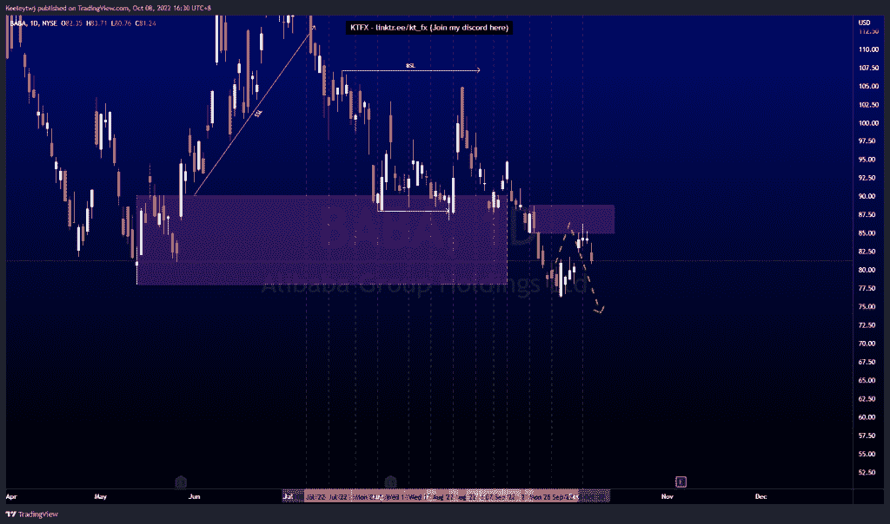
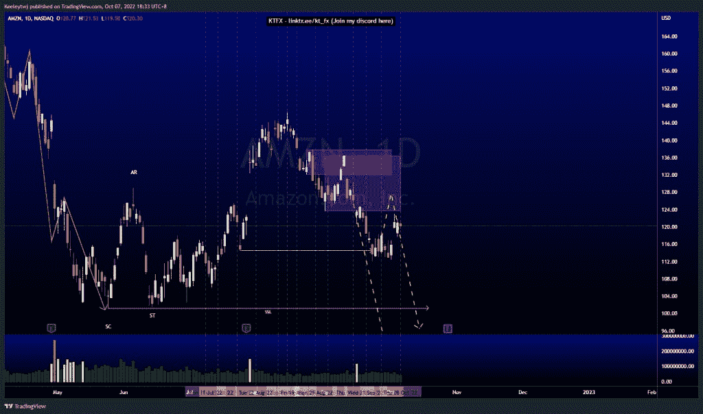
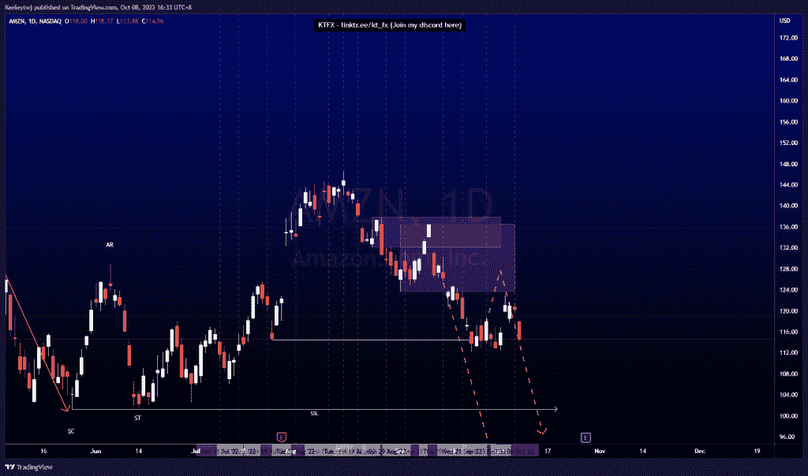

# 第 1 部分本周良好的技术分析#XPEV #BABA #AMZN

> 原文：<https://medium.com/coinmonks/part-1-good-technical-analysis-this-week-xpev-baba-amzn-1c16d469f608?source=collection_archive---------12----------------------->

市场分析，图表，技术分析，股票，外汇，外汇交易，交易心理，交易计划，学习交易，日交易，投资，信号，投资，股市，股票

在这里找到更多关于我的信息(YouTube/Discord/Telegram):[https://www.linktr.ee/keeleytan](https://www.linktr.ee/keeleytan)

如果你觉得我的帖子有帮助，如果你能在这个帖子上给我一个赞，并关注我以后的类似帖子，我将不胜感激。如果您有任何意见/反馈，请随时使用上面的谷歌表单链接。

不和谐的免费信号服务正式启动。如果有兴趣，请到我的不和谐来看看！

#XPEV

自我上次分析以来，价格下跌了 15.94%。

Before

After

#巴巴

自从我上次分析以来，价格下跌了 4.31%，在 85.00 的熊市点反弹。

Before

After

#AMZN

自从我上次分析以来，价格下跌了 4.77%，在下跌前几乎缓解了 136.49 的看跌点。

Before

After

希望你已经利用了我这周的分析。喜欢，分享，评论如果你是盈利的！我在考虑尝试在 discord 上提供免费信号服务。

让我知道，如果你有任何你想让我分析的行情。

一定要在其他社交平台上看看我，我在交易、分析和心理学上发布内容。看看我这里:【https://www.linktr.ee/keeleytan】T2

种类

贴在[技术分析](https://2minutesliteracy.wordpress.com/category/technical-analysis/)

*原载于 2022 年 10 月 8 日 http://2minutesliteracy.wordpress.com**[*。*](https://2minutesliteracy.wordpress.com/2022/10/08/part-1-good-technical-analysis-this-week-xpev-baba-amzn/)*

> *交易新手？尝试[加密交易机器人](/coinmonks/crypto-trading-bot-c2ffce8acb2a)或[复制交易](/coinmonks/top-10-crypto-copy-trading-platforms-for-beginners-d0c37c7d698c)*