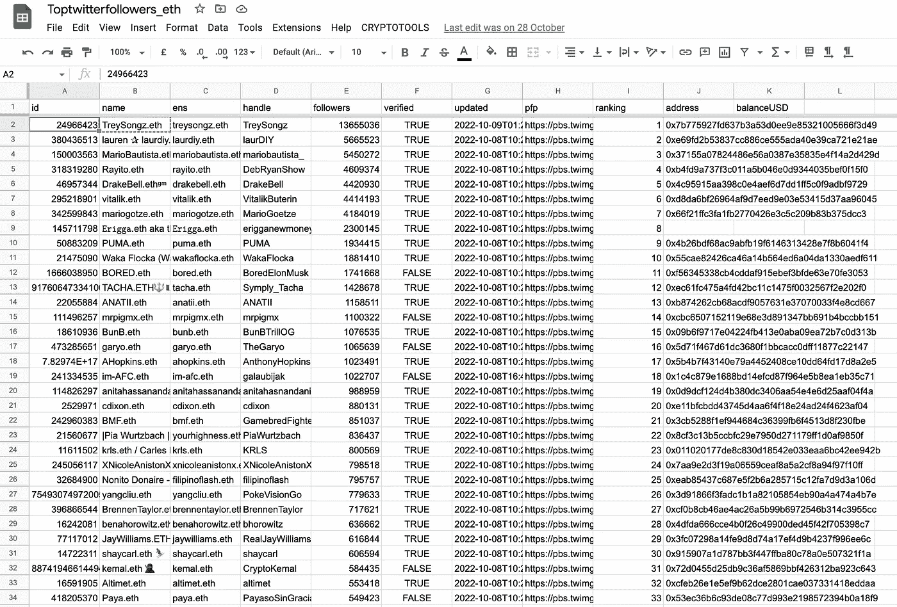

# 第 1 部分:这就是当你不关心你在 Twitter (Python)上的加密隐私时会发生的事情

> 原文：<https://medium.com/coinmonks/part-1-this-is-what-happens-when-you-dont-care-about-your-crypto-privacy-on-twitter-python-eace6b209df5?source=collection_archive---------6----------------------->

[Source](https://datascience.virginia.edu/news/best-sql-jobs-data-scientist)

大约 2 个月前，一名技术熟练的数据专家创建了一个数据库，其中包含 117，394 个与加密地址相关联的 Twitter 帐户。这些地址，以及相应的 Twitter 账户和 ENS 地址，都可以在一个[公共 Google Drive 数据库中找到。](https://drive.google.com/file/d/1ANOIptofc-G_PXIp0ShkLmG1FYheh5SD/view)

[https://www.linkedin.com/posts/atsagkadouras_web3-blockchain-data-activity-6986407463222689792-iKDM/](https://www.linkedin.com/posts/atsagkadouras_web3-blockchain-data-activity-6986407463222689792-iKDM/)

# 第一部分:他是怎么做到的？

如果我们看一下数据集，用户是按照以**结尾的名字过滤的。**eth。那些是 **ENS (** [**以太坊名称服务**](https://ens.domains/) **)** 域。ENS，或以太坊名称服务，是一个分散式系统，用于在以太坊区块链上将人类可读的名称解析为机器可读的地址。它允许用户使用容易记住的名字而不是又长又复杂的地址串来发送事务和访问分散的应用程序。它们很重要，因为它们**直接链接到相关的以太坊账户**。

下面，我创建了一个快速的 python 例子，演示了如何获得一个 json 数组，其中 Twitter 用户名以。eth，以及他们的名字，显示的名字，id，追随者，验证状态。

[https://github.com/Eloise1988/TWITTER/blob/main/search.py](https://github.com/Eloise1988/TWITTER/blob/main/search.py)

Screenshot of the data one can retrieve from Twitter’s API.

一旦你从 Twitter 获得了 ENS 域的列表，你就可以使用`[web3.py](https://web3py.readthedocs.io/en/latest/web3.main.html)`库[(如下图)](https://razacodes.io/get-the-wallet-address-from-an-ens-domain-name)获得关联的以太坊公共地址。 **Web3.py** 是一个 Python 库，用于处理以太坊区块链及其相关技术，比如智能合约。它**提供了与以太坊区块链**交互的高级接口，并允许开发人员编写 Python 代码来在以太坊平台上构建分散式应用程序(dapps)。

[https://github.com/Eloise1988/TWITTER/blob/main/get_AddresswithENS.py](https://github.com/Eloise1988/TWITTER/blob/main/get_AddresswithENS.py)

Source : [https://etherscan.io/enslookup-search?search=ethereum.eth](https://etherscan.io/enslookup-search?search=ethereum.eth)

总之，这位数据科学家能够通过专业技术生成将 Twitter 账户与其各自的公共以太坊地址链接起来的文件。很可能他在 Twitter 上有一个高级账户，这使他能够检索超过 100，000 个地址，为进一步分析提供了丰富的数据集。

## 第 1 部分到此结束

社交媒体的广泛使用彻底改变了我们交流和分享信息的方式，但也给个人隐私带来了重大的 T2 风险。当我们使用 Twitter 这样的社交媒体平台时，我们不断产生大量的个人数据，这些数据很容易被他人访问和分析。这些数据可以包括我们的**想法、**意见、**个人偏好**，以及我们的物理**位置、与其他用户的联系**，甚至我们的**财务状况。**

**在第 2 部分**中，我们将重点关注可以从这些地址收集到的**财务信息**。当这些数据结合在一起时，可以创建我们个人生活和习惯的详细图片。重要的是要认识到黑客、骗子和其他恶意行为者滥用这些信息的可能性，他们可能会利用这些信息窃取我们的身份，欺骗我们，甚至对我们造成身体伤害。保持谨慎并保护自己免受这些威胁是至关重要的。

> 交易新手？试试[加密交易机器人](/coinmonks/crypto-trading-bot-c2ffce8acb2a)或者[复制交易](/coinmonks/top-10-crypto-copy-trading-platforms-for-beginners-d0c37c7d698c)