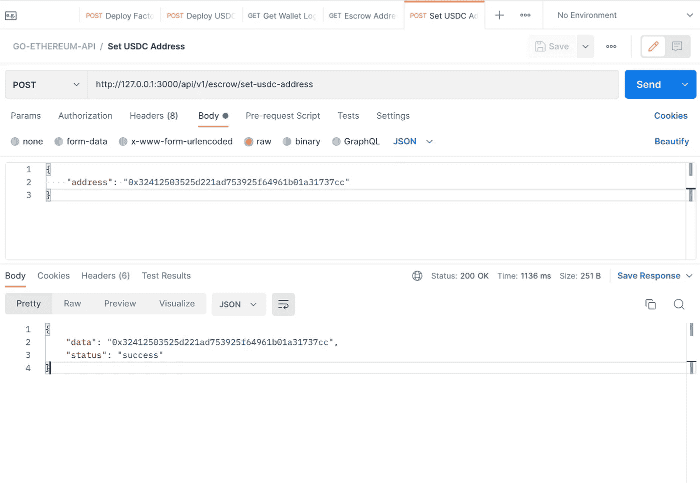
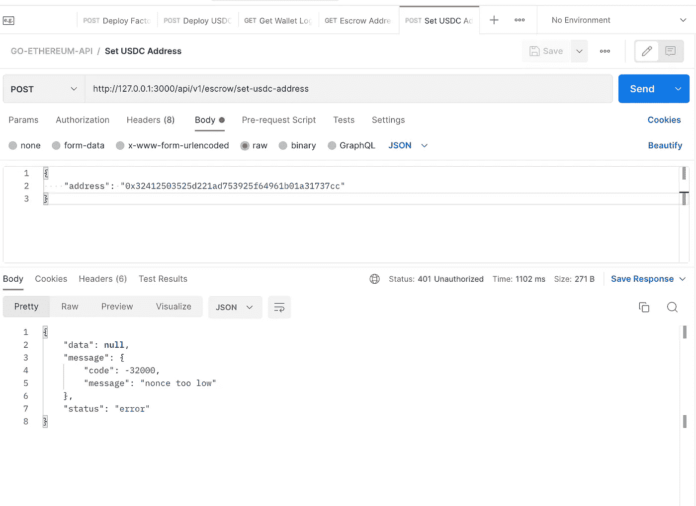
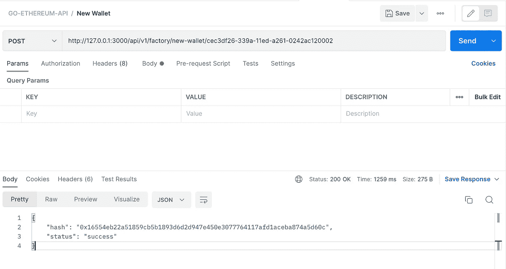
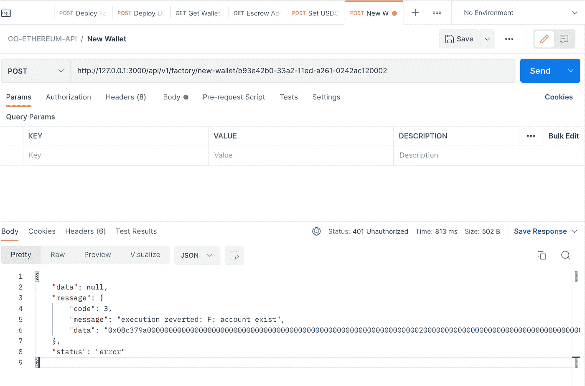
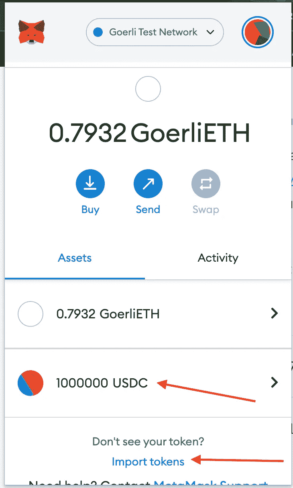

# 第 2 部分:在 Go 中构建一个完整的 API，使用 go-ethereum 客户端和 GoFiber 框架与 P2P 托管智能契约进行交互

> 原文：<https://medium.com/coinmonks/part-2-building-a-complete-api-in-go-to-interact-with-a-p2p-escrow-smart-contract-using-fa0514531032?source=collection_archive---------21----------------------->


这是本系列两篇文章的第二部分

*   [第 1 部分:项目概述、设置纤程、生成 Go 绑定、部署合同、添加 get 托管&钱包逻辑地址端点](/coinmonks/part-1-building-a-complete-api-in-go-to-interact-with-a-p2p-escrow-smart-contract-using-9cf1f681c860)
*   第 2 部分:添加和总结 P2P API 端点

你可以在 GitHub 的[这里找到代码库作为参考。](https://github.com/alofeoluwafemi/-smart-contract-api-go-ethereum)

这里是 API Postman 集合[链接](https://www.getpostman.com/collections/362a5590ccf482592588)供你导入。

# P2P 订单网页挂钩

# 设置 USDC 地址

在本文的第一部分中，我们部署了一个 USDC 契约，我提到过它是一个模拟的 USDC，在我们的 P2P 系统中用作对抗 Fiat 的交换手段。在生产环境中，我们会将地址更改为以太坊或或戴上使用的实际地址，无论哪种稳定的货币适合我们的目的。

正如我们之前所做的，首先在`api_router.go`文件中添加一条路线来设置 USDC。

```
escrow := api.Group("/escrow")

escrow.Post("/set-usdc-address", controllers.SetUSDCTokenAddress)
```

在控制器包中，创建`escrow_controllers.go`来保存与托管合同相关的动作的控制器方法。

```
package controllers

import (
	"github.com/alofeoluwafemi/go-ethereum-api/pkg/blockchain"
	"github.com/gofiber/fiber/v2"
)

func SetUSDCTokenAddress(c *fiber.Ctx) error {
	conn := blockchain.CurrentConnection
	type Request struct {
		Address string `json:"address"`
	}

	request := new(Request)

	if err := c.BodyParser(request); err != nil {
		return c.Status(fiber.StatusBadRequest).JSON(fiber.Map{
			"status":  "error",
			"message": "Malformed data",
			"data":    err,
		})
	}

	err := conn.SetUSDCAddress(request.Address)

	if err != nil {
		return c.Status(fiber.StatusUnauthorized).JSON(fiber.Map{
			"status":  "error",
			"message": err,
			"data":    nil,
		})
	}

	return c.Status(fiber.StatusOK).JSON(fiber.Map{
		"status": "success",
		"data":   request.Address,
	})
}
```

最后，在区块链包中，添加一个新文件`escrow.go`，并添加以下内容。

```
package blockchain

import (
	"github.com/alofeoluwafemi/go-ethereum-api/pkg/ethereum"
	"github.com/ethereum/go-ethereum/common"
	"log"
)

var EscrowInstance *Escrow

const (
	EscrowAddress = "0xd27adc3848dE1324AF87e5C235355e4a017Aa1CF"
)

type Escrow struct {
	Address  common.Address
	Instance *ethereum.Escrow
}

func (clientCon ClientConnection) newEscrow(address string) *ethereum.Escrow {
	EscrowInstance = new(Escrow)

	contractAddress := common.HexToAddress(address)

	EscrowInstance.Address = contractAddress

	instance, err := ethereum.NewEscrow(contractAddress, clientCon.Client)
	if err != nil {
		log.Fatalln("Cannot get Factory contract at address ", address, " due to: ", err)
	}

	return instance
}

func (clientCon ClientConnection) SetUSDCAddress(address string) error {

	_, err := getEscrow().SetUsdcTokenAddress(clientCon.trxOpts, common.HexToAddress(address))

	if err != nil {
		log.Printf("Cannot set new USDC token on Escrow due to: %v", err)

		return err
	}

	return nil
}

func getEscrow() *ethereum.Escrow {
	return CurrentConnection.newEscrow(EscrowAddress)
}
```

这不需要更多的解释，因为它与我们之前遵循的格式相同。如果您还没有阅读本系列的第 1 部分，我建议您阅读一下。

重启 Fiber 服务器，在 Postman 中向[http://127 . 0 . 0 . 1:3000/API/v1/escrow/set-usdc-address](http://127.0.0.1:3000/api/v1/escrow/set-usdc-address)发出 POST 请求，工厂契约将被部署。

**成功 API 调用**



**错误 API 调用**

这将在您向使用相同 nonce 的 API 发出第二个请求后立即发生。



# 创建保管人钱包

我们将创建的下一个路由是`/api/v1/factory/new-wallet/:uuid`，这样当我们向这个端点发出 POST 请求时，它将调用工厂契约上的函数`newCustodian`。这将部署一个名为`CustodianWalletProxy`的代理契约，将调用委托给`CustodianWalletLogic`。

首先，像往常一样。将路线添加到`api_router.go`。

```
api.Post("/factory/new-wallet/:uuid", controllers.NewWallet)
```

接下来是控制器，这次是在`factory_controller`文件中。

```
func NewWallet(c *fiber.Ctx) error {
	conn := blockchain.CurrentConnection
	uuid := c.Params("uuid")

	trx, err := conn.NewWallet(uuid)

	if err != nil {
		return c.Status(fiber.StatusUnauthorized).JSON(fiber.Map{
			"status":  "error",
			"message": err,
			"data":    nil,
		})
	}

	return c.Status(fiber.StatusOK).JSON(fiber.Map{
		"status": "success",
		"hash":   trx.Hash(),
	})
}
```

正如您所看到的，为了创建新的钱包，智能契约需要一个惟一的标识符来将其保存在控制器通过 URL 参数接受的映射中。您很快就会看到，每个唯一的 ID 不能分配给另一个用户。

最后，将`NewWallet`方法添加到`factory.go`文件的`blockchain`包中。

```
func (clientCon ClientConnection) NewWallet(uuid string) (*types.Transaction, error) {

	trx, err := getFactory().NewCustodian(clientCon.trxOpts, uuid)

	if err != nil {
		log.Printf("Cannot create new wallet: %v", err)

		return new(types.Transaction), err
	}

	return trx, nil
}
```

像往常一样重新启动光纤服务器，并向 http://127 . 0 . 0 . 1:3000/API/v1/factory/new-wallet/CEC 3d d14-339 a-11ed-a261-0242 AC 120002 和[http://127 . 0 . 0 . 1:3000/API/v1/factory/new-wallet/b 93 e 42 b 0-33 a2-11ed-a 266 发出 POST 请求这将为附加在两个 URL 末尾的每个 UUID 创建一个帐户。](http://127.0.0.1:3000/api/v1/factory/new-wallet/b93e42b0-33a2-11ed-a261-0242ac120002)

创建两个帐户的目的是，当我们进一步创建订单时，我们可以使用两个帐户。



如果您使用相同的 UUID 重试，您将得到一个帐户存在错误。



# 使用 UUID 获取钱包地址

这将是一个显而易见的，添加使用 UUID 获得钱包地址的路线。

```
api.Get("/factory/wallet/:uuid", controllers.GetWallet)
```

在`factory_controller.go`

```
func GetWallet(c *fiber.Ctx) error {
	conn := blockchain.CurrentConnection
	uuid := c.Params("uuid")

	address, err := conn.GetAccountByUUID(uuid)

	if err != nil {
		return c.Status(fiber.StatusUnauthorized).JSON(fiber.Map{
			"status":  "error",
			"message": err,
			"data":    nil,
		})
	}

	return c.Status(fiber.StatusOK).JSON(fiber.Map{
		"status": "success",
		"hash":   address.String(),
	})
}
```

在区块链包中，添加`GetAccountByUUID`方法来调用契约方法。

```
func (clientCon ClientConnection) GetAccountByUUID(uuid string) (*common.Address, error) {

	address, err := getFactory().Accounts(clientCon.callOpts, uuid)

	if err != nil {
		log.Printf("Cannot get account: %v due to error %v", uuid, err)

		return new(common.Address), err
	}

	return &address, nil
}
```

重启服务器并使用 Postman 向[http://127 . 0 . 0 . 1:3000/API/v1/factory/wallet/b 93 e 42 b 0-33 a2-11ed-a261-0242 AC 120002](http://127.0.0.1:3000/api/v1/factory/wallet/b93e42b0-33a2-11ed-a261-0242ac120002)发出 GET 请求。记得将 UUID 更改为您之前使用的那个，并注意返回的两个帐户地址。

在我自己的情况下，我返回的两个帐户地址是

# 修复随机数过低错误

到目前为止，您可能已经遇到了一个回复错误，返回的 **nonce 太低**。如下所示，我花了一段时间才意识到我在将 nonce 设置为 transact 选项时引入了这个问题。要解决这个问题，只需添加下面的方法，并且在每个传递`clientCon.trxOpts`的方法中，这意味着它是一个状态改变方法，调用它来增加下一个事务的 nonce。

```
func (clientCon ClientConnection) postTransact() {
	clientCon.trxOpts.Nonce = new(big.Int).SetUint64(clientCon.nonceAt(clientCon.SignerPublicAddress))
}
```

**用途**

```
func (clientCon ClientConnection) NewWallet(uuid string) (*types.Transaction, error) {

	trx, err := getFactory().NewCustodian(clientCon.trxOpts, uuid)

	if err != nil {
		log.Printf("Cannot create new wallet: %v", err)

		return new(types.Transaction), err
	}

	clientCon.postTransact()

	return trx, nil
}
```

# 向 USDC 的帐户地址提供资金(模拟)

打开 Metamask 并单击 **import token** ，输入已部署的 USDC 地址，并确保对钱包地址执行此操作，您在 env 中将私钥用作部署者帐户。所有初始令牌都将分配给该帐户，请参见下图。



使用元掩码为这两个地址分配 100 个 USDC。

# 打开 P2P 购买订单

该功能在钱包地址上直接可用。请记住，每个钱包都是一个智能合同，而不是你所期望的 EOA。我们的部署者帐户拥有超级管理员权限来调用它的方法。

这种方法利用了代理模式，因此，将来我们可以通过简单地升级钱包逻辑来为已经部署的钱包添加更多功能，钱包逻辑不会自行执行，而是通过使用已部署的钱包代理的状态通过`delegatecall`调用其功能。

**添加路线**

这里的`:address`参数是保管钱包的地址。

```
api.Post("/wallet/order/new/:address", controllers.NewBuyOrder)
```

**添加控制器的方法**

```
func NewBuyOrder(c *fiber.Ctx) error {
	conn := blockchain.CurrentConnection
	request := new(blockchain.Order)
	wallet := c.Params("address")

	blockchain.WalletAddress = wallet

	if err := c.BodyParser(request); err != nil {
		return c.Status(fiber.StatusBadRequest).JSON(fiber.Map{
			"status":  "error",
			"message": "Malformed data",
			"data":    err,
		})
	}

	trx, err := conn.OpenBuyOrder(*request)

	if err != nil {
		return c.Status(fiber.StatusUnauthorized).JSON(fiber.Map{
			"status":  "error",
			"message": err,
			"data":    nil,
		})
	}

	return c.Status(fiber.StatusOK).JSON(fiber.Map{
		"status": "success",
		"data":   trx.Hash(),
	})
}
```

最后在区块链包裹的`wallet.go`里面。

```
func (clientCon ClientConnection) OpenBuyOrder(order Order) (*types.Transaction, error) {

	trx, err := getWalletLogic().NewBuyOrder(
		clientCon.trxOpts,
		common.HexToAddress(order.Seller),
		common.HexToAddress(order.Receiver),
		big.NewInt(order.Amount),
		big.NewInt(order.Rate),
		big.NewInt(order.Fee),
	)

	if err != nil {
		log.Printf("Cannot open order : %v", err)

		return new(types.Transaction), err
	}

	clientCon.postTransact()

	return trx, nil
}
```

使用 Postman 向[http://127 . 0 . 0 . 1:3000/API/v1/wallet/order/new/0x C1 f 07 db 647 aa 3002 c 12 BBA F8 d 598 f 0 ef 19 C4 DDD 3](http://127.0.0.1:3000/api/v1/wallet/order/new/0xC1F07Db647Aa3002c12BbaF8D598F0ef19c4ddd3)发出 POST 请求将返回事务哈希。

请记住用适用于您的参数替换 URL 中的钱包地址参数。

# 获取未结订单后的账户总余额

终于到最后一点了！

钱包合同的`GetTotalBalance`返回钱包余额减去当前未完成的订单，因此一旦我们打开订单，我们不希望他们花费和无法履行订单。

**添加路线**

```
api.Post("/wallet/balance/:address", controllers.GetWalletUSDCBalance)
```

**添加控制器方法**

在`wallet_controller`添加

```
func GetWalletUSDCBalance(c *fiber.Ctx) error {  
  conn := blockchain.CurrentConnection  
  walletAddress := c.Params("address")  

   blockchain.WalletAddress = walletAddress  

   balance, err := conn.GetUSDCBalance()  

   if err != nil {  
      return c.Status(fiber.StatusUnauthorized).JSON(fiber.Map{  
         "status":  "error",  
         "message": err,  
         "data":    nil,  
      })  
   }  

   return c.Status(fiber.StatusOK).JSON(fiber.Map{  
      "status": "success",  
      "data":   balance,  
   })  
}
```

现在在区块链包的`wallet.go`中添加`GetUSDCBalance`方法。

```
func (clientCon ClientConnection) GetUSDCBalance() (*big.Int, error) {

	balance, err := getWalletLogic().GetTotalBalance(clientCon.callOpts)

	if err != nil {
		log.Printf("Cannot open order : %v", err)

		return new(big.Int), err
	}

	return balance, nil
}
```

使用 Postman 向[http://127 . 0 . 0 . 1:3000/API/v1/wallet/balance/0x C1 f 07 db 647 aa 3002 c 12 BBA F8 d 598 f 0 ef 19 C4 DDD 3](http://127.0.0.1:3000/api/v1/wallet/balance/0xC1F07Db647Aa3002c12BbaF8D598F0ef19c4ddd3)发出 POST 请求。钱包余额被返回。

恭喜你！！🎉🎉

谢谢你一直关注我，如果你喜欢这篇文章，你可以为这篇文章鼓掌并订阅我的 youtube 频道来支持我。

> 交易新手？尝试[加密交易机器人](/coinmonks/crypto-trading-bot-c2ffce8acb2a)或[复制交易](/coinmonks/top-10-crypto-copy-trading-platforms-for-beginners-d0c37c7d698c)