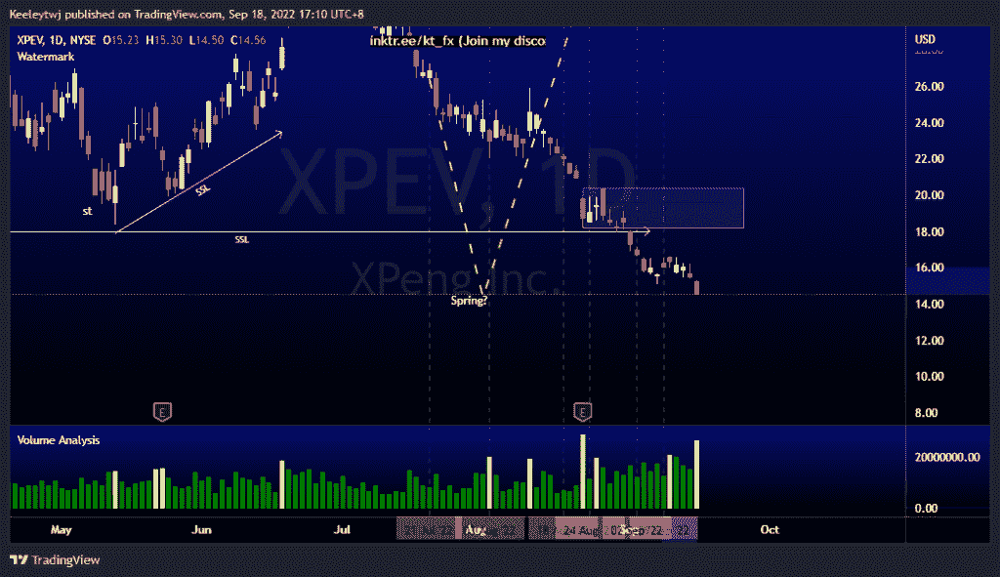

# 第二部分本周良好的技术分析#AAPL #TIGR #XPEV

> 原文：<https://medium.com/coinmonks/part-2-good-technical-analysis-this-week-aapl-tigr-xpev-1c44b539a6e5?source=collection_archive---------23----------------------->

在这里找到更多关于我的信息(YouTube/Discord/Telegram):[https://www.linktr.ee/keeleytan](https://www.linktr.ee/keeleytan)

如果你觉得我的帖子有帮助，如果你能在这个帖子上给我一个赞，并关注我以后的类似帖子，我将不胜感激。

我在考虑尝试在 discord 上提供免费信号服务。如果你有兴趣，请给我发邮件，让我在那里扮演一个角色！

#AAPL

自我上次分析以来，价格下跌了 7.79%。

#XPEV

自我上次分析以来，价格下跌了 9.37%。

#TIGR

自我上次分析以来，价格下跌了 6.54%。

希望你已经利用了我这周的分析。喜欢，分享，评论如果你是盈利的！

让我知道，如果你有任何你想让我分析的行情。

一定要在其他社交平台上看看我，我在交易、分析和心理学上发布内容。看看我这里:【https://www.linktr.ee/keeleytan】T2

种类

贴在[技术分析](https://2minutesliteracy.wordpress.com/category/technical-analysis/)

*原载于 2022 年 9 月 18 日*[*http://2minutesliteracy.wordpress.com*](https://2minutesliteracy.wordpress.com/2022/09/18/part-2-good-technical-analysis-this-week-aapl-tigr-xpev/)*。*

> 交易新手？尝试[加密交易机器人](/coinmonks/crypto-trading-bot-c2ffce8acb2a)或[复制交易](/coinmonks/top-10-crypto-copy-trading-platforms-for-beginners-d0c37c7d698c)