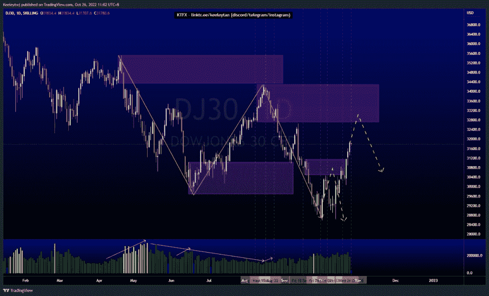
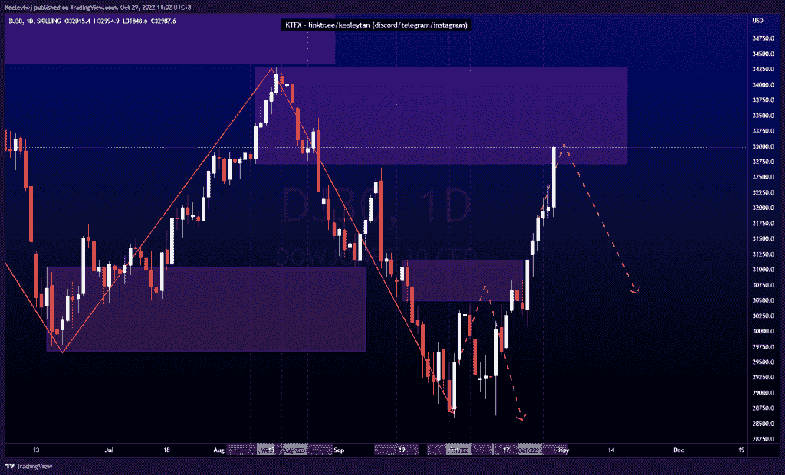
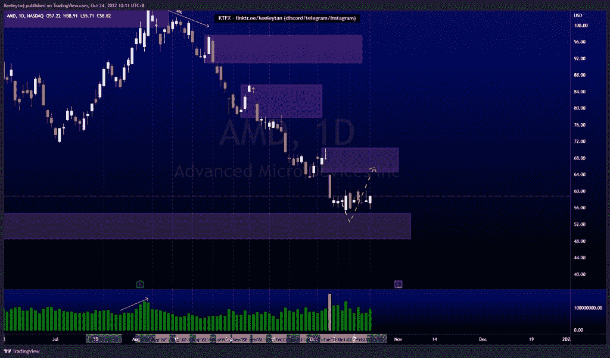
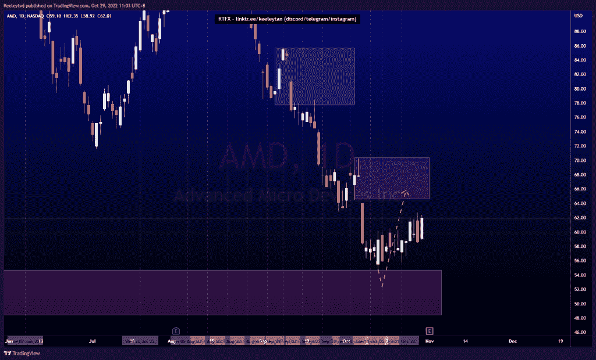
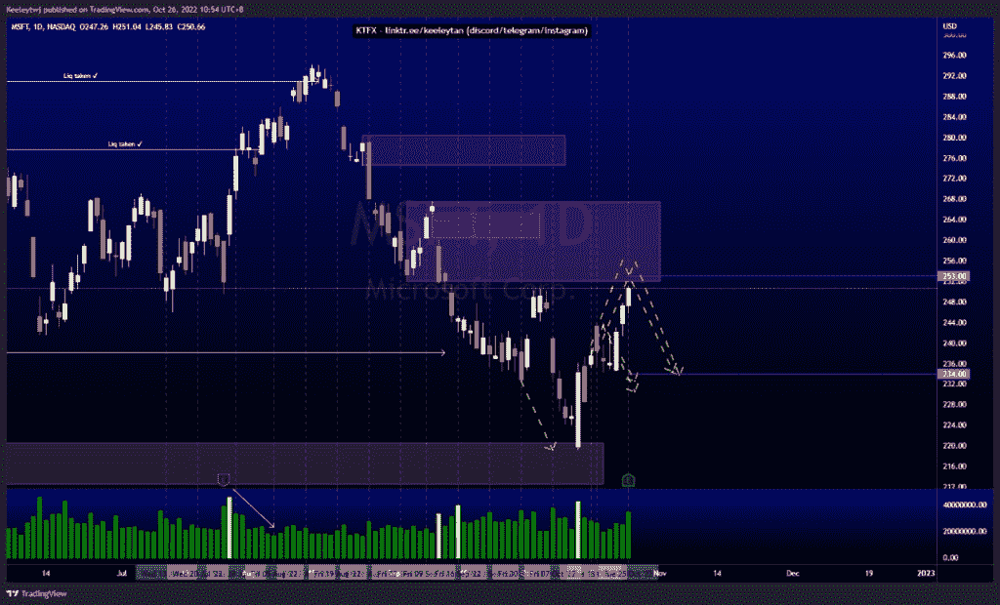
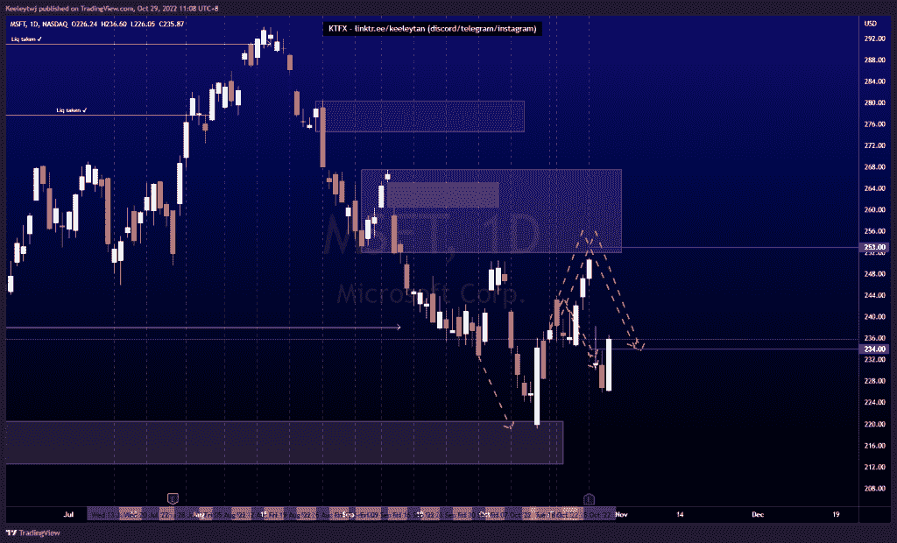

# 第 2 部分本周出色的技术分析#DJ30 #AMD #MSFT

> 原文：<https://medium.com/coinmonks/part-2-good-technical-analysis-this-week-dj30-amd-msft-1ce4b87fa77d?source=collection_archive---------18----------------------->

在这里了解更多关于我的信息(YouTube/不和谐/电报):[https://www.linktr.ee/keeleytan](https://www.linktr.ee/keeleytan)

如果你觉得我的帖子很有帮助，如果你能在这个帖子里给我留下类似的内容，并在以后的帖子里关注我，我将不胜感激。如果您有任何评论/反馈，请使用上面的谷歌表格链接。

不和免费信号服务正式启动。如果有兴趣，去我的不和处看看吧！

#DJ30

自我上次分析以来，价格上涨了 3.65%。

以前

在...之后

#AMD

自我上次分析以来，价格上涨了 5.39%。

以前

在...之后

#MSFT

自我上次分析以来，价格下降了 6.04%。

以前

在...之后

希望你已经利用了我本周的分析。喜欢，分享，并评论如果你是在盈利！我正在考虑尝试提供免费的不和谐信号服务。

如果您有任何需要我分析的问题，请告诉我。

一定要在其他社交平台上查看我，我会发布交易、分析和心理学方面的内容。在这里为我结账:[https://www.linktr.ee/keeleytan](https://www.linktr.ee/keeleytan)

*原载于 2022 年 10 月 30 日*[*http://2minutesliteracy.wordpress.com*](https://2minutesliteracy.wordpress.com/2022/10/30/part-2-good-technical-analysis-this-week-dj30-amd-msft/)*。*

> 交易新手？试试[密码交易机器人](/coinmonks/crypto-trading-bot-c2ffce8acb2a)或者[拷贝交易](/coinmonks/top-10-crypto-copy-trading-platforms-for-beginners-d0c37c7d698c)