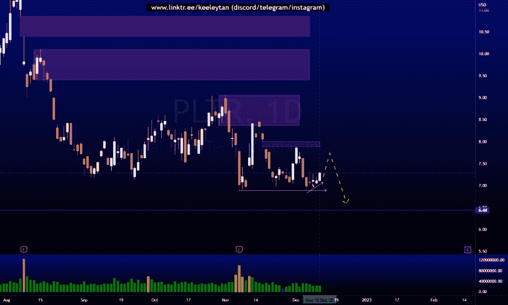
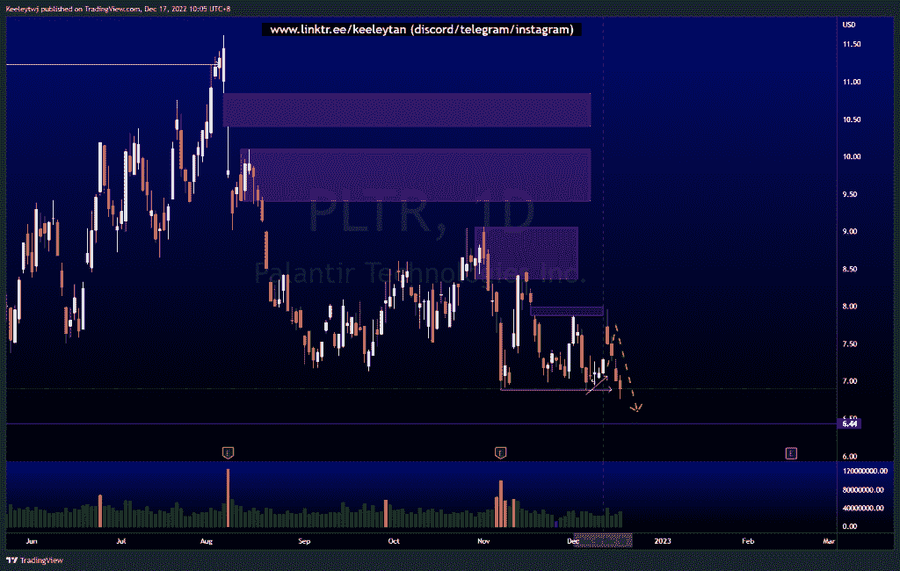
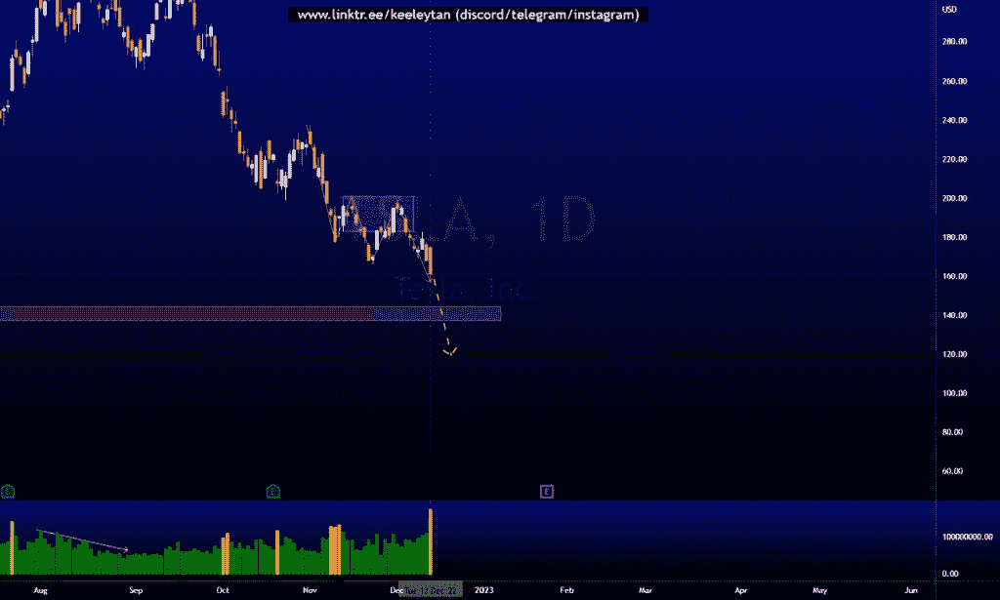
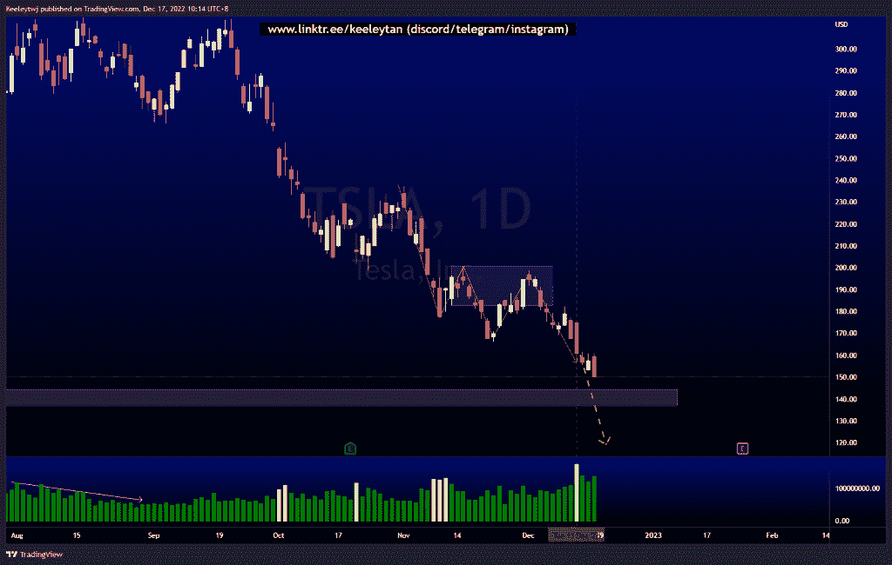
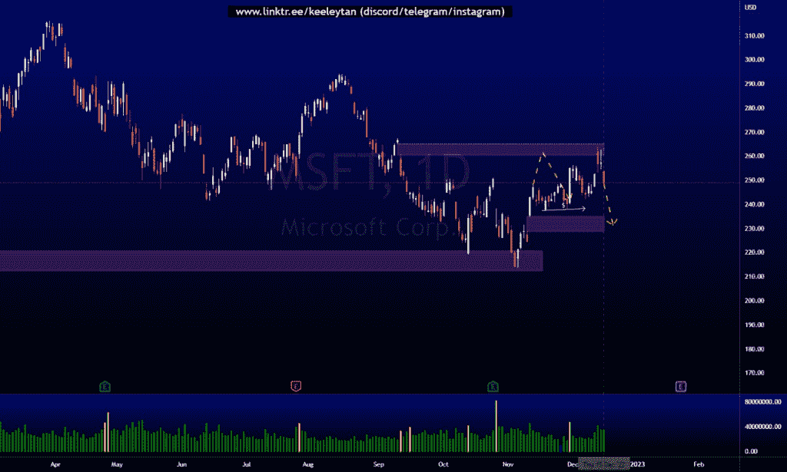
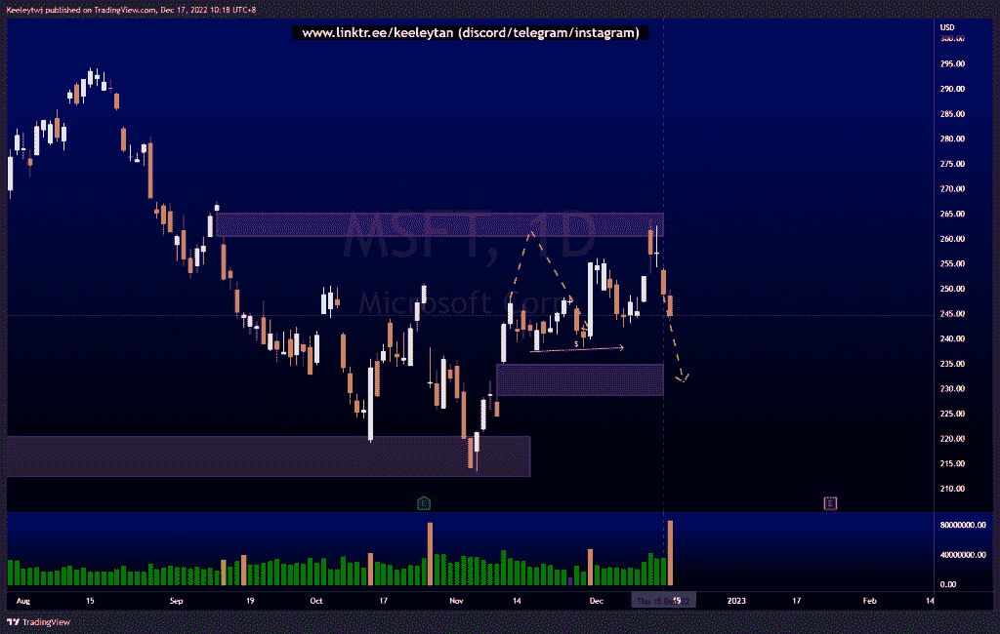

# 第二部分本周良好的技术分析#PLTR #TSLA #MSFT

> 原文：<https://medium.com/coinmonks/part-2-good-technical-analysis-this-week-pltr-tsla-msft-6e534fb8d1e2?source=collection_archive---------26----------------------->

在这里找到更多关于我的信息(YouTube/Discord/Telegram):[https://www.linktr.ee/keeleytan](https://www.linktr.ee/keeleytan)

如果你觉得我的帖子有帮助，如果你能在这个帖子上给我一个赞，并关注我以后的类似帖子，我将不胜感激。

我在考虑尝试在 discord 上提供免费信号服务。如果你有兴趣，请给我发邮件，让我在那里扮演一个角色！

#PLTR

自从我本周最后一次分析以来下跌了 5.35%。预期表现完美，在接受卖方流动性之前填补了公允价值缺口。

之前([https://www . trading view . com/chart/PLTR/fgIzWBUo-PLTR-Analysis/](https://www.tradingview.com/chart/PLTR/fgIzWBUo-PLTR-Analysis/))

在...之后

#TSLA

从我本周最后一次分析以来下跌了 6.78%。

之前([https://www . trading view . com/chart/TSLA/bvpetko 4-TSLA-Analysis/](https://www.tradingview.com/chart/TSLA/bvPEtkO4-TSLA-Analysis/))

在...之后

#MSFT

自从我本周最后一次分析以来下跌了 1.73%。根据我 11 月 11 日的分析，价格在下跌前填补了 260.40 的公允价值缺口。

之前([https://www . trading view . com/chart/MSFT/SfAiERUn-MSFT-Analysis/](https://www.tradingview.com/chart/MSFT/SfAiERUn-MSFT-Analysis/))

在...之后

希望你已经利用了我这周的分析。喜欢，分享，评论如果你是盈利的！我在考虑尝试在 discord 上提供免费信号服务。

让我知道，如果你有任何你想让我分析的行情。

一定要在其他社交平台上看看我，我在交易、分析和心理学上发布内容。看看我这里:[https://www.linktr.ee/keeleytan](https://www.linktr.ee/keeleytan)

*原载于 2022 年 12 月 18 日 http://2minutesliteracy.wordpress.com***。**

> *交易新手？试试[加密交易机器人](/coinmonks/crypto-trading-bot-c2ffce8acb2a)或者[复制交易](/coinmonks/top-10-crypto-copy-trading-platforms-for-beginners-d0c37c7d698c)*