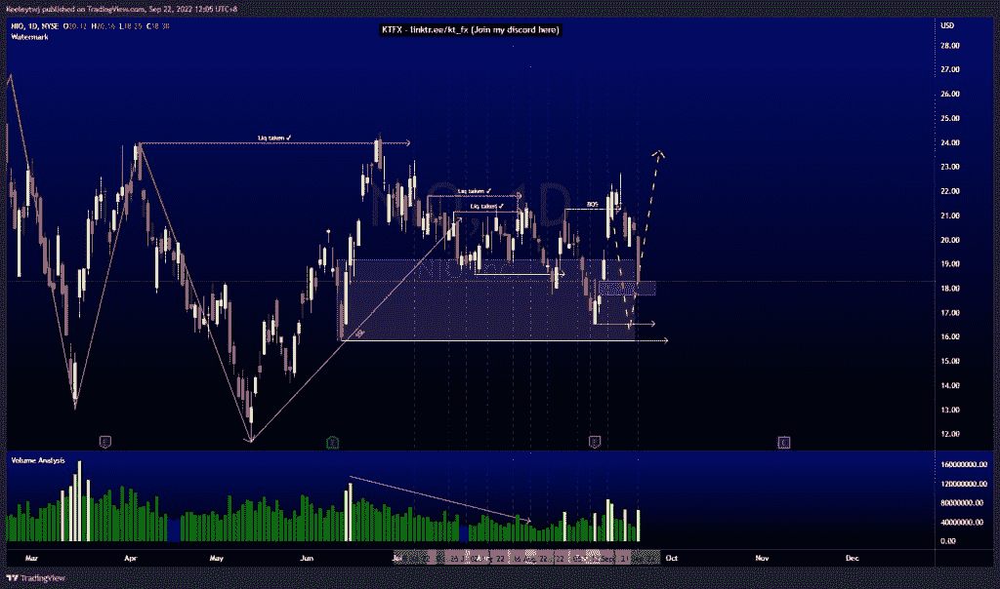
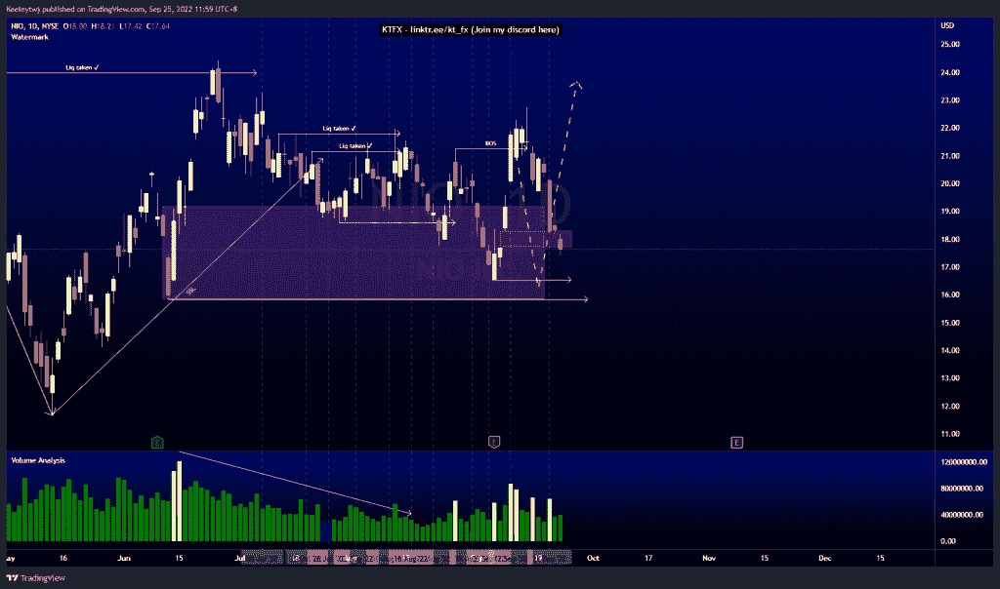
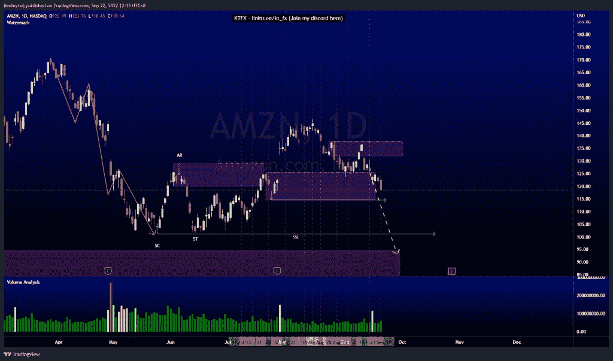
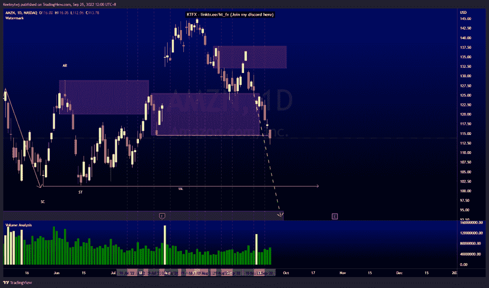
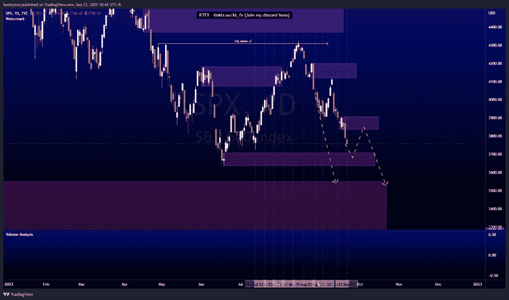
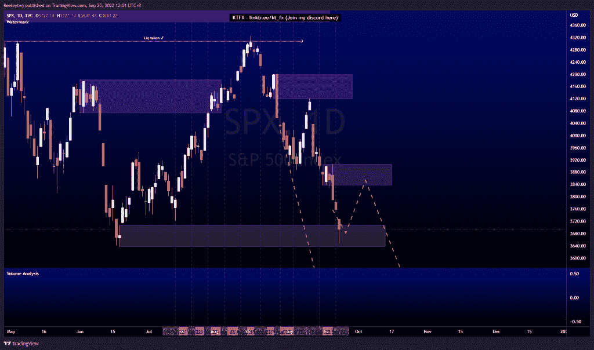

# 第二部分本周良好技术分析#SPX #NIO #AMZN

> 原文：<https://medium.com/coinmonks/part-2-good-technical-analysis-this-week-spx-nio-amzn-f0afdca7ac1a?source=collection_archive---------15----------------------->

在这里找到更多关于我的信息(YouTube/Discord/Telegram):[https://www.linktr.ee/keeleytan](https://www.linktr.ee/keeleytan)

如果你觉得我的帖子有帮助，如果你能在这个帖子上给我一个赞，并关注我以后的类似帖子，我将不胜感激。

我在考虑尝试在 discord 上提供免费信号服务。如果你有兴趣，请给我发邮件，让我在那里扮演一个角色！

#NIO

自从我 9 月 12 日的最后一次分析以来，价格下跌了 18.90%，自从我上次分析以来，价格下跌了 3.34%。

#AMZN

自从我 9 月 15 日的最后一次分析以来，价格下跌了 9.90%，自从我上次分析以来，价格下跌了 3.94%。

#SPX

自从我 9 月 15 日的最后一次分析以来，价格下跌了 5.33%，自从我上次分析以来，价格下跌了 1.72%。

希望你已经利用了我这周的分析。喜欢，分享，评论如果你是盈利的！我在考虑尝试在 discord 上提供免费信号服务。

让我知道，如果你有任何你想让我分析的行情。

一定要在其他社交平台上看看我，我在交易、分析和心理学上发布内容。看看我这里:【https://www.linktr.ee/keeleytan】T2

种类

贴在[技术分析](https://2minutesliteracy.wordpress.com/category/technical-analysis/)

*原载于 2022 年 9 月 25 日 http://2minutesliteracy.wordpress.com**[*。*](https://2minutesliteracy.wordpress.com/2022/09/25/part-2-good-technical-analysis-this-week-spx-nio-amzn/)*

> *交易新手？尝试[加密交易机器人](/coinmonks/crypto-trading-bot-c2ffce8acb2a)或[复制交易](/coinmonks/top-10-crypto-copy-trading-platforms-for-beginners-d0c37c7d698c)*