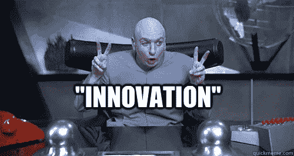
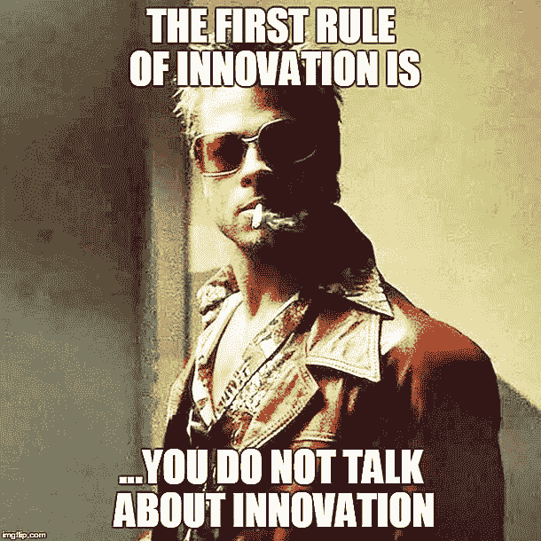

# [第 2 部分，共 2 部分]为什么自下而上的方法在企业中是不可能的。

> 原文：<https://medium.com/coinmonks/part-2-of-2-why-the-bottoms-up-approach-is-impossible-in-corporations-376251370369?source=collection_archive---------42----------------------->

Let’s talk about “innovation” today.

我认为企业自下而上的创新方式是不可能的。

或者至少是无情的，难以置信的困难。

让我来解释一下为什么自下而上的方法很少在企业环境中奏效。

现在，公司不能像创业公司一样行事。

他们可以尝试，但这只是口头上说说而已。

这就像幼儿园里的大猩猩试图扮演一个人类小孩。

没用的。

想想吧。

在公司的最底层，你有经营者，他们做实际的工作。

按下按钮，输入文件，转换 pdf 文件，记录时间。

他们既没有经验，也没有魄力向经理提出伟大的想法或新的做事方式。

在中层管理人员层面，他们要么厌倦了几十年的工作，要么在不断受到“新想法”的轰炸后变得麻木不仁。

不管是哪种方式，他们都不情愿、固执或“没有时间”接受新奇事物。

> 交易新手？试试[加密交易机器人](/coinmonks/crypto-trading-bot-c2ffce8acb2a)或者[复制交易](/coinmonks/top-10-crypto-copy-trading-platforms-for-beginners-d0c37c7d698c)

这不是他们的错，这只是公司运作的方式。

公司要成功，经营者需要经营，工作层需要工作，经理需要管理。

没人有时间去“跳出框框思考”或娱乐“颠覆性想法”。

你能想象试图说服他们的高管吗？

C-suites when you ask for an innovation budget..

他们要经历多少努力、时间、审查、判断和痛苦？

在高管层，他们是终极老板，从公司成立之初就一直在那里。

称之为惯性或“太有经验”，但他们总是没有时间，他们的脑海里有许多其他的议程。

因此，如果你看到在每一个层面上，都存在着坦率地说是心理上和系统性的障碍和壁垒。

新的想法或新的做事方式自然地“向上”沉淀，这是极其复杂的。

而且我连办公室政治，语言障碍，文化差异，地理都没碰过！

We don’t talk about it.

事实是，自下而上非常适合初创公司，但一旦初创公司发展到一定规模，从长远来看，自上而下总是会占上风。

当然，也有自下而上的工作和伟大的想法在部门内部浮出水面的例子。

一如既往，硬币的两面都有优点和故事。

需要澄清的是，我并不是在诋毁任何人或任何公司，我只是指出我的一个观察，这可能不是一件坏事。

这就是为什么他们说 B2B 销售最好针对 C 级，并承认这一点，可能有助于我们更好地理解事情。

所以说真的，既然我们知道创新在大公司中基本上是自上而下的，我们能做什么呢？

-

你认为自下而上的创新方法在大公司中可行吗？

-

#创业#商业#创业#成长#成功#社交媒体#文化#创业#战略#底层#创新#企业创新#员工能力#管理