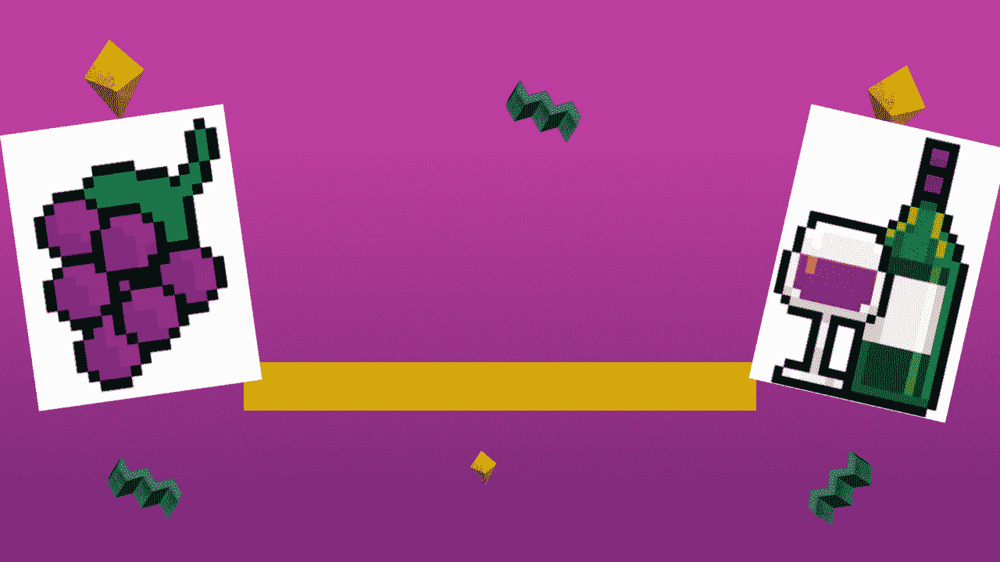

# 第 3 和第 4 部分葡萄金融系列:酿酒厂，回扣，债券和我的被动收入生态系统

> 原文：<https://medium.com/coinmonks/part-3-4-grape-finance-series-winery-rebates-gbonds-and-the-my-passive-income-ecosystem-4d6cd42dff46?source=collection_archive---------11----------------------->

|葡萄金融是雪崩网上的去中心化金融平台。通过下注代币和参与节点赚取被动收入。

欢迎来到我的葡萄金融系列的第 3 和第 4 部分。该平台已经停止了他们的酿酒厂，并向任何有葡萄酒节点的人退款。所以，这是…