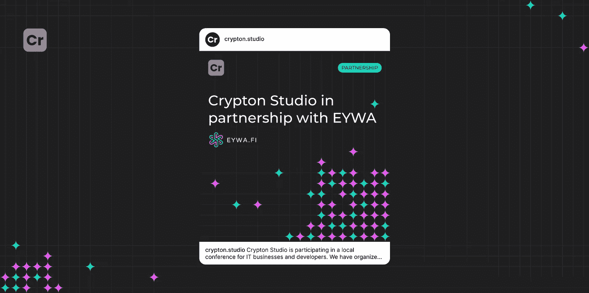

# 与埃及妇女协会的伙伴关系

> 原文：<https://medium.com/coinmonks/partnership-with-eywa-3c7581a35c22?source=collection_archive---------45----------------------->

Crypton Studio 正在参加一个面向 IT 企业和开发者的本地会议。我们组织了一个致力于区块链开发的板块。

作为该版块的主要负责人，我们邀请了 T2 EYWA T3 国际跨链协议项目的首席执行官 Boris Povar。

[EYWA 协议](https://medium.com/u/66eb660d8470?source=post_page-----3c7581a35c22--------------------------------)跨链协议，得益于分散的网络间数据桥，允许您在不同的链中创建智能合同管理系统，开发跨链 dApps 并管理资产。

和 Boris 一起，我们将讨论使用区块链技术的细微差别，以他的项目为例:链间协议的架构和特性。还有，为什么会有这么大的区块链被创造出来，对人们有什么实际的好处，什么样的未来等待着我们？

我们对 EYWA 参与当地会议感到非常高兴。我们期待富有成效的合作！

> 交易新手？尝试[加密交易机器人](/coinmonks/crypto-trading-bot-c2ffce8acb2a)或[复制交易](/coinmonks/top-10-crypto-copy-trading-platforms-for-beginners-d0c37c7d698c)