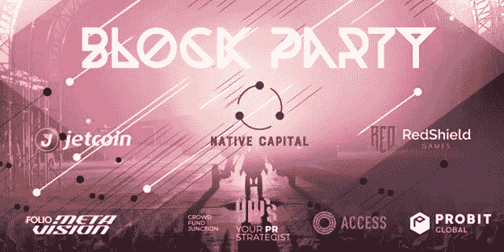

# Token2049 第一天的“街区派对”,仅限受邀者使用本地资本、进入新加坡等

> 原文：<https://medium.com/coinmonks/party-on-the-block-on-day-1-of-token2049-with-native-capital-access-singapore-and-more-by-89fa1b177f2?source=collection_archive---------35----------------------->

[*your prstrategist*](https://yourprstrategist.com/)*是 Block Party(token 2049 Day 1 的独家后派对)的活动合作伙伴和赞助商，很高兴能与我们的社区分享特别折扣代码。* ***折扣代码:ACCESS50***

*关注我们的*[*Twitter*](https://twitter.com/strategist_pr)*并标记 2 位好友，就有机会赢得 2 张免费入场券！*

Crypto VC [本土资本](https://www.nativecapital.io/) (NATCAP)和区块链工业协会 [Access Singapore](https://www.access.org.sg) 将于 9 月 28 日在由时尚偶像卡尔·拉格费尔德设计的豪华精品酒店 [So/新加坡索菲特](https://www.so-singapore.com)举办**街区**派对。这是亚洲顶级加密货币会议 [Token2049 Singapore](https://www.asia.token2049.com) 第一天之后的独家庆功宴。

在位于城市中央商务区中心的 So/索菲特酒店的 [1927 屋顶泳池&酒吧](https://www.so-singapore.com/wine-dine/1927-rooftop-bar/)举行，街区派对将以来自极简艺术的 techno 为特色， [JETCOIN](https://jetcoin.io) 模特展示市场上最热门的 NFT。受邀与会者将获得免费入场券和饮料，而贵宾席将提供光滑的贝尔维迪尔伏特加大杯、麦卡伦 12 苏格兰威士忌、朝日啤酒和特殊的酩悦香槟酒瓶。

除了 Native Capital、Access Singapore 和 JETCOIN 之外，其他活动合作伙伴还包括 game [Redshield](https://redshield.game/) 、web 3 PR agency[your PR strategist](https://yourprstrategist.com)、专注于密码的道风险投资 [CrowdFundJunction](https://www.crowdfundjunction.com) 以及即将举行的签名活动 Men's Folio、 [Metavision](https://www.mens-folio.com/metavision/) 。这个派对一定会是一个很好的社交活动，也是 Token2049 最热门的派对之一。

晚上 9 点开门，派对将持续到很晚。

**活动详情:**

日期:2022 年 9 月 28 日

地址:新加坡，068876，罗宾逊路 35 号

时间:晚上 9 点到很晚

特色:极简艺术

[**现在就拿票吧！**](https://www.eventbrite.com/e/party-on-the-block-on-day-1-of-token2049-with-natcap-access-redshield-tickets-417863399677)

**合作伙伴:**

**Native Capital** (NATCAP)是一家私人会员俱乐部，专门为区块链行业的初创企业提供早期融资。NatCap 提供元宇宙、Gamefi、NFT 和其他项目的独家私人销售渠道。

Redshield 是一款多人 NFT RPG 游戏，玩家在 20 世纪 40 年代的反乌托邦宇宙中进行激烈的团队战斗。

Metavision 是由 Men's Folio 发起的元宇宙计划，Men ' s Folio 是引领男士时尚和奢华生活方式的区域性媒体。

**CrowdFundJunction (** CFJ)致力于寻找早期阶段的区块链初创公司，以帮助他们加速增长，从强大的社区和有影响力的人那里获得项目的长期支持。

**yourPRstrategist** 是一家屡获殊荣的精品公关顾问公司，致力于利用当今最相关的传播渠道，将区块链和 Web3 品牌故事呈现在更广泛的受众面前。

[*来源*](https://techbullion.com/party-on-the-block-on-day-1-of-token2049-with-native-capital-access-singapore-and-more-by-invite-only/)

> 交易新手？尝试[加密交易机器人](/coinmonks/crypto-trading-bot-c2ffce8acb2a)或[复制交易](/coinmonks/top-10-crypto-copy-trading-platforms-for-beginners-d0c37c7d698c)