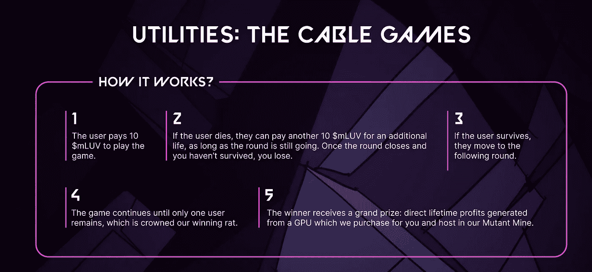

# Web3 中的被动收入——众筹加密挖掘

> 原文：<https://medium.com/coinmonks/passive-income-in-web3-crowd-funded-crypto-mining-b60779589d35?source=collection_archive---------5----------------------->

众所周知，我们中的许多人在财富积累和被动收入的承诺下跃入了 web3。随着如此多的项目转向为持有人提供公共设施，这个空间的景观已经从早期的“我们喜欢艺术”转变为堕落者似乎永恒的战斗口号“文”。

尽管我们喜欢在 Twitter 上告诉大众这一切都是关于艺术的，但对大多数人来说根本不是这样。人们聚集在这个空间做一件事，赚钱。艺术、氛围和文化，尽管我们喜欢成为其中的一部分，但在当前的 meta 中，这些都是次要的。为什么不呢？我们都有权追逐我们的那份馅饼，随着一些项目从赌注/实用令牌元发展而来，追逐这些袋子变得前所未有的容易。

# 进入群体——变异矿工鼠

变异矿工鼠是一个已经在索拉纳区块链活跃的项目，利用 6666 NFT 集合作为众筹，在迪拜的国际自由区管理局下建立一个大规模的加密采矿设施，那里的运营成本将比美国或欧盟效率高得多，加上没有税收。MMR 已经作为一个正式的商业实体运作，(变异矿工-FZCO)，没有留下任何制度上的障碍阻碍铸币厂的成功。

突变的矿工鼠已经准备好蜂拥而至，填补了 web2 和 web3 之间的空白。

# 工具箱

MMR 生态系统有一些游戏化，理解细节很重要，因为它们将直接影响持有者的收入潜力。

**变异矿工工具**

变异矿工工具是第一批铸造给持有者的收藏品，价格为 0.169 索尔。这家造币厂为在迪拜建立公司基础设施和法律费用提供资金，同时也是投资者未来主要收入的一个重要方面。

变异矿工工具的总供应量为 3333，有 4 种不同的工具可供选择，分为 3 个稀有等级。

每种工具占供应量的 25%。

持有 4 种工具中每一种的一套完整工具将授予持有者分享未来采矿收入的权利。你的工具集的稀有性将决定你的份额的价值。持有工具而不完成一套仍将有价值，其形式是从赌注、社区中的优先白名单、DAO 访问以及 MMR 托管服务的折扣中获得收益，但不会从加密挖掘操作中获得收益。

> 交易新手？试试[密码交易机器人](/coinmonks/crypto-trading-bot-c2ffce8acb2a)或者[复制交易](/coinmonks/top-10-crypto-copy-trading-platforms-for-beginners-d0c37c7d698c)

最多有 833 套，毫无疑问，工具被低估了。以目前的市场价格，不到 3 索尔就可以买到一套青铜工具。

全套持有者将获得:

*   青铜工具-矿业收入的 1 倍
*   白银工具-矿业收入的 1.25 倍
*   黄金工具-矿业收入的 1.5 倍
*   完整的工具集将保证主集合的白名单

> ***专业提示，2 套青铜比 1 套黄金产量高，入门成本更低(截至本文撰写之时)。***

*   *在撰写本文时，青铜工具在魔法伊甸园的交易价格是 0.71 索尔*

[https://magiceden.io/marketplace/mutant_miner_tools_](https://magiceden.io/marketplace/mutant_miner_tools_)

# 邮政铸币厂

在主要收集造币厂(7 月 29 日)，预计约 100 美元，采矿作业应建立和销售后 14-21 天运行。

最初的基础设施将是最先进的 GPU 以太坊矿，随后将收入再投资到 ASIC 比特币矿工。只要以太坊保持工作证明，GPU 操作就将挖掘以太。如果/当以太坊最终成为股权证明，DAO 将做出决定，以最好地评估如何进行和评估其他硬币的盈利能力。理想情况下，ASIC 比特币矿工将在 ETH 上线之前投入使用。

一旦采矿设施完全投入使用，开采出来的以太坊将被转化为索拉纳，并根据持有物的稀有程度分发给持有者。

# 我们热爱金钱

持有人的另一个收入来源将来自与 DeFi 区项目和他们的 LUV 令牌的联系。

突变矿工鼠，结合矿工工具集，将能够赌注并产生突变 LUV，一个$LUV 的细分版本，将以 200 mLUV : 1 LUV 的汇率开盘。

对于那些不熟悉 Defi 区生态系统和他们的本地标志$LUV 的人，我强烈建议也要赶上那边正在做的所有工作，因为它直接影响突变矿工鼠的产量。

美元的 LUV 令牌最近以 0 . 50 美元的价格部署在 DeFi 地区 DAO 持有者的初始 DAO 产品中，并保持稳定的价值，徘徊在每 1 LUV 1 美元左右。随着 DeFi 区继续建设并为$LUV 增加更多价值，MMR 只会成为更具吸引力的长期投资。

要了解 DeFi 区和 LUV 故障，请查看我的文章[这里](/@irish_/defi-district-the-new-web3-meta-7969dee4c128)。

# 突变标记组学:

变异的 LUV 将会有各种各样的功能，除了可以用$LUV 来交换。把你的老鼠长期押在赚取 mLUV 上，然后可以用来交换你自己的个人采矿设备，这是一个游戏改变者。这是目前区块链“被动收入”的顶峰。

参加电缆咀嚼游戏是利用你的 mLUV 收入的另一种方式，以赢得你自己的 GPU 矿(由突变矿工鼠托管)产生的终身利润。

# 游戏化

基于主要系列的游戏化特征，Miner Rats 生态系统有一些有趣的变化。薄荷将有 4 种不同的老鼠，每一种在生态系统中都有自己的用途。为了让社区参与进来，所有者将采取必要的措施来保护(或窃取)采矿利润。

这些特征和功能也应该推动一个有趣的二级市场，因为具体的特征将非常受欢迎，但所有这些特征本身都是有价值的。我很想知道这一切是如何进行的，我不介意每周点击一次按钮来赚取更多的利润。

# 投资回报预期

上面估计的回报显示，随着每月收入的一部分不断再投资，SOL 支付池的贡献越来越大。随着时间的推移，这种设置将继续复合，并为持有人创造更大的收入份额。

变异的矿工鼠可能成为真正的长期金融欺骗代码，让那些足够看涨的投资者买入 HODL 和中国的股票。在接下来的几个月，甚至几年后，将会有机构投资者和加密鲸加入进来，快速追踪采矿作业的规模。突变的 Miner Rats 将向投资者提供基础设施服务，以增加持有者的被动收益，同时成为扩张的催化剂。路线图已经在各个方面交付了，项目的未来似乎有了坚实的基础。

我可以自信地说，这个领域会有精明的投资者希望进入这个项目。在没有透露姓名的情况下，我可以确认一些 DeGods & Okay Bears 的持有人，以及一些知名的 Twitter 影响者将开始积累 rat 及其配套工具集。

— — — — — — —

像往常一样，我写的不是投资或财务建议。总是做你自己的研究，尽你所能做出最好的决定。交易非功能性交易是投机性的，可能会导致永久性损失。

交易愉快，朋友。

> 加入 Coinmonks [电报频道](https://t.me/coincodecap)和 [Youtube 频道](https://www.youtube.com/c/coinmonks/videos)了解加密交易和投资

# 另外，阅读

*   [比诺莫评论](https://coincodecap.com/binomo-review) | [斯多葛派 vs 3Commas vs TradeSanta](https://coincodecap.com/stoic-vs-3commas-vs-tradesanta)
*   [Capital.com 评论](https://coincodecap.com/capital-com-review) | [香港的加密借贷平台](https://coincodecap.com/crypto-lending-hong-kong)
*   如何在 Uniswap 上交换加密？ | [A-Ads 审查](https://coincodecap.com/a-ads-review)
*   [WazirX vs coin dcx vs bit bns](/coinmonks/wazirx-vs-coindcx-vs-bitbns-149f4f19a2f1)|[block fi vs coin loan vs Nexo](/coinmonks/blockfi-vs-coinloan-vs-nexo-cb624635230d)
*   [本地比特币评论](/coinmonks/localbitcoins-review-6cc001c6ed56) | [加密货币储蓄账户](https://coincodecap.com/cryptocurrency-savings-accounts)