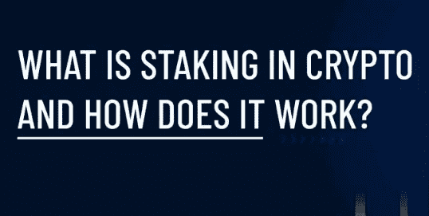
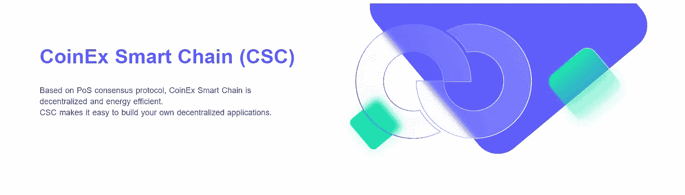
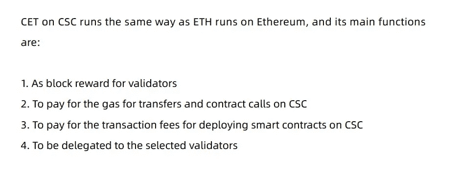
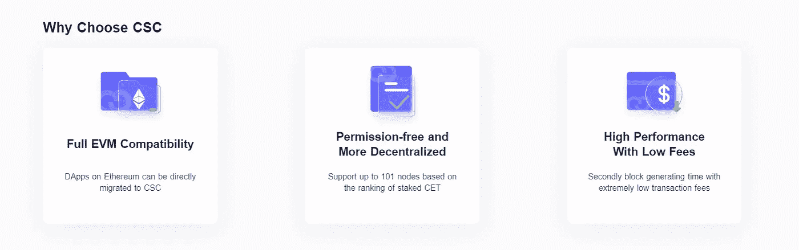
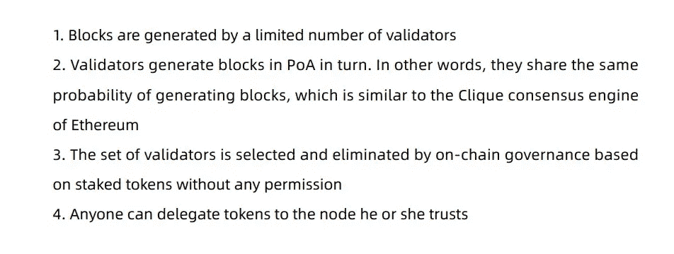
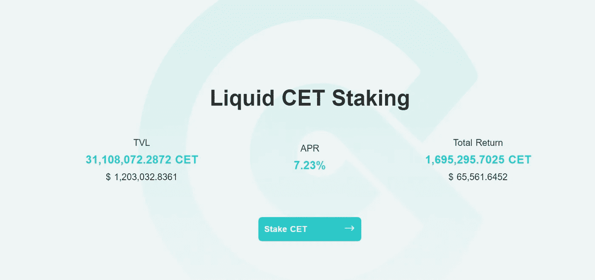
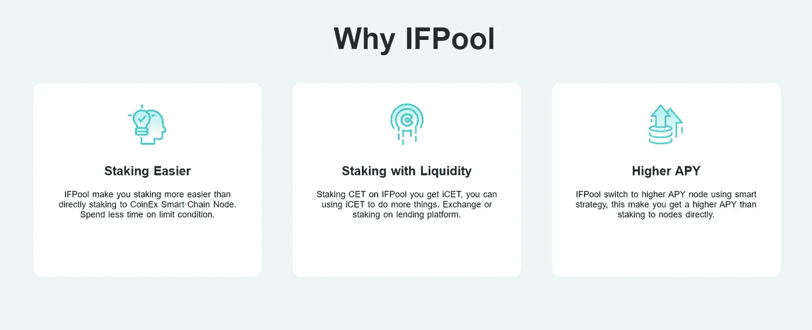

# 被动收入奖励

> 原文：<https://medium.com/coinmonks/passive-income-reward-269e11c85457?source=collection_archive---------23----------------------->

## 在 CSC 上下注

赌注加密现在变得日益流行，因为许多人开始意识到它。它已经成为加密投资者赚钱的另一种方式。更准确地说，是产生良好的被动收入。赌注可能是一个复杂的想法，也可能是一个简单的想法，这取决于你开启了多少层次的理解。对于许多交易者和投资者来说，下注是一种因持有某种加密货币而获得回报的方式。

## 赌注是如何运作的。

赌注是您同意将您的一部分加密技术授予区块链网络的过程。区块链网络使用你的密码来改善网络。你的密码在下注时获得奖励的原因是区块链让它发挥作用。允许赌注的加密货币使用一种称为“赌注证明”的“共识机制”，这是他们确保所有交易都得到验证和保护的方式，中间没有银行或支付处理器。你的密码，如果你选择赌注，成为这个过程的一部分。

***“只有一些加密货币有赌注。请记住，并非每种加密货币都具有赌注功能。它仅适用于使用利益证明(PoS)模型的公司。与工作证明模型(PoW)“***相比，它在确认交易方面效率更高，使用的能量更少

如果你拥有的加密货币允许下注，你可以“下注”你的一些资产，并随着时间的推移获得一定比例的回报。这通常是通过一个“赌注池”来实现的，你可以把它想象成一个有息储蓄账户。幸运的是 CSC 允许赌注。

## CSC & CET

CSC — CoinEx 智能链是一个分散的高效公共链，基于 PoS 共识协议运行。它可以为开发者提供一个高效、低成本的链上环境来运行去中心化智能合约应用(DApps)和存储数字资产。CSC 坚持去中心化和无权限块生成的原则，这样任何人都可以通过下注 CET 成为验证者。 CET — CoinEx Token 是 CoinEx & CoinEx 智能链的原生令牌。

## 了解隐藏加密背后的机制

*这是开始变得更具技术性的地方*。要理解这一点，你需要一点背景知识。

*   加密货币通常是分散的，这意味着没有中央权威机构在运作。那么，在一个分散的网络中，所有的计算机是如何得到正确的答案，而不需要一个中央权威机构来提供给它们呢？他们使用“共识机制”
*   许多加密货币——包括比特币和以太坊 1.0——使用一种被称为工作证明的共识机制。通过工作证明，该网络在解决一些问题时投入了巨大的处理能力，如验证地球两端陌生人之间的交易，并确保没有人试图花同样的钱两次。这个过程的一部分涉及到全世界的“矿工”，他们竞相成为第一个解开密码难题的人。获胜者有权将最新的“验证交易块”添加到区块链上，并获得一些密码作为回报。

标桩被认为是一种帮助确认交易的新方法。这种确认交易的过程只发生在使用利益证明模型的加密货币中。

“工作证明”模式受到了很多批评，因为它消耗了大量的能源，加剧了全球变暖的影响。

## 什么是利害关系的证明？

一种被称为“利益证明”的新的共识机制已经出现，其理念是在降低费用的同时提高速度和效率。股权证明降低成本的一个主要方式是，不要求所有这些矿商费力解决数学问题，这是一个耗费大量精力的过程。取而代之的是，交易由真正通过赌注投资于区块链的人来验证。

*   赌注的作用类似于挖掘，在这一过程中，网络参与者被选中将最新一批交易添加到区块链中，并作为交换获得一些密码。
*   具体的实现因项目而异，但本质上，用户将他们的代币放在线上，就有机会在区块链上添加一个新块以换取奖励。他们的股份代币充当他们添加到区块链的任何新交易的合法性的保证。
*   这个网络根据他们的股份大小和他们持有股份的时间长度来选择验证者(通常被称为验证者)。所以最投入的参与者会得到回报。如果一个新区块的交易被发现无效，用户可以通过网络烧掉一定数量的股份，这就是所谓的**砍杀事件。**

## 赌注的好处

许多长期加密持有者将赌注视为通过产生回报使其资产为他们服务的一种方式，而不是将它们收集在加密钱包中。

标桩还有一个额外的好处，就是有助于您所支持的区块链项目的安全性和效率。通过投入部分资金，您可以提高区块链抵御攻击的能力，并增强其处理交易的能力。(一些项目还向 staking 参与者授予“治理令牌”,这使得持有者对该协议的未来更改和升级有发言权。)

*   **对环境友好—** 打桩使用一种产生极少能量的机制，最终有助于保护环境。它不需要很高的计算能力，这使它比[密码挖掘](https://www.blockchain-council.org/defi/staking-vs-yield-farming-vs-liquidity-mining/)好得多。
*   **助力区块链网络—** Staking crypto 帮助区块链网络更高效地处理交易。不仅如此，它还有助于为系统提供高安全性，使欺诈可以忽略不计。
*   **帮助您赚取更多利息—** 赌注加密已经成为投资者赚取大量利息的最佳方式之一。一般能给你提供不错的收益。

# 在 CSC 上下注

为了保护我们的密码，我们首先需要选择一个像 CSC 这样的 PoS 公共链。欢迎每个人通过下注 CET 来帮助节点成为验证者

欢迎大家通过押 CET 申请成为验证师。验证器的第一次赌注必须超过 10000CET，随后的每次赌注必须超过 1000CET。基于整体的标桩排名，区块链将在每 200 个块中选择前 101 个节点作为验证器。验证器有义务生成块并验证链上信息。作为回报，验证者将根据他们的赌注比例获得批量佣金和一定数量的批量生产奖励。

你可以在[https://www.coinex.net/validator](https://www.coinex.net/validator)查看 CSC 验证器

## 赌注奖励。

主要是对验证者的奖励来自大宗交易奖励(每笔 1 CET)和大宗交易佣金。奖励根据验证者赌注在总赌注中的比例而不同。由于验证者以相同的概率轮流生成块(如果它们保持 100%在线)，所有验证者的收益只与它们的赌注比例有关。

区块链按每 200 块赌注的比例分配奖励。验证器的奖励接收地址可以通过调用合同或通过[节点命令行](https://docs.coinex.org/#/en-us/validator_cli)来检索奖励。每 28800 块可以提取奖励。

CSC 通过系统契约来管理节点堆栈和治理。系统合同已在 CSC 启动后部署。目前，为 CSC 设计了两套系统合同:

*   验证者契约——通过标桩契约，任何人都可以创建节点，为节点标桩并获利。
*   Slash contract —由于网络、硬件、配置和其他因素，CSC 可能会因网络异常、机器崩溃和其他潜在问题而不稳定。因此，中国证监会引入了惩罚机制。斜杠契约主要负责跟踪验证器节点的错误块记录。当错误的块记录达到某个阈值时，将从验证者的押记资产中扣除 500CET 的罚款。

你可以通过选择一个佣金较低且具有验证大量区块的良好记录的赌注池来获得最大回报。基于 CSC 的应用 IFPool 中的 Staking。通过 CSC 的第一个赌注挖掘池 IFPool，即使是初学者也可以投票给 CSC 验证器，并直接通过 MetaMask 下注他们的 CET 持股。在 IFPool 中，赌注为获得的每份 iCET 产生回报，用户可以在撤销 CET 时要求回报。通过这个池，零售用户可以直接在他们的钱包中下注 CET 来赚取被动收入，与通过 CSC 验证器下注 CET 相比，这是一种更容易、更方便、更少限制的方法。

*   与 IfPool 在:[https://ifpool.io/](https://ifpool.io/)下注

> 交易新手？试试[密码交易机器人](/coinmonks/crypto-trading-bot-c2ffce8acb2a)或者[复制交易](/coinmonks/top-10-crypto-copy-trading-platforms-for-beginners-d0c37c7d698c)