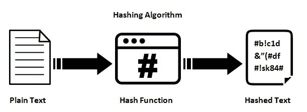
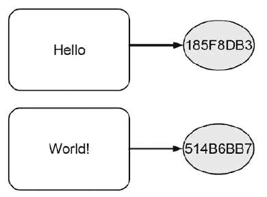
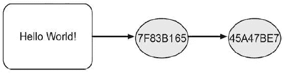
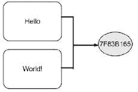
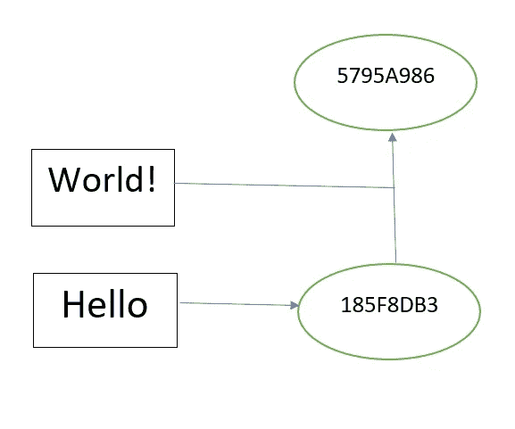
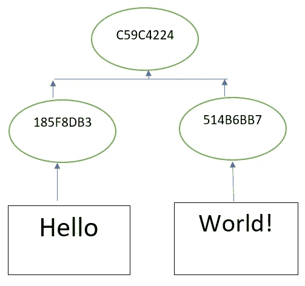

# 区块链中的哈希模式

> 原文：<https://medium.com/coinmonks/patterns-of-hashing-in-blockchain-5319a1b9cba8?source=collection_archive---------4----------------------->

哈希函数一次只能处理一条输入数据，并生成一个称为哈希值的输出值。哈希值由 0-9 的数字和字母(A-F)组成，所以哈希值总共由 16 位组成。这 16 个数字称为十六进制数。有多种类型的散列函数，它们根据产生的散列值的长度而变化。

基本上，哈希技术有五种不同的模式:

1.  独立散列
2.  重复散列
3.  组合散列法
4.  顺序散列法
5.  分层散列法

**独立哈希:**哈希函数分别对每个输入数据进行变换。

Independent hashing

**2。重复散列:**散列函数将输入数据转换成一个散列值，这个散列值再次作为输入给出，并产生另一个输出散列值。

> 交易新手？试试[密码交易机器人](/coinmonks/crypto-trading-bot-c2ffce8acb2a)或[复制交易](/coinmonks/top-10-crypto-copy-trading-platforms-for-beginners-d0c37c7d698c)

Repeated Hashing

**3。组合散列:**它使我们能够为一个以上的数据块产生单一的散列值。当数据非常小时，使用这种散列技术，因为它减少了产生散列值的更多功率的使用。如果您已经注意到它类似于重复散列(在第一次散列期间)，那么获得的两个散列值是相同的。

Combined hashing

**4。顺序散列:**只要新数据出现，顺序散列就同时使用组合散列和重复散列来创建散列值的更新。现有的哈希值与新到达的输入数据合并，然后进行哈希运算以获得更新后的哈希值。如果您需要单个散列值，并希望跟踪其发展到新数据的出现，这种散列模式是很有价值的。

Sequential hashing

**5。分层散列法:**分层散列法使用组合散列法来创建散列值对，从而能够创建层次结构。分层散列模式的目标是以类似于组合散列的方式为大量数据块创建单个散列值。与组合散列相比，分层散列具有效率优势，因为组合数据由大小固定的散列值形成，因此减少了所需的计算能力和所需的时间。

Hierarchical Hashing

为了更好地理解，您可以使用下面的网站来实现这些散列技术。学习起来会很有趣:)

 [## 哈希函数

### 哈希函数

哈希 Functionswww.blockchain-basics.com](http://www.blockchain-basics.com/HashFunctions.html)