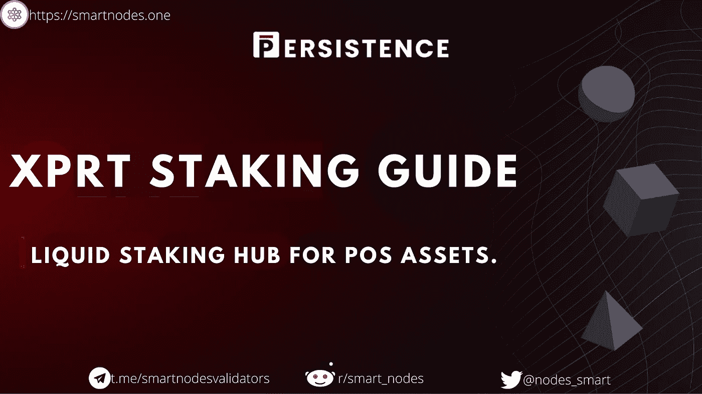

# Persistence.one (XPRT)定位指南——如何在 Smartnodes 中定位 XPRT

> 原文：<https://medium.com/coinmonks/persistence-one-xprt-staking-guide-how-to-stake-xprt-in-smartnodes-one-743655b396a9?source=collection_archive---------11----------------------->

Persistence.one(XPRT) Staking guide- How to stake XPRT In smartnodes.one

持久性。POS 资产的单一流动锁定中心(锁定指南)

> *在本教程指南中，我们将向您展示如何使用*[*smart nodes . one*](https://smartnodes.one/)*中的* [*Keplr 扩展钱包*](https://chrome.google.com/webstore/detail/keplr/dmkamcknogkgcdfhhbddcghachkejeap?hl=en) *来下注****【XPRT】****令牌。*

您可以在下面的说明中了解如何利用持久性(XPRT)进行赌注，这些说明包括:

1.  XPRT 定位简介
2.  如何为您的钱包登录仪表板
3.  转移(标桩)您的 XPRT
4.  查看赌注奖励信息

# 什么是持久性(XPRT)？

一个由持久性驱动的 DeFi 应用程序生态系统，一个基于 Tendermint 的专业第 1 层网络，专注于通过流动赌注释放赌注资产的流动性。由于持久性，用户可以在参与 dex 上的借贷和流动性供应等 DeFi 原语时获得赌注激励，这使得发行和部署流动性赌注集变得更加容易。

Persistence 寻求为 PoS (Proof-of-Stake)用户提供无缝的 staking 和 DeFi 体验，同时使程序员能够创建基于 stkASSETs 的尖端应用程序。

Persistence.one XPRT Staking Guide

# 什么是$XPRT 令牌？

$XPRT 是持久性生态系统的工作令牌，引导生态系统应用程序来推动网络采用，并通过赌注来保护核心基础设施。$XPRT 利益相关者可以参与治理，为生态系统的长期成功做出贡献。

$XPRT 通过多种途径从生态系统的财务活动中积累价值，包括汽油费、与生态系统应用程序的费用共享、枢纽路由等。

什么是$XPRT 的记号组学？

1 亿美元的 XPRT 是在 genesis 上铸造的，将在 42 个月内陆续发行——令牌分布如下:

*   **营销&增长:** 25.6% (25，600，000 美元)
*   **生态系统发展&增长:**19.4%(1940 万美元)
*   团队: 16% (16，000，000 美元)
*   种子和私人销售:14%(1400 万美元)
*   **验证者激励:** 10% (10，000，000 美元 XPRT)
*   **验证者&战略销售:** 10% (10，000，000 美元 XPRT)
*   顾问: 4% (4，000，000 美元 XPRT)
*   **公开销售:**1%(100 万美元 XPRT)

准备好下注您的 **$XPRT** &享受高达 **36%的 APR** 下注奖励了吗？

Credit -Persistenc.one(Youtube)

**我们在哪里可以买到 XPRT 令牌？**

1.  [渗透区](https://app.osmosis.zone/?from=USDC&to=DEC)
2.  [Junoswap](https://junoswap.com/)
3.  [霍比环球](https://www.huobi.com/en-us/exchange/xprt_usdt)
4.  [库币](https://www.kucoin.com/trade/XPRT-USDT)
5.  [Sifchain](https://sifchain.network/#/swap?from=xprt&to=rowan)

> [*如何使用渗透作用. zone |渗透作用你应该知道的一切*](https://smartnodes.medium.com/how-to-use-osmosis-zone-everything-you-should-know-about-osmosis-9561a076faff)

**如何入股 XPRT Token？**

在交易所购买后，你需要将这些代币转移到一个自我保管的钱包中。

*   **自保管钱包(最受欢迎的一款)**

1.  开普勒
2.  [宇宙站](https://wallet.cosmostation.io/cosmos)

将资产转移到新钱包后，打开 [smartnodes.one](https://smartnodes.one/) 来下注您的 **$XPRT 代币**。

**步骤 1** —转到 delegate 部分，找到**Persistence(XPRT)****点击 delegate。**

[https://www.keplr.app/#starters](https://www.keplr.app/#starters)

**第二步-**-**再次点击**进行委托。

[https://smartnodes.one/#delegate](https://smartnodes.one/staking/decentr?apr=19&link=https%3A%2F%2Fsmartnodes.one%2Fdashboard%2Fdecentr%2Fstaking%2Fdecentrvaloper1g96pw596ullcxxe88tcmgx4vlka7tk5p4rd3sg)

**步骤 3 -** 连接你的 **Keplr** 钱包。

Connecting Keplr wallet to smartnodes.one

**第 4 步-** 选择 Keplr-点击下一步- **点击批准。**

Approving Keplr Integration [https://smartnodes.one/](https://smartnodes.one/)

**步骤 5-** 输入帐户名，确保在链的导入地址中选择了 **XPRT** 。**点击下一步。**

Creating account name to stake-[https://smartnodes.one/](https://smartnodes.one/)

**步骤 6-** **确认**，再次检查地址是否添加正确——点击保存。

Confirming account in smartnodes.one

**步骤 7-** 您已经成功地将您的 **XPRT** 令牌导入到 [Smartnodes.one](http://smartnodes.one/) 中

*   向下滚动并点击持久性锁定指南中的**详情**。

Finding details about Staking XPRT Safely.

接下来，单击“委托”,继续进行立桩。

Delegate to Smartnodes

**第八步**——现在选择 [**验证器**](http://smartnodes.one/) ，输入想要下注的金额，填油费为 3000，选择 Keplr 钱包，点击**发送。**

**第九步** - **审批**Keplr 弹出窗口中的交易。

Approving transaction in Keplr for Smartnodes.one

**第 10 步-** 祝贺您，您已经成功地用 Smartnodes 下注了您的 **XPRT 代币**(您还可以看到您的资产分配、奖励和余额)。

Staked XPRT with Smartnodes

**访问他们的**官方** [**网站，了解更多关于 Persistence.one(XPRT)** 项目的信息。](https://persistence.one/)**

# 关于智能节点

1.  [Smartnodes](http://smartnodes.one/) Validator 是一个提供 100%斜线和双符号退款保护的利益证明服务。
2.  我们在宇宙中非常活跃，尽我们所能给予支持。我们是社区驱动的。验证者积极地对提案进行投票，以帮助确保适当的治理。
3.  [Smartnodes](https://smartnodes.one/#faq) 使用的基础设施是最好的，有 10 层安全措施来保护您的资产。
4.  我们目前正在 33 个加密货币链上提供利益相关证明服务(POS ),并在不断增长，请查看我们的验证器节点网站。 [Smartnodes.one](https://smartnodes.one/dashboard/)
5.  如有任何其他问题，请随时在我们的社交媒体上联系团队成员，或发邮件至 hello@smartnodes.one

SmartNodes is an infrastructure provider for Proof-Of-Stake blockchains and decentralized projects.

**Socials**| |[**Reddit**](https://www.reddit.com/user/Smart_nodes/)**|**[**Twitter**](https://mobile.twitter.com/nodes_smart)**|**[**网站**](https://smartnodes.one/) **|** [**电报**](https://t.me/smartnodesvalidators)**|**[**insta gram**](https://www.instagram.com/smartnodes_validator/?igshid=YmMyMTA2M2Y=)**|**[**不和**](https://discord.com/invite/TA3UVPwn6D)

> 交易新手？试试[加密交易机器人](/coinmonks/crypto-trading-bot-c2ffce8acb2a)或[复制交易](/coinmonks/top-10-crypto-copy-trading-platforms-for-beginners-d0c37c7d698c)