# SOL 的前景

> 原文：<https://medium.com/coinmonks/perspectives-for-the-sol-4f404e62078c?source=collection_archive---------11----------------------->

你好，我是迈克尔·海波夫。

在这篇文章中，我们将考虑投资吸引力的索拉纳区块链，更具体地说，它的家令牌溶胶，我也将回答为什么 8。金融决定不建立在索拉纳身上。

首先，我们来看看 SOL 的长处。

# 从中长期来看，有哪些因素有利于投资 SOL？

1.  交易速度快，成本低

Solana 仍然是市场上最便宜、最快的分散式区块链网络之一

*   每秒事务数(TPS): 29，171
*   形成一个区块的时间:2.34 秒
*   一笔交易成本(汽油费):0.00025 美元

2.强大的市场营销和社区的高度社会活动

索拉纳社区是三个最活跃的社区之一:

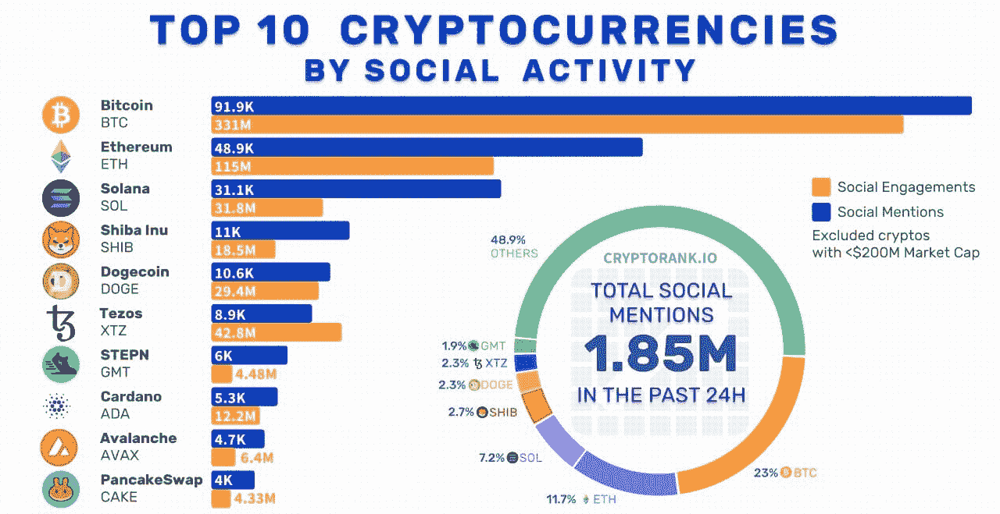

与此同时，Solana 品牌的积极推广不仅发生在网上，也发生在网下:

*   索拉纳品牌的连锁商店正在建设中

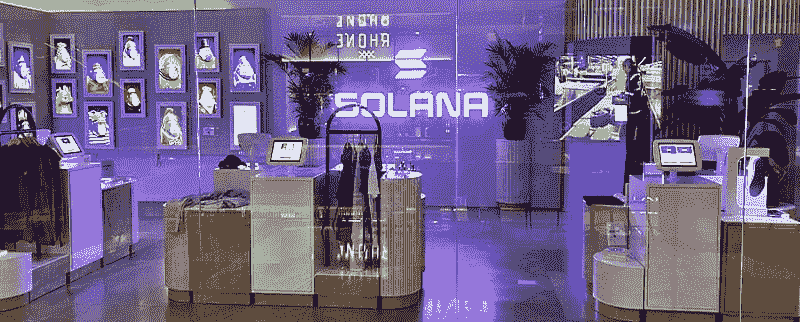

*   Solana Saga 智能手机正在开发中

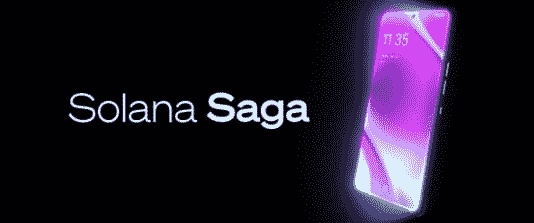

3.低价

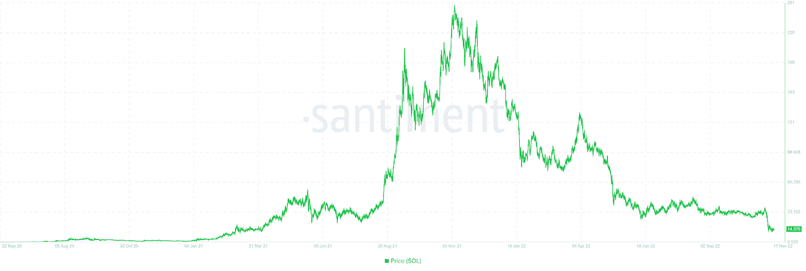

索拉纳的价格从高点下跌了 95%，为未来的增长留下了巨大的空间。

# 从中长期来看，阻碍投资 SOL 的因素有哪些？

1.  索拉纳区块链的技术问题

自 2020 年以来，索拉纳区块链已经经历了至少 7 次断电；2022 年发生了 5 次故障。垃圾邮件攻击类似于 DDOS 攻击，其创始人阿纳托利·亚科文科自己称之为索拉纳的诅咒。问题在于索拉纳区块链现有的带宽限制，同时，交易成本非常低，这使得有可能在网络上安排垃圾邮件攻击，并通过机器人同时创建数千万笔交易，从而使网络过载并使其瘫痪。

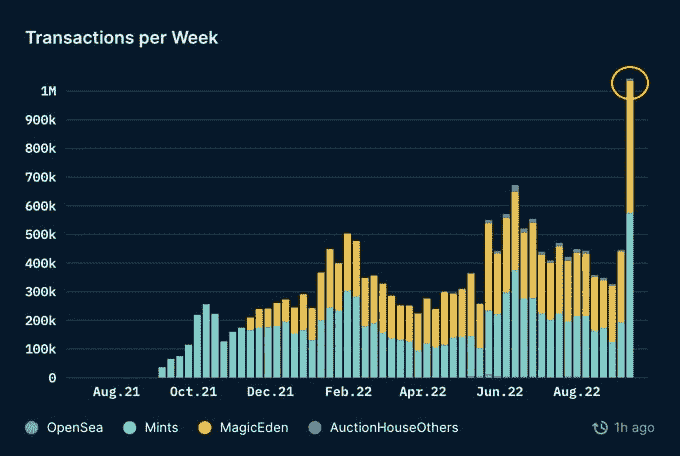

上面的图表显示了其中一种垃圾邮件攻击的示例。

2.前 FTX 首席执行官萨姆·班克曼-弗里德是索拉纳的首席大使和投资者

FTX 是市场上第二重要的加密货币交易所。它是由索拉纳·区块链号驱动的。FTX 的破产和山姆的离开对整个生态系统造成了巨大的破坏。除了声誉受损，FTX 正在进行的 SEC 调查和破产程序也是一个重大风险。Sam 参与的所有附属法人实体和投资项目都可能受到攻击。例如，众所周知，FTX 交易所用户的资金在他们不知情的情况下被转移到阿拉米达公司集团进行投资和交易活动。

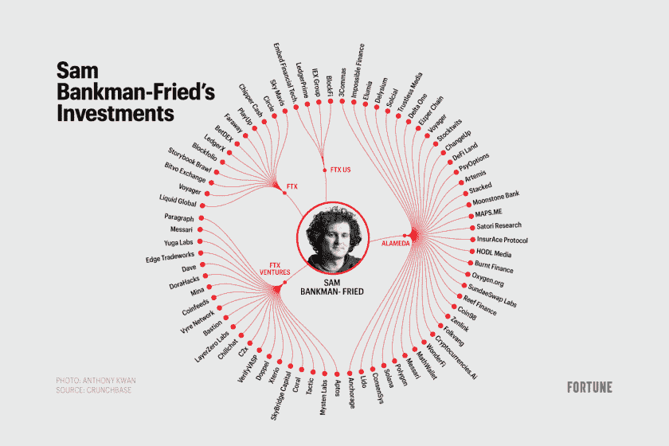

此外，山姆是索拉纳区块链的早期投资者。根据一些报道，他的账户中有 2.92 亿美元的“解锁溶胶”，8.63 亿美元的“锁定溶胶”和 4100 万美元的“溶胶抵押品”。作为破产程序的一部分，这些资金可能会被出售以偿还对债务人的债务。这肯定会对价格造成压力。

3.索尔的交易比市场更糟糕

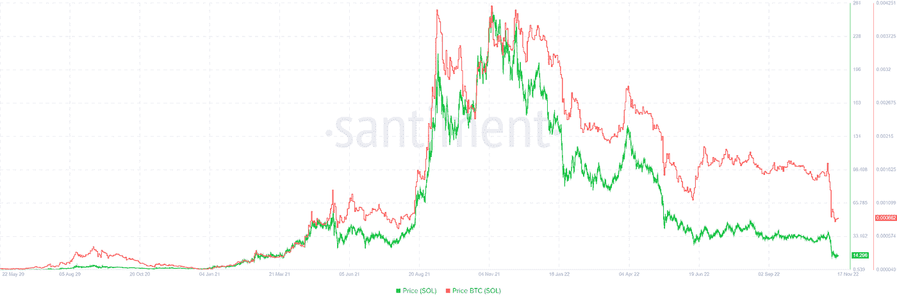

上面的图表显示，SOL 的价格交易比以比特币为基准的市场更糟糕。这意味着，在索拉纳，不存在阻止价格下跌的内在因素，也不存在买入的内部人士。

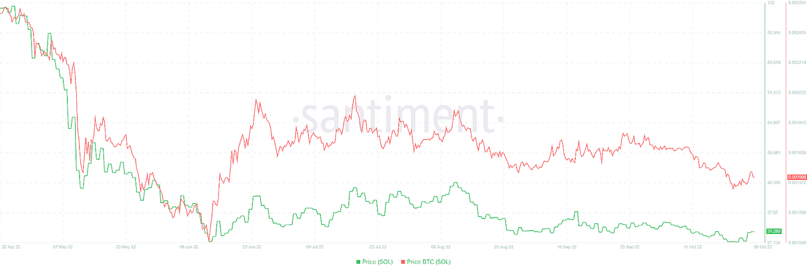

2022 年 6 月比特币的反弹证实了这一点(以上图红线为标志)。我们可以看到溶胶的价格并没有对一般的市场积极性作出反应，实际上保持在自己的水平。

4.利益相关方退出 SOL

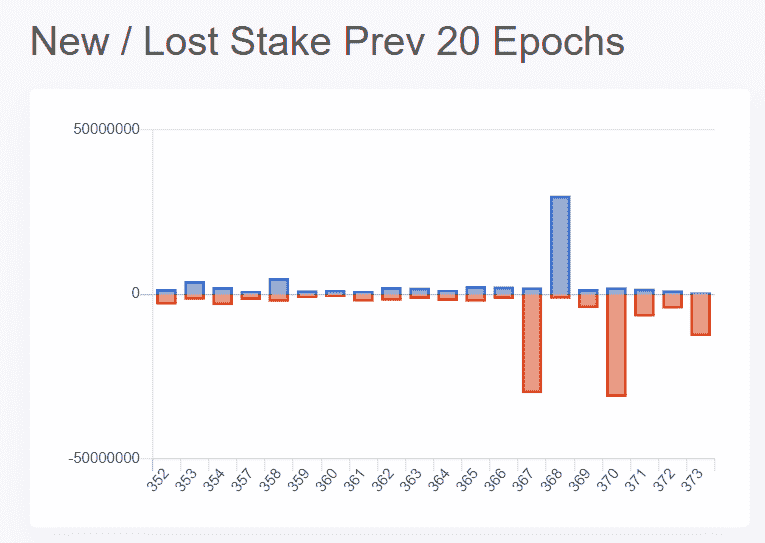

在 https://solanacompass.com/validators/，我们看到 SOL 利益相关者从索拉纳区块链大量外流。因为持有人代表长期投资者，也就是长期投资代币的人，这种动态从根本上来说是负面的。

5.索拉纳区块链开发商的活动减少

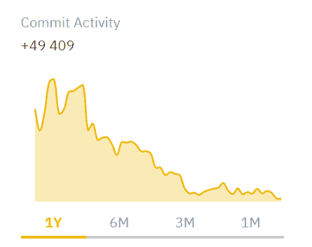

根据 https://research.binance.com/en/projects/solana[的说法](https://research.binance.com/en/projects/solana)，在过去的几个月中，Solana 开发者仓库中的提交活动已经大大减少了

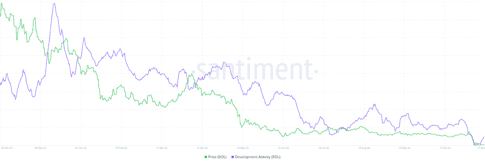

Santiment 数据证实了开发商活动的下降趋势。

在频繁的系统崩溃和黑客攻击中，这一事实对买家来说也是一个危险信号。

6.索拉纳用户黑客

不幸的是，对于这个网络的用户来说，索拉纳也不能被称为一个安全的区块链。

仅在 2022 年，DeFi 历史上针对 Solana 用户的两次最大规模攻击就已实施:

*   2022 年 2 月，索拉纳网络上的虫洞桥被黑客攻击导致了 3.2 亿美元的损失。这座桥的使用者资金被盗。
*   2022 年 8 月，8000 个 Solana 用户钱包的资金被盗。

此外，在 2022 年 11 月，几乎在申请破产和 Sam Bankman-Fried 辞去首席执行官职务的同时，FTX 交易所遭到黑客攻击，价值 6 亿美元的加密货币资产被提取。

这些盗窃是在何种加密货币中进行的不得而知，但很可能其中很大一部分是在 SOL 令牌中。将这些资金推向市场是一个时间问题，象征性的销售将对价格造成长期压力。

7.索拉纳区块链膨胀令牌经济学

SOL token 价格面临额外压力的另一个重要因素是 Solana tokenomics 的通胀性质。

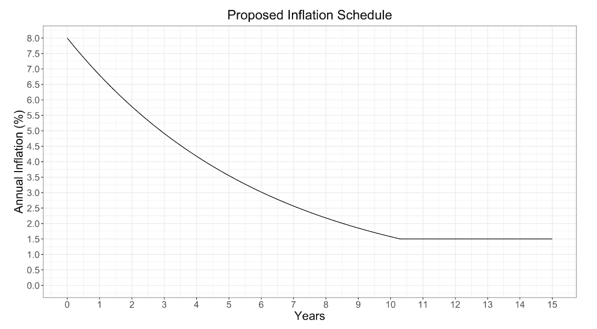

SOL 没有铸造限制，将按计划通货膨胀发行，根据白皮书图表，今年的通货膨胀率应该在 6%左右。

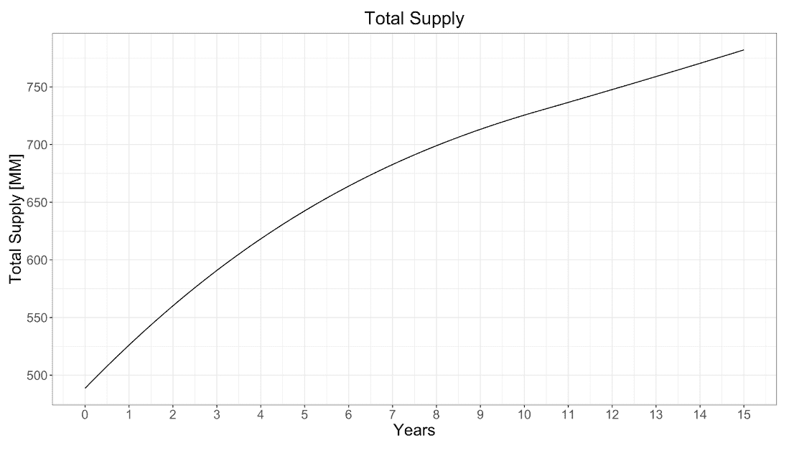

上图显示了 15 年间市场上代币供应增长的动态。根据 https://explorer.solana.com/supply,[的数据](https://explorer.solana.com/supply,)，目前的总供应量为 533，682，239 索尔币。

8.SOL 代币的继续归属

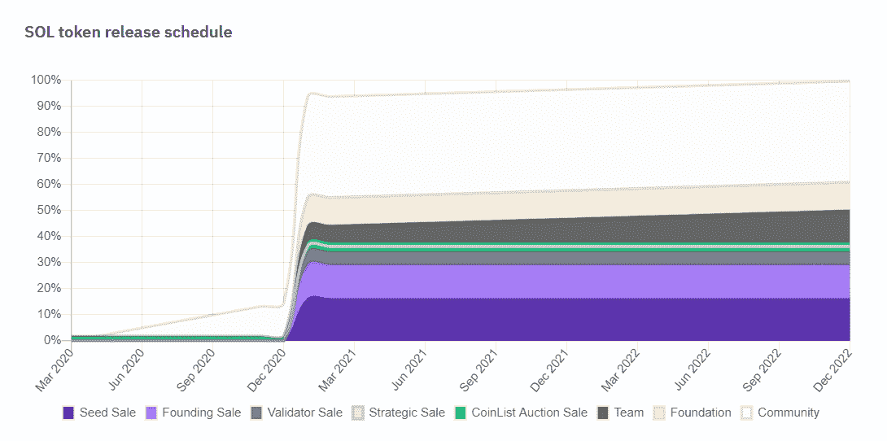

最后要关注的是投资轮参与者的行权计划。正如我们从归属时间表中看到的，它应该在今年完成，因此，直到 2022 年底，由于锁定令牌的释放，SOL 令牌将面临额外的压力。

# 结论

索拉纳是一个有前途的区块链，具有吸引人的技术特征、稳定的令牌组学和优秀的开发和营销团队；然而，当前的内部和外部市场因素不支持购买 SOL 代币，即使从长期来看在当前的价格水平下。

BitMex 的创始人亚瑟·海斯(Arthur Hayes)以其过去相当准确的预测而闻名，他正在谈论 3 美元区域的 SOL 日。

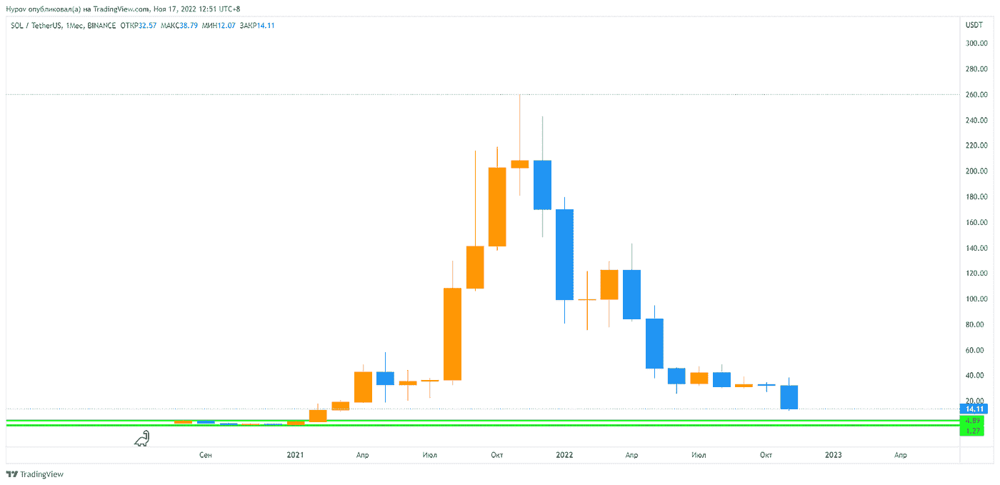

如果我们看一下 SOL 的历史价格图，我们可以看到做市商水平突破了 30 美元，这导致了清算的激增和雪崩式的价格下跌。SOL 价格支持的下一个级别是在币安交易的第一个月形成的交易通道，在 5 到 1 美元的区域，所以 Hayes 的估计总体上看起来非常现实。

如果我们认为 SOL 是一项长期投资，只有当接近公布的范围时，才可以推荐购买，平均仓位至少为 1 美元。同时，观察价格相对于比特币的行为也很重要。买入的绿色信号将是内部人士积极买入的开始。这一点在比较 SOL 和比特币的价格图表时就会看到，前者即使在下跌的市场中也会上涨。

# 回到主题:为什么 8。财务决定不建立在索拉纳？

相信看完这篇文章，你已经明白答案了。尽管 Solana 拥有所有的技术优势，但这项技术仍然太原始，容易受到黑客攻击。以太坊区块链和与之兼容的协议，如 BNB 链，已经证明了它们的可靠性！同时，主要竞争优势 8。金融在于商业模式不依赖于特定的区块链。我们可以轻松扩展并与任何网络的项目合作，甚至与加密货币无关的业务合作。

想了解更多 8。金融？查看[球场甲板](https://drive.google.com/file/d/1t7oomRxGBjsEUaKiFsSn-OWba3fOoS30/view?usp=sharing)。

照顾好你自己和你的钱！

祝大家好运，

迈克尔·海波夫

8 的 CPO。金融

> 交易新手？试试[密码交易机器人](/coinmonks/crypto-trading-bot-c2ffce8acb2a)或者[复制交易](/coinmonks/top-10-crypto-copy-trading-platforms-for-beginners-d0c37c7d698c)