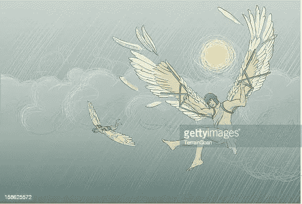

# 彼得·希夫与伊卡洛斯，技术，以及对区块链的影响

> 原文：<https://medium.com/coinmonks/peter-schiff-vs-icarus-technology-and-implication-for-blockchain-6f710977a089?source=collection_archive---------57----------------------->

Icarus via Gettyimages

彼得·希夫是比特币的强烈批评者，他的银行被波多黎各监管机构关闭，因为他们无法维持最低净资本要求。结果，账户被冻结，客户无法提取他们的钱。他们也不允许出售给高资质的买家，这些买家可以注入远远超过监管最低限额的资金。

彼得·希夫是金融方面的权威，他是美国股票经纪人，欧洲太平洋资本公司的首席执行官和首席全球策略师。他还写了 9 本书，都是关于美国经济和金融的。但是他[一直强烈批评加密货币](https://markets.businessinsider.com/currencies/news/bitcoin-critic-peter-schiff-blasts-cryptocurrency-federal-government-us-dollar-2021-4-1030365316#:~:text=Peter%20Schiff%20dismissed%20bitcoin%20as,a%20%22giant%20bubble%20economy.%22)，尤其是比特币和以太坊。他对加密货币的主要论点是，除了人们购买它们之外，它们没有任何东西支持，他觉得这削弱了它们的价值。好像钱的概念不是人类同意赋予物质价值，不管是纸还是金属。货币的价值是生活在一个地区的人们一致认同的东西，无论是有形的还是虚拟的。那么，他为什么要破坏加密货币呢？直到他不在了？

彼得·希夫让我想起了伊卡洛斯，因为它与彼得·希夫的故事在很多层面上都有交集。

《大英百科全书》这样总结伊卡洛斯的故事；

“当国王反对代达罗斯并囚禁他时，代达罗斯秘密地为自己和他的儿子伊卡洛斯制作了翅膀，打算逃到西西里。不顾父亲的警告，伊卡洛斯飞得离太阳太近了；把羽毛粘在翅膀上的蜡融化了，他掉进海里淹死了。”你可以在这里阅读《T4》更详细的版本。

**"The Fall of Icarus” by René Milot**

这个神话简洁地让读者知道，人类一直梦想着飞行。什么是飞行？如果没有一种方法可以让我们轻松地在不同的地方之间穿梭。如果不是达到目的的手段，代达罗斯塑造的翅膀是什么？那些翅膀是什么？如果不是科技小玩意？彼得不明白金钱的概念在很大程度上取决于什么是技术。如果技术让生活变得更容易，那不就是金钱的目的吗？在货币出现之前，人们用物体和象牙来换取成袋的食物。然而，这些交换是不平等的，这就是为什么货币(实际上是纸币)来满足这种需求。今天的钱就是钱不是一眨眼的事，这是一个人们必须慢慢适应并融入他们生活的想法。

人性就是这样，如果某样东西存在的时间足够长，它的错误就很有可能暴露出来。随着使用的频繁，必然会出现这种情况。反对技术将会阻碍人类的进步。对抗解决问题的需要只会给我们制造更多的问题。事实是，比特币可以解决彼得的问题，因为不必维持余额来维持银行运转。

现在，如果波多黎各监管机构允许，彼得希望用比特币卖掉他的银行。

伊卡洛斯飞得离太阳太近，燃烧，坠入大海。尽管迪达勒斯警告过，他还是照做了。伊卡洛斯如此热爱飞行，以至于忽略了代达罗斯。我想这里就是这样。事实是，彼得可以避免目前发生的事情已经降临到欧洲太平洋资本公司。这并不是说加密空间没有它的问题。

加密空间仍然是年轻的，因此，它仍然是结构化的。这个空间并没有失去骗局，金字塔计划，地毯池等。就在几个月前，Terra 的 Luna 坠毁将其送入死亡螺旋，至少可以说，失去了很多。这就是欧盟 MiCA 等法规旨在解决的问题。但欧盟并不孤单，美国也推出了管理加密空间的法规。这些规定是否会压制行业创新是大多数人心中的疑问。然而，它们很重要，因此投资者和机构会对数字资产感到放心。这无疑将促进该行业的发展，因为数字资产现在将在经济中发挥受监管的作用。展望未来，事情可能会改变。

总体而言，去中心化是区块链技术最受称赞的特性之一，这使得它处理交易和其他事情的速度比传统的货币机构快得多。随着政府机构涌入这一领域，是否还有权力下放的余地？或者说，区块链的初创企业会分散到什么程度？这些问题以及更多的问题亟待解答。

在对技术和创新采取立场之前，应该对它们提出一些问题。要想成为一件科技产品，它必须让使用者的生活更轻松。区块链技术和加密货币无疑让生活变得更加轻松。说了这么多，希望彼得·希夫和欧洲太平洋能走出目前的困境，拥抱科技。

> 加入 Coinmonks [电报频道](https://t.me/coincodecap)和 [Youtube 频道](https://www.youtube.com/c/coinmonks/videos)了解加密交易和投资

# 另外，阅读

*   [用于 Huobi 的加密交易信号](https://coincodecap.com/huobi-crypto-trading-signals) | [Swapzone 审查](/coinmonks/swapzone-review-crypto-exchange-data-aggregator-e0ad78e55ed7)
*   [最佳加密交易机器人](/coinmonks/crypto-trading-bot-c2ffce8acb2a) | [购买索拉纳](https://coincodecap.com/buy-solana) | [矩阵导出评论](https://coincodecap.com/matrixport-review)
*   [Coldcard 评论](https://coincodecap.com/coldcard-review) | [BOXtradEX 评论](https://coincodecap.com/boxtradex-review)|[uni swap 指南](https://coincodecap.com/uniswap)
*   [比特币基地评论](/coinmonks/coinbase-review-6ef4e0f56064) | [德里比特评论](/coinmonks/deribit-review-options-fees-apis-and-testnet-2ca16c4bbdb2) | [FTX 评论](/coinmonks/ftx-crypto-exchange-review-53664ac1198f)
*   [Coinmetro 评论](https://coincodecap.com/coinmetro-review) | [VirgoCX 评论](https://coincodecap.com/virgocx-review)