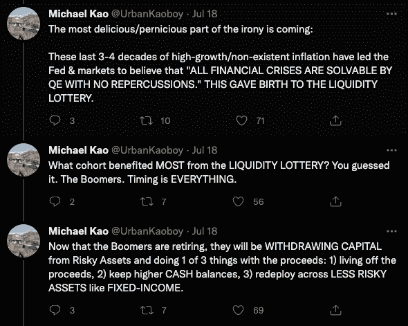
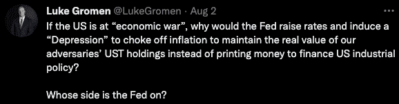
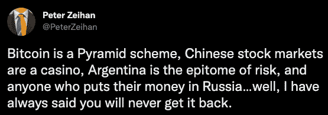

# 彼得·泽汗看好比特币

> 原文：<https://medium.com/coinmonks/peter-zeihans-bullish-case-for-bitcoin-ee5c9082c0b5?source=collection_archive---------13----------------------->

诚然，我对彼得·泽汗情有独钟。他务实，以数据为导向，说着我非常习惯的爱荷华方言。他最新著作 [*世界末日只是开始*](https://www.amazon.com/End-World-Just-Beginning-Globalization/dp/006323047X) *，*的前提是，我们目前正在经历二战后美国主导的世界秩序的终结。这个前提得到了三个 d 的支持。人口统计、债务和去全球化。在本文中，我们将简要探讨这些因素中的每一个，它们是如何相互关联的，以及为什么我认为 Zeihan 最终会改变对比特币的态度。

# 人口统计数据

经济学家的一致观点是，人口老龄化是一种通缩力量。然而，最近这一共识受到了质疑。

二战后的婴儿潮是一个近乎全球性的现象。在过去 40 年的大部分时间里，进入成年的这一代人带来了消费主导型经济增长(GDP 增长)的飙升。最近，这种经济增长的很大一部分是由大多数人认为不可持续的巨额债务支撑的。(我们将在下一节更深入地探讨债务。)

对债务和人口统计如何共同作用的普遍共识如下:

一旦大部分人口进入老年，消费的商品和服务就会减少。商品和服务消费减少导致 GDP 下降。GDP 下降和高负债水平导致通货紧缩。

根据 Zeihan 的说法，欧洲和东亚的大部分地区已经达到并跨越了终端人口临界点。几乎在所有发达国家，二战后出生的一代人都选择不生足够多的孩子。随着“繁荣一代”步入退休年龄，没有足够的年轻工人来替代他们……重申一下，缺乏年轻工人=缺乏消费，而缺乏消费=通货紧缩。不幸的是，随着消费物价指数达到 40 年来的最高点，我们意识到，事情没那么简单。

过去，通胀是由消费主导的。今天，通货膨胀是由货币扩张或货币贬值导致的。如今，各国政府觉得有义务让本国货币贬值，以偿还过去的债务。货币供应量的增加意味着每单位货币比以前贬值了(你正在失去购买力)。

货币贬值，加上对劳动力的高需求，再加上劳动力供应的下降，导致所有工人的工资上涨。工资上涨通常会以商品和服务价格上涨的形式传递给消费者。

高盛(Goldman Sachs)大宗商品交易员迈克尔·高(Michael Kao)的观点非常微妙。Kao 基于 Joe seph Wang[的论文](https://twitter.com/FedGuy12/status/1549051802389454848)认为劳动力下降将导致长期通胀。Zeihan 还从中国劳动力的竞争力或缺乏竞争力的角度讨论了这一现象。中国劳动力不再廉价。

Kao 认为，20 世纪 90 年代劳动力供应的大量增加(东欧和中国)，加上婴儿潮一代进入消费高峰期，给了美国“两全其美”的强劲经济增长，这种增长是由廉价流动性推动的(QE)，以及由于廉价外国劳动力而处于历史低位的通胀。

廉价劳动力=低通胀。20 世纪 90 年代的大量廉价劳动力不复存在。

在高看来，我们正在进入一个“长期滞胀”的环境:婴儿潮一代消费低迷导致的增长停滞+劳动力短缺和资本稀缺推动的通胀。

资本稀缺是泽汗新书的另一个主要经济主题。没有廉价和充足的资本，许多公司和技术将得不到资金。一个资本匮乏的世界尤其会影响到那些努力争取外国直接投资的发展中国家。

作为全球[总财富](https://www.self.inc/info/generational-wealth-gap/)的最大持有者，我经常想知道……婴儿潮一代在未来几年将如何配置资本？

剖析上面高的思路，婴儿潮一代似乎处境艰难。

由于劳动力成本增加和缺乏能源生产能力投资导致的持续通货膨胀，他们的选择似乎有限。

1.  靠收益生活——非常简单。(食物、住所、公用设施等。)所有这些都变得越来越贵。
2.  持有快速贬值的法定货币。
3.  重新配置到风险较低的资产，如固定收益(债务)，其中大多数实际收益率为负。

每年退休人员将花掉他们的本金，同时他们的本金被印钞机虚增(贬值)。

在不久的将来，有多少退休人员将与他们的千禧一代子女生活在一起？

这就把我们带到了第二个问题…

# 债务

在当前以债务为基础的法定货币体系中，债务通常被视为资产，而非负债。在过去 40 年里，低利率和量化宽松政策的结合导致了大规模全球债务泡沫的产生。根据格雷格·福斯(Greg Foss)的说法，“全球债务是全球 GDP 的 4 倍”，其中很大一部分是主权债务。(见下图)

此外，Foss 指出，“如果[全球]平均利率为 3%，那么全球 GDP 需要以每年 12%的速度增长，才能跟上债务的有机增长。”随着欧洲爆发冲突和中国关闭 C-19，最近[国际货币基金组织](https://www.imf.org/en/Publications/WEO/Issues/2022/04/19/world-economic-outlook-april-2022)将其 2022 年全球增长预期下调至 3.6%。Foss 认为，由于各国无法通过增加消费来摆脱债务，唯一的出路就是货币持续贬值。用他的话来说，“在这个等式中，货币是一个错误的术语……”偿还过去债务的唯一方法是今天让货币贬值，未来让货币越来越贬值。

经济学家[卢克·格罗曼](https://twitter.com/LukeGromen)对财政上的利害关系有着清晰的认识。他断言，美国纠正其主权债务危机并进入长期紧缩的可能性微乎其微。这样做会导致美国政府 1。拖欠债务或 2。违背对福利项目的承诺。

从货币方面来看，美元走强正在将拥有美元互换额度的盟国的经济推向边缘。美联储对美元的武器化让我们最亲密的两个盟友日本和欧盟极其痛苦。在这个[片段](https://youtu.be/Ac0BOavsWaY)中，Zeihan 自己预测了欧元的最终灭亡，可以说欧元是世界上第二或第三重要的货币。(要预览一个崩溃的货币/货币体系会是什么样子，请看[斯里兰卡](https://theconversation.com/how-did-sri-lanka-run-out-of-money-5-graphs-that-explain-its-economic-crisis-187352)、[黎巴嫩](https://www.reuters.com/markets/rates-bonds/lebanons-financial-crisis-how-it-happened-2022-01-23/)和[土耳其](https://www.reuters.com/markets/europe/turkey-caught-spiral-lira-crises-2022-06-10/))。

如果我们像泽汗所说的那样，正在进入一个多极世界，为什么不利用我们今天的货币特权来确保我们明天的竞争力呢？

我想知道，在未来十年，还会有多少民族国家失去货币特权？

这个问题把我们带到了最后一个问题…

# 去全球化

“布雷顿森林体系创造了人类历史上最长、最深刻的经济增长和稳定时期……过去几十年不是美国世纪，而是美国的牺牲，这已经结束……人为支撑整个亚洲和欧洲体系的各种结构、战略和经济因素正在终结。”—宰汉

根据 Zeihan 的说法，我们正处于瓦解的早期阶段。在未来几十年，自由贸易、合作和安全将被保护主义、冲突和海盗行为所取代。从[贸易战](https://www.bbc.com/news/business-45899310)、[资产](https://www.france24.com/en/live-news/20220629-allies-freeze-330-bn-of-russian-assets-since-ukraine-invasion-task-force)、[扣押](https://finance.yahoo.com/news/american-companies-could-lose-billions-if-russia-seizes-their-assets-155936278.html)、[代理权](https://www.theguardian.com/world/2022/jul/28/xi-jinping-tells-joe-biden-not-to-play-with-fire-over-taiwan-in-two-hour-call)、[战争](https://www.washingtonpost.com/business/russia-is-right-the-us-is-waging-aproxy-war-in-ukraine/2022/05/10/2c8058a4-d051-11ec-886b-df76183d233f_story.html)到[金砖四国](https://www.globaltimes.cn/page/202207/1270661.shtml?id=12)、[英国退出欧盟](https://www.theweek.co.uk/100284/brexit-timeline-key-dates-in-the-uk-s-break-up-with-the-eu)、[资源掠夺](https://www.dw.com/en/eu-prepares-for-russia-to-cut-off-gas-supply-over-sanctions/a-62493092)……体系的断裂日益明显。

***审时度势&预测未来。***

哪些地区将成为未来的领导者？

Zeihan 根据以下要素评估区域:

1.  人口结构
2.  获得食物
3.  获得自然资源
4.  获得资本
5.  合作领域
6.  贸易路线的安全

***准备成功的区域列表:***

1.  北美+英国+哥伦比亚+(可能)中美洲
2.  斯堪的纳维亚+法国+英国
3.  东南亚(不包括中国)+日本+澳大利亚+新西兰+(可能)韩国
4.  印度+日本对外投资
5.  阿根廷+邻居

***注定失败的地区名单:***

1.  中国
2.  欧洲
3.  非洲(除了少数例外)
4.  中东

# **在一个贸易战、货币贬值、政府资产被没收、军事冲突不断升级的世界里，我们将如何珍惜我们的时间和精力？**这让我们想到了**比特币** …

# ***贼汉&比特币***

Zeihan 仍然认为比特币只不过是一种投机资产。这种资产只有在婴儿潮时期出生的大量资本寻求超额回报的情况下才有意义。他认为，随着婴儿潮时期出生的大量资本枯竭，围绕比特币和其他数字资产的投机热潮也将枯竭。Zeihan 还根据比特币在过去 6-12 个月的下行波动性(高时间偏好)否定了比特币作为价值储存手段的作用。

我认为 Zeihan 错过了什么，他和其他许多人很快就会明白…

*   比特币 2100 万英镑的硬性上限使其成为债券、股票和房地产之外的优质价值储存手段。(低时间偏好)
*   比特币是分散的。它不能被政府/国家行为者操纵、贬低或没收。
*   比特币是有史以来最难发明的货币。硬钱让战争/冲突变得昂贵。比特币=和平。
*   比特币矿工将保护我们的能源网。能量=生命。
*   比特币矿工将推动可再生能源的采用。
*   随着时间的推移，随着越来越多的人使用比特币储存货币能量，比特币的美元价格将变得不那么波动。
*   比特币将缩小全球债务泡沫，成为通向另一种/更优越的货币体系的桥梁。

透过金钱的镜头来想象宰汉的“世界末日”过渡期，给我留下了许多未解之谜…

1.  全球有多少公民的货币会大幅贬值或彻底毁灭？
2.  在人口结构终结的社会中，应享权益/养老金将如何筹资？
3.  有多少难民能够带走他们的资产？(房地产，黄金，比特币)
4.  一个金钱和国家分离的世界会是什么样子？

下次见…保持好奇。

> 交易新手？尝试[加密交易机器人](/coinmonks/crypto-trading-bot-c2ffce8acb2a)或[复制交易](/coinmonks/top-10-crypto-copy-trading-platforms-for-beginners-d0c37c7d698c)