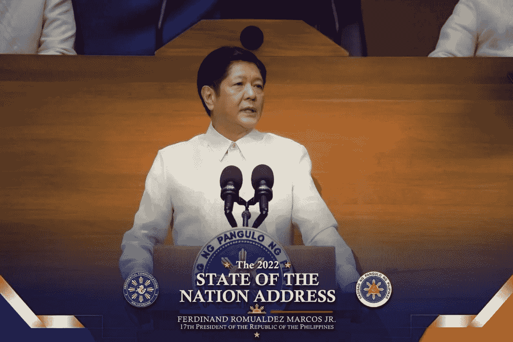

# 菲律宾总统小马科斯推动对数字服务征税

> 原文：<https://medium.com/coinmonks/philippine-president-marcos-jr-pushes-tax-on-digital-services-e1c2b7b1067?source=collection_archive---------66----------------------->

菲律宾总统小邦邦·马科斯(Bongbong Marcos Jr .)在他的首份国情咨文中，阐述了他的政府未来六年的计划，包括对数字服务提供商征税，其中可能包括加密交换。

上任不到一个月，菲律宾总统小邦邦马科斯(Bongbong Marcos Jr .)周一在国会发表讲话，提出了他的第一个创收提案，以解决该国因应对新冠肺炎疫情而产生的巨额债务。

“我们的税收制度将进行调整，以赶上数字经济的快速发展，包括对数字服务提供商征收增值税，”他说。

点击这里关注我们了解更多故事[。](http://t.me/etellworld)

> 交易新手？试试[密码交易机器人](/coinmonks/crypto-trading-bot-c2ffce8acb2a)或者[复制交易](/coinmonks/top-10-crypto-copy-trading-platforms-for-beginners-d0c37c7d698c)