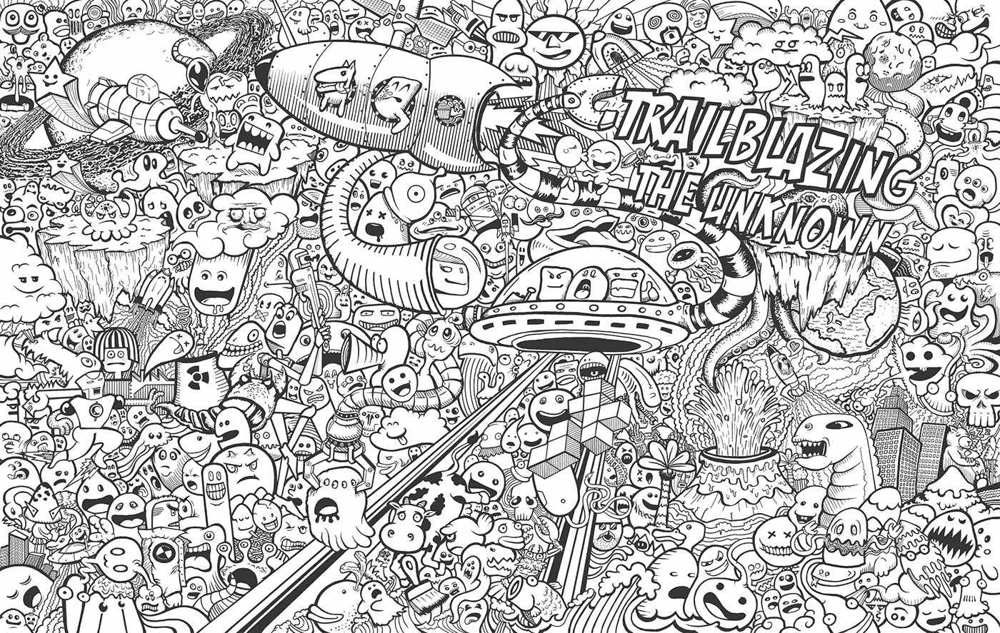
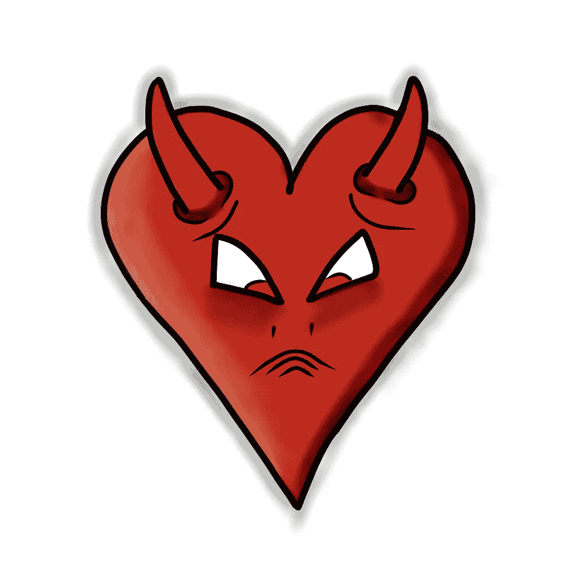
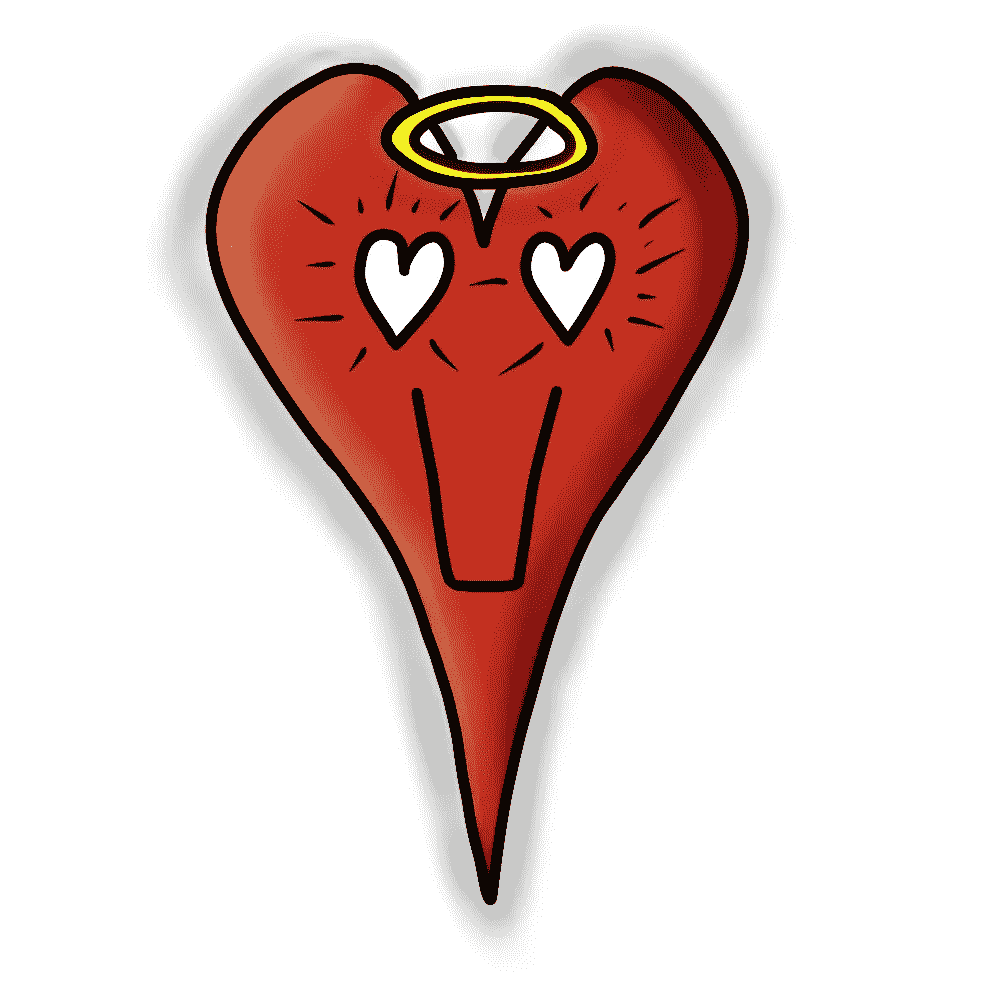
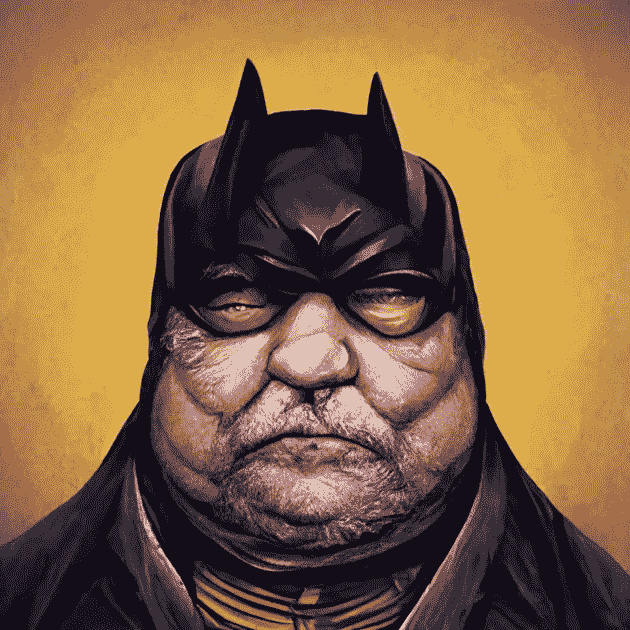

# 哲学 101:最重要的是什么？🧙🏼‍♂️

> 原文：<https://medium.com/coinmonks/philosophy-101-what-is-the-one-1-thing-%EF%B8%8F-b66f4ed8ef94?source=collection_archive---------28----------------------->

# 01

这是**二进制**，所有计算机用来相互交流的语言。

0 表示**关闭**，1 表示**开启**。*是* / *否*，0 是*否*，1 是*是…* 因为+1 是正在采取的动作，开关从下向上翻转，从关到开。

当你有成吨的 01 的 00101100001101011000 时，它开始有一个完整的“代码”序列发生或不发生，是的，它发生了，不，它没有发生。

## 有/没有
宝宝还是没有宝宝

随着我们进入量子领域，仅仅通过我们的思想/意志，将同时存在“那里”或“不在那里”。参见 Shrodingers 猫实验

> 维基百科:[https://en.wikipedia.org/wiki/Schr%C3%B6dinger's_cat](https://en.wikipedia.org/wiki/Schr%C3%B6dinger's_cat)

这是光明和黑暗，阴阳，正面和反面，黑白，毛毛虫蝴蝶，鸡蛋和鸡…

我们是光，穿过我们自己意识的黑暗，随心所欲地看到我们将看到的任何东西。

这已经被科学地记录了，舒曼共振的增加，地球磁极的快速移动，电磁异常的增加，你能想到的…我们从太阳和更大的太阳那里得到了比我们更多的光。

> **作为个体，我们内心都有光明和黑暗(上帝/魔鬼)(善良/邪恶)**↓——看看它们是如何看起来一样的

我们要尽可能地增加光明，从无序中带来有序，从已知到未知，从谎言(想象)的海洋中找到真相。

## 一个“1”是正在采取的行动

脚的摆动，从得到一个约会的一脚踢起…这是已经发生或没有发生的"摆动"…如果它被拿走了…它就不能被拿回来。决定已经做出。

你可以说有一团火，一束光，一种新兴的能量，我们越是向它注入生命，这种能量就越强烈。它变成了永不熄灭的火焰/激情/欲望。使用那团火，把它对准爱、感激、理解、同情、同情…而不是相反的东西，那将是憎恨、悲伤、绝望、贪婪、欲望、批评、判断…

你有疾病，或者你没有… Rh-或 Rh+血统，实干家和不实干家，爱人和恨人。在一个充满仇恨的世界里，做一个爱人。

任何一个有灵性发展的人都可能知道，闪耀更多光芒，成为更多“一”的方式是通过心灵。

随着更多的光在声音、频率、色谱、声谱上显示出来……我们开始看到更多的光，并可能开始扩展我们的意识……谁知道随着地球上和我们身体的光摄入量的增加，还有什么可能呢……

努力让**爱**成为你生活的目标、终点、高潮，你将获得自由，成为光明。

_ _ _ _ _ _ _ _ _ _ _ _ _ _ _ _ _ _ _ _ _ _ _ _ _ _ _ _ _ _
_ _ _ _ _ _ _ _ _ _ _ _ _ _ _ _ _ _ _ _ _ _ _ _ _

**时刻小心！！！⚠️**

*这一点我怎么强调都不为过！保持高度警惕，留意你点击的每一个链接、你做的每一笔交易和你接触的每一个人，因为这个领域骗子很多，即使是最好看的项目也会被撤下。*

点击所有链接之前，仔细检查，确保它们是你正在寻找的官方链接。此外，在给自己或他人发送任何有价值的东西之前，要再三检查所有的钱包地址。

关注我的新营销代理公司**多层次营销**，获取更多未来几年的营销技巧/建议！

> [*推特*](https://www.twitter.com/metadadsxyz)[*不和*](https://discord.gg/mchzhDCwhF)[*YouTube*](https://www.youtube.com/channel/UC7pbtSBs9nRJHK6coMhCR8g)[*抖音*](https://www.tiktok.com/@thedudescrypto)[*insta gram*](https://www.instagram.com/metadadsxyz)[*Spotify 播客*](https://open.spotify.com/episode/5U8vXE9HDAsGbSbebw9p62?si=2rZIigw-Tw2pCxjxmkbYzQ)
> 
> 请将 Polygon Matic 发送到这个 Eth 地址，或 Eth Tokens，以支持我和我不断增长的家庭🙏🏼
> 
> ***0xb 53b 3978333 e 11 c 382 ab 619 f 02 f 469 A8 c 70750 af***
> 
> ***或***
> 
> *从我们的 OpenSea 购买一辆 NFT(报价)更多信息请访问 11 月* [*https://opensea.io/collection/*dudelvillegenesis](https://opensea.io/collection/dudelvillegenesis)

_________________________________________________________________

# 干杯，
Ty

**我的一些其他博文:**
[5 个没落的 Web3](/coinmonks/5-downfalls-of-web3-cd5dc8ade4fd)
[5 + 5 个不和谐的战术](/coinmonks/5-tips-for-a-better-discord-nft-crypto-edition-ff9b039d0359)
[Crypto 101:一个初学者指南](/coinmonks/crypto-101-a-beginners-guide-345d440bd163)
[NFT 最佳实践(营销&社区成长)](/coinmonks/top-5-nft-best-practices-marketing-and-community-growth-7025e26eb50c)
[Web3 基础知识](/coinmonks/web3-basics-252121357f33)
[替代效用案例对于 NFT 的](/coinmonks/alternative-nft-crypto-real-life-use-cases-b7c0b08d99ef)
[什么是营销&为什么](/coinmonks/what-is-marketing-why-everyone-should-be-a-marketer-6173b8dffd61)

> 交易新手？尝试[加密交易机器人](/coinmonks/crypto-trading-bot-c2ffce8acb2a)或[复制交易](/coinmonks/top-10-crypto-copy-trading-platforms-for-beginners-d0c37c7d698c)