# 本周 Bera 最差密码的凤凰！

> 原文：<https://medium.com/coinmonks/phoenix-of-beras-worst-crypto-takes-of-the-week-180891adf1a9?source=collection_archive---------25----------------------->

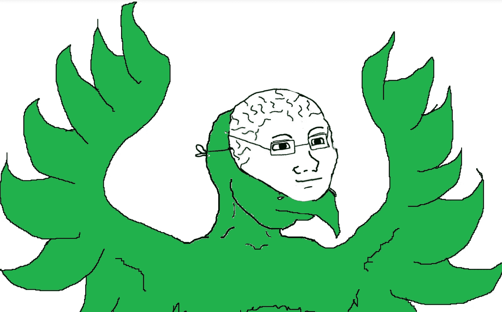

多奇怪的一周啊，对吧，猩猩们？市场像一个该死的混蛋一样踢来踢去，然而我们忍受了审查和 FUD 的水平，这使得任何智商超过 100 的人都考虑打包他们的加密投资组合，打电话给注册经纪人，并购买一系列明智的蓝筹股股息。

*和往常一样，这意味着一系列糟糕的拍摄和 CT 搞笑接踵而至。因此，这里有一堆弱智需要你的胃，包括一个新的每周嘉宾点不是别人，正是灰尘，破旧，潮湿的老恐龙彼得希夫！*

# 第一个错误。凯尔·萨曼尼:被骗对你有好处。

我们知道凯尔·萨曼尼是 Multicoin Capital 的联合创始人和管理合伙人。嗯，也许*你*知道。我们只知道他是一个在 CT 上大声喧哗的人，他用他有钱的事实作为对事情有看法的理由。他也是 Cobie 有史以来最大的烧伤接受者:

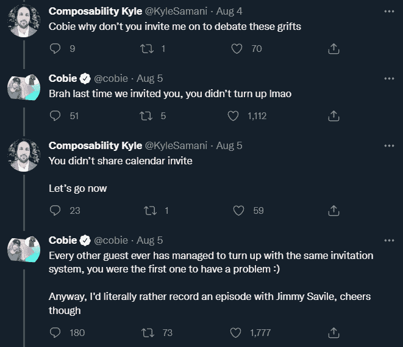

而且，如果有任何一种方法可以证实你没有英国最受诽谤的 nonce 那么受欢迎的说法，那可能就是公开宣扬在骗局中失去所有的钱是一件好事:

为 Samani 说句公道话，我们不反对在少数情况下，根据损失的严重程度，损失金钱可以塑造性格。糟糕的是，萨曼尼是一名风险投资人，他被指控诈骗或与那些让人赔钱的项目有关联。我们没有声称要核实任何事情——不要他妈的起诉我们，凯尔。我们只是觉得这个语境值得我们先**烂拍**。

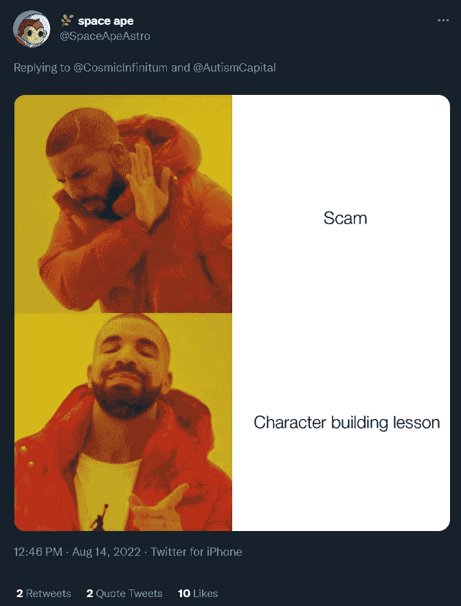

# 第二个错误。总体 CT:如果我们改变我们的 pfp，我们就能改变世界

悲剧上周发生了，当时伯格兰的汉堡批准了 tx 隐私巨头 Tornado Cash，导致数千个钱包被列入黑名单，包括冻结了一船 USDC 的 Circle。这当然激起了一堆 CT 的愤怒，并以热情、无聊的帖子的形式暗示了政治激进主义，用户将他们的 pfp 改成了 Tornado 标志:

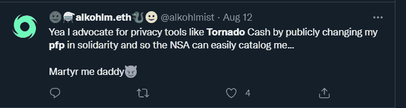

然而，这场运动注定不会像“Je Suis Charlie”或“#MeToo”运动那样成功，因为 CT 仍然有幽默感，它也像一个该死的混蛋一样踢着球:

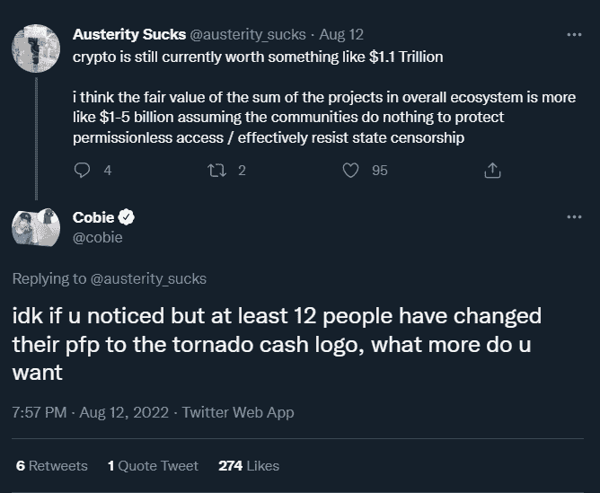

最后，如果我们想看到 DeFi 挺过这一天，我们可能不得不*实际做点什么*。换句话说，我们完蛋了。

# 第三个错误。马丁·斯克雷里:我对我的投资者赔钱感到非常难过，我要起诉你。

对于马丁做了(或没做)什么，我们不会说太多，因为他现在有起诉人的心情。总结一下，他的币$ MSI(Martin shk reli Inu—mmmhhhhhhhm)突然跌了 90%，他将其归咎于一次黑客攻击..所以你只要自己挖掘一下，提出你自己的观点:

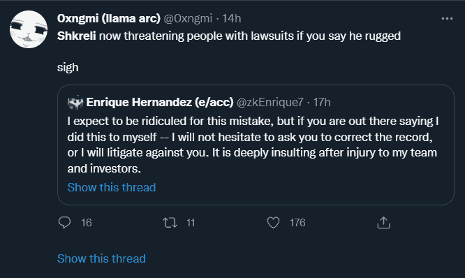

我是说，看起来每个人都想起诉，在这里:

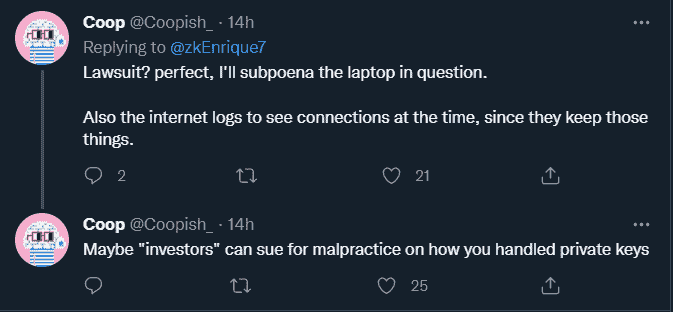

有没有什么关于坐牢的事让人们都很开心？一直雇佣律师起诉每个人似乎有悖于金钱交易的直觉，但这些人知道他们在做什么:

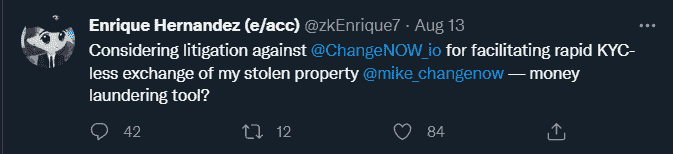

哦，顺便说一句，Shkreli 出于某种原因称自己为“恩里克埃尔南德斯”，也许我们错过了这个笑话。请在评论中告诉我们，因为我们是专业人士，我们希望得到澄清。

# 第四个错误。美国参议院:我们雇佣 87000 套西装扫地

因此，除了“啪啪啪”的龙卷风(而不是坏演员利用它作恶)，伯格兰大厅里的超级大脑还投票部署了一支 87，000 人的西装大军，突袭贫穷的逃税者的文件柜，如果他们不服从，就枪毙他们:

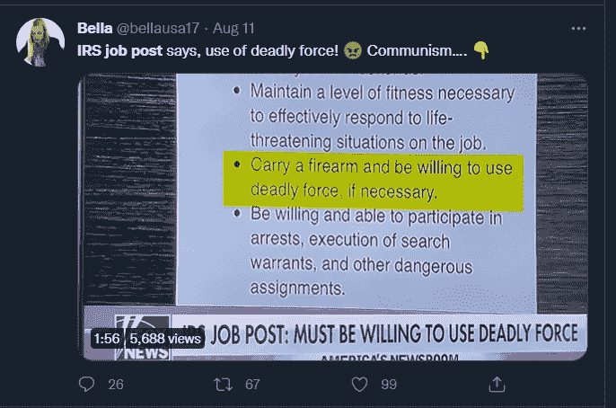

在这里，我们并不完全是政治性的(这取决于那些知道他们在任何特定时刻谈论的 wtf 的人)，就像制作这个的家伙一样:

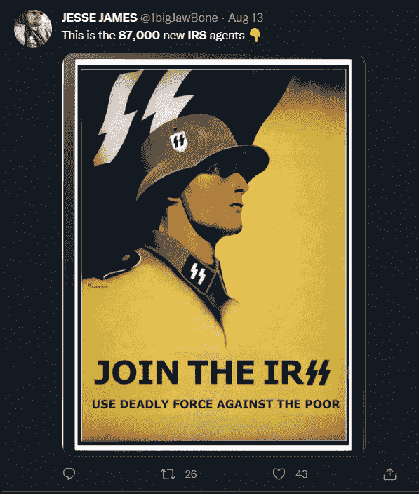

但是，不管一个人有什么样的政治倾向，都很难摆脱这样一种感觉，即帝国中有什么地方出了问题，而且这与底线有关。我们求助于自闭症记者自闭症资本的一篇社论:

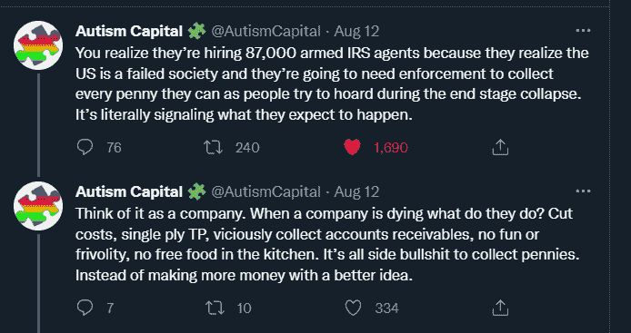

是真的吗？希望不会。他是否患有自闭症，因此可能是对的？是的。

# 第四个错误。每一个缉毒署的协议:我们必须坚持我们的绿帽子追求坚持武断，仓促实施的制裁！

唉，我们不能停止谈论上周的 FUD。这很重要，安侬。

像前面提到的 Circle/USDC 这样的协议，以及包括 AAVE、Uniswap 和 Ren protocol 在内的许多其他协议都被抓了个正着，它们审查了与 Tornado Cash 交互的钱包，并将用户钱包 addy 的发送给了当局。这引发了新一轮关于审查制度的大辩论:

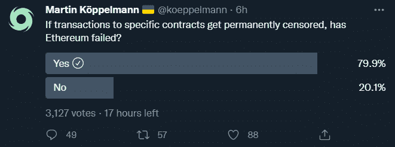

Kudos for having both the Tornado pfp and the Ukrainian flag in your name, ser.

虽然对哲学和法律辩论的剖析很少能达到喜剧的目的，但如果你想在下一次以太坊会议上提出一个自命不凡的观点，这是有启发性的:

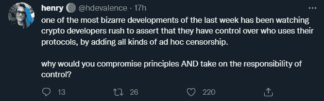

亨利的发型很糟糕，但观点很好。为什么要搬起石头砸自己的脚？亨泰兔子怎么想的？

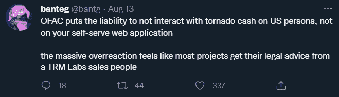

哦。更多的参考协议，让低劣的，吸血的律师狡猾地进入 DeFi 空间，并得到所有诉讼。你呢，pupperino？

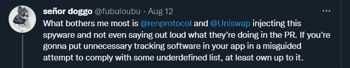

没错。这几乎就像受到攻击和质疑的协议有某种动机突然改变他们对用户的忠诚。我们不得不说，自我保护是一个复杂的漏斗蛋糕。

嗯，真他妈的郁闷。更好地减轻情绪与我们新的每周坏采取不是别人，正是旧的，黄金战斧彼得希夫。

# 彼得·希夫本周说:

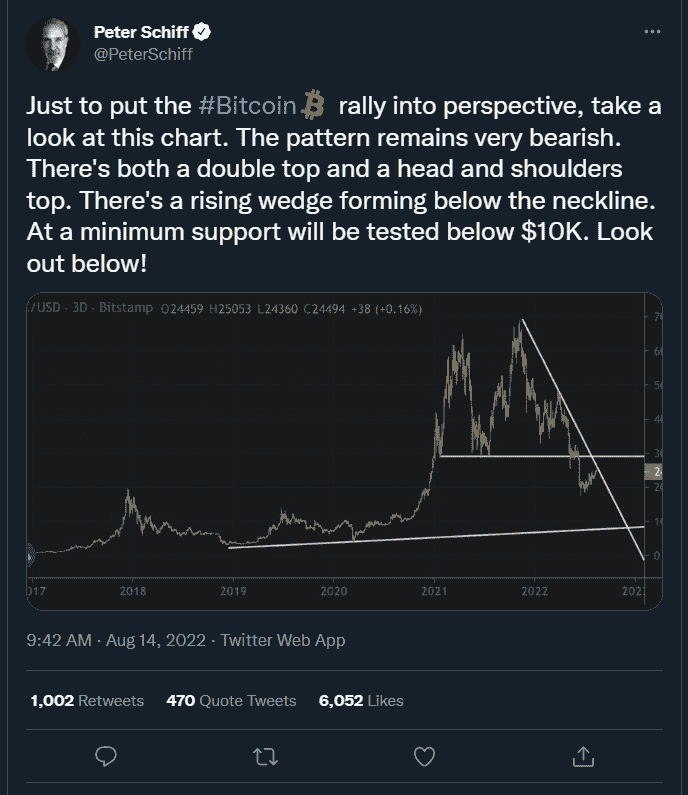

哦，八月战士，

一种真正金属的捍卫者，

你的歌声飘向琥珀色的天空，

你荒谬的梦想就此破灭:

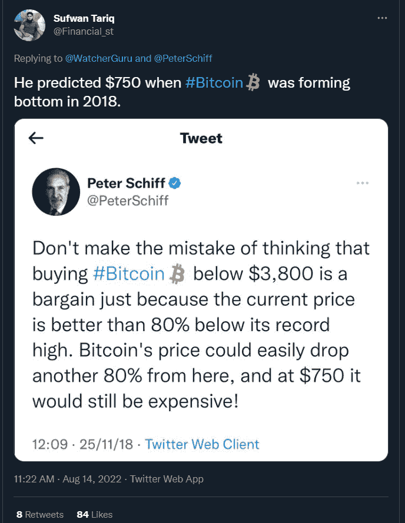

没事的彼得。这次你就对了，文黄金挤到 10000，你终于可以把棒子拔出来了！

感谢阅读，下周见。

> 交易新手？试试[加密交易机器人](/coinmonks/crypto-trading-bot-c2ffce8acb2a)或者[复制交易](/coinmonks/top-10-crypto-copy-trading-platforms-for-beginners-d0c37c7d698c)