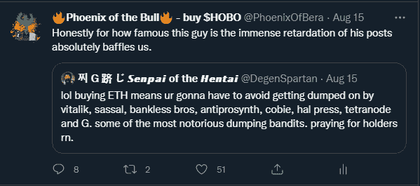

# 本周 Bera 最差密码的凤凰！(8 月 15 日至 22 日)

> 原文：<https://medium.com/coinmonks/phoenix-of-beras-worst-crypto-takes-of-the-week-august-15-22-966ba35856ad?source=collection_archive---------24----------------------->

我们错了，好吗？我们认为过去的几周将被“叉子战争”所主导，这是一场结束 posETH 和 powETH 之间所有秘密冲突的秘密冲突。相反，我们看到这种叙事退居“审查弧”之后，美国最终在实施肆意制裁方面取得了成功。这导致许多协议纷纷效仿并退出 dankly。

*幸运的是，尽管存在恐惧和迫在眉睫的贫困，但它也滋生了一些值得嘲笑和嘲笑的坏现象。每个人都在互相扔石头和大便，我们为什么要有所不同呢？只有当食物大战结束时，我们才会清扫地板上的残羹剩饭，蹒跚地一起做我们的临时玉米沙拉，上面全是灰尘和头发。*

# 最差选择 1。费协议的治理掉头

当我们冒险时，我们最喜欢的硬币之一是 FXS 美元，由萨姆·卡泽米安先生，又名。“那个对$FRAX 喋喋不休的家伙”。我们早期最美好的回忆是山姆对龙虾的沉默，因为他的身体似乎不能不先令他的稳定硬币，FRAX。尽管如此，在社区成员的多次嘲笑和没完没了的取笑之后，萨姆回来了，让他的协议来说话。建筑商注意:向山姆学习。他很艰难地学会了，所以你不用学了。

Go dig on [LobsterDAO](https://t.me/lobsters_chat) for more fun.

总之，萨姆现在是太空中的大混蛋，他很生气。似乎费(与 4 月份的 Fuse hack 有直接联系)在 DAO 投票上做了 180 度大转弯，以补偿黑客的受害者。呜。在这里阅读山姆的帖子。

看起来 Frax，连同许多其他的 whale 和 smol，将会损失大量的赔偿，这很少是一件好事。用户@sh4dowlegend 在这里很好地充实了情况[。](https://twitter.com/sh4dowlegend/status/1560928111411208192?s=20&t=nETAr0IEScbLTTsj31OiHA)

总而言之，这绝对是游乐场逻辑应该适用的情况之一，又名。“不准偷懒”。

# 最差选择 2。加里·詹斯勒(Gary Gensler)让婴儿潮一代相信，将过时的法规应用于尖端技术是有意义的

我们相信生活中的两件事:

1.人们应该为新闻付费。记者们努力工作，将自己置于身体和职业的危险之中，这样我们就可以了解到我们周围正在发生的事情。
2。华尔街日报是个垃圾，你永远不应该用你在地铁厕所里捡到的一分钱来买它。

因此，我们将公开承认我们没有阅读[这篇文章](https://www.wsj.com/articles/the-sec-treats-crypto-like-the-rest-of-the-capital-markets-disclosure-compliance-security-investment-mutual-fund-protections-blockfi-bankruptcy-bitcoin-11660937246)。幸运的是，Twitter 上还有其他人阅读了这篇文章，所以他们可以为我们提供意见。底线是，当 Gensler 说加密应该像其他资产一样受到监管时，他是在口头上呼吁那些对加密了解不够的人相信他。现在，在我们看来，福克斯新闻频道就像一坨屎，但是这里的是 Ripple 律师约翰·迪顿对 Gensler 的反驳。底线:美国证券交易委员会应该离开加密。

All fear the #xrpcommunity.

现在，ofc，这些镜头中的大部分都是瑞波军队的士兵，所以我们就直接跳到我们喜欢的那一点:

从禁止比特币现货 ETF，到入侵 Uniswap 实验室，以及将海登亚当斯(Hayden Adams)同化为 borgicorn，美国证券交易委员会(SEC)长期以来一直是一个似乎在压制的同时发出美德信号的机构。做得更好，SEC。自我教育。

# 最差选择 3。“德根·斯巴达和其他人一样，在以太坊去中心化问题上犯了同样的错误,”巴尼回应道

上周，我们被烟熏了。

我们追随德根斯巴达，从一开始就如此，并将永远尊重斯巴达人的统治力、进取心和恒心。尽管如此，我们不能否认他的一些镜头是培养皿中的大脑。奇怪的是，这实际上让他变得更酷，因为左脑可以获得如此大的影响力和资本，这对这个领域的大多数猿类来说是个好兆头。我们犯了什么罪？

我们称他的表演为弱智。这当然唤醒了他的崇拜，并让狗跑去找肉。我们不想成为“回复者”，也不想冒犯真正的 OG。但是当我们被遗忘的时候？

你最好知道我们会敲碎他们的手指。所以是这样的:

这是一大串谈话。许多许多怀疑 ETH 的猿类正在利用验证器份额向 Lido 优势倾斜的事实作为集中化的证据。看一看这些数字，肯定会让人觉得是这样的。这就是为什么我们感谢亨泰兔，Banteg，在附近放大一点点。如果猿花时间，它们甚至会在大脑中产生皱纹:

因此，如前所述，查看顶部指标，您会发现橙色的 Lido 确实在以太坊验证器中占有相当大的份额。然而，看看下面，丽都包含了什么，画面会变得更加清晰。一个人所要做的就是看，他们可以减轻他们的迟钝。

谢谢你，兔子。

# 最差选择 4。$JPM 的杰米·戴蒙对比特币的供应提出了弱智的质疑

婴儿潮一代有一个平台。婴儿潮一代不明白代码是如何工作的。婴儿潮一代在 FUD 有既得利益。这是一个古老的故事。

I am always skeptical of things I deliberately avoid learning about.

对于那些不知道的人来说，杰米·戴蒙是摩根大通的首席执行官兼董事长。这意味着，尽管现在采用加密是肯定的，但他仍然是一只恐龙，不知道自己在说什么。

在这种情况下，他是在开玩笑，基本上是在说“你们知道，当我不花五分钟的时间去学习一些东西时，我总是很怀疑这样的东西”。好吧，兄弟。你所要做的就是阅读，但没关系，享受做亿万富翁的乐趣:

# 最差选择 5。Joseph.eth 做了一些奇怪的不合理的推论

好吧，你有。以你的名义。你需要写一个线程，一般来说，那些让你兴奋的线程是最受关注的。为什么不对某事产生怀疑呢？杰米·戴蒙成功了！这是这样的:

好吧，还不错，这是一个很好的线程开始推文。德隆是以太坊的核心开发者，所以他知道发生了什么。你会认为这是以太坊协议和验证器出错的地方，对吗？没有。这条线索更侧重于美国监管机构及其审查制度的任意应用。这将是一个很好的观点，如果这是该线程的目的。

His beret bequeaths timeless wisdom.

这是一个经典的案例，写一个帖子太快了，以至于你忘记检查你的观点是否与你最初的信念相符。这叫连续性，如果你想提出一个像样的观点，这很重要。我是说，得了吧，德隆，你用过脑子吗？你聪明吗？我是说你有。以你的名义，爵士。这是心理战吗？

# 最差选择 6。OFAC·盖斯。

我们永远不会理解闪光机器人。MEV 是为那些能够像阅读儿童书籍一样阅读 etherscan 的人准备的，尽管去年《伊甸园协议》问世时，我们曾想过这个概念，但在我们能够完全掌握所有知识之前，这个故事就销声匿迹了。

尽管如此，flashbots 一直是我们和许多其他人学习的基石，因为它们往往与该领域最大的发展密切相关。这就是为什么我们失望地发现，他们(可能)正在为这个空间中新的和日益增长的审查节做贡献。

Hentai Bunny vs. Evil Morty would be a banger of an episode, ngl.

似乎与 flashbots 的互动让用户了解了交易跟踪和一系列其他技术内容，也许你能比我们更好地利用它们(不是财务建议)。

We wish we knew what all of this meant.

盐是真实的，但我们记得 flashbots 一直是飓风生活的地方，因为技术辩论在太空中。我们致力于更好地尝试和理解它，但希望照亮讨论至少给你机会为一些新的和可怕的事情感到紧张。

Again. When we learn what this stuff is, we will get back to you.

都很吓人。尽管我们密切关注并尊重哈苏的所作所为，但看起来他的自闭症倾向于“符合逻辑的”而不是“最好的”。看看他最近对一些加拿大密码市场的疯狂限制就很有启发性:

我们尊重你，哈苏，我们只是不知道是否可以信任你…

# 结论

这些文章无意冒犯。几乎每一个我们关注的人物都是虚构的，有着巨大的大脑，并且比我们做得更好。但这并不意味着我们不能筛选粪便，找到小粪便闻闻。如果我们像鲸鱼说的那样孤独，那么我们还应该做些什么呢？工作？建筑？渴望$绳？不，我们会留在这里，所以下周请注意我们，届时我们将有一群其他备受尊敬的邪教领袖和我们一起被拖垮。

感谢阅读。

> 交易新手？试试[加密交易机器人](/coinmonks/crypto-trading-bot-c2ffce8acb2a)或者[复制交易](/coinmonks/top-10-crypto-copy-trading-platforms-for-beginners-d0c37c7d698c)