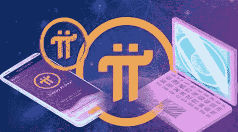
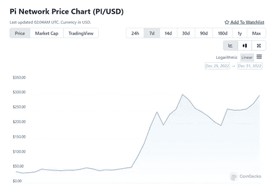
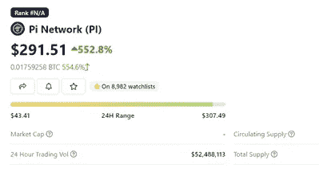
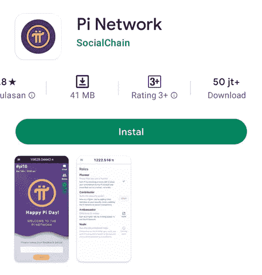

# 火币上市后圆周率飙升

> 原文：<https://medium.com/coinmonks/pi-coin-price-pumped-high-after-listing-on-huobi-4b825118a70e?source=collection_archive---------27----------------------->

今年 2022 年在加密货币方面可能会有很多令人惊讶的事情，从由于 Terra Luna 案件导致的比特币价格下跌，Solana 黑客，Harmony 黑客，到 FTX 交易所的破产。不过，还有一件事比较让人意外，就是 PI 网络上市。

PI 网络是一种可以通过移动设备/智能手机挖掘的数字货币。用户可以通过推荐系统获得圆周率币，并获得圆周率币奖励。Pi network 于 2019 年由 3 名斯坦福学生 Vince McPhillip、Chengdiao Fan 和 Nicolas Kokkalis 创立。

> 交易新手？在[最佳密码交易所](/coinmonks/crypto-exchange-dd2f9d6f3769)上尝试[密码交易机器人](/coinmonks/crypto-trading-bot-c2ffce8acb2a)或[复制交易](/coinmonks/top-10-crypto-copy-trading-platforms-for-beginners-d0c37c7d698c)

## 在多个交易所上市

从 2019 年开始等待，圆周率网现在正式在几个交易所交易，分别是**火币和 XT.com**。硬币发行后的几天内，圆周率的价格大幅飙升。已经飙升的圆周率价格的上涨，似乎给了加密货币投资者希望。

[Pi Network Price in USD: PI Live Price Chart & News | CoinGecko](https://www.coingecko.com/en/coins/pi-network)

## 如何获得圆周率硬币

1.  **可通过智能手机**挖掘圆周率币。通过在 playstore 中安装 pi 网络应用程序。通过观看广告挖掘的用户随后将获得 pi 币奖励。
2.  **带有转诊程序**。邀请朋友或个人使用一个特殊的用户代码也能以 pi 币的形式提供激励。

## 剖析 Pi 网络的可能市值。

[Pi Network Price in USD: PI Live Price Chart & News | CoinGecko](https://www.coingecko.com/en/coins/pi-network)

目前圆周率币仍未公布其代币的最大供应量。所以我们假设。根据我对几位圆周率硬币矿工的研究，自从他们在 2019 年采矿以来，他们至少能够获得 1000-5000 个圆周率硬币。我们将取最低值的 1000 个圆周率硬币，每个圆周率硬币的价格水平为 200 美元。**因此，每个人拥有大约 20 万美元的资产。**

同时，**使用 pi 网络应用的用户数量为 5 千万用户**。将资产数量乘以每个用户可以获得的总资产，**总的可能市值可以达到 10 万亿美元左右。市值的数量非常惊人**

圆周率硬币会在今年晚些时候成为隐藏的宝石并给加密货币市场带来兴奋吗？？谁知道呢？？NFA(不是财务建议)的家伙