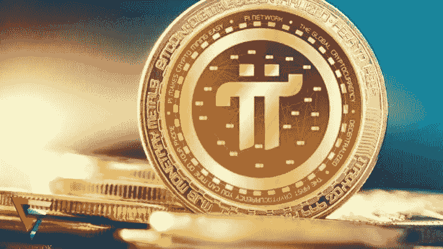
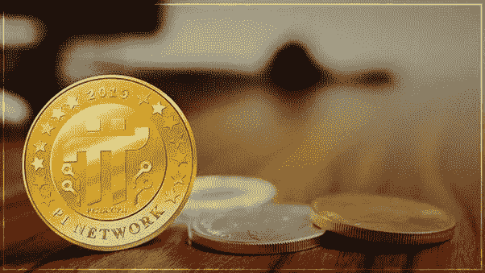
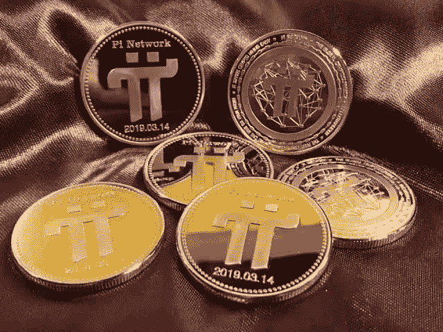
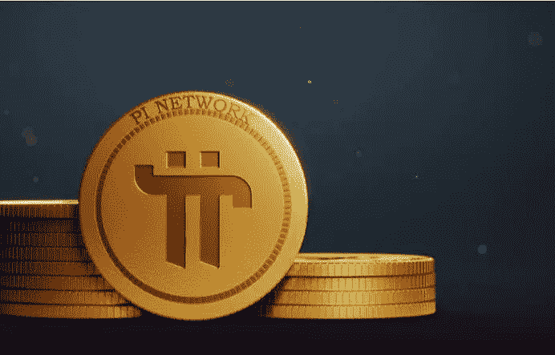

# Pi 加密货币:Pi 加密货币合法吗？

> 原文：<https://medium.com/coinmonks/pi-cryptocurrency-is-pi-cryptocurrency-legit-73fead7cb736?source=collection_archive---------2----------------------->

Is Pi Cryptocurrency Legist?

互联网上关于圆周率加密货币有很多议论，虽然很多人专注于挖掘圆周率硬币，但一些个人仍然怀疑所谓的加密货币。

2018 年，斯坦福大学的一个团队创建了 Pi Networks，它被用作第三方应用程序，用户可以挖掘 Pi 硬币，并与网络上的其他矿工(先驱)交易商品和服务。

被称为“先锋”的网络或社区已经从最初的 10 万用户增长到 230 多个国家或地区的 3500 多万用户。2022 年 6 月，在通过 KYC 采用 Pi 网络后，许多先驱迁移到 Pi mainnet。

这让很多人怀疑圆周率硬币是否合法。但是，在本文中，我们将查看 Pi 加密货币的概述以及它是否是 Legist。

**亦读:** [*获得 2 美元的即时马拉空投！*](https://link.medium.com/C6inFqqZ1sb)

# 什么是 Pi 加密货币？

Pi Cryptocurrency

Pi [加密货币](https://link.medium.com/6U4lhaBZ1sb)由斯坦福大学的 Nicolas Kokkalis 和 Chengdiao Fan 于 2018 年推出。圆周率团队以一种任何人都可以通过连接到互联网的移动设备挖掘圆周率硬币的方式建立了这家初创公司。

Android 和 iOS 智能手机都支持 Pi 移动应用程序的安装。用户可以在安装和配置该程序后，在智能手机上快速开始挖掘圆周率硬币。

Pi 网络的用户被称为先锋。自成立以来，Pi 网络获得了相当大的社交媒体关注，参与人数显著增加，截至 2022 年，估计有 3300 万成员。

在圆周率网络上，任何人都可以用自己的电脑成为一个节点，将用户推荐到圆周率手机 app 上挖掘圆周率加密货币，并获得奖励(圆周率币)。

Stellar Consensus 协议是 Pi 节点(SCP)使用的算法的基础。分布式分类账的 Pi 节点验证交易，并根据[Capital.com](https://capital.com/pi-network-pi-coin-price-prediction-2021-2025)就记录新交易的顺序达成一致。

该应用程序现在充当加密货币钱包，个人可以在其中交易圆周率硬币。该应用程序要求用户链接他们的脸书账户和电话号码，因为该应用程序作为官方钱包来存储圆周率硬币

2020 年 5 月，该应用程序开始播放广告，作为初创公司的资金来源。在比特币的情况下，每四(4)年减半，Pi 加密货币减半。当完成一个特定的里程碑时，减半发生。

这是为了稀缺性维持圆周率币的网络。当 PI 达到 10 万用户时，它的挖掘速率从每小时 1.6π下降到 0.8π，然后再次下降到 0.4π，然后在达到 100 万用户时再次下降到每小时 0.2π。当网络达到 10 亿用户时，它将继续减少一半，直到根据 [Picore 团队](https://twitter.com/PiCoreTeam/status/1336727117967417344?t=7hM31d0Mpq9TRxm1a9TP6Q&s=19)的说法为零。

# Pi 加密货币是如何工作的

How Does Pi Cryptocurrency Work?

Pi 加密货币的工作方式类似于多层次营销(MLM)。你要做的就是下载 app(安卓和 iOS 都有)。该软件将需要一个推荐代码和安装后的一些个人信息(姓名，电子邮件，电话号码)。

这个软件非常容易使用和理解。只需每 24 小时点击一次“赚取 Pi”按钮即可。根据您的状态，应用程序将自动添加适当数量的 Pi 硬币到您的帐户。即使你关掉手机和网络，这种情况还是会发生。

一旦你加入 Pi 网络并开始采矿，你就开始成为一名先锋。当你提升三个会员等级时，你每小时的圆周率也会上升。

随着时间的推移，当你宣布五个或更多值得信赖的关系时，你将被提升为贡献者。如果至少有 23 名先锋使用你的推荐代码注册了你的网络，你就成为了大使。

**也来看看:** [*投资加密货币要避免的 4 大错误*](/coinmonks/the-4-worst-mistakes-to-avoid-when-investing-in-cryptocurrency-fc70eb6fd3cc)

# 如何卖圆周率币

How To Sell Pi Cryptocurrency

Pi 团队推出了 Pi Coin 的 mainnet，个人可以通过在应用程序上完成验证过程“KYC ”,从 testnet 迁移到 mainnet。该团队让 KYC 对开拓者来说非常重要，因为这也将增加应用程序和机器自动化的可用性。

还部署了 Pi explorer，这使得先驱们能够看到交易历史，比如发送者和接收者。应用程序已更新，因此用户在收到圆周率硬币时会得到通知。

3 月 14 日，Pi 团队宣布了一项更新，完成 KYC 并将 Pi coin 从 Testnet 迁移到 Mainnet 区块链的用户可以在 Pi coin 应用程序上购买商品或服务。

经过验证的先锋还可以将 mainnet Pi 加密货币作为 P2P(先锋对先锋)转移给其他经过验证的先锋。一些人现在在社交媒体“脸书”上购买圆周率硬币，因为他们被称为“圆周率小贩”。

开拓者也可以锁定圆周率硬币一段时间，以获得更高的采矿率。然而，这是为那些喜欢每 24 小时赌一次圆周率硬币以获得最大收益或开矿率的人准备的。

# Pi 加密货币价值

圆周率加密货币尚未在区块链全面上线，这意味着用户无法在任何加密货币交易所购买圆周率硬币。那些挖掘圆周率硬币的人将能够在区块链最终发布时交换他们挖掘的硬币。

据该小组称，mainnet 减少了挖掘圆周率硬币的假账户。当硬币在区块链推出时，每个经过验证的先锋都可以将他们的圆周率硬币兑换成其他加密货币或法定货币。

Pi 的加密货币价值之前被加密货币统计源“CoinMarketCap”列为 0.007077 美元。据 capital.com 称，到 2022 年 8 月 31 日。然而，在撰写本文时， [coinmarketcap](https://coinmarketcap.com/currencies/pinetwork) 上的硬币价格不可用。

这些纯粹是推测性的说法，Pi 网络的真正价值只有在它在交易所上市并恢复交易后才会显现。实际数字可能与这些假设大相径庭。

# Pi 对尼日利亚奈拉的加密货币价值

很多人想知道 Pi 硬币对尼日利亚奈拉的价值。因此，这种硬币还没有在区块链上流通或交易，但是尼日利亚的许多商贩，也就是所谓的“圆周率商贩”，现在都在购买圆周率硬币，期待着它的上市，而在撰写本文时，这种情况还不为人知。

目前，所有购买硬币的卖家都有自己的具体价格，但公众并不知道。只有卖家在出售他们的圆周率硬币时，才能向卖家透露。

# Pi 加密货币合法吗？

Is Pi Cryptocurrency Legist?

许多用户或先驱仍然对所谓的加密货币持怀疑态度，因为它花了很长时间来建立它的 mainnet，它并没有完全在区块链上运行，而且硬币在加密货币交易平台上的上市时间比预期的要长。

由于 Pi 网络尚未发布，围绕它存在不确定性。加密货币是非常不稳定的投资。虽然该项目的创造者声称网络是安全的，但一些人认为这可能是一个金字塔计划。

正如 Pi 加密团队所显示的那样，最近的事件显示情况并非如此。自从 mainnet 推出以来，用户已经可以花他们的圆周率硬币了，而且有传言说一些在线市场现在接受它们作为支付方式。

为了对项目的安全性提出意见，你应该进行研究。

*加入密码电报群(* [*点击这里！*](https://t.me/cryptoportalTG) *)*

# 结论

然而，圆周率硬币，因为它被称为尚未存在于任何区块链，而很多人得到了错误的概念，圆周率作为一个硬币，这是很难消除空气，因为很多用户认为它已经区块链建成。

*本文仅传递信息，不视为投资建议。*

> 交易新手？试试[加密交易机器人](/coinmonks/crypto-trading-bot-c2ffce8acb2a)或者[复制交易](/coinmonks/top-10-crypto-copy-trading-platforms-for-beginners-d0c37c7d698c)