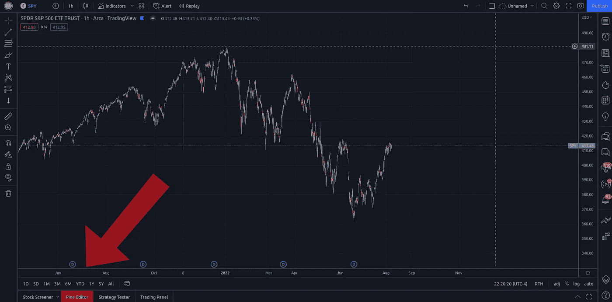
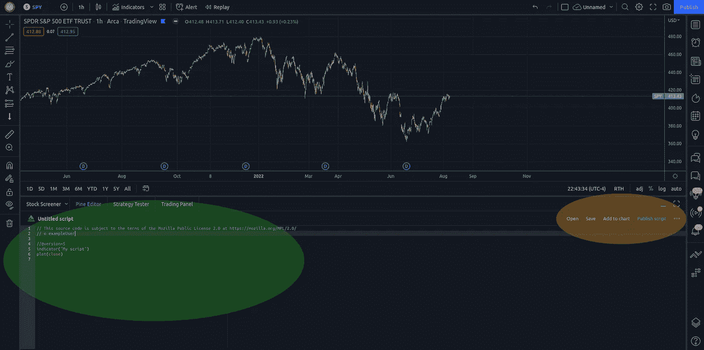

# 松树脚本:基础

> 原文：<https://medium.com/coinmonks/pine-script-the-basics-6ec4eca1da61?source=collection_archive---------5----------------------->

本文将向您介绍用于 TradingView 平台的 Pine 脚本编程语言的基础知识。如果你喜欢这篇文章，请在未来关注我更多的松树脚本文章。

让我们开始吧。

我们将关注 Pine Script v5，因为它是该语言的最新版本。

这里有几个链接可以帮助你:

**Pine Script 用户手册**

 [## 欢迎使用 Pine Script v5-Pine Script V5 用户手册 V5 文档

### Pine Script 是 TradingView 的编程语言。它允许交易者创建自己的交易工具，并在…

www.tradingview.com](https://www.tradingview.com/pine-script-docs/en/v5/Introduction.html) 

这是一本作为技术手册的手册，讲述了这种语言是如何工作的，以及这种语言包含了哪些特性。它将帮助你理解语言是如何工作的，这将帮助你在编写代码时理解你所写的内容。

**PineScript 参考手册(文档)**

 [## Pine Script 语言参考手册

### 编辑描述

www.tradingview.com](https://www.tradingview.com/pine-script-reference/v5/) 

Pine Script Language Reference Manual 提供了 Pine Script Language 所有可能组件的字典，以及每个组件是如何具体实现的。它列出了每一个内置函数、变量、操作符，以及编写代码时可以使用的任何东西。

简单来说:

> 用户手册就像一本关于语言的教科书
> 
> 参考手册就像一本字典

我将向您提供的大部分信息(如果不是全部的话)可以在 Pine Script 用户手册和语言参考手册中找到，而且格式可能更好。然而，我理解想要向一个人学习而不是阅读手册，所以让我们继续。

**松木编辑**

您可以将代码直接写入或复制到 TradingView 平台上的代码编辑器(称为 Pine 编辑器)或您喜欢的任何文本编辑器中。最终你的代码将不得不直接在平台上使用。

要使用 Pine 编辑器，从任何 TradingView 图表中点击位于窗口底部的“Pine 编辑器”选项卡，如下图所示。我用红色突出了它。

如果您选择使用另一个文本编辑器，您仍然需要最终将您的代码输入到 Pine 编辑器中，以便将其保存到 TradingView 平台。

The Pine Editor Tab is located Here

单击该选项卡后，您应该会看到类似这样的内容:

Important areas of the Pine Editor are highlighted

绿色圆圈区域是您输入代码的地方。如您所见，打开编辑器时会自动提供一个默认模板。

黄色区域是一些有用功能的菜单，您可以在其中保存您的工作，打开您最近处理的指标等…

**第一个指示灯:逐行显示**

Ignore the .py file extension shown in the footer. That is only to show some syntax highlighting (colored text) on Medium and you will not use any .py files with Pine Script in your coding.

这是上面链接的用户手册中给出的示例指示器。让我们看看它是如何工作的。

**第 1 行**:

> //@版本=5

这一行只是告诉 Pine 编辑器您将使用 Pine Script v5。这很重要，因为 Pine 脚本会随着每个新版本而变化，TradingView 需要知道您使用的是哪个版本，以便知道您是否正确地编写了代码。如果你愿意的话，你 ***可以*** 使用以前版本的 Pine 脚本，但是如果你这样做的话，我们今天在这里使用的代码将不会运行。

**第二行:**

> 指标(“MACD 1 号”)

这条线的`indicator()`部分就是所谓的**功能**。你可以看出这是一个函数，因为末尾有一个`()`。

函数是做特定事情的代码块。它执行一个*功能*。通常这是你想要不止一次做的事情，通过定义一个函数来执行任务，你可以通过*一次又一次地调用*这个函数来节省时间。`indicator()`是 Pine 脚本语言中的一个内置函数，所以我们看不到它在幕后使用的确切代码，但我们可以阅读文档来了解它是如何工作的。我们可以在以后的课程中编写自己的函数。

在这种情况下，`indicator()`函数被传递了一个`"MACD #1"`的 ***参数*** 。如果你在参考手册中查找`indicator()`函数，你会发现，当它被开发者包含在 Pine 脚本语言中时，它被设计成可以接受各种不同的 ***参数*** 。大多数参数都是可选的，但是有一个参数是必需的:title。

当我们输入`“MACD #1”`作为函数的参数时，我们在说，“我希望这个指示器的标题是“MACD #1”。

简而言之，这一行告诉 TradingView 我们正在创建一个新的指标，它将被称为“MACD #1”。

**额外提示(针对高级学习者):**

`overlay`是`indicator()`功能中的可选参数。如果你将`overlay = true`作为一个像`indicator("MACD #1", overlay = true)`一样的参数传递，那么你的指标将会出现在和你的图表相同的窗口中。否则，默认情况下`overlay`设置为`false`，您的指示器将出现在图表上它自己的部分。

这对于像 MACD 这样的地方不是很有用，但是如果你只想显示当前价格的移动平均线，这就很有用了。

**第 3 行&第 4 行:**

> 快速= 12
> 
> 慢= 26

这些行每个 ***初始化*** 一个新的 ***变量*** 。

现在我们的代码知道我们有两个新东西，每个都存储一个值。其中一个叫`fast`，另一个叫`slow`。

`fast`现在正在存储值 12。`slow`现在正在存储值 26。

这意味着如果我们将来在代码中使用`fast`和`slow`，TradingView 将知道我们实际上是想使用这些变量所代表的值。当您不得不多次使用同一个值时，当您希望代码可读性更好时，以及在保存在变量中的值不容易定义的更复杂的情况下，这就很方便了。

**第 5 行&第 6 行:**

> fastMA = ta.ema(close，fast)
> 
> slowMA = ta.ema(接近，缓慢)

在这里，我们看到了我们刚刚讨论过的所有概念的很好的例子。

`fastMA`和`slowMA`都是新的**变量**。在这两种情况下，“MA”代表*移动平均线*。这些变量包含什么值？

如果我们看等号的右边，我们会看到一个**函数**被调用。`ta.ema()`。这种格式对我们来说有点新，但这是开发人员将功能内置到 Pine 脚本语言中的另一个例子。

在这种情况下，我们有函数调用的`ta`部分和`ema()`，它们分别代表*技术分析*和*指数移动平均线*。原因是，在 Pine Script 中，存在一种编程语言的“子部分”，它被称为`ta`。那个“子部分”(不是一个技术术语)有属于它自己的函数，当我们想要使用它们时，我们必须让 TradingView 知道我们正在使用语言的那个部分的函数。

所以在这种情况下，我们想使用`ema()`函数。该函数属于 Pine 脚本的`ta`部分，所以当我们想要调用它时，我们必须指定`ta.ema()`。

对于变量`fastMA`，我们给它赋值`ta.ema(close, fast)`。

对于变量`slowMA`，我们给它赋值`ta.ema(close, slow)`。

我们可以看到，`ema()`函数需要两个**参数**。在参考手册中我们可以看到它需要一个*源*和一个*长度*。当我们向函数传递值时，我们说我们传递的是参数。我们传入`close`作为源(数据源)，传入`fast`或`slow`作为长度。

在这两种情况下，`close`都是 Pine 脚本中的内置变量，它等于最后一个完整棒线的收盘价，或者如果你正在处理一个尚未收盘的棒线，则等于最后一个交易价格。

记住，`fast`和`slow`存储的是我们在指示器的第 3 & 4 行中定义的值`12`和`26`。所以当我们传入`fast`和`slow`时，我们实际上是在传入值`12`和`26`。

那么这一切意味着什么呢？

`fastMA`现在存储`ta.ema(close, fast)`函数调用的 ***返回值*** 。也就是说，它存储了函数在用我们作为参数*传入的*参数*处理数据后返回给我们的值。*

同样，`slowMA`正在存储`ta.ema(close, slow)`函数调用的 ***返回值*** 。

到目前为止已经很多了，所以现在是休息一下，喝点饮料和/或吃点小吃，或者站起来四处走走，让头脑清醒一下的好时机。

这里是我们到目前为止已经讨论过的概念列表。

*   **初始化**——当你创建一个变量时的术语。
*   **变量** —您分配的保存值的名称。
*   **功能**——执行一项任务的一段代码。
*   **参数** —您的函数执行任务(通常)需要的变量。一些参数可以是可选的。
*   **参数** —您输入到函数中的数据，以便它可以执行其任务。

一切都好吗？很好。

**第 7 行:**

> MACD = fastMA–slow ma

现在我们看到了变量的值。

我们正在用存储在`fastMA`和`slowMA`中的值做一些数学运算，并将结果赋给变量`macd`。在这种情况下，这就是`fastMA`和`slowMA`的区别。

这很有趣，因为第 5 & 6 行中的函数不断更新这些值，然后我们使用不断变化的值来计算一个新值，我们称之为`macd`。现在很容易看出编程是多么有用和强大。即使是这种简单的计算对一个速度如此之快的普通人来说也是不可能的。

**第 8 行:**

> 信号= ta.ema(macd，9)

这到底是怎么回事？

我们现在正在计算一个新值，我们称之为`signal`。

为了得到这个值，我们再次*调用`ta.ema()`函数*，只是这一次我们传入我们刚刚在第 7 行计算的`macd`值作为数据*源，*，我们给它一个 9 个周期(9 个小节)的*长度*。

所以本质上我们是在计算 MACD 在过去 9 根棒线上的指数移动平均线。

**第 9 行&第 10 行:**

> 绘图(macd，color = color.blue)
> 
> 绘图(信号，颜色=颜色.橙色)

现在奇迹发生了。

这些行调用内置的`plot()`函数，该函数告诉 TradingView 在我们的图表上显示什么。

这里我们可以看到，我们在`blue`中显示`macd`的值，在`orange`中显示`signal`的值。

`color`是一个可选参数，而`plot()`可以带很多其他可选参数，所以当我们想要使用一个特定的可选参数时，我们可以通过像`color = color.blue`这样的语法显式地定义它。

恭喜你！您刚刚完成了 Pine 脚本中的第一个指标。

剩下的就是点击黄色圆圈区域中的“添加到图表”按钮，如顶部截图所示。您还需要保存您的指标，以便将来再次使用。实际上，MACD 是 TradingView 中的一个内置指标，所以你刚才做的一切都是徒劳的，但至少现在你知道它是如何工作的了！:)

关注我或订阅我或其他媒体称之为 Pine Script 的更多指导帖子，在那里我们可以更深入地讨论一些有趣的主题。

请随时告诉我，如果你觉得这有用或没用，如果有任何事情你想在未来听到。

查看本系列的下一篇文章:

[Pine 脚本中的函数](/@tony.j.miri/functions-in-pine-script-ac2b3cfbabed)

> 交易新手？试试[密码交易机器人](/coinmonks/crypto-trading-bot-c2ffce8acb2a)或者[复制交易](/coinmonks/top-10-crypto-copy-trading-platforms-for-beginners-d0c37c7d698c)