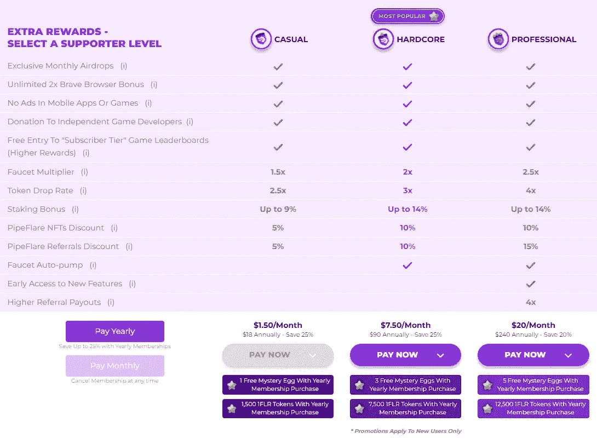

# pipe flare——游戏赚钱

> 原文：<https://medium.com/coinmonks/pipeflare-play-to-earn-7379d4789eab?source=collection_archive---------6----------------------->

[PipeFlare](https://pipeflare.io/r/1m86) 是顶级的“真正的”游戏赚钱网站之一。有很多网站和游戏声称他们是为了赚钱而玩，但最终却是为了玩而付费。我已经尝试了多个网站和应用程序，承诺他们会付钱给你玩，但我只见过几个真正的网站付钱给你玩。我发现只有少数几个是值得的。 [PipeFlare](https://pipeflare.io/r/1m86) ，Rollercoin，还有 Womplay。这三个游戏赚钱网站是我遇到的最有价值的网站。这篇文章将重点关注 PipeFlare，但如果你有兴趣了解 Rollercoin 和 Womplay，请查看我以前写的一篇题为“[**Play To Earn——评论和想法**](https://read.cash/@HattyHats/play-to-earn-reviews-and-thoughts-db09608d) **”的文章。**

# **什么是管道火炬**

[PipeFlare](https://pipeflare.io/r/1m86) 是一款由 Flare 令牌支持的即玩即赚加密游戏平台。PipeFlare 创建于 2020 年，发展迅速。玩游戏，从他们的加密水龙头收集免费代币，要求空投，在每周排行榜上竞争，并通过他们的推荐计划赢得奖励。你也可以在业内最好的 NFT 市场上买卖有限的 NFT。

PipeFlare 不仅可以让你玩游戏，赚取他们称为 Flare 的令牌，而且你还可以使用 PipeFlares 日常水龙头，赚取 ZEC，MATIC 和 Flare。

你不会从 PipeFlare 水龙头上赚很多钱，但是随着时间的推移，它会越积越多。每周你要求你的水龙头整整一周，你将能够做一个旋转轮彩票游戏，你可以赢得高达 5 美元。这太棒了。我还没有赢得 5 美元，但我已经赢得了 0.10 美元，0.25 美元和 0.50 美元，这太棒了。这最终会让你每月仅从索取水龙头中就能赚到几美元。当然取决于你的运气。有时你会从旋转中赚得更少，有时你会赚得更多。所以只要使用水龙头，你每个月就能赚到可观的收入。

# 如何开始在 PipeFlare 上赚钱

创建 [PipeFlare](https://pipeflare.io/r/1m86) 账户。这很容易，可以在几分钟内完成。你可以使用谷歌、脸书、推特、LinkedIn 或苹果注册。如果你不习惯使用这些，你可以用你的邮箱注册。注册后，我还建议创建一个 MetaMask 钱包。您将需要这个来转移和交换您的 FLR 令牌。你也可以下注你的 1FLR，这是我建议的，但是当你准备提款时，你已经创建并连接了你的钱包。如果你不知道如何设置，那么我建议你去 PipeFlare 上的水龙头区，走一走他们提供的通道。

# 来自 PipeFlare 的加密水龙头的索赔

[PipeFlare](https://pipeflare.io/r/1m86) 允许您每天申请免费的 ZEC、MATIC 和 1FLR。你可以设置一个提醒，或者你可以像我一样，每天晚上都这样做。很容易忘记，所以提醒可能是你最好的选择。你要求的越多，得到的金额就越高，每周一次，你可以旋转轮盘，有机会赢得一大笔钱。每次旋转轮盘，我至少会赢 0.05 美元，但通常是 0.10 美元到 0.30 美元。

# 玩你的第一个游戏

[PipeFlare](https://pipeflare.io/r/1m86) 有大量游戏可供选择。你玩得越多，你在排行榜上的排名就越高，这将使你赢得最多的奖金，具体取决于你在每个游戏周期结束时在排行榜上的位置。

你可以玩多种游戏。目前有 11 个，而且他们还在不断增加。这些游戏不是你正常的廉价网游。他们玩起来很有趣，并从其他游戏网站中脱颖而出。查看我在本文开头的视频，看看这些游戏的演示，以及它们玩起来有多简单和有趣。

# 检查您的 Airdrop 资格状态

[PipeFlare](https://pipeflare.io/r/1m86) 每个月都有多次空投。获得免费加密成为合格的。

有一些空投对每个人都可用，这取决于你玩了多少游戏以及你在游戏中的钱包里有多少 1FLR，但也有其他更大的空投只对网站的支持者可用。就像你买了包月套餐。或者如果你持有他们的烟火魔法。

# 查看 PipeFlare 的 NFT 市场

[PipeFlare](https://pipeflare.io/r/1m86) 有大量的公用事业 NFT，可以解锁额外的奖励。看看他们。你可以投资许多不同的非金融资产。有些游戏你可以赚取额外的 FLR，有些游戏你可以赚取相当于 FLR 的额外彩蛋，有些游戏会给你更多的红心，有些游戏会给你付费推荐，等等。它们种类繁多，有些比其他的更值钱。我没有投资任何 NFT，所以我不确定他们是否值得，但我已经支付了临时支持者年度订阅费，我想最终是每年 18 美元。我喜欢投资于我相信的项目，但很难大量投资，尤其是当你把一切都与其他项目捆绑在一起的时候。不过，有总比没有好。

# 开始赚取佣金

每推荐一个朋友，您就可以免费玩一次高达 5 美元的游戏。

这是赚取额外收入的好方法。您传播的信息越多，每次旋转赢得 5 美元的机会就越大。

**水龙头佣金:**当您的 1 级-4 级推荐人向 ZEC 水龙头索赔时，您将获得他们索赔的一部分。下图解释了推荐层级。

**游戏佣金:**当您推荐的用户通过玩 PipeFlare 游戏获得代币时，您将获得他们收入的一部分。

**商店佣金**:当你推荐的用户从 [PipeFlare 的](https://pipeflare.io/r/1m86)推荐商店购买商品时，你将获得他们销售额的一部分。****

**会员佣金**:当你推荐的用户购买订阅时，你将从他们的销售中获得一部分。

**NFT 佣金:**当您推荐的用户从 PipeFlare 的市场购买 NFT 时，您将获得他们销售额的一部分。

**下注佣金:**当您推荐的用户下注他们的 1FLR 代币时，您将获得他们所获利息的一定百分比。****

**火焰神秘彩蛋佣金:**当您推荐的用户在玩 PipeFlare 游戏时赢得火焰神秘彩蛋，您也将获得一个神秘彩蛋。这些神秘彩蛋可以兑换 1FLR 代币、推荐、NFT 等奖品。

# [常见问题解答](https://pipeflare.io/r/1m86)

# 什么是[管焰](https://pipeflare.io/r/1m86)？

[PipeFlare](https://pipeflare.io/r/1m86) 是一个由 Flare 令牌支持的玩赚加密游戏网站。你可以玩游戏，从他们的 PipeFlare 水龙头收集免费的加密货币，参与空投，在每周排行榜上竞争，并通过他们的推荐计划获得奖励。你也可以在他们分散的市场上买卖限量版的 NFT。

# 管道火焰合法吗？

[PipeFlare](https://pipeflare.io/r/1m86) 是业内最负盛名的 P2E 和博彩网站。他们得到了区块链领域一些最大投资者的支持，包括 DCG 和 Horizen Labs。他们向公众公布我们所有的交易。

我发现只有几个合法的游戏赚钱网站，这是最好的网站之一，如果不是最好的。我从这个网站赚了不少钱，而且我只是偶尔使用它。我试图把我的时间分散到我使用的所有网站上，充分利用它们，但是一天中没有足够的时间给每一个网站足够的时间。不过，我倾向于在 PipeFlare 上花更多时间，因为游戏很有趣，你可以与其他 Pipeflare 玩家竞争，在排行榜上获得最高排名，这样你就可以赚得最多，这就更好了。

# 如何在 PIPEFLARE 上注册账户？

在 [PipeFlare](https://pipeflare.io/r/1m86) 上注册账户既简单又免费。只需点击页面标题中的注册按钮，然后按照简单的提示进行操作。

正如我在本文前面提到的，有多种方法可以注册。如果你觉得用谷歌或其他账户不舒服，那就用电子邮件。我用 [Skiff](https://app.skiff.com/signup?mail&referral=hattyhatss) 做了一封电子邮件，只是为了我的赚钱网站和加密网站。我建议去看看。这是一个非常棒的电子邮件服务，它将您的安全放在心上，并基于区块链技术运行。检查一下，让我知道你的想法。ProtonMail 是另一项伟大的电子邮件服务。

# PIPEFLARE 在 NFT 有市场吗？

[PipeFlare](https://pipeflare.io/r/1m86) 拥有业内顶级的 NFT 市场。您可以购买、出售和交易与游戏、排行榜、推荐、水龙头等相关的 NFT。我们还发行了我们的限量薄荷烟火 NFT，给你独家乐趣津贴，如赌注奖金和第四神秘加密水龙头。

我个人没有使用过 NFT 市场的 PipeFlares，但是我想我越是使用这个网站，我就会把我的收入投资到他们的 NFT 中。

# PIPEFLARE 使用哪些协议？

[PipeFlare](https://pipeflare.io/r/1m86) 令牌，被称为 Flare 令牌(1FLR)，为游戏生态系统提供动力。他们还利用多边形网络为他们的 NFT 市场供电，并很快为他们的元宇宙产品供电。

这些年来，PipeFlare 一直在增长，在我听来，他们似乎正计划为元宇宙生产产品。不知道这将如何工作，但我很高兴看到结果。 [PipeFlare](https://pipeflare.io/r/1m86) 问世仅两年，发展迅速。

如果你决定看看 PipeFlare，请在评论中告诉我。如果您已经在使用 PipeFlare，请留下您的评论，让我知道您的想法。

我希望你喜欢这篇文章，并感谢你花时间来检查它。喜欢和关注更多的内容，并帮助我的页面增长。请留言问好。

如果你有兴趣看到我支持的更多项目，请访问我的网站！

 [## 哈蒂小屋

### 欢迎来到哈蒂小屋。我正在创造一个地方，让人们可以找到可靠和简单的方法来学习，赚取…

www.hattysshack.org](https://www.hattysshack.org/) 

[上的原创文章 read.cash](https://read.cash/@HattyHats/pipeflare-play-to-earn-c8a63b26)

> 交易新手？尝试[加密交易机器人](/coinmonks/crypto-trading-bot-c2ffce8acb2a)或[复制交易](/coinmonks/top-10-crypto-copy-trading-platforms-for-beginners-d0c37c7d698c)