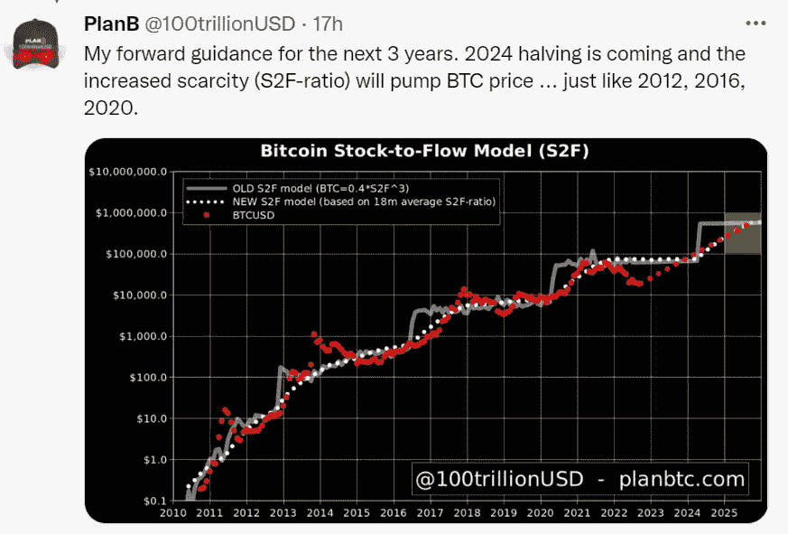

# PlanB 又在买比特币了。我们应该仔细观察

> 原文：<https://medium.com/coinmonks/planb-is-buying-bitcoin-again-we-should-watch-carefully-1bd5017494f5?source=collection_archive---------5----------------------->

他在 2015 年以 400 美元的价格买入，在 2018 年以 4000 美元的价格买入，在他的 S2F 模型中处于明显的低点

Source: [twitter.com/](https://twitter.com/100trillionUSD)

知名分析师 [PlanB](https://twitter.com/100trillionUSD) 表示，他将第三次大举买入比特币。

> 鉴于他的记录和分析的深度，这应该是对我们所有人的一个信号。