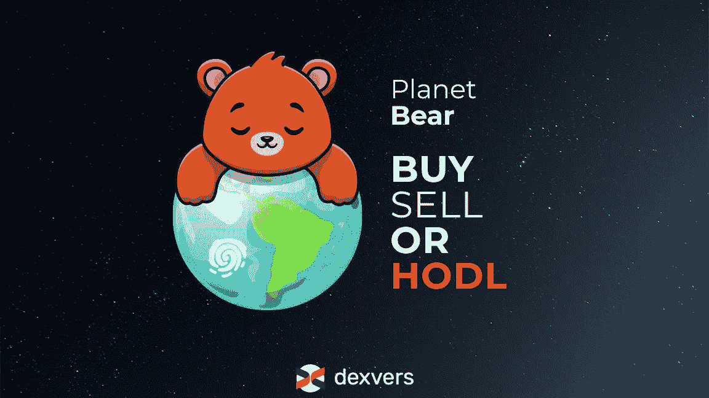

# 行星熊——买，卖，还是 Hodl？

> 原文：<https://medium.com/coinmonks/planet-bear-buy-sell-or-hodl-baa0bcfb921e?source=collection_archive---------38----------------------->

To hodl or not to hodl? That is the question!

即使是加密领域之外的人也知道，加密货币市场非常不稳定。价格波动——上涨、下跌、再上涨——这是一个永无止境的循环。最近，我们目睹了比特币的又一次熊市，因此也是整个市场的熊市。

在 2022 年 3 月底/4 月初，BTC 价格约为 47k 美元，而现在，9 月份，它低于 20k 美元。这种损失，尤其是如果你已经投入了大量的资金，真的会令人沮丧。

不过，有一个普遍的说法，人们把它当作一个笑话来讲——除非你卖出了，否则这不是亏损——这是一个真实的说法。

# 什么是熊市？

[经济层面的](https://www.investopedia.com/terms/b/bearmarket.asp)，熊市代表资产价格从近期高点下跌 **20%或更多**的情况，通常伴随着“恐慌性抛售”。知道 BTC 在 2021 年 11 月的 ATH(略低于 7 万美元)，而它现在的价格甚至不到 1.9 万美元——你可以很容易地推断出它的价格跌幅远远大于 20%。

现在，密码老手都很清楚这是(一种)正常现象，他们中的大多数人不会轻易恐慌。然而，在任何市场，对熊市的自然反应是恐慌抛售。由于价格一分钟比一分钟低，你赶紧卖掉你的资产。

然而，BTC 总是设法回来，并努力创造新的历史新高。大多数比特币爱好者会告诉你 hodl，基本上什么都不做，只等市场自我修正。

虽然霍德林是一个比卖掉所有加密资产更好的选择，但这两个不是唯一的选择。你可以对冲，并实际购买下跌，即使它在你购买后继续下跌。让我们看看如何！

# 避险救援机制

在稳定之前，交易者可以在提到的两个选项中选择——卖掉他们的资产或者等待并祈祷价格回升。如今，情况有点不同了。

这里是这种对冲策略的本质，让每个人都明白——当价格开始下跌时，你用 BTC 换一种稳定的货币(让我们以 USDC 为例)。当价格最低时，用你的 USDC 购买比你以前更多的 BTC(因为现在的价格低于你的购买价格)。然后，当价格再次暴涨时(最终，它总是这样)，你将拥有比熊市前更多的 BTC。

当它是“红色的一天”和价格下跌时，并不都是厄运和黑暗。这是提升你资产的绝佳机会。但是请记住——为了让这一步行得通，你需要做自己的研究，而且要非常小心。

如果有一个完美的避免损失的方法，每个人都会成为一个密码百万富翁。所以，错误是正常的，每个人都有可能犯错。不管是谁告诉你，他们的交易总是完美无缺…好吧，你知道，他们的裤子可能着火了。

# 没有唯一的解决方案

您的行动取决于您的经验、您拥有的资产，当然，还取决于您当地的监管和加密政策。因此，你可能不应该只是复制粘贴别人说的话，比如在 Reddit 上。(不过，我们喜欢 Reddit。)

**虽然没有唯一的解决方案，但有一个非常典型的错误**——出售你所有的加密资产，然后退出菲亚特。呆在加密的世界里，根据市值和交易量寻找“赢家和输家”，但不要为了容易受通胀影响的东西而弃船。有了法定货币，从长远来看，无论你做什么，你都无法避免损失。

现在的密码市场如此活跃和广阔，你有很多投资机会可以探索。不管你有多兴奋，都要知道自己的极限。从少量开始是完全可以的，试一下水，看看效果如何。成功的密码交易需要新手的失误、耐心、时间和奉献。如果你在第一次交易后没有比埃隆·马斯克更富有，这很酷。

# 总而言之

最后，这里有一些熊市情况下的注意事项。

# 防御命令(Defense Order)

1.  研究，研究，研究
2.  制定好对冲策略
3.  持续彻底地跟踪市场情况
4.  向加密老手寻求帮助(有信誉的人)
5.  知道所有的熊最终都会冬眠:)

# 不

1.  恐慌；这一切都被看到了
2.  出于恐惧做出轻率的决定；深思熟虑后做出明智的决定
3.  把你所有的鸡蛋放在一个篮子里；多样化你的投资组合
4.  退出菲亚特，卖掉你所有的加密资产
5.  把这一切留给宇宙来解决；你能行的

# 二者择一地

当出现熊市时，每个人都在谈论 BTC。这没什么，比特币一直强烈影响着整个市场。只是不要忘了大海中有如此多的替代硬币，如果你明智地投资，你可能是下一个 MATIC 的第一个持有者。

我们 Dexvers 认为，交易密码应该是任何人、任何地方都可以使用的。我们正在建立一个对各方都有利的生态系统，包括交易商、流动性提供商、上市项目以及我们的所有社区成员。

欢迎随时加入 Dexvers 社区的**和 [**不和谐**](https://discord.gg/FDgNWhU4Ps) 栏目，我们在这里讨论市场上正在发生的事情以及如何预测即将发生的事情。**

**__**

****免责声明** : *本文提供的信息不是法律、会计或财务建议。这些信息不应被解释为投资或交易建议，也不意味着是购买、出售或持有任何加密货币的恳求或建议。***

> **交易新手？试试[密码交易机器人](/coinmonks/crypto-trading-bot-c2ffce8acb2a)或[复制交易](/coinmonks/top-10-crypto-copy-trading-platforms-for-beginners-d0c37c7d698c)**