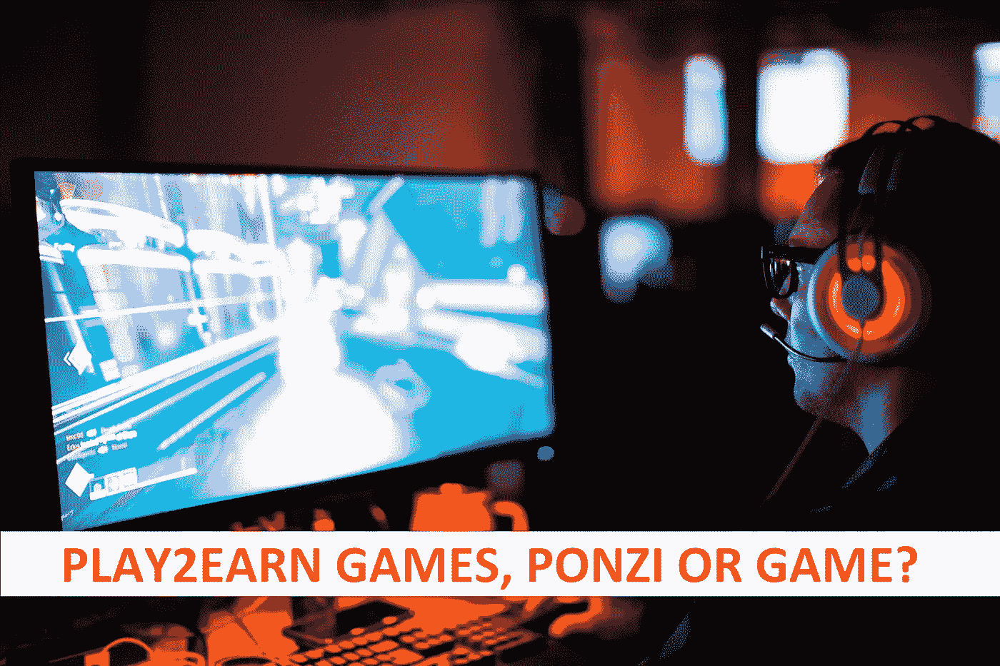

# 玩 2 赚游戏，是不是总注定要失败？

> 原文：<https://medium.com/coinmonks/play-2-earn-games-are-they-always-doomed-to-fail-c3681065d846?source=collection_archive---------32----------------------->

到底什么是玩赚游戏，或者更确切地说，他们是如何工作的？让我们试着找出答案，好吗？

# 它从一声巨响开始

大多数这类游戏都是以大爆炸和大张旗鼓开始的。通常有很多人希望早点入场并开始赚钱。这与大多数普通电脑或游戏机游戏的工作方式非常相似。

他们通常在发射或关闭发射器时有他们的玩家高峰。随着时间的推移逐渐减少。最终，如果这是一款注重 PvP 的游戏，它将被宣布“死亡”。

因为如果玩家数量下降到临界量以下，他们就无法继续游戏了。更不用说，对于剩下的几个球员来说，提示时间往往是可怕的。

而且很有可能大多数“玩赚”游戏会有和“普通”游戏相似的玩家轨迹。但是他们可能会有一个更长的曲线。这是由于“挣钱”的诱惑。

这将使新玩家的涌入比普通游戏持续更长时间。正因为如此，延长了曲线，推迟了不可避免的低迷。至少在我看来是这样。

# 但以呜咽结束

还有一件事会导致大多数游戏失败，那就是大多数游戏都是建立在庞氏骗局的基础上的。我的意思是，与他们不同，他们是投入项目的外部资金来源。玩家只能取出他们放进去的东西。当然是减去开发费。

因此，一旦第一批玩家开始提取他们的收入，这将开始耗尽其他玩家的可用资金。随着新玩家的不断减少，他们带来了新的资金。系统最终会关闭。不再能够自我维持。

这与你在庞氏骗局中遇到的“问题”完全相同。最终，你用光了新的资金来支付老投资者。当新投资者想要他们的报酬时，这一切就像纸牌搭的房子一样轰然倒塌。

# 难道所有的游戏都注定要失败吗？

从某种意义上说是的。然而，有一些缓和因素可以延长游戏的寿命。也就是说，如果游戏性非常好，人们会想继续玩下去。尽管可以选择提现。但到目前为止，我还没有看到任何游戏接近这一点。

也有其他类型的玩赚游戏。这是游戏获得外部资金，要么完全或作为基于玩家的资金的补充。这方面的一个例子是 RollerCoin。

我猜他们的收入有相当一部分来自外部来源，比如横幅广告和要约墙。玩家投入游戏的资金加上这些资金。如果不是无限期的，它至少可以让游戏持续更长的时间。

然而，这种“玩即赚”游戏的缺点是，如果你通过玩这种游戏变得富有的可能性非常小，那么这几乎是不可能的。

# 结论

我想说的最重要的事情是做你的研究，弄清楚你正在处理的是什么类型的游戏赚钱项目。它运行了多长时间了？游戏是否受欢迎，是否仍有大量新玩家涌入。

*Is the player base increasing or decreasing, very important to keep track of for considering the viability of a play 2 earn game*

所有这些都是你在决定投入时间和金钱之前需要考虑的因素。所以从某种意义上说，它就像其他投资一样。但是这个可能会占用你更多的时间。因为在这些游戏中花费时间或金钱来达到目标通常是相互关联的。

好吧，结论是如果你打算玩一个付费游戏。目标是用它来赚钱，而不是娱乐或消磨时间。然后，你需要尽可能早地进入，以便最大化你能够兑现的机会。

最好你从第一天就加入。就像所有庞氏类型的项目一样。请不要被其他玩家说他们已经赚了 X 或 y 所诱惑。如果他们已经能够兑现，这将迅速减少你重复同样壮举的几率。

这些只是我对这个话题的想法，你的可能会有所不同。请分享你的想法，你有任何好的或坏的经验玩游戏赚吗？请在下面的评论区分享他们和你对这个话题的想法。无论如何不要把这当成财务建议，这只是一个网络狂人的胡言乱语。^^

如果你想支持我和我制作的内容，请考虑关注我，阅读我的其他帖子，或者为什么不两者都做。

网络上见！

图片提供:[https://unsplash.com/](https://unsplash.com/)

> 交易新手？试试[密码交易机器人](/coinmonks/crypto-trading-bot-c2ffce8acb2a)或者[复制交易](/coinmonks/top-10-crypto-copy-trading-platforms-for-beginners-d0c37c7d698c)