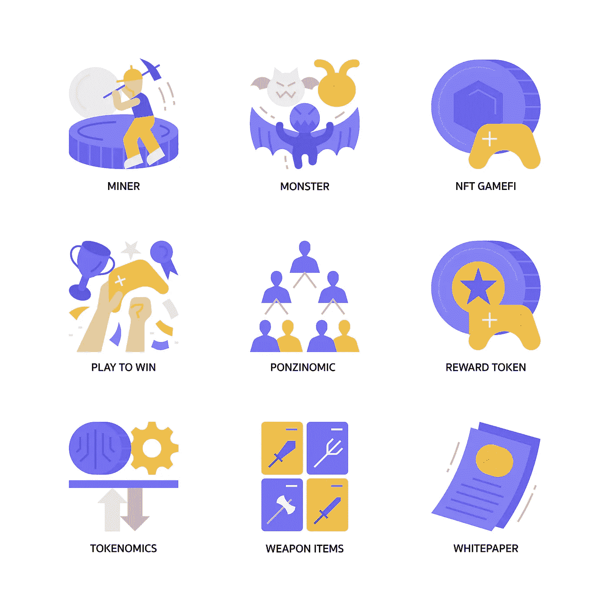

# 游戏开发-在 NFT 和游戏行业建立你的业务

> 原文：<https://medium.com/coinmonks/play-to-earn-game-development-establish-your-business-in-both-nft-gaming-industry-8d40fe08e868?source=collection_archive---------21----------------------->

NFT image from [adobe stock](https://stock.adobe.com/)

对区块链技术的大肆宣传已经有一段时间了。企业家和企业主以各种方式受益于这项技术，如提高安全性和隐私性、降低成本、实现分散结构、可见性、可追溯性、不变性、高投资回报率等。这增加了许多商业头脑参与这一区块链产业并取得成功的机会。进入这个领域的一个最棒的想法是赢得 NFT 游戏开发的机会。我们来快速看一下 [**P2E NFT 游戏开发**](https://www.londontime.co/nft-gaming-development-launch-your-business-with-play-to-earn-nft-games/)

# NFT 游戏开发

> NFT 游戏被认为是为了赚钱而玩的游戏，因为它们允许玩家赚取奖励和实时有价值的资产。在这些游戏中，游戏内资产是不可替代的代币，玩家可以在 NFT 市场上用这些资产或数字货币进行交易。许多 NFT 诱导的游戏已经被发现并成功运行；这使得许多商业头脑有兴趣成为这些不可替代代币发展的一部分并获得成功。

# 参与 NFT 游戏开发之前要记住的事情

区块链游戏开发商已经开始意识到愤怒的游戏玩家和传统游戏开发商的这些担忧。各个区块链游戏开发工作室即将推出的游戏现在被宣传为 [**即玩即赚体验**](https://www.appdupe.com/p2e-nft-game-development)——与他们的 P2E 游戏前辈明显不同。

例如，在视频游戏行业发展了 20 年后，韩国游戏开发商 Wemade 最近发布了 Mir 4，将目光投向了区块链游戏，这是一种与区块链集成的成熟 MMO 体验。作为其为区块链奥运会建立完整平台计划的一部分，Wemade 打算利用即将发布的版本来提升对 P2E 奥运会的认知。

“在 Wemix 平台上玩游戏是不会发财的。Wemade 首席执行官 Henry Chang 在接受 nft now 采访时表示:“我们之所以强调玩和赚，而不是为了赚而玩，是因为经济回报只是整个体验的一小部分。”。“我们服务的游戏是制作精良的游戏，玩起来很有趣。经济回报并不是你应该在 Wemix 平台上玩游戏的唯一原因。它让游戏变得更加刺激，”他说。

虽然今天的顶级 NFT 游戏通常具有明显的 P2E 游戏机制，但从长远来看，区块链在游戏行业的整合可能需要大幅降低这种信息传递。

例如，虽然 P2E 游戏在网上获得了很多支持，但更大的游戏社区的很大一部分人仍然对互联网上的新发展持怀疑态度(如果不是完全仇恨的话)，这要归功于区块链技术，也就是所谓的 Web3。远非如此。在最糟糕的情况下，区块链游戏——尤其是 P2E 游戏——基本上可以作为一大部分用户的第二职业。当游戏中的表现可以决定餐桌上是否有食物时，为游戏中的奖励和货币而奋斗突然变得更加反乌托邦了。鉴于这种游戏如何奖励你的潜在风险，那么 Venturelli 所描述的对于愉快的游戏体验至关重要的逃避现实的幻想就是不正当的。

Gamefi icons from [adobe stock](http://adobe stock)

# P2E 游戏开发简单不简单？

好吧，如果开发一款区块链游戏的正确方法是专注于制作一款真正有趣的游戏，而不是让用户有潜力在游戏中赚钱的系统，那么为什么开发者不这么做来证明所有的反对者都是错的呢？答案是游戏开发真的真的很难。

## 这是如此之难，以至于 NFT 世界团队没有从头开始构建自己的游戏，而是依靠一个经验丰富的《我的世界》模型团队来帮助构建一个世界分散化和沙盒的潜在竞争对手。因此，他们将整个生态系统托管在《我的世界》的服务器上——这有点违背了最初利用区块链技术的精神。

随着《我的世界》在其所有服务器上禁止 NFTs 和任何区块链技术，NFT 世界现在需要做的工作，并最终制作自己的游戏。希望这个游戏至少会很有趣。

## 为 NFT 游戏开发选择最好的公司

游戏开发的第一步是对领域做深入的研究。一个人应该对自己正在做的事情有基本的了解。这有助于进行清晰的分析，并为开发和推出 NFT 游戏[**创造更好的商业策略。**](https://www.appdupe.com/nft-gaming-development)

选择正确的开发公司非常重要，会影响游戏的结局。人们可以选择一个开发公司的基础上，他们的客户，以前的工作，评级，演示工作等。

选择公司后，你应该为游戏开发提出想法，因为这让开发者更容易理解他们对游戏的需求、偏好和要求。

为游戏中包含的功能、游戏的用户界面/UX 设计等规划战略性商业想法。，都应该做好充分的准备，因为这有助于开发人员提供一个开发良好的游戏。

开发完游戏后，进行多重测试，一旦无 bug 就推出。

## 经过思考

我们处在 [**玩赚游戏和区块链科技**](https://www.appdupe.com/p2e-nft-game-development) 的时代。NFT 推动的在区块链玩游戏的游戏增加了市场的速度和成功。这些游戏的快节奏已经创造了数十亿美元的收入，并且仍在成功进行中。没人知道 P2E 奥运会会超越传统游戏，但谁知道呢？永远不要说永远。我们可以肯定的是，P2E·NFT 游戏的未来是光明的，这为将非功能性游戏融入人们的日常生活和爱好创造了很大的可能性。

> 交易新手？试试[密码交易机器人](/coinmonks/crypto-trading-bot-c2ffce8acb2a)或[复制交易](/coinmonks/top-10-crypto-copy-trading-platforms-for-beginners-d0c37c7d698c)