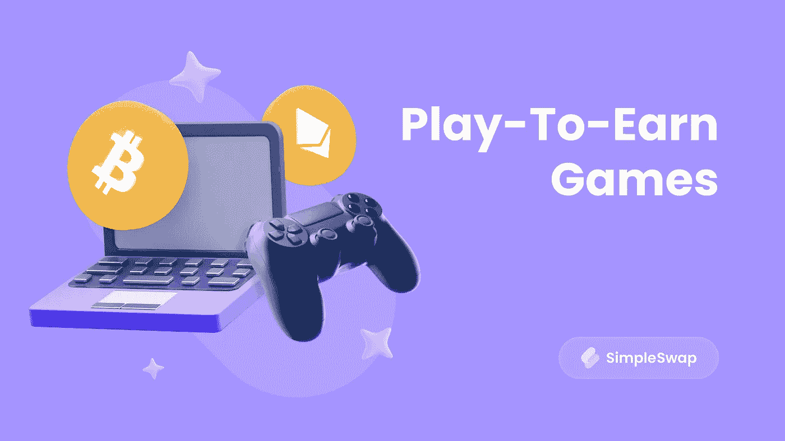

# 游戏赚钱:你能变得富有吗？

> 原文：<https://medium.com/coinmonks/play-to-earn-games-can-you-become-rich-3e7a01e0460b?source=collection_archive---------22----------------------->

电子游戏在世界范围内的流行令人难以置信！仅主机游戏在 2022 年就已经赚了超过 500 亿美元。智能手机游戏也有很高的需求——[根据 Statista 报告](https://www.statista.com/statistics/278181/global-gaming-market-revenue-device/)手机游戏在 2021 年达到 910 亿美元。当然，区块链工业不能远离这个部门。

由于游戏的流行，像 P2E 这样的模式现在很受欢迎，因为它不仅是一个享受美好时光的机会，也是一个收入来源。这就是为什么玩赚游戏成为趋势。

**什么是玩即赚(P2E)游戏？**

在 P2E 游戏中，玩家会因为他们的胜利获得奖励——奖励可以是游戏中独一无二的物品，也可以是物品清单中物品的价值增加了。这些物品中的每一个都是一个 [NFT](http://simpleswap.io/blog/non-fungible-tokens-explained?utm_source=medium&utm_campaign=playtoearngames) ，可以用加密货币进行买卖。

为了完全参与 P2E 奥运会，你应该首先购买 NFT。然而，我们习惯了在电子游戏上花钱，不是吗？我们必须买游戏来玩。比如将于 2022 年底发售的《战神 Ragnarok for PlayStation》，现在已经可以预购，售价 69.99 美元。顺便说一句，在你花钱买了它之后(假设的话)，你将无法在它里面赚取密码，这在 P2E 游戏中是可以做到的。

然而，有了 P2E，你也可以免费玩这个游戏。但是如果你想发展你的角色或者在这个过程中获得密码，你可能需要为此支付一些钱。当然，并不是每个人都将 P2E 游戏视为一种赚钱的方式。我们中的一些人只是喜欢游戏本身，所以为不寻常的游戏体验支付少量费用也是可以的。然而，如果你打算用 P2E 投资和赚钱，你可能要考虑它可能带来的一些风险。

**玩真的能挣钱吗？**

一方面，这听起来有点不可思议——你怎么能一边玩电脑游戏一边赚足够的钱来维持生活？另一方面，对于许多国家的居民来说，比如菲律宾，P2E 博彩成为了传统工作的替代品，因为他们所在地区的工资低，失业率高。游戏玩家甚至通过玩 P2E 游戏来养家糊口。

所以答案是‘是的，你可以通过玩 P2E 游戏赚钱’。但是怎么做呢？为了清楚起见，我们举个例子。

[**《异世界》**](https://alienworlds.io/) 举例来说，是一款拥有[177000 日活用户](https://dappradar.com/wax/games/alien-worlds)的 P2E 游戏。它的本质很简单——玩家探索星球，建设经济，组建政府和联盟。未来，开发者计划增加与其他研究人员争夺领域和资源的选项。

游戏中有几种类型的 NFT 物品:土地、武器、工具、角色(爪牙)。都是可以买卖的。玩家在主要活动中需要它们——提取 TLM 资源，这是一种[万亿](http://simpleswap.io/coins/alien-worlds?utm_source=medium&utm_campaign=playtoearngames)加密货币。

在外星世界注册期间，玩家选择六个星球中的一个，每个星球都是一个分散的自治组织(DAO)——有点像一个集体国家。这意味着每个 TLM 持有者都可以通过投票参与地球的管理。玩家一起决定在他们的星球上完成任务的奖励，在什么条件下获取资源，等等。

这个游戏能赚多少？2021 年，一位用户[在 Reddit](https://www.reddit.com/r/AlienWorldsio/comments/n0qdnu/how_much_money_did_you_earn_by_playing_alienworlds/) 上写道，他在两周内赚了 160 美元。

这证明你可以通过玩游戏来获得密码。当然，有许多不同的 P2E 游戏不仅仅是关于外星人的，任何人都可以找到他们感兴趣的东西。

**风险呢？**

如果你计划在 P2E 投资并获得回报，重要的是要明白这里有一些陷阱。你总有可能损失投资金额，所以要做好准备，不要忘记在投资前做好自己的研究。

要知道，开发者完全控制着 P2E 游戏的经济，他们可能会在这个过程中做出改变。随着时间的推移，项目可能会结束，而您的 NFTs 的命运仍将是个问题。这种情况已经发生在[战斗赛车](https://www.playtoearn.online/2022/01/20/battle-racers-is-closing-down-in-one-month/)和 [F1 德尔塔时间](https://www.racefans.net/2022/04/01/official-formula-1-nft-game-f1-delta-time-closes-three-years-after-launch/)的玩家身上(这两款游戏都是赛车模拟器)。

另一个风险可能与加密货币汇率的波动以及黑客攻击的威胁有关。比如虫洞跨链桥[在 2022 年被攻击](https://www.bloomberg.com/news/articles/2022-02-02/blockchain-bridge-wormhole-hit-with-potential-315-million-hack)——黑客提取 wETH 令牌金额 3.19 亿美元，DeFi project Beanstalk [在 4 月损失 1.81 亿美元](https://www.bloomberg.com/news/articles/2022-04-18/defi-project-beanstalk-loses-182-million-in-flash-loan-attack?leadSource=uverify%20wall)。

此外，P2E 游戏可能有一些庞氏骗局的特征。Business Insider 曾经[假设](https://markets.businessinsider.com/news/currencies/play-to-earn-crypto-axie-infinity-business-model-gaming-value-2022-1)如果所有 Axie Infinity 玩家(或大部分玩家)在同一天将游戏代币兑换成其他货币，其价值将会崩盘。但如果保持和加强利息，价值将继续上升(这种可能性更大)。

所以要小心，在决定投资 P2E(或任何其他项目)之前，先分析一切，然后再采取行动——以防万一。

**总结**

根据 Alexis Ohanian(Reddit 社交网络的联合创始人)的观点，在几年内，NFT 机械师将进入 90%的游戏。很快，P2E 模式将不再是我们的惊喜，边玩边赚密码将会像往常一样。

并非所有人都同意这一点——一些玩家看不到 P2E 游戏的价值。例如,《孤岛惊魂》和汤姆·克兰西系列游戏的创造者育碧软件，在推出其石英 NFT 平台后，最近面临着批评。这肯定不会阻止他们在这个领域进行新的实验，但也许现在他们会更加谨慎。

无论如何，玩 P2E 游戏的体验绝对值得一试。你可以从小额投资开始，只是为了充分了解 P2E 的动态——这对你来说将是一个有趣的加密实验，也许以后它会成为一种收入来源。

[**SimpleSwap**](http://simpleswap.io/?utm_source=medium&utm_campaign=playtoearngames) **提醒您:本文仅供参考，不提供投资建议。所有购买和加密货币投资都是你自己的责任**。

最初发表于 [Publish0x 博客](https://www.publish0x.com/simpleswap-blog/play-to-earn-games-can-you-become-rich-xgjvlgx)。

> 交易新手？尝试[加密交易机器人](/coinmonks/crypto-trading-bot-c2ffce8acb2a)或[复制交易](/coinmonks/top-10-crypto-copy-trading-platforms-for-beginners-d0c37c7d698c)