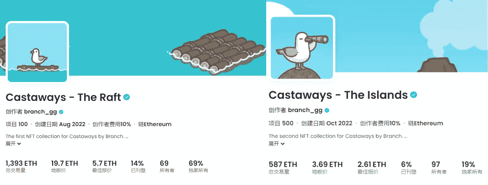
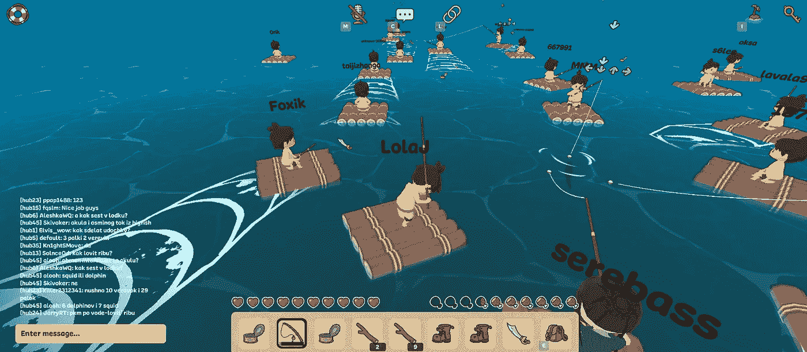
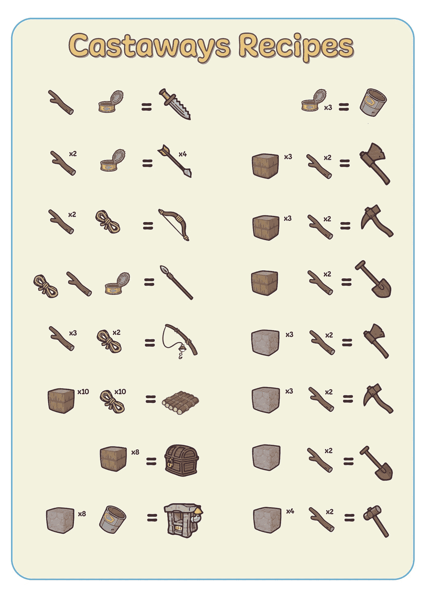
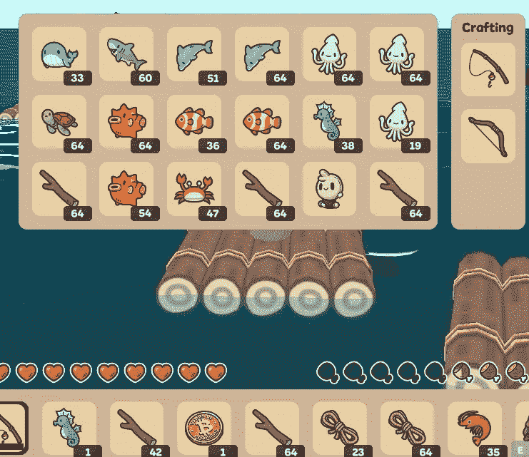
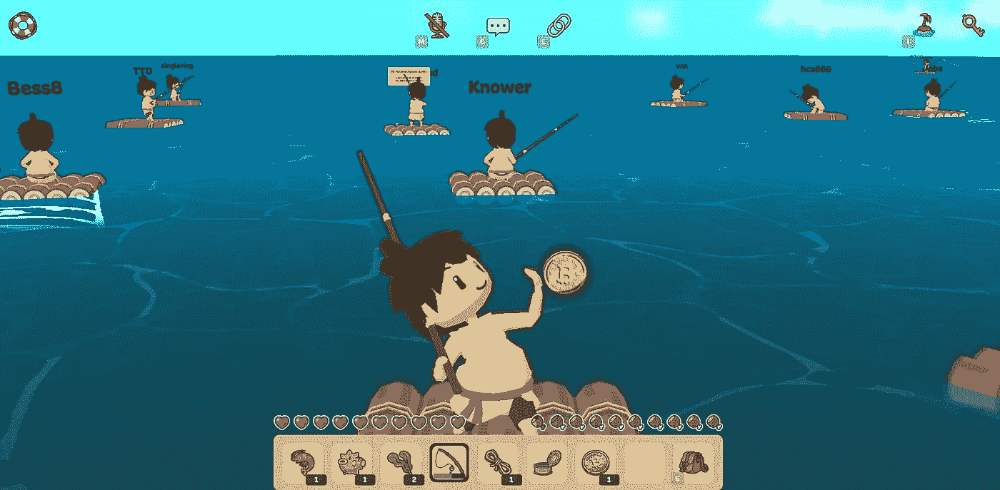
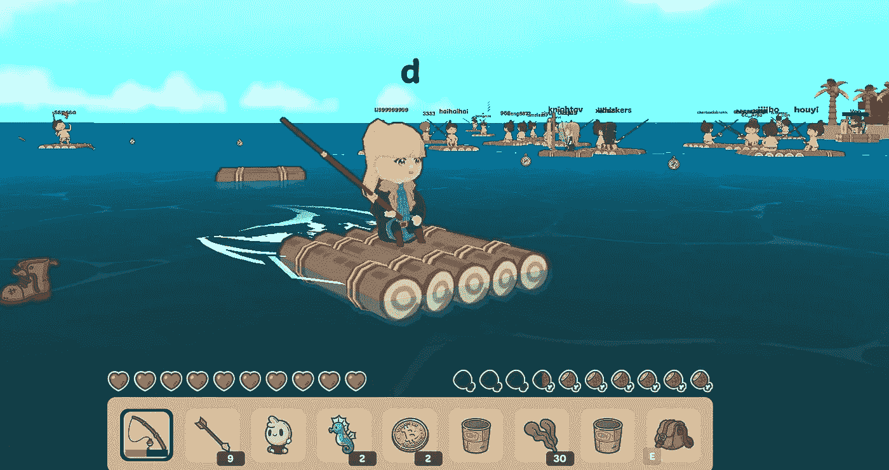

# 玩 Web3 游戏漂流者，收到 4ETH 从岛上空投

> 原文：<https://medium.com/coinmonks/playing-web3-game-castaways-received-4eth-from-the-island-airdrop-b6c74a45523e?source=collection_archive---------1----------------------->

前段时间，Opensea 推出了 NFT 项目，漂流者——木筏非常受欢迎。

目前的底价保持在 17ETH，共成交 1393 个 ETH，超过 200 万美元。

随后该系列推出第二款 NFT，群岛，目前楼面价为 3.7ETH，共成交 587 ETHs。

最近，漂流者项目的内部测试版终于上线了。

Castaways Gaming NFTs

《漂流者》是一款沙盒游戏，用户无需持有 NFT 就可以免费进入。

玩家进入游戏后会被扔到一个偏僻的小岛上，在那里可以通过捕鱼、种植、社交、辅助他人等方式在游戏中生存并构建游戏生态，在游戏中玩到赚到。

从游戏白皮书中呈现的游戏生态来看，海洋中不仅有寻宝和造物，未来还会有烹饪用火、种植生物、建造村庄、岛屿间的战斗等。

目前已经开放了 alpha 测试版，任何玩家都可以通过邮箱登录。Web3 用户还可以绑定钱包，在游戏中钓鱼或者在海里捡各种水滴。

Castaway game page

楚小莲也试图玩这个游戏。虽然我是残党，不擅长玩游戏，但通过其他玩家的教程，还是对游戏玩法有了基本的了解，上手也很容易。

几经不懈努力，终于抓到一只螃蟹。之前钓到一条鱼，不小心吃了。可惜了。

据说抓到一条大鱼，或者捡到其他稀有物品，可能会提高空投的几率。

Various items caught can be synthesized into different tools

游戏内测已经上线一段时间了。第一次空投的 25000 多名选手参加了岛上 250 场 WL 比赛，获胜者获得了岛上空投。

有一个早期玩家参与游戏体验，得到了 NFT 岛，并以 4ETH 的价格出售。他的 NFT 卖出后，楼面价涨到了 5.69 ETH，一度有点遗憾。

目前第二阶段空投也在进行中。项目组已经发布公告，11 月 15 日将向最活跃的玩家空投 10000 个宝箱。。

可能不如第一轮空投有价值，毕竟数量差了 40 倍，但能拿到空投无疑是非常好的。

Items caught by other players

密码市场上有各种空投。有人做交互测试，有人玩内测游戏，有人体验产品功能等交互。他们都通过早期的项目参与获得了额外的机会。

目前，《漂流》也处于早期阶段，粉丝 2000 多人，DC 社区用户 3000 多人。没有出圈的 fomo，正式版也还没推出。参与封闭测试版的玩家可能会有额外的好处。

有兴趣的可以在后台给 castaway 发私信，获取游戏官网和怎么玩的教程。

Gold coin caught by the player in the castaway

此外，游戏还与沙盒和 NFT 项目 DigiDaigaku 合作。

玩家可以在沙盒游戏模块中进行漂流，也可以在海上看到个性化的 DigiDaigaku 头像的玩家。

或许在未来的游戏画面中，有可能与无聊猿、志那都红豆等玩家进行鱼 PK。

DigiDaigaku in castaway game

目前游戏不需要额外投入，只需要花点时间在游戏里钓鱼，接其他滴。可以一个人驾驶小竹筏，自由漂流，消耗一天的体力值，还可以钓一些鱼或者其他物品。

游戏内测阶段没有收入，抓到的物品不能出售，也没有其他代币奖励。后期可能会有更完整的生态，让你在游戏中边玩边赚。

简而言之，了解新游戏总是好的。

以上只是我个人观点，没有投资建议。我是楚小莲，我正在关注元宇宙和 web3。

> 交易新手？试试[加密交易机器人](/coinmonks/crypto-trading-bot-c2ffce8acb2a)或者[复制交易](/coinmonks/top-10-crypto-copy-trading-platforms-for-beginners-d0c37c7d698c)