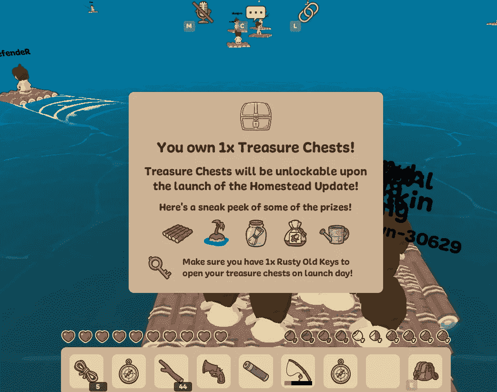
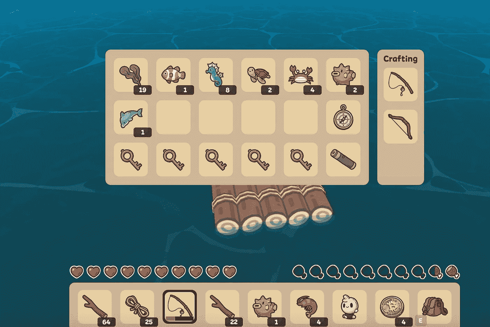
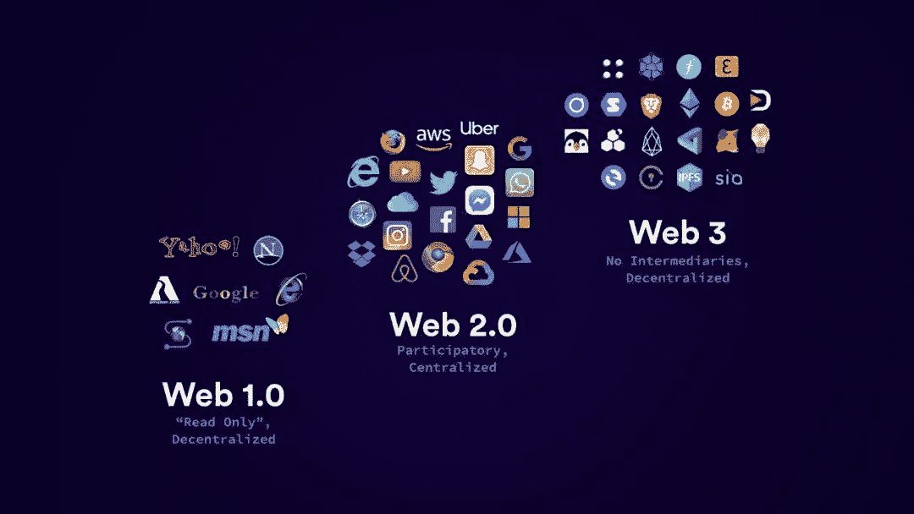
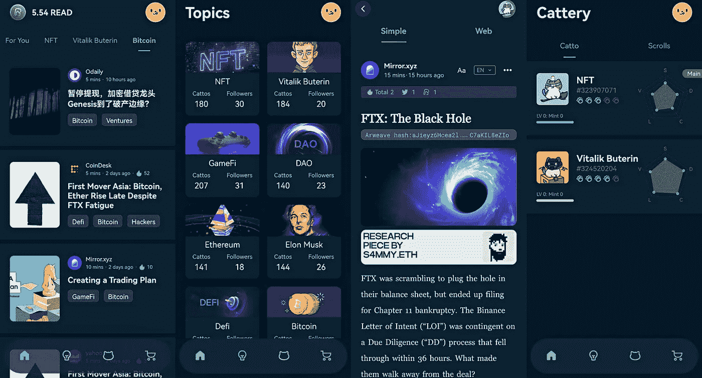
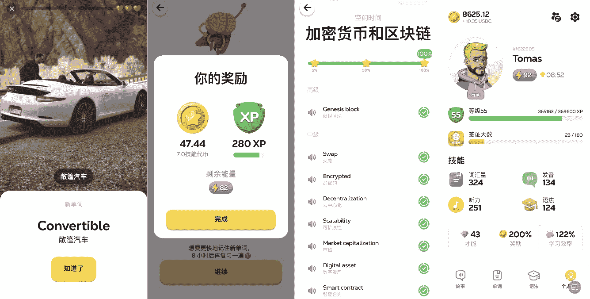
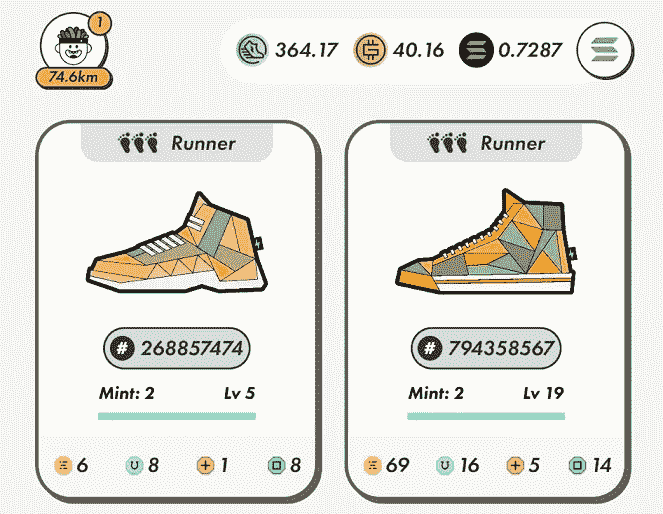
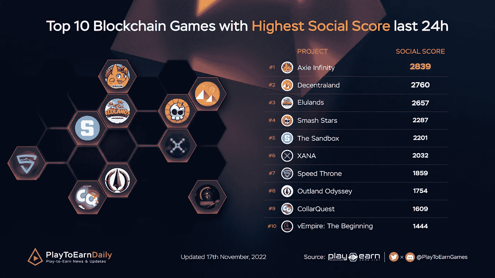

# 玩 web3 游戏收到 50 美元空投，如何玩 Web3？

> 原文：<https://medium.com/coinmonks/playing-web3-games-and-receiving-a-50-airdrop-how-to-play-web3-a90271be1c8f?source=collection_archive---------0----------------------->

前段时间关注了 web3 游戏 castaways，这两天收到空投盲盒。

盲盒 2 周后打开，可能是筏、岛、工具等 NFT。目前盲盒在 Opensea 上的售价约为 0.04ETH，也就是 50 多美元。

如果木筏或小岛 NFT 能在盲箱中打开，那就非常可观了，但有很大概率是低价值的工具 NFT。

Get blind box airdrop in castaways game

11 月初写了一篇介绍漂流者游戏的文章，当时才开始玩，并没有在游戏上投入大量时间。注册了 2 个账号，钓到大鱼的账号收到了空投，没钓到大鱼的账号没有拿到空投。

如果我现在出售盲盒，我将在这次互动体验中获得 50 美元的空投；如果我抱着盲箱，打开木筏，我会很幸运。NFT 筏艇目前的底价是 16ETH。

《漂流者》仍处于测试阶段。玩家可以免费获得木筏和钓具开始游戏；玩游戏没有直接收入。未来还会有种植、社交、跑马等其他玩法。

也许游戏正式上线后，钓上来的大鱼小虾或者各种小玩意都可以出售交易，形成游戏生态，实现玩了赚了。

Various things caught in castaways game

目前有很多 Web3 项目，从游戏、生活、搜索、交易等。，以及各种 web3 短视频和社交项目，很多都是从 web2 升级而来的。

我们可以片面地理解 web3，即在 web2 的基础上，增加收入的方式，让用户在其中投入的行为和注意力变得有经济价值。

在更深层次的理解上，也有不同的进入方式，邮箱或者数字钱包；在技术方面和交互方式上也有区别。

What is web3?

比如我最近一直在关注 ReadON。这个项目的定位是边读书边赚钱。体验了一下，是各种 web3 信息的集合。用户持有卡托 NFT，阅读其中的信息，并获得阅读奖励。
本项目解决了查找各种 web3 信息的需求，并读取其中最新的 web3 热点信息。当然，从另一个角度来看，信息相对有限。

ReadON project page

还有学英语 letmespeak，这是一个学习英语的 web3 项目。玩家持有角色 NFT，在其中可以学习英语，包括口语、语法和词汇，并获得 LSTAR 奖励。

每次学习到一定量的 LSTAR，就可以卖掉换现金；不买 NFT 也可以直接学英语，但是没有利润。

letmespeak game page

与 web2 相比，web3 方法就像是先购买会员权。玩家会在项目期间每天签到，获得收入。如果项目持续的时间足够长，收益将超过投资。

例如，去年链式游戏非常流行。用户首先购买的是游戏 NFT，比如飞船、农场植物等。；并且一边玩游戏一边挣钱，但是项目后期崩溃太快。

如果你选择的 web3 项目有其他体验，比如买 STEPN 跑鞋，指导自己运动；或者买一个演讲者角色，想学英语等等。

即使这个项目最终失败了，它也获得了一次学习经历或娱乐。

还有一些项目的需求并不明显，只是短期 FOMO。早期玩家获得利益，后来者只能被动接手，没有延续性。

STEPN, once popular out of the circle

不管是 web2 还是 web3，最终还是要回到解决用户的什么需求上来。

例如，打桩是有利可图的，因为它提供了流动性，但必须考虑整个项目的安全性。时不时被黑或者项目方跑路，项目就会归零。

还有一些伪需求，看似是用户需求，其实用处不大。例如，用户真的需要专注于 ReadON 来阅读 web3 信息吗？

项目能否继续发展，最终还是要看市场。

​Still popular web3 games

在未来，web3 可能没有明确的边界，或者 web3 只是区块链发展的一个草图。市场会如何发展无法预料，但不建议参与早期项目，万一哪家做出来呢？

以上只是我个人观点，没有投资建议。我是楚小莲，我正在关注元宇宙和 web3。

> 交易新手？试试[加密交易机器人](/coinmonks/crypto-trading-bot-c2ffce8acb2a)或者[复制交易](/coinmonks/top-10-crypto-copy-trading-platforms-for-beginners-d0c37c7d698c)